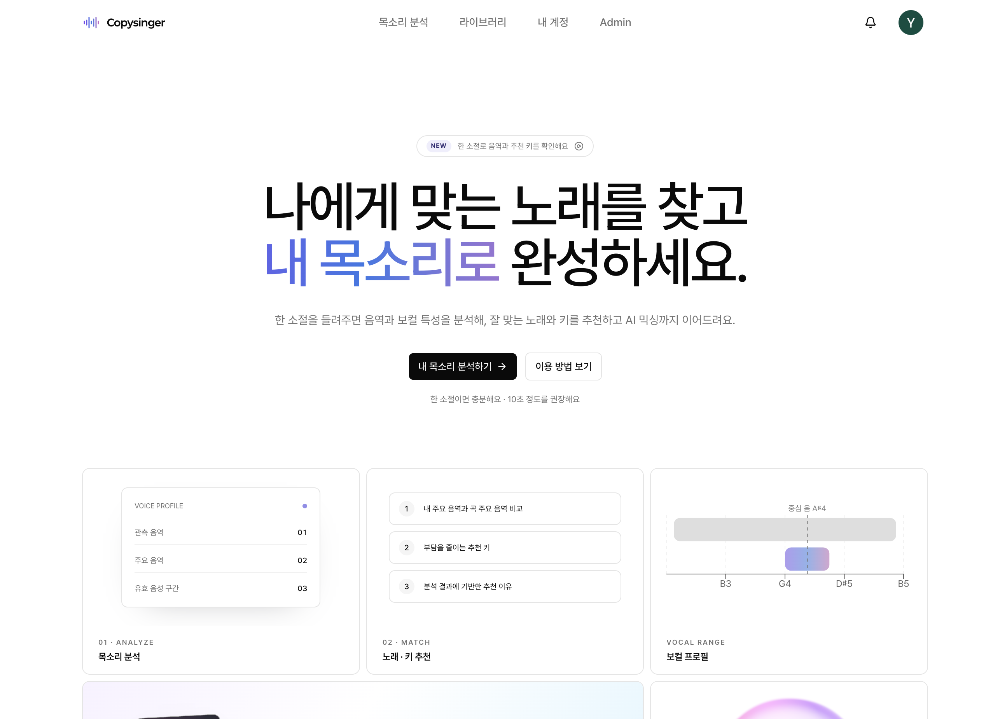
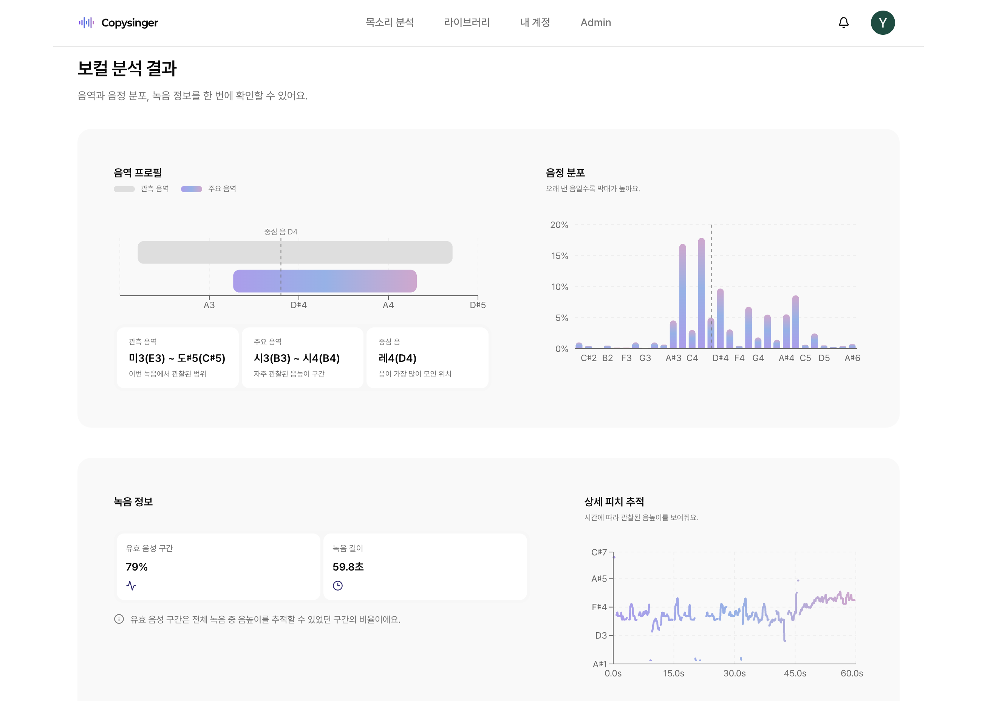

<p align="center">
  
</p>

<h1 align="center">
  <strong>Copysinger</strong>
</h1>

<p align="center">
  <strong>한 소절의 목소리를 분석해 잘 맞는 노래와 키를 찾고, AI 믹싱까지 이어주는 보컬 추천 서비스</strong>
</p>

<p align="center">
  
  
  
  
</p>

<p align="center">
  <a href="#quick-start">Quick Start</a> •
  <a href="#주요-기능">주요 기능</a> •
  <a href="#기술-스택">기술 스택</a> •
  <a href="#시스템-구성">시스템 구성</a> •
  <a href="#실행과-배포">실행과 배포</a> •
  <a href="#테스트">테스트</a>
</p>

<p align="center">
  
</p>

<p align="center">
  
</p>

---

## 목차

- [Quick Start](#quick-start)
- [주요 기능](#주요-기능)
- [기술 스택](#기술-스택)
- [시스템 구성](#시스템-구성)
- [실행과 배포](#실행과-배포)
- [프로젝트 구조](#프로젝트-구조)
- [테스트](#테스트)
- [문서 워크플로](#문서-워크플로)

## Quick Start

```bash
# 1. 의존성 및 로컬 설정 준비
pnpm install --frozen-lockfile
cp .env.example .env.local

# 2. PostgreSQL 시작
docker compose up -d

# 3. DB 준비
pnpm run db:migrate:deploy
pnpm run db:generate

# 4. 웹과 background worker 시작
pnpm dev
```

→ [http://localhost:3000](http://localhost:3000)에서 확인

## 주요 기능

### 🎙️ 목소리 분석

- 브라우저 녹음 또는 오디오 파일 업로드
- 관측 음역, 주요 음역, 중심 음과 유효 음성 구간 분석
- 음정 분포와 시간별 피치 흐름 시각화
- 분석한 레퍼런스 오디오와 보컬 프로필을 라이브러리에 보관

### 🎵 노래와 키 추천

- 공개 카탈로그 전체를 현재 보컬 프로필과 비교
- 원키 적합도, 추천 키와 추천 이유 제공
- 검색·정렬·필터와 곡별 상세 근거 제공
- 원본 YouTube 영상을 privacy-enhanced player로 확인

### ✨ AI 믹싱

- 사용자가 선택한 곡만 티켓을 사용해 AI 믹싱
- 보컬 분리, 자동 피치 이동과 반주 재결합
- PostgreSQL 영속 큐와 lease 기반 worker로 재시작 후에도 작업 복구
- 완료 결과 재생·다운로드와 믹싱 이력 관리

### 📚 라이브러리와 계정

- 보컬 프로필과 믹싱 결과를 한곳에서 탐색
- 티켓 잔액과 지급·사용·환불 내역 확인
- 분석과 믹싱 완료·실패 알림 제공
- Google OAuth 기반 사용자별 데이터 소유권 보호

### 🛠️ 관리자 운영

- 사용자, 티켓과 믹싱 작업 상태 관리
- 추천곡, YouTube 미리듣기 영상과 원곡 음원 등록·교체
- 곡 분석 준비 상태, 공개, 추천 제외와 복원 관리
- 카탈로그 snapshot 내보내기·가져오기

## 기술 스택

| 영역 | 기술 |
| --- | --- |
| **Framework** | Next.js 16 App Router, React 19 |
| **Language** | TypeScript 5.9 |
| **UI** | Tailwind CSS 4, Base UI, shadcn, Motion |
| **Server state** | TanStack Query |
| **Audio UI** | WaveSurfer, MediaBunny |
| **Charts** | Recharts |
| **Database** | PostgreSQL, Prisma 7 |
| **Authentication** | Better Auth, Google OAuth |
| **Media storage** | Leemage |
| **AI processing** | Modal, SoulX-Singer, Demucs, librosa |
| **Validation** | Zod |
| **Test** | Node test runner, Vitest, Storybook, Playwright |
| **Architecture** | Feature-Sliced Design, Steiger |

## 시스템 구성

```text
Browser
  └─ Next.js App Router
      ├─ Better Auth ─────────────── Google OAuth
      ├─ Prisma ──────────────────── PostgreSQL
      ├─ Media client ────────────── Leemage
      └─ Durable background workers
          ├─ 보컬 프로필 분석 ───── Modal CPU analyzer
          ├─ 곡 카탈로그 분석 ───── Modal CPU analyzer
          └─ AI 믹싱 ─────────────── SoulX-Singer Modal API
```

웹 요청은 분석과 믹싱 작업을 PostgreSQL에 접수하고 바로 응답한다. 별도 worker가 작업을 원자적으로 점유하며, 외부 작업 ID와 lease를 저장해 프로세스가 재시작돼도 같은 작업을 이어간다. 사용자 레퍼런스와 최종 결과는 Leemage에 저장하고 PostgreSQL에는 소유권과 파일 metadata만 유지한다.

추천곡 카탈로그도 PostgreSQL을 runtime source of truth로 사용한다. 곡 identity, YouTube 출처 revision, 분석 revision, 공개 상태와 원곡 asset을 분리해 출처를 교체해도 기존 추천과 믹싱 근거를 보존한다.

## 실행과 배포

### 사전 요구사항

- Node.js 22.13.0 이상
- pnpm 11.9.0
- Docker 20 이상
- PostgreSQL
- Google OAuth web client
- Leemage project와 API key
- 배포된 Modal 분석·믹싱 서비스
- production 결과 오디오 변환을 위한 FFmpeg

각 로컬·운영 설정의 의미와 선택 조건은 [.env.example](.env.example)에 정리되어 있다.

### 로컬 실행

`docker compose up -d`는 로컬 PostgreSQL을 시작한다. 데이터베이스를 준비한 뒤 `pnpm dev`를 실행하면 Next.js와 믹싱·보컬 분석·곡 분석 worker가 함께 시작된다. 두 분석 worker는 배포된 Modal CPU service를 사용한다.

```bash
docker compose up -d
pnpm run db:migrate:deploy
pnpm run db:generate
pnpm dev
```

주요 화면:

- `/` — 공개 랜딩
- `/profile` — 목소리 녹음·업로드와 분석
- `/library` — 보컬 프로필과 믹싱 결과
- `/account` — 계정과 티켓 원장
- `/admin` — 관리자 운영
- `/admin/songs` — 추천곡 관리
- `/admin/custom-mixing` — 관리자 커스텀 믹싱

### 분석 서비스

보컬 프로필과 곡 카탈로그 분석 service는 인증을 준비한 뒤 각각 Modal에 배포한다.

```bash
pnpm run modal:vocal-profile:deploy
pnpm run modal:song-catalog:deploy
```

곡 분석기는 관리자에게 업로드받은 원곡 파일을 job 단위 임시 디렉터리에서 처리한다. Demucs로 보컬을 분리한 뒤 pYIN 음역 분석과 chroma 기반 원키 추정을 수행하며, 임시 음원과 stem은 결과 반환 전에 정리한다.

### production

단일 인스턴스에서는 build 후 기본 start 명령을 사용한다. `pnpm start`는 웹과 세 worker를 함께 감독하며 하나가 실패하면 전체 프로세스를 종료해 배포 관리자가 인스턴스를 다시 시작할 수 있게 한다.

```bash
pnpm install --frozen-lockfile
pnpm run db:migrate:deploy
pnpm build
pnpm start
```

새 PostgreSQL에 배포한 경우 migration 후 `/admin/songs`에서 기존 카탈로그 snapshot을 가져온다. snapshot에는 분석 결과와 외부 asset metadata가 포함되며 원본 음원 bytes는 포함되지 않는다.

## 프로젝트 구조

```text
app/                              Next.js App Router adapter
src/_app/                         FSD App layer, provider, route, worker
src/_pages/                       FSD Pages layer
src/widgets/                      독립적인 페이지 UI block
src/features/                     사용자 action과 application use case
src/entities/                     domain model과 domain UI
src/shared/                       공통 config, DB, media, UI와 library
prisma/                           schema, migration과 development seed
scripts/                          worker 및 검증 script
services/soulx-singer-svc/        Modal GPU singing voice conversion API
services/vocal-profile-modal/     Modal 보컬 프로필 분석기
services/song-catalog-analyzer/   Modal 곡 카탈로그 분석기
services/vocal-analysis-core/     Modal 분석 service가 공유하는 Python core
tests/                            unit, integration, UI와 boundary test
```

root `app/`은 Next.js route convention과 FSD public API re-export만 담당한다. 실제 page composition과 Route Handler 구현은 `src/_app/`과 `src/_pages/`에 있다.

```text
_app → _pages → widgets → features → entities → shared
```

slice 사이에서는 대상 slice의 root public API로만 접근한다. `index.ts`는 browser-safe API, `index.model.ts`는 runtime-neutral contract, `index.server.ts`는 DB·secret·server capability를 노출한다. 자세한 규칙은 [공식 FSD Next.js guide](https://fsd.how/docs/guides/tech/with-nextjs/)를 따른다.

## 테스트

```bash
# 전체 production build와 회귀 테스트
pnpm test

# 정적 품질 검사
pnpm run check

# 개별 검사
pnpm run lint
pnpm run typecheck
pnpm run check:architecture
pnpm run db:validate

# Storybook
pnpm storybook
pnpm run test:storybook --run
```

전체 suite는 production build, domain/unit test, PostgreSQL integration, API contract, FSD boundary와 Storybook interaction을 순서대로 검증한다.

## 문서 워크플로

이 저장소는 embedded local workflow의 lee-spec-kit을 사용한다.

```bash
npx lee-spec-kit detect --json
npx lee-spec-kit idea <name>
npx lee-spec-kit feature <name> --component web
npx lee-spec-kit feature <name> --component modal-api
```

제품 요구사항은 `docs/prd/`, Feature별 spec·plan·tasks·decisions는 `docs/features/` 아래에서 관리한다.
