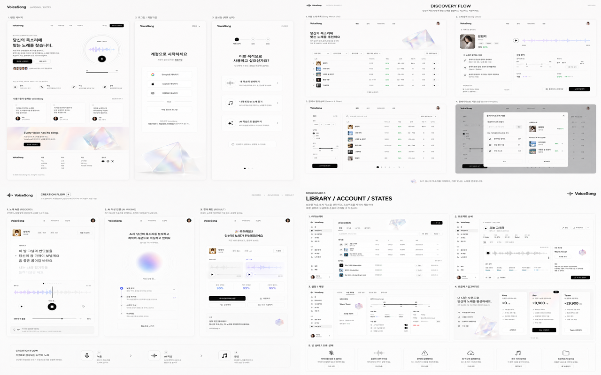

# Page Redesign Image Set

F018의 13개 App Router page를 원본 디자인 보드, 현재 구현 캡처와 ImageGen 방향 시안으로 비교하기 위한 산출물이다.

## 정본 구분

- `../../assets/product-ui-redesign/*.png`: 사용자가 제공한 원본 visual source of truth
- `current/`: 2026-08-10 현재 구현의 1280×800 desktop baseline
- `concepts-v2/`: 원본 보드와 공통 master를 함께 참조해 다시 생성한 채택 시안
- V1과 V2 중간 시안: 페이지마다 색과 shell이 달라 최종 검수에서 폐기했으며 repository에는 포함하지 않는다.

V1은 `#FBFAF7` warm canvas와 독립 prompt 때문에 페이지마다 wordmark, navigation, typography와 정보 밀도가 달라졌다. 구현 방향으로 사용하지 않으며 repository 용량을 늘리지 않도록 폐기본도 보관하지 않는다.

## V2 생성 방식

- Mode: built-in ImageGen의 reference-conditioned generation/edit
- Public master: `concepts-v2/landing.png`
- Product master: `concepts-v2/library.png`
- 모든 화면에 관련 원본 보드와 master를 `referenced_image_paths`로 함께 전달했다.
- 공통 prompt lock: `#FFFFFF` canvas, `#FAFAFA/#F7F7F7` quiet surface, `#E8E8E8` border, `#111111/#737373` type, black primary CTA, lavender/blue data accent, green status, shadow 최소화, sans typography, flat information hierarchy
- Product shell lock: sidebar 없는 64px top header, 동일 waveform mark와 `Copy Singer`, 중앙 `Voice Scan / Library / Account`, 우측 compact avatar
- Landing ending lock: `Every voice has its song.` CTA, iridescent crystal과 그 아래의 실제 site footer
- Admin과 dev SVC는 같은 token을 사용하는 top-header utility 예외다.

세부 prompt와 제약은 [V2 Style Lock](./v2-style-lock.md)을 따른다. 생성 이미지의 작은 문구와 fixture 숫자는 구현 계약이 아니며 실제 API·Zod·Page composition이 정본이다.

## 비교 시트

### 원본 디자인 보드

### 현재 구현

### 채택한 V2 시안

V2 시트의 순서는 왼쪽부터 Landing, Login, Voice Scan, Vocal Profiles, Vocal Profile Detail, Song Match, Song Detail, Library, Mixing History, Mixing Detail, Account, Admin, dev SVC다.

## 파일 목록

| Route | Current | V2 concept | 주 reference |
| --- | --- | --- | --- |
| `/` | [landing](./current/landing.png) | [landing](./concepts-v2/landing.png) | Landing / Entry |
| `/login` | [login](./current/login.png) | [login](./concepts-v2/login.png) | Landing / Entry |
| `/profile` | [profile](./current/profile.png) | [profile](./concepts-v2/profile.png) | Landing / Entry, Creation |
| `/vocal-profiles` | [vocal profiles](./current/vocal-profiles.png) | [vocal profiles](./concepts-v2/vocal-profiles.png) | Library / Account |
| `/vocal-profiles/[id]` | [profile detail](./current/vocal-profile-detail.png) | [profile detail](./concepts-v2/vocal-profile-detail.png) | Library / Account |
| `/recommendations/[id]` | [song match](./current/recommendation-detail.png) | [song match](./concepts-v2/recommendation-detail.png) | Discovery |
| `/recommendations/[id]/songs/[itemId]` | [song detail](./current/song-detail.png) | [song detail](./concepts-v2/song-detail.png) | Discovery |
| `/library` | [library](./current/library.png) | [library](./concepts-v2/library.png) | Library / Account |
| `/mixing-history` | [mixing history](./current/mixing-history.png) | [mixing history](./concepts-v2/mixing-history.png) | Creation, Library / Account |
| `/library/mixes/[id]` | [mixing detail](./current/mixing-detail.png) | [mixing detail](./concepts-v2/mixing-detail.png) | Creation |
| `/account` | [account](./current/account.png) | [account](./concepts-v2/account.png) | Library / Account |
| `/admin` | [admin](./current/admin.png) | [admin](./concepts-v2/admin.png) | Library / Account token only |
| `/dev/svc` | [dev SVC](./current/dev-svc.png) | [dev SVC](./concepts-v2/dev-svc.png) | Creation token only |

페이지별 구현 차이와 우선순위는 [Page Redesign Gap Analysis](../../page-redesign-analysis.md)에 기록한다.
