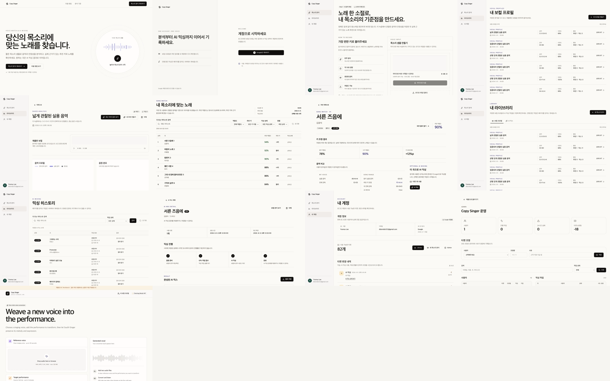
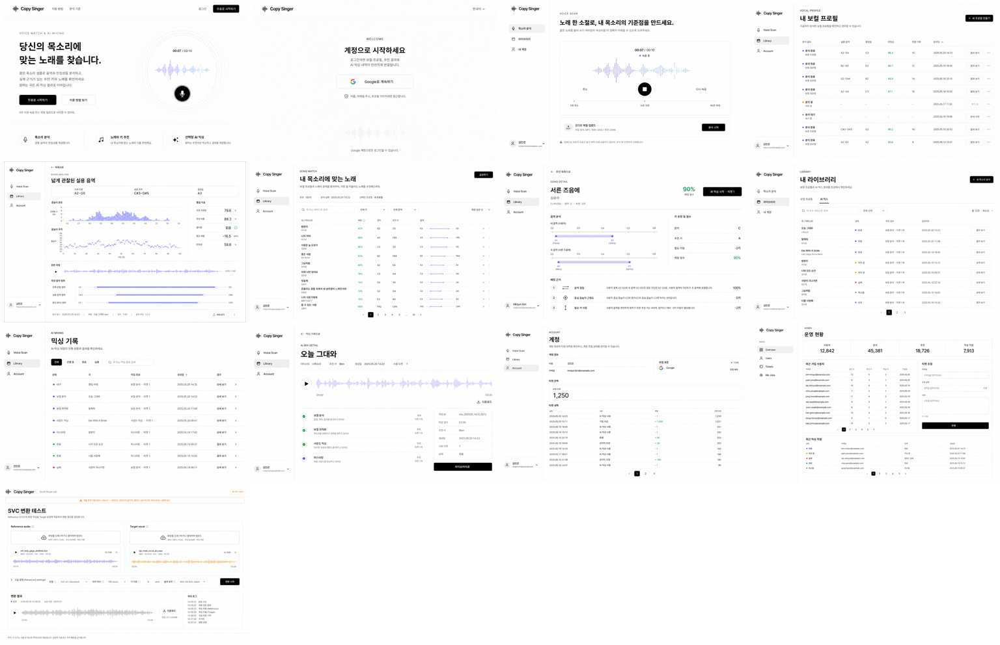

---
lee-spec-kit:
  kind: visual-analysis
  scope: feature
---

# F018 Page Redesign Gap Analysis

현재 구현된 13개 page route를 1280×800에서 캡처하고, 사용자가 제공한 네 디자인 보드와 V2 ImageGen 시안을 대조한 결과다. V2는 픽셀 구현 명세가 아니라 레이아웃·정보 위계·색감의 방향이며 실제 데이터, 상태, 버튼과 문구의 정본은 현재 코드·API·Zod 계약이다.

## 핵심 결론

1. 현재 화면이 누렇게 보이는 지적은 정확하다. `src/_app/styles/globals.css`의 light token이 `--background: oklch(0.985 0.004 80)`, `--card: oklch(0.998 0.002 80)`, `--sidebar: oklch(0.975 0.003 75)`처럼 hue 75–80의 미세한 warm chroma를 사용한다. 원본 보드의 거의 무채색 흰 캔버스와 비교하면 화면 전체에 베이지 막이 생긴다.
2. V1 생성본도 prompt에서 warm white `#FBFAF7`를 지시하고 페이지를 독립 생성해 이 문제를 반복했다. V1은 폐기한다.
3. V2는 `#FFFFFF` canvas, neutral gray, 동일 Landing/Library master와 관련 원본 보드를 각 호출에 함께 사용했다. 결과적으로 wordmark, product rail, heading rhythm, list density와 accent 용도가 같은 계열로 정렬됐다.
4. 현재 구현은 기능과 상태 계약은 충분하지만, 일부 화면은 원본 보드보다 카드성 구획이 많고 first viewport의 제품 interaction이나 결과가 작다. token 교정 후 상세·작업 화면의 위계를 순차 보완하는 것이 효과가 크다.

## 비교 개요

## 공통 수정 기준

| 항목 | 현재 | V2 목표 | 구현 제약 |
| --- | --- | --- | --- |
| Canvas | hue 75–80의 warm chroma | neutral `#FFFFFF` | light semantic token을 한 번에 교정하고 Storybook 전체 회귀 |
| Surface | warm card/sidebar | neutral `#FAFAFA/#F7F7F7` | dark theme token은 별도 유지 |
| Shell | 구현은 공통이나 화면별 첫 위계가 다름 | 216px rail, 동일 brand/nav/title rhythm | mobile Sheet와 auth guard 보존 |
| Section | 일부 큰 rounded Card 반복 | whitespace, hairline, flat grid | Dialog/Sheet 같은 실제 overlay는 elevation 허용 |
| Accent | 상태 외 warm warning이 넓게 보임 | waveform lavender/blue, success green에 제한 | 색상만으로 상태를 전달하지 않음 |
| Density | 상세는 여백 과다, 일부 목록은 낮은 행 밀도 | 1280×800에서 비교 가능한 6–9행 | 100곡 목록의 lazy audio·URL filter 유지 |

## 페이지별 차이

| Route | 현재와 V2의 핵심 차이 | 우선순위 | 반드시 보존할 계약 |
| --- | --- | --- | --- |
| `/` | 현재도 motion은 동작하지만 hero 오른쪽 visual이 작고 전체 canvas가 warm하다. V2는 copy와 ripple microphone을 거의 1:1로 두고 기능 strip을 첫 viewport 하단에 붙인다. | 중 | session별 CTA, reduced motion, microphone Link |
| `/login` | 현재는 기능 설명이 함께 있는 분할 구성이며 V2는 원본처럼 중앙 한 열 Google entry다. 가장 큰 차이는 warm background와 form 폭이다. | 낮음 | Google-only, safe callback, configured/error state |
| `/profile` | 현재는 설명 Card와 녹음 Card가 경쟁한다. V2는 live waveform, timer와 stop control을 단일 중심 interaction으로 올리고 upload를 보조 행으로 내린다. | 높음 | 5초 최소, 10초 권장, 60초 최대, permission/upload/trim, cleanup |
| `/vocal-profiles` | 현재 구조는 이미 평면 목록에 가깝지만 row당 정보 그룹이 넓고 warm surface가 남는다. V2는 title/action과 7–8개 분석 행을 같은 viewport에 정렬한다. | 낮음 | active job polling, profile navigation, 실제 측정값만 표시 |
| `/vocal-profiles/[id]` | 현재는 summary, source, chart가 세로로 길게 분산된다. V2는 summary band, histogram, pitch trace와 quality를 첫 viewport에 배치한다. | 높음 | source audio, charts의 null gap, delete/recommendation action, 중립 presentation |
| `/recommendations/[id]` | 현재도 100곡 compact 목록이지만 header metadata와 filter가 분산되고 key/range 비교가 약하다. V2는 한 줄 filter와 더 조밀한 pitch-range 열을 사용한다. | 중 | URL filter/sort, Query cache, mixing state, initial waveform 0개 |
| `/recommendations/[id]/songs/[itemId]` | 현재는 score breakdown 위계가 강하고 range/CTA가 떨어져 있다. V2는 score·단일 mixing CTA·두 range band·세 근거를 한 화면에 묶는다. | 중 | 같은 recommendation Query key, nullable song profile, 외부 source link |
| `/library` | 현재 기능 구조는 V2와 가장 가깝다. 차이는 warm canvas, header의 빈 공간과 row action 밀도다. | 낮음 | profile/mix tabs, server filter, URL pagination, active polling |
| `/mixing-history` | 현재 목록은 비교적 평평하지만 상태 badge와 row 간격이 크다. V2는 상태 점·작업 정보·결과 action을 한 표에 고정한다. | 낮음 | 실제 status만 표시, fake percent 금지, polling |
| `/library/mixes/[id]` | 현재는 timeline이 결과보다 먼저 눈에 들어온다. V2는 결과 waveform을 첫 화면의 주인공으로 두고 실제 단계·metadata를 아래에 둔다. | 높음 | private media, terminal polling stop, download/delete, fake stage/percent 금지 |
| `/account` | 현재 구조와 데이터는 적절하지만 warm surface와 ticket summary Card가 강하다. V2는 identity, Google, balance와 ledger를 hairline 기반으로 평평하게 연결한다. | 낮음 | session identity, 실제 Google provider, ticket ledger, 없는 설정 금지 |
| `/admin` | 현재는 rounded metric Card와 독립적인 warm dashboard다. V2는 동일 token/wordmark를 쓰는 flat operator rail과 표 중심 구조다. | 후속 높음 | 운영 form·권한·데이터 동작; F018 전면 redesign 제외 범위 |
| `/dev/svc` | 현재는 warm canvas 위 purple/orange card language가 제품과 크게 다르다. V2는 순백색 utility 화면에 input waveform 두 색만 남긴다. | 후속 중 | streaming upload, SVC form/result, dev-only 경고; F018 전면 redesign 제외 범위 |

## 권장 구현 순서

1. Light semantic token에서 hue 75–80 chroma를 제거하고 `background/card/sidebar/muted/border`를 neutral scale로 교정한다.
2. `/profile`, `/vocal-profiles/[id]`, `/library/mixes/[id]`의 첫 viewport를 각각 recording, analysis, result 중심으로 재배치한다.
3. Song Match와 Song Detail의 metadata/filter/range/action rhythm을 V2에 맞춘다.
4. Landing visual 크기와 fold를 다듬되 이미 구현된 waveform/ripple motion 및 reduced-motion 계약을 보존한다.
5. `/admin`과 `/dev/svc`는 F018 제외 범위를 유지하고 별도 후속 Feature에서 같은 neutral token을 적용한다.

## 생성 시안 사용 시 주의

- ImageGen이 만든 작은 문구, 이메일, 숫자, 곡명과 아이콘 세부는 fixture이며 구현 요구사항이 아니다.
- Account concept의 연결 해제, Recommendation concept의 공유처럼 현재 기능 계약에 없는 생성 흔적은 구현하지 않는다.
- 앨범 artwork, genre, difficulty, lyrics, playlist, favorite, project, pricing, Before/After는 원본 보드에 있어도 현재 범위에서 만들지 않는다.
- Admin/dev SVC 시안은 통일 방향을 보여 주는 후속 범위이며 F018 구현 완료를 소급 변경하지 않는다.

## 산출물

- [생성·캡처 자산 안내](./generated/page-redesigns/README.md)
- [V2 Style Lock](./generated/page-redesigns/v2-style-lock.md)
- [원본 보드 정본](./product-ui-redesign.md)
- [장기 Design System](./design-system.md)
