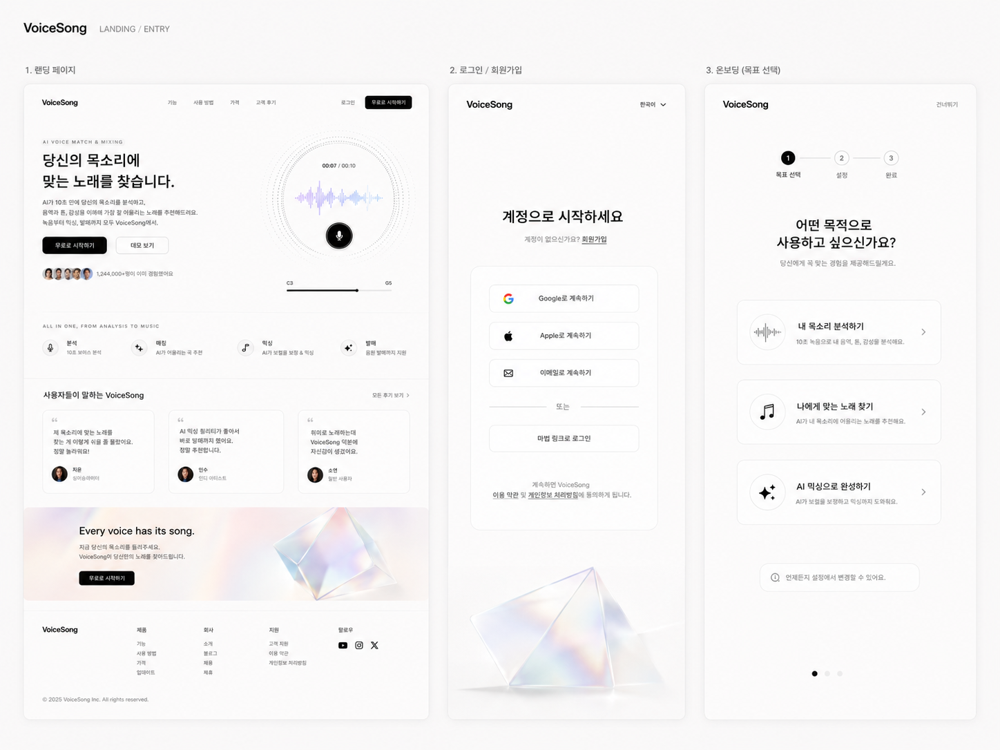
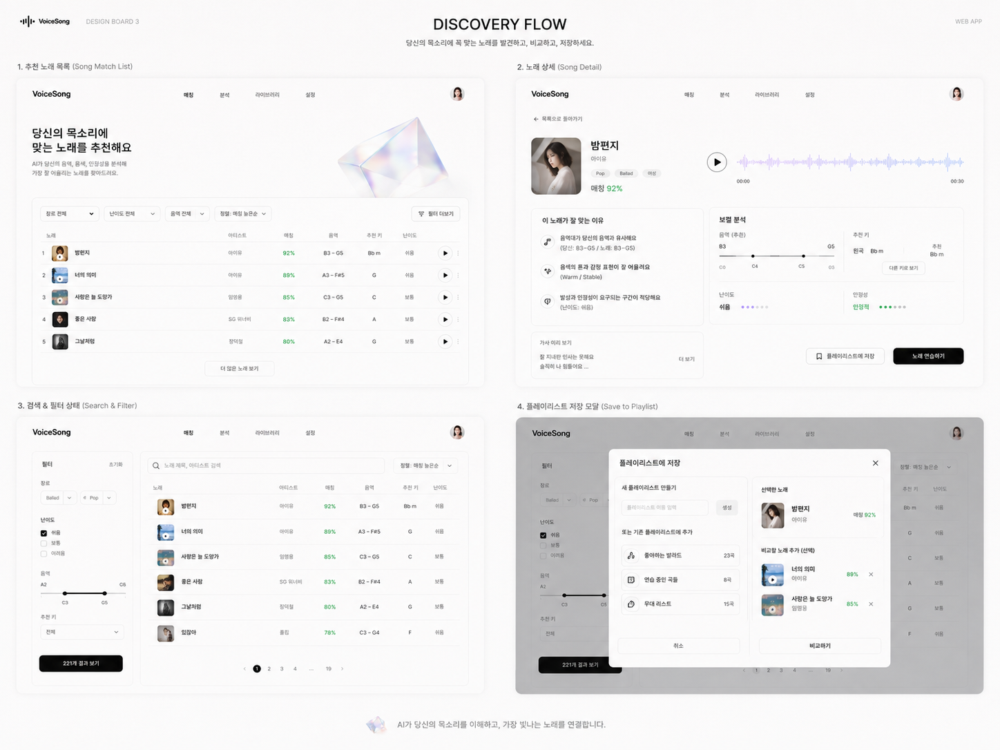
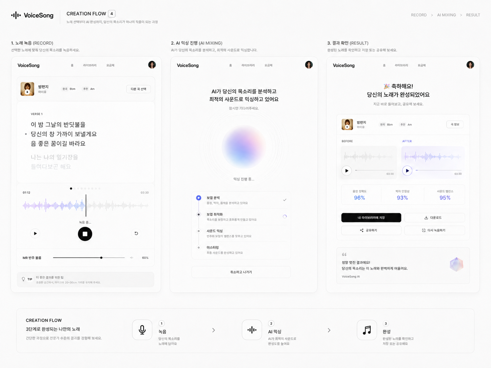
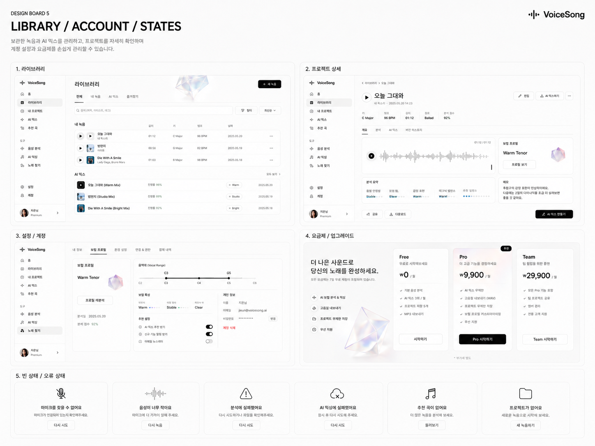

---
lee-spec-kit:
  kind: visual-reference
  scope: project
---

# Copy Singer Product UI Redesign

F018과 후속 제품 UI Feature가 공유하는 디자인 정본이다. 원본 디자인 보드는 2026-08-09 사용자가 제공한 네 장의 이미지이며 `docs/designs/assets/product-ui-redesign/`에 원본 바이트 그대로 보관한다. 이 문서는 이미지의 픽셀 복제가 아니라 공간감, 정보 위계와 상호작용 구조를 구현 가능한 규칙으로 정리한다.

전 제품에 반복 적용되는 color, typography, spacing, component, responsive와 accessibility 규칙은 [Copy Singer Design System](./design-system.md)을 정본으로 사용한다. 이 문서는 F018의 visual brief와 원본 reference에 집중한다.

## 원본 보드

| 보드 | 포함 화면 | 핵심 패턴 |
| --- | --- | --- |
| [Landing / Entry](./assets/product-ui-redesign/landing-entry.png) | 랜딩, 로그인, 온보딩 | 큰 제목, 넓은 여백, 단일 primary CTA, 한 열 인증 폼 |
| [Discovery Flow](./assets/product-ui-redesign/discovery-flow.png) | 추천 목록, 곡 상세, 검색·필터, 저장 모달 | 조밀하지만 평평한 목록, 상세 근거 분리, 낮은 대비의 구획 |
| [Creation Flow](./assets/product-ui-redesign/creation-flow.png) | 노래 녹음, AI 믹싱, 결과 | 제품 상호작용을 중앙에 두고 상태 단계를 간결하게 표현 |
| [Library / Account / States](./assets/product-ui-redesign/library-account-states.png) | 라이브러리, 상세, 설정, 요금제, 빈·오류 상태 | 좌측 app navigation, 표 중심 라이브러리, 일관된 상태 패널 |

### Landing / Entry

### Discovery Flow

### Creation Flow

### Library / Account / States

네 자산은 모두 `1448 × 1086` PNG다. 프로젝트 안의 kebab-case 파일을 이후 구현·리뷰·시각 비교의 기준으로 사용하며 Desktop의 원래 파일 경로에 의존하지 않는다.

## 시각 원칙

- white, warm gray, black을 기본으로 하고 black을 primary action에 사용한다.
- 경계는 얇고 낮은 대비로 표현하며 shadow는 overlay와 꼭 필요한 떠 있는 요소에만 쓴다.
- 모든 영역을 둥근 카드로 감싸지 않는다. grid, spacing, separator와 typography로 먼저 구분한다.
- 제목은 크고 간결하게, 보조 설명은 작고 차분하게 두어 정보 위계를 만든다.
- lavender·blue 계열은 waveform과 분석 시각화, green은 성공·적합도처럼 의미가 있는 상태에만 제한한다.
- 전역 gradient 배경과 전형적인 purple AI SaaS 장식은 사용하지 않는다.
- 제품 동작인 녹음, 파형, 분석, 추천 근거와 결과 재생이 화면의 시각적 중심이 된다.

## 컴포넌트 원칙

- 현재 shadcn/ui 및 semantic token을 확장해 사용하고 별도 UI library나 디자인 시스템을 추가하지 않는다.
- 기존 `AudioWaveformPlayer`, WaveSurfer recorder, Chart, Button, Card, Progress, Slider, Switch, Tooltip을 우선 재사용한다.
- 필요한 Tabs, Dialog, Sheet, DropdownMenu 등은 현재 shadcn/Base UI 구성과 FSD 공개 API 규칙에 맞춰 추가한다.
- ElevenLabs UI는 패키지로 도입하지 않는다. live waveform, microphone permission, audio scrubber와 명시적 interaction state 같은 공개 패턴만 현재 구현에 맞게 재구성한다.
- 아이콘은 현재 Lucide 체계를 유지하고 장식 목적의 새 icon package를 추가하지 않는다.

## 데이터 정직성

디자인 보드에 보이지만 현재 제품 계약에 없는 정보는 mock production data로 채우지 않는다.

| 디자인 요소 | F018 처리 | 후속 조건 |
| --- | --- | --- |
| 앨범 이미지, 장르, 난이도, 가사, 인앱 곡 미리듣기 | 중립 placeholder 또는 해당 영역 미노출 | Song metadata/API와 사용 권한 확장 |
| 플레이리스트, 즐겨찾기 | 미노출 | 사용자 소유 저장 모델과 API |
| 노래 가창 녹음과 프로젝트 | 미노출 | Recording/Project 도메인과 반주·가사 계약 |
| Raw/AI Mixed Before & After | 미노출 | 사용자 가창 원본과 결과 연결 모델 |
| 구독 요금제와 결제 | 미노출 | 상품·결제·권한 정책 |
| 이메일·Apple 로그인 | 미노출 | 인증 PRD 변경 |

## 반응형·상태 원칙

- desktop에서는 sidebar 또는 상단 navigation과 넓은 content rail을 사용한다.
- tablet에서는 정보 열을 재배치하고 필터는 접을 수 있게 한다.
- mobile에서는 핵심 CTA와 재생·녹음 control을 우선하고 표를 단순 목록으로 전환한다.
- loading, empty, error, disabled, permission denied, recording, processing과 success를 텍스트와 아이콘으로 함께 구분한다.
- waveform 이외의 장식 animation은 reduced motion 환경에서 제거한다.

## 외부 참고

- [ElevenLabs UI repository](https://github.com/elevenlabs/ui)
- [Waveform](https://ui.elevenlabs.io/docs/components/waveform)
- [Live Waveform](https://ui.elevenlabs.io/docs/components/live-waveform)
- [Mic Selector](https://ui.elevenlabs.io/docs/components/mic-selector)
- [Voice Button](https://ui.elevenlabs.io/docs/components/voice-button)
