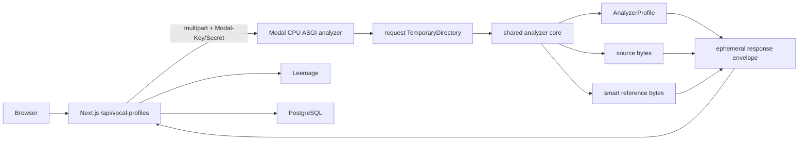

# Implementation Plan: modal-vocal-profile-analysis

> 스펙이 승인된 후 작성합니다.
> canonical docs surface 밖의 unmanaged docs 산출물(예: `docs/plans/*`, `docs/superpowers/*`)이 있더라도, 아키텍처/파일/테스트 내용은 이 파일로 흡수하고 최종 SSOT는 여기로 유지합니다.

---

## 개요

- **기능 ID**: F010
- **대상 레포**: copy-singer-modal-api
- **작성일**: 2026-08-08
- **상태**: Approved
  - 값: Draft | Review | Approved

이 계획은 F009에서 확정된 `AnalyzerProfile`과 `smart-reference-v1`의 의미를 바꾸지 않고, 프로덕션 사용자 분석 실행 위치만 local FastAPI에서 별도 Modal CPU app으로 옮기는 것을 목표로 한다. local FastAPI는 개발/contract parity 경로로 유지한다.

---

## 기술 스택

| 구분 | 선택 | 이유 |
| ---- | ---- | ---- |
| Modal 배포 단위 | 별도 `copy-singer-vocal-profile-analyzer` App | CPU analyzer와 SoulX L4 mixer의 dependency, autoscaling, 비용 경계를 분리한다. Modal App 안의 Function은 서로 독립적으로 scale하므로 굳이 GPU app lifecycle에 결합하지 않는다. |
| HTTP surface | FastAPI + `@modal.asgi_app()` | 현재 multipart 업로드/error contract와 유사한 HTTP adapter를 유지하고 health/analyze endpoint를 명시적으로 제공한다. |
| compute baseline | CPU 2 physical cores, memory 4096 MiB, GPU 없음 | librosa/pYIN/FFmpeg CPU workload의 첫 benchmark 기준. 최종 값은 10/30/60초 측정 후 조정한다. |
| autoscaling baseline | `min_containers=0`, 기본 scale-to-zero, `scaledown_window=60`, 제한된 `max_containers` | 상시 warm 비용을 만들지 않고 Modal 기본 idle 정책에서 시작한다. warm 증가는 evidence가 있을 때만 적용한다. |
| HTTP sync budget | sync 우선, 60초 cold end-to-end 목표 90초 이하 / client budget 120초 | Modal Web Function의 150초 HTTP 제한에 30초 이상 safety margin을 둔다. benchmark가 이를 만족하지 못하면 async submit/polling으로 전환한다. |
| endpoint 인증 | Modal proxy token (`Modal-Key`, `Modal-Secret`) | 별도 API key 검증 코드를 analyzer에 추가하지 않고 platform server-to-server auth를 사용한다. credential은 Next.js server 전용이다. |
| analyzer code | 기존 `services/vocal-profile-api/app` 코어 공유 | local/Modal의 분석·reference algorithm 분기를 막고 같은 versioned contract를 사용한다. |
| artifact handoff | Modal 단일 분석 응답의 ephemeral artifact envelope → Next.js Leemage upload | Modal의 후속 GET이 다른 container로 라우팅되는 문제를 피하고 persistent Volume/Dict 없이 source/reference를 같은 요청에서 회수한다. |
| 영구 저장 | Next.js → Leemage + PostgreSQL | 기존 ownership/보상 cleanup 로직과 secret 경계를 재사용하고 Modal에 Leemage/DB credential을 주지 않는다. |
| 비용 산정 | benchmark runtime × 당시 Modal CPU/memory 공식 단가 | 가격을 코드 상수로 고정하지 않고 측정 문서에 시점과 단가를 기록한다. |

### 현재 Modal 제약 기준

계획 작성 시점 공식 문서 기준으로 Web Function request body는 최대 4 GiB이고 response body는 크기 제한이 없으며, HTTP request는 150초 제한을 가진다. Modal Function 실행 timeout 기본값은 300초이며 별도 지정할 수 있다. idle container의 기본 `scaledown_window`는 60초이고 `min_containers`/`buffer_containers`는 latency와 비용 trade-off를 만든다.

이 Feature는 최대 60초의 경량 client-converted audio만 받으므로 body size가 제한의 병목이 되지 않는다. 실제 위험은 pYIN/FFmpeg 처리와 cold start를 합친 latency이므로 transport 선택은 시간 benchmark를 기준으로 한다.

---

## 아키텍처

### 1. 공유 분석 코어 경계

현재 `services/vocal-profile-api/app/main.py`에는 HTTP upload, 임시 디렉터리, `standardize_audio`, pitch 분석, smart reference 생성과 local TTL storage가 한 route에 결합되어 있다. 이를 다음 경계로 분리한다.

```text
HTTP adapter
  ├─ local FastAPI adapter
  └─ Modal FastAPI adapter
          ↓
shared recording analysis service
  ├─ validate MIME / size / segment input
  ├─ standardize_audio
  ├─ analyze_wav_with_frames
  ├─ build_smart_reference
  └─ build AnalyzerProfile-compatible result
```

공유 service는 외부 저장소나 DB를 호출하지 않는다. 호출자가 제공한 request-scoped working directory에서만 파일을 만들고 profile metadata와 생성 artifact path/metadata를 반환한다.

local FastAPI는 기존 호환을 위해 현재 `POST /v1/analyze` + artifact GET + DELETE 계약을 유지할 수 있다. Modal adapter는 같은 shared service 결과를 단일 HTTP 응답으로 serialize한다.

### 2. 별도 Modal CPU App

신규 `services/vocal-profile-modal/modal_app.py`를 둔다.



Modal image에는 다음을 고정한다.

- Python 3.12
- FFmpeg
- `services/vocal-profile-api/requirements.txt`와 동일한 analyzer dependency versions
- 공유 analyzer source directory
- GPU resource 없음

App은 SoulX mixer app과 분리하여 analyzer deploy가 mixer GPU worker image/lifecycle을 건드리지 않도록 한다.

### 3. artifact handoff 계약

현재 local analyzer는 POST 완료 후 임시 파일을 남기고 Next.js가 `/source`, `/synthesis-reference`를 별도 GET한 뒤 DELETE한다. 이 구조를 Modal에서 그대로 사용하면 후속 요청이 같은 ephemeral container/filesystem에 도착한다는 보장이 없으므로 사용하지 않는다.

Modal transport는 한 분석 호출 안에서 다음 envelope를 반환한다.

```text
ModalAnalysisEnvelope
├── profile: AnalyzerProfile
├── source
│   ├── mimeType
│   ├── fileName
│   └── bytes (transport encoding)
└── synthesisReference?:
    ├── mimeType: audio/wav
    ├── fileName
    └── bytes (transport encoding)
```

1차 구현은 최대 60초 source + 최대 30초 mono WAV reference의 제한된 크기를 활용해 JSON-safe base64 envelope를 사용한다. benchmark에서 serialization/memory overhead가 유의미하면 HTTP multipart binary envelope로 교체할 수 있게 transport codec을 별도 module로 둔다.

중요한 점은 bytes encoding 방식보다 **한 HTTP operation이 끝나면 Modal filesystem에 후속 artifact 의존성이 남지 않는 것**이다. `TemporaryDirectory` context를 벗어난 뒤 해당 path가 존재하지 않음을 test 가능한 helper에서 확인한다.

### 4. Next.js analyzer adapter

현재 `lib/vocal-profile/server.ts`의 단일 URL helper와 route 내부 fetch를 다음 server-only adapter로 이동한다.

```text
lib/vocal-profile/analyzer/
├── types.ts
├── local-adapter.ts
├── modal-adapter.ts
└── index.ts
```

공통 결과:

```text
AnalyzedRecording
├── profile: AnalyzerProfile
├── source: { bytes, mimeType, fileName }
└── synthesisReference?: { bytes, mimeType, fileName }
```

backend 선택은 명시적 환경변수로 한다.

- `VOCAL_PROFILE_ANALYZER_BACKEND=local|modal`
- local: 기존 `VOCAL_PROFILE_API_URL`
- modal: 별도 `VOCAL_PROFILE_MODAL_URL`, `VOCAL_PROFILE_MODAL_KEY`, `VOCAL_PROFILE_MODAL_SECRET`

production에서 modal 호출이 실패해도 local로 자동 fallback하지 않는다. backend 전환은 config 변경으로만 수행한다.

### 5. Leemage persistence 재사용

`app/api/vocal-profiles/route.ts`는 adapter에서 받은 bytes를 다음 순서로 처리한다.

1. analyzer response/recording ID/capability 검증
2. source bytes를 Leemage `REFERENCE`로 저장
3. smart reference가 있으면 `SYNTHESIS_REFERENCE`로 저장
4. Prisma profile + recording relation 생성
5. DB 실패 시 생성한 MediaAsset을 기존 `discardMediaAsset` 경로로 보상 정리

`lib/leemage/media-service.ts`에는 analyzer URL에서 다운로드하는 함수와 별도로 **bytes 입력을 직접 저장하는 내부 primitive**를 만든다. local adapter도 장기적으로 이 common primitive를 사용하되 기존 동작을 깨지 않도록 단계적으로 전환한다.

Modal에는 Leemage API key, DB URL, Better Auth secret을 전달하지 않는다.

### 6. 오류와 retry 계약

오류를 세 계층으로 나눈다.

#### 입력/분석 rejection

기존 analyzer `reasonCode/detail/retryable`를 그대로 전달한다.

- `UNSUPPORTED_AUDIO`
- `PAYLOAD_TOO_LARGE`
- `TOO_LONG`
- `INVALID_SEGMENTS`
- 기존 quality rejection

이 계층은 자동 retry하지 않는다.

#### analyzer compatibility

- health/capability 또는 실제 response가 `smart-reference-v1`을 만족하지 않으면 `ANALYZER_UPDATE_REQUIRED`
- recording ID mismatch 또는 schema mismatch는 `ANALYSIS_FAILED`

#### transport/infrastructure

Modal auth, 429, 5xx, timeout, network error를 별도 stable reason code로 매핑한다. 재시도는 같은 recording/operation ID를 사용하며 Modal analyzer가 external side effect를 만들지 않으므로 안전해야 한다. 자동 retry 횟수는 제한하고 expected 4xx에는 적용하지 않는다.

### 7. sync/async 결정 게이트

기본 구현 후보는 sync ASGI endpoint다. 다음 benchmark를 먼저 실행한다.

| fixture | cold | warm | 확인 |
| --- | --- | --- | --- |
| 10초 | p50/p95 또는 반복 표본 | 반복 표본 | startup 대비 분석 비율 |
| 30초 | 동일 | 동일 | 일반 reference path |
| 60초 | 동일 | 동일 | 최악 정상 입력 |

**sync 승인 기준:**

- 60초 cold end-to-end가 반복 검증에서 90초 이하
- Next.js timeout 120초 안에 안정적으로 완료
- Modal 150초 HTTP 경계에 최소 30초 safety margin
- retry 시 중복 external resource 없음

위 조건을 만족하지 못하면 구현 중 transport를 다음 async 형태로 바꾼다.

```text
POST /v1/analyze-jobs -> server-owned operation ID / Modal FunctionCall id mapping
GET  /v1/analyze-jobs/{id} -> pending | succeeded | failed
```

이 경우 사용자에게 Modal raw call ID를 직접 노출하지 않고 Next.js server가 operation state를 소유한다. async 전환은 데이터 모델/UI scope를 늘리므로 benchmark evidence 없이 선제 도입하지 않는다.

### 8. autoscaling / cost policy

baseline은 scale-to-zero다.

- `min_containers=0`
- `scaledown_window=60` baseline
- CPU 2.0 / memory 4096 MiB baseline
- 필요 시 `max_containers`로 비용 폭주 제한

benchmark에 다음을 기록한다.

- cold/warm queue + execution wall time
- requested CPU/memory
- analyzer execution time
- artifact serialization time
- source/reference payload size
- 당시 공식 CPU/core/sec 및 memory/GiB/sec
- 요청당 계산 비용

`scaledown_window` 증가 또는 `min_containers>0`는 measured user latency가 필요성을 입증할 때만 별도 decision으로 확정한다.

### 9. privacy / cleanup

Modal function은 `tempfile.TemporaryDirectory(prefix="copy-singer-vocal-profile-")`를 request 단위로 사용한다.

- 사용자 source
- analysis WAV
- synthesis reference WAV

를 이 directory 아래에만 둔다. persistent Volume/Dict에 사용자 audio를 쓰지 않는다. response bytes를 메모리에 확보한 뒤 context를 종료하고 path 제거를 확인한 다음 HTTP response를 반환한다.

로그에는 audio bytes, multipart body, auth header, 사용자 email을 기록하지 않는다. request/recording ID, analyzer version, duration bucket, latency, outcome reason code만 기록한다.

---

## 파일 구조

```text
services/
├── vocal-profile-api/
│   └── app/
│       ├── analysis.py
│       ├── analysis_service.py        # 신규: transport-neutral recording analysis
│       ├── contracts.py
│       ├── main.py                    # local FastAPI adapter
│       ├── media.py
│       └── reference.py
├── vocal-profile-modal/
│   ├── modal_app.py                   # 신규: CPU ASGI app
│   ├── transport.py                   # 신규: ephemeral artifact envelope codec
│   ├── benchmark.py                   # 10/30/60초 benchmark/report helper
│   └── README.md
lib/
├── vocal-profile/
│   ├── analyzer/
│   │   ├── index.ts
│   │   ├── types.ts
│   │   ├── local-adapter.ts
│   │   └── modal-adapter.ts
│   ├── contract.ts
│   └── server.ts
├── leemage/
│   └── media-service.ts
app/api/vocal-profiles/route.ts
.env.example
tests/
├── vocal-profile-analyzer-adapter.test.ts
├── vocal-profile-modal-contract.test.ts
└── leemage-media.integration.ts
services/vocal-profile-api/tests/
├── test_analysis_service.py
└── test_modal_parity.py
```

파일명은 구현 중 기존 구조와 중복되면 조정할 수 있지만 transport-neutral core, local adapter, Modal adapter, Next.js adapter의 경계는 유지한다.

---

## 테스트 전략

### 단위 테스트

- shared analysis service가 MIME/size/segments와 F009 profile/reference 결과를 기존과 동일하게 생성한다.
- Modal transport codec이 source/reference bytes와 metadata를 loss 없이 encode/decode한다.
- Modal adapter가 proxy auth header를 server-side로 추가하고 4xx/429/5xx/timeout을 stable error contract로 매핑한다.
- backend selector가 `local|modal`을 명시적으로 선택하고 misconfiguration을 fail closed 한다.
- bytes 기반 Leemage storage primitive와 DB failure compensation을 검증한다.

### Python contract/parity 테스트

동일 fixture를 shared local service와 Modal function entry logic에 적용해 다음을 비교한다.

- analyzer / analyzerVersion
- min/max/p10/p50/p90
- tessitura
- voiced ratio / pitch stability / clipping / RMS
- histogram / pitch trace schema
- `smart-reference-v1` version/status/sourceRanges
- synthesis reference duration <= 30초
- expected rejection reason code

수치형 pitch/quality metric은 deterministic algorithm에서 동일 결과를 기대하되 codec decode 차이가 있는 fixture는 명시된 tolerance를 사용한다.

### Modal cleanup 테스트

- success path에서 request temporary directory 제거 확인
- analysis rejection path 제거 확인
- smart-reference unavailable path 제거 확인
- exception/serialization failure path 제거 확인
- persistent Volume/Dict 사용 없음 확인

### 통합 테스트

- Next.js local adapter → 기존 analyzer → bytes → Leemage mock → Prisma profile 생성
- Next.js Modal adapter → Modal-compatible envelope fixture → Leemage mock → 동일 Prisma profile 생성
- Modal smart reference storage failure 시 source profile은 유지하고 기존 fallback metadata를 기록
- profile DB 저장 실패 시 source/reference MediaAsset 보상 정리
- incompatible Modal response가 profile 저장 전에 차단됨

### 실제 Modal benchmark / smoke

실제 remote 실행은 비용/원격 작업이므로 실행 전에 사용자 승인 경계를 따른다.

- 10/30/60초 fixture cold/warm
- health capability
- authenticated analyze
- wrong credential rejection
- source/reference hash와 local parity
- CPU/memory 및 latency 기록
- 당시 공식 가격으로 request cost 계산

### 전체 회귀

- `pnpm test`
- `pnpm run lint`
- `pnpm exec tsc --noEmit`
- `pnpm run build`
- vocal-profile Python test suite
- Prisma validate/status가 관련 변경 시 통과
- `npx lee-spec-kit workflow-audit --json`

---

## 전환 순서

1. shared analysis service 추출 + local regression 고정
2. Modal CPU app + artifact envelope 구현
3. Next.js local/modal analyzer adapter 구현
4. Leemage bytes persistence로 route 정리
5. local/Modal parity + failure/cleanup test
6. 사용자 승인 후 실제 Modal deploy/benchmark
7. benchmark gate로 sync/async와 CPU/memory/warm policy 확정
8. sync이면 production Modal backend config 문서화, async가 필요하면 job transport task를 수행
9. 전체 회귀 후 production backend 전환 준비 상태를 문서화

실제 production endpoint 전환과 배포는 이 Feature 구현 검증과 사용자 승인 없이 자동 실행하지 않는다.

---

## 관련 문서

- Spec: [spec.md](./spec.md)
- Decisions: [decisions.md](./decisions.md)
- Idea: `../../../ideas/I007-modal-vocal-profile-analysis.md`
- Modal Web Functions: `https://modal.com/docs/guide/webhooks`
- Modal request timeouts: `https://modal.com/docs/guide/webhook-timeouts`
- Modal cold starts: `https://modal.com/docs/guide/cold-start`
- Modal resources: `https://modal.com/docs/guide/resources`
- Modal retries: `https://modal.com/docs/guide/retries`
- Modal pricing: `https://modal.com/pricing`
