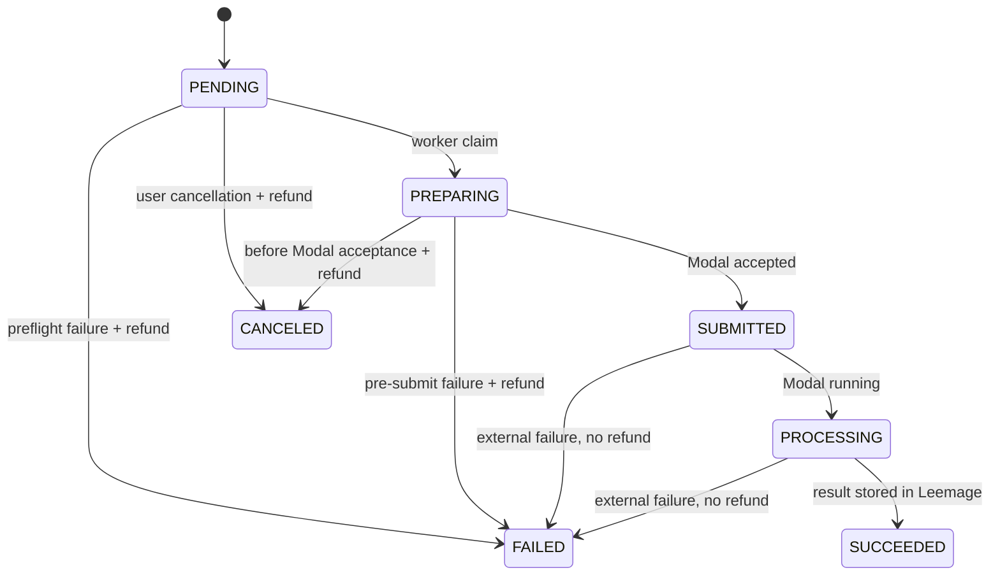

# Implementation Plan: auth-owned-mixing-queue

> 스펙이 승인된 후 작성합니다.
> canonical docs surface 밖의 unmanaged docs 산출물(예: `docs/plans/*`, `docs/superpowers/*`)이 있더라도, 아키텍처/파일/테스트 내용은 이 파일로 흡수하고 최종 SSOT는 여기로 유지합니다.

---

## 개요

- **기능 ID**: F008
- **대상 레포**: copy-singer-web
- **작성일**: 2026-08-06
- **상태**: Approved
  - 값: Draft | Review | Approved

---

## 기술 스택

| 구분 | 선택 | 이유 |
| ---- | ---- | ---- |
| 인증 | Better Auth + Google social provider | Next.js App Router와 Prisma를 공식 지원하고 Google OAuth만 제한적으로 활성화할 수 있다. |
| 인증 저장소 | 기존 PostgreSQL + Better Auth Prisma adapter | 별도 인증 DB 없이 사용자 소유 관계와 세션을 같은 트랜잭션 경계에서 조회한다. |
| 파일 저장소 | Leemage REST API | 사용자가 지정한 프로젝트 공통 저장소이며 일반 오디오에 presign/confirm/delete 흐름을 제공한다. |
| 파일 모델 | `MediaAsset` 메타데이터 + Leemage 외부 ID | PostgreSQL에 바이너리를 넣지 않고 소유권·정리 상태·외부 참조를 추적한다. |
| 큐 | `MixingJob` PostgreSQL 테이블 + 별도 TypeScript worker | 추가 Redis 없이 현재 로컬 스택에서 작업·lease·재시작 복구를 영속화한다. |
| claim | PostgreSQL `FOR UPDATE SKIP LOCKED` + lease | 여러 worker가 같은 작업을 중복 점유하지 않고 만료 작업을 회수할 수 있다. |
| 티켓 | `User.ticketBalance` + append-only `TicketLedger` | 빠른 잔액 검사와 감사 가능한 변동 내역을 함께 제공한다. |
| 관리자 | `ADMIN_EMAILS` env allowlist | MVP에서 별도 역할 관리 UI 없이 서버에서 명시적인 관리자 경계를 적용한다. |
| UI | Next.js Server Components + 기존 shadcn 구성요소 | 기존 제품 스타일과 서버 권한 검사를 유지하면서 account/history/admin 화면을 추가한다. |

---

## 아키텍처

### 인증 및 소유권 흐름

1. `/login`에서 Better Auth client가 Google OAuth를 시작한다.
2. `/api/auth/[...all]` handler가 callback을 처리하고 Prisma에 User/Session/Account를 저장한다.
3. 신규 사용자 생성 후 idempotent한 signup grant가 `User.ticketBalance`와 `TicketLedger`에 적용된다. hook 실패 후 재로그인에도 복구할 수 있도록 세션 기반 `ensureSignupGrant()`를 함께 둔다.
4. 보호 API는 `auth.api.getSession({ headers })`로 사용자 ID를 얻고 모든 Prisma 조건에 `userId`를 포함한다.
5. 관리자 API는 동일 세션의 정규화 email을 `ADMIN_EMAILS`와 비교한다.

### 프로필 및 Leemage reference 흐름

1. 기존 analyzer가 업로드를 OS 임시 디렉터리에서 표준 WAV로 만들고 profile 통계를 계산한다.
2. DB profile 작성 전에 Leemage adapter가 presign → PUT upload → confirm을 수행한다.
3. 하나의 DB 트랜잭션에서 사용자 소유 `MediaAsset(REFERENCE)`·`Recording`·`VocalProfile`을 연결한다.
4. 트랜잭션 실패 시 이미 confirm된 파일을 즉시 삭제하고, 삭제 실패는 `MediaCleanupJob`에 기록한다.
5. 로컬 임시 파일은 성공·실패와 무관하게 제거한다.

### 티켓 및 믹싱 접수 흐름

1. 사용자가 recommendation item에서 AI 믹싱을 누르면 브라우저가 UUID idempotency key를 생성한다.
2. API가 세션, profile·recommendation 소유권, 곡 상태와 티켓 비용을 검증한다.
3. Serializable DB 트랜잭션에서 조건부 balance 차감, `MIXING_DEBIT` 원장과 `MixingJob(PENDING)`을 생성한다.
4. 동일 `(userId, idempotencyKey)` 요청은 기존 작업을 반환하고 추가 차감하지 않는다.
5. history와 recommendation UI는 job ID를 기준으로 상태를 조회한다.

### worker 및 결과 저장 흐름

1. `pnpm worker:mixing`이 처리 가능한 `PENDING` 또는 lease 만료 작업을 `SKIP LOCKED`로 claim하고 lease owner/expiry를 저장한다.
2. worker가 Leemage reference를 임시 디렉터리로 가져오고 allowlist된 곡 URL을 yt-dlp로 내려받는다.
3. Modal에 고정 제품 preset으로 제출하기 전까지 실패하면 작업을 실패 처리하고 티켓을 idempotent하게 환불한다.
4. Modal job ID를 `SUBMITTED` 상태와 함께 저장한 후 polling하여 `PROCESSING`을 반영한다. 이 시점 이후 실패에는 환불하지 않는다.
5. 성공 WAV를 Modal에서 스트리밍해 Leemage에 presign/upload/confirm하고 `MediaAsset(MIX_RESULT)`와 `SUCCEEDED`를 트랜잭션으로 연결한다.
6. 모든 원곡·reference copy·중간 파일은 `finally`에서 삭제한다. worker 종료 시 lease 만료 후 다른 worker가 외부 job ID를 이용해 이어받는다.
7. Leemage 삭제·부분 업로드 정리는 같은 worker의 별도 cleanup claim으로 재시도한다.

### 상태와 데이터 모델



- Better Auth: `User`, `Session`, `Account`, `Verification`.
- 사용자 소유: `VocalProfile.userId?`, `RecommendationRun.userId?`. nullable은 기존 fixture migration을 위한 호환성이고 신규 제품 데이터는 필수 검증한다.
- 저장 파일: `MediaAsset(userId, kind, provider, externalProjectId, externalFileId, externalUrl, mimeType, sizeBytes, status, lastError, deletedAt)`.
- recording 연결: 기존 `Recording.storagePath`를 nullable로 전환하고 `mediaAssetId`를 추가한다. SONG/legacy 경로는 기존 local semantics를 유지한다.
- 티켓: `User.ticketBalance`, `TicketLedger(userId, type, amount, balanceAfter, mixingJobId?, actorUserId?, reason, idempotencyKey)`.
- 작업: `MixingJob(userId, vocalProfileId, songId, recommendationItemId?, referenceAssetId, resultAssetId?, state, ticketCost, refundState, idempotencyKey, modalJobId?, attempt, maxAttempts, leaseOwner?, leaseExpiresAt?, heartbeatAt?, errorCode?, errorDetail?, timestamps)`.
- 정리: `MediaCleanupJob(mediaAssetId, action, state, attempt, nextAttemptAt, lease...)`.

### 권한 행렬

| 기능 | 비로그인 | 사용자 | 관리자 |
| --- | --- | --- | --- |
| 로그인 | 허용 | 허용 | 허용 |
| 본인 profile/recommendation | 차단 | 허용 | 본인만 일반 API로 허용 |
| 본인 account/history/result | 차단 | 허용 | 본인만 일반 API로 허용 |
| 다른 사용자 reference 재생 | 차단 | 차단 | 차단 |
| 관리자 집계·검색 | 차단 | 차단 | 허용 |
| 티켓 조정 | 차단 | 차단 | 사유와 함께 허용 |

### env 계약

```dotenv
BETTER_AUTH_SECRET=
BETTER_AUTH_URL=http://localhost:3000
GOOGLE_CLIENT_ID=
GOOGLE_CLIENT_SECRET=
ADMIN_EMAILS=

LEEMAGE_BASE_URL=https://leemage.leey00nsu.com/api/v1
LEEMAGE_API_KEY=
LEEMAGE_PROJECT_ID=

SIGNUP_TICKET_GRANT=1
MIXING_TICKET_COST=1
MIXING_WORKER_CONCURRENCY=1
MIXING_MAX_ATTEMPTS=3
MIXING_LEASE_SECONDS=120
```

secret은 서버 모듈에서만 읽고 브라우저로 직렬화하지 않는다. base URL은 Leemage 배포 환경 차이를 위해 설정 가능하게 유지한다.

---

## 파일 구조

```text
app/
├── api/auth/[...all]/route.ts
├── api/mixing-jobs/{route.ts,[id]/route.ts,[id]/audio/route.ts}
├── api/account/tickets/route.ts
├── api/admin/{overview,users,mixing-jobs,ticket-adjustments}/...
├── login/page.tsx
├── account/page.tsx
├── mixing-history/page.tsx
└── admin/page.tsx
components/
├── auth/{google-sign-in,user-menu}.tsx
├── account/ticket-ledger.tsx
├── mixing/{mixing-history-list,mixing-status}.tsx
└── admin/{admin-overview,user-table,mixing-job-table,ticket-adjustment-dialog}.tsx
lib/
├── auth/{auth,client,session,admin}.ts
├── config/server-env.ts
├── leemage/{client,media-service}.ts
├── tickets/{service,contract}.ts
└── mixing/{queue,worker,service,contract}.ts
scripts/
└── mixing-worker.ts
prisma/
├── schema.prisma
└── migrations/..._auth_media_ticket_mixing_queue/migration.sql
tests/
├── auth-ownership.test.ts
├── leemage-client.test.ts
├── ticket-ledger.integration.ts
├── mixing-queue.integration.ts
├── mixing-worker.integration.ts
└── account-history-admin-ui.test.tsx
```

---

## 테스트 전략

- **단위 테스트**: env parsing, admin allowlist, Leemage HTTP 계약/429 backoff, 상태 전이, 환불 경계, UI 상태 포맷.
- **DB 통합 테스트**: signup grant idempotency, 동시 ticket debit, 중복 idempotency key, 잔액 부족, `SKIP LOCKED` claim, lease 회수, 조건부 환불, ownership query.
- **worker 통합 테스트**: mock yt-dlp/Modal/Leemage로 pre-submit 실패 환불, post-submit 실패 무환불, 성공 결과 업로드와 temp cleanup, 재시작 resume.
- **라우트/UI 테스트**: 비로그인 401/redirect, cross-user 404/403, account ledger, history paging, admin allowlist와 ticket adjustment validation.
- **회귀 테스트**: 기존 프로필 분석, 추천 100곡 순위와 `/dev/svc` 개발 흐름.
- **수동 로컬 검증**: Docker PostgreSQL에서 Google OAuth callback, 실제 Leemage reference/result 업로드·삭제, worker를 중간 종료/재시작한 뒤 동일 작업 완료를 확인한다.
- **최종 게이트**: `pnpm test`, `pnpm run lint`, `pnpm exec tsc --noEmit`, `pnpm run db:validate`, `pnpm run build`.

---

## 관련 문서

- Spec: [spec.md](./spec.md)
- Decisions: [decisions.md](./decisions.md)
