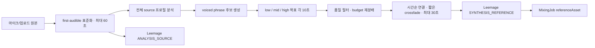

# Implementation Plan: audio-waveform-and-smart-reference

> 스펙이 승인된 후 작성합니다.
> canonical docs surface 밖의 unmanaged docs 산출물(예: `docs/plans/*`, `docs/superpowers/*`)이 있더라도, 아키텍처/파일/테스트 내용은 이 파일로 흡수하고 최종 SSOT는 여기로 유지합니다.

---

## 개요

- **기능 ID**: F009
- **대상 레포**: copy-singer-web
- **작성일**: 2026-08-07
- **상태**: Approved
  - 값: Draft | Review | Approved

---

## 기술 스택

| 구분 | 선택 | 이유 |
| ---- | ---- | ---- |
| 실시간 녹음 | `wavesurfer.js` Record plugin | 동일 마이크 stream으로 recording과 continuous/scrolling waveform을 함께 관리하고 60초 progress event를 제공한다. |
| React 파형 | `@wavesurfer/react` | WaveSurfer instance와 React lifecycle/event subscription을 공통 hook/component로 관리한다. |
| 분석 차트 | shadcn Chart + Recharts v3 | 프로젝트 theme/tooltip/accessibility layer를 사용하면서 수동 SVG 좌표 계산을 제거한다. |
| reference 편집 | Python, NumPy, soundfile/ffmpeg | 기존 analyzer의 f0·voiced frame과 표준 WAV를 같은 sample index 기준으로 안전하게 자르고 crossfade한다. |
| 영속화 | Leemage + Prisma PostgreSQL metadata | 분석 source와 합성 reference 바이너리는 Leemage에 두고 DB에는 소유권·종류·버전·선택 구간만 저장한다. |
| 호환 정책 | nullable synthesis reference + legacy fallback | 기존 profile은 migration 없이 유지하고 새 artifact가 없을 때 기존 source를 사용한다. |

---

## 아키텍처

### 1. 60초 실시간 녹음

1. `VocalProfileRecorder`가 WaveSurfer instance와 memoized Record plugin을 client에서 초기화한다.
2. 시작 버튼이 `RecordPlugin.startRecording()`을 호출하고 plugin의 `record-progress`를 단일 경과 시간 SSOT로 사용한다.
3. `continuousWaveformDuration=60`, `renderRecordedAudio=true`로 녹음 중 누적 파형과 종료 후 재생 파형을 같은 container에 표시한다.
4. 수동 정지 또는 60초 도달 시 `stopRecording()`하고 `record-end` Blob을 기존 `File` 입력 계약으로 넘긴다.
5. 권한 거부·재녹음·unmount에서 plugin, WaveSurfer와 mic stream을 idempotent하게 정리한다.

### 2. 공통 WaveSurfer 플레이어

1. `AudioWaveformPlayer`는 Blob URL 또는 same-origin URL을 받아 WaveSurfer waveform과 별도 shadcn Button controls를 렌더링한다.
2. ready/play/pause/timeupdate/error event로 loading, current time, duration과 재생 상태를 표시한다.
3. profile source와 mixing result proxy는 기존 session/Range 계약을 그대로 사용한다. object URL은 component가 소유할 때만 revoke한다.
4. decode가 실패하거나 파일이 설정 임계치를 넘으면 동일 media source를 사용하는 native controls fallback을 표시해 재생 기능을 보존한다.
5. 기존 `<audio>` 사용처와 수동 `components/waveform.tsx`를 점진적으로 공통 component로 교체한다.

### 3. 분석 source와 smart synthesis reference



1. analyzer는 기존 60초 source와 f0/voiced mask로 연속 유성 frame을 phrase 후보로 묶는다.
2. phrase는 최소 연속 길이, voiced density, RMS, clipping과 pitch band coverage로 점수를 계산한다.
3. band 경계는 profile의 `p10`, `median`, `p90`을 중심으로 겹치지 않게 정하고 low/mid/high에 각각 10초 목표 budget을 둔다.
4. 품질 기준을 통과한 phrase가 부족한 band의 budget은 점수가 높은 다른 band에 재분배하며 반복·padding하지 않는다.
5. 선택 phrase는 원래 시간 순으로 이어 붙이고 20–50ms equal-power crossfade를 적용해 최대 30초 WAV를 만든다.
6. analyzer response descriptor에 selection algorithm/version, source ranges, band, selected duration, fallback reason을 제한된 JSON으로 기록한다.
7. analyzer는 source와 synthesis reference를 별도 download endpoint로 제공하고 Next.js가 둘을 Leemage에 업로드한다.
8. `VocalProfile.synthesisReferenceAssetId` nullable relation과 `MediaAssetKind.SYNTHESIS_REFERENCE`를 추가한다. Recording의 기존 asset은 사용자가 재생하는 분석 source로 유지한다.
9. mixing enqueue는 준비된 synthesis asset을 우선 snapshot하고, legacy/null 상태에서는 기존 `REFERENCE` source를 snapshot한다.
10. profile 삭제와 부분 실패 보상은 두 asset을 모두 삭제 또는 cleanup queue에 등록한다.

### 4. shadcn Chart 전환

1. shadcn CLI로 현재 Base UI preset에 맞는 `components/ui/chart.tsx`를 추가하고 Recharts v3를 설치한다.
2. `RangeProfile`은 horizontal ranged bar와 `ReferenceLine`, `HistogramChart`는 `BarChart`, `PitchTrace`는 `LineChart`로 교체한다.
3. pitch trace의 `midi=null`은 `connectNulls=false`로 무성 gap을 유지한다.
4. MIDI 숫자 formatter를 음이름으로 공유하고 tooltip에는 원래 MIDI·비율·시간을 함께 표시한다.
5. `accessibilityLayer`, keyboard focus, 기존 텍스트 metric cards와 unavailable state를 유지한다.

### 상태·오류 계약

- smart reference 생성 성공: profile + source asset + synthesis asset을 연결한다.
- reference 생성 실패: source profile 저장은 허용하고 descriptor에 failure/fallback을 기록하며 mixing은 legacy source fallback을 사용한다.
- source asset 저장 실패: profile 생성 전체를 보상 삭제한다.
- synthesis asset 저장 실패: 생성된 외부 asset만 정리하고 profile은 source asset으로 저장한다.
- client waveform 실패: 분석·재생 요청 자체를 실패시키지 않고 native player fallback으로 전환한다.

### 5. 개발 환경 로그인 우회

1. `DEV_AUTH_BYPASS_ENABLED=true`와 `DEV_AUTH_BYPASS_USER_ID`가 함께 설정된 경우에만 기존 PostgreSQL 사용자를 개발 session으로 해석한다.
2. 우회는 `NODE_ENV=development|test`에서만 동작하며 production과 미지정 runtime에서는 환경변수가 있어도 비활성화한다.
3. 지정 사용자가 DB에 없으면 익명 fallback이나 임의 사용자 생성을 하지 않고 명확한 설정 오류로 실패한다.
4. page/API session helper가 동일한 우회 session을 사용해 향후 보호 화면의 로컬 자동 검증에 재사용한다.

### 6. 전송 오디오와 믹싱 결과 경량화

1. 업로드 파일은 긴 파일 동의 후 client-only media converter를 지연 로드한다. Web Audio로 첫 유효 음성 위치를 찾고, Mediabunny Conversion으로 해당 위치부터 최대 60초를 mono 16kHz·64kbps AAC/M4A 우선, Opus/WebM fallback으로 인코딩한다.
2. Workbench의 `audioFile`, duration, 크기와 WaveSurfer source는 원본이 아니라 변환 결과만 가리킨다. 변환 실패 시 원본 업로드 fallback을 두지 않아 60초 초과 전송을 방지한다.
3. analyzer는 변환된 최대 60초 파일을 받아 기존 16kHz 분석 WAV를 임시 생성하되, Leemage에는 작은 압축 source를 저장한다. server-side 60초 trim은 방어적 legacy 경로로 유지한다.
4. worker는 Modal WAV 결과를 Leemage에 저장하기 전 FFmpeg로 stereo AAC/M4A 160kbps로 변환한다. 이미 압축된 호환 결과는 그대로 유지하며 변환 실패 시 큰 WAV를 영구 저장하지 않고 job을 실패 처리한다.
5. `AudioWaveformPlayer`에 여러 source range를 하나의 영역으로 재생하는 segment controls를 추가한다. smart descriptor의 low/mid/high ranges를 원본 시간 순으로 묶고, 현재 range가 끝나면 같은 영역의 다음 range로 이동한 뒤 종료한다.
6. profile 생성 직후에는 변환본 Blob URL, 저장 profile에서는 소유권이 보호된 source proxy URL을 같은 segment player에 전달한다.

---

## 파일 구조

```text
components/
├── audio/
│   ├── audio-waveform-player.tsx
│   └── vocal-profile-recorder.tsx
├── ui/chart.tsx
├── vocal-profile-workbench.tsx
└── vocal-profile-results.tsx
lib/
├── audio/waveform.ts
├── leemage/media-service.ts
├── mixing/queue.ts
└── vocal-profile/{contract,visualization}.ts
app/
├── vocal-profiles/[id]/page.tsx
└── api/vocal-profiles/route.ts
services/vocal-profile-api/app/
├── analysis.py
├── contracts.py
├── main.py
├── media.py
└── reference.py
prisma/
├── schema.prisma
└── migrations/*_smart_synthesis_reference/
tests/
├── audio-waveform-player.test.tsx
├── vocal-profile-recorder.test.tsx
├── vocal-profile-charts.test.tsx
├── smart-reference.integration.ts
├── mixing-queue.integration.ts
├── profile-audio-preparation.test.ts
├── compress-mixing-result.test.ts
└── vocal-profile-reference-bands.test.ts
services/vocal-profile-api/tests/
└── test_reference.py
```

---

## 테스트 전략

- **단위 테스트**:
  - WaveSurfer event → UI state, 60초 stop, cleanup과 native fallback.
  - low/mid/high 분류, phrase 최소 길이, quality ranking, budget 재분배, 결정성, crossfade 길이.
  - Recharts data mapping, null gap, MIDI formatter와 unavailable state.
- **통합 테스트**:
  - analyzer 60초 source에서 내부 무음을 제외한 최대 30초 reference 생성과 selection descriptor 검증.
  - source/synthesis 두 Leemage asset 생성, 부분 실패 cleanup, profile 삭제와 legacy fallback.
  - enqueue가 새 profile에는 synthesis asset, 과거 profile에는 source asset을 snapshot하는지 검증.
  - 모든 보호 audio URL이 WaveSurfer player에서도 소유권과 Range를 유지하는지 검증.
- **브라우저 테스트**:
  - 실제 마이크 권한 후 60초 누적 파형, 수동 정지·재녹음·재생과 responsive chart tooltip을 확인한다.
  - 업로드 Blob, 저장 profile, 추천 결과와 mixing history에서 공통 player를 확인한다.
- **품질 비교**:
  - 동일 사용자 reference와 동일 target에 대해 기존 앞 30초 baseline과 smart 30초의 source ranges·voiced density·pitch coverage를 비교한다.
  - 실제 Modal A/B는 티켓/비용을 사용하므로 실행 전 별도 사용자 승인을 받으며 자동 품질 향상을 단정하지 않는다.
- **전체 회귀**: `pnpm test`, TypeScript, ESLint, production build, Prisma validate와 Python test suite.

---

## 관련 문서

- Spec: [spec.md](./spec.md)
- Decisions: [decisions.md](./decisions.md)
