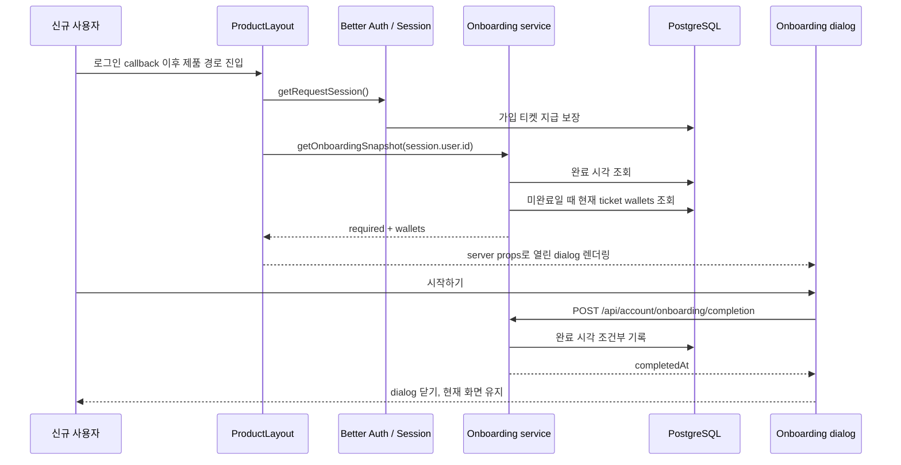

# Implementation Plan: new-user-onboarding

> 스펙이 승인된 후 작성합니다.
> canonical docs surface 밖의 unmanaged docs 산출물(예: `docs/plans/*`, `docs/superpowers/*`)이 있더라도, 아키텍처/파일/테스트 내용은 이 파일로 흡수하고 최종 SSOT는 여기로 유지합니다.

---

## 개요

- **기능 ID**: F038
- **대상 레포**: copy-singer-web
- **작성일**: 2026-08-17
- **상태**: Approved
  - 값: Draft | Review | Approved

---

## 기술 스택

| 구분 | 선택 | 이유 |
| ---- | ---- | ---- |
| Framework | Next.js App Router + React Server/Client Components | 인증 product layout에서 최초 상태를 서버에서 판정하고 상호작용 모달만 client boundary로 둔다. |
| Auth | 기존 Better Auth session helper | session user ID를 유일한 상태 조회·변경 주체로 사용한다. |
| Persistence | Prisma 7 + PostgreSQL `User.onboardingCompletedAt` | 브라우저나 기기에 종속되지 않는 계정 단위 완료 상태와 감사 가능한 완료 시각을 저장한다. |
| Server data | 기존 ticket service + 직접 server props | `getRequestSession()`의 가입 티켓 보장 이후 현재 지갑을 읽어 client waterfall과 잔액 상수 복제를 피한다. |
| Mutation | 인증된 Node.js Route Handler + TanStack Query mutation | 기존 API 경계와 오류 처리를 재사용하고 멱등 완료 후 client 상태를 갱신한다. |
| Validation | Zod contract | 완료 API 응답의 ISO datetime 계약을 런타임에서 검증한다. |
| UI | 공용 Dialog/Button/ProductMark + 공용 FunnelStepper + Lucide 아이콘 + semantic tokens | 브랜드와 기존 생성 퍼널의 진행 상태를 재사용하고 새 UI dependency나 이미지 asset을 추가하지 않는다. |
| Verification | Node integration tests + Storybook interaction/a11y + 정적 검사 | 영속성·소유권과 실제 mobile/desktop 모달 동작을 각 경계에서 검증한다. |

---

## 아키텍처

### 1. 데이터 모델과 기존 사용자 이관

`User`에 `onboardingCompletedAt DateTime?`를 추가한다. PostgreSQL migration은 column을 nullable로 추가한 뒤 migration 실행 시 존재하는 모든 사용자 row를 같은 배포 시각으로 backfill한다. column default는 두지 않아 migration 이후 Better Auth가 만드는 신규 사용자가 `null`로 시작하게 한다.

별도 onboarding event table이나 boolean을 만들지 않는다. 현재 요구사항은 한 번의 완료 여부이며 timestamp 하나로 완료 여부와 기록 시점을 함께 표현할 수 있다. 향후 온보딩 버전별 재노출은 이 Feature 범위가 아니므로 version column을 선행 추가하지 않는다.

### 2. 서버 판정과 초기 payload

`getOnboardingSnapshot(userId)`는 먼저 사용자 완료 시각을 조회한다.

- 완료 시각이 있으면 `{ required: false }`를 반환하며 ticket wallet을 추가 조회하지 않는다.
- 완료 시각이 없으면 기존 `getTicketWallets(userId)`를 호출해 `{ required: true, wallets }`를 반환한다.

`ProductLayout`은 기존 `getRequestSession()` 이후 이 snapshot을 준비한다. 이 순서로 기존 `ensureSignupTicketGrants()`가 끝난 실제 잔액을 안내에 사용한다. 개발 인증 bypass session은 snapshot을 만들지 않아 개발 기본 흐름에서 모달을 띄우지 않는다.

snapshot은 `ProductShell`의 serializable prop으로 전달한다. 완료 사용자는 onboarding UI를 열지 않고, 미완료 사용자만 첫 server render부터 열린 모달을 받으므로 hydration 이후 flash가 없다. 조회 실패는 product route 전체를 실패시키지 않도록 server log를 남기고 이번 응답에서 onboarding을 생략하되 완료 상태는 쓰지 않는다.

### 3. ProductShell UI 경계

온보딩은 인증 제품 shell 한 곳에서만 소비되므로 별도 단일 소비 feature slice로 만들지 않고 `widgets/product-shell`에 contract, client mutation, server service와 `NewUserOnboardingDialog`를 함께 둔다. `ProductShell`은 shell chrome과 main content를 그대로 렌더링하고 미완료 payload가 있을 때 dialog를 함께 mount한다. app layout과 Route Handler는 widget의 client/server public API만 사용한다.

Dialog는 공통 header와 stepper 아래에 현재 단계 본문 하나만 보여 준다.

```text
Copysinger mark  처음 만나는 Copysinger
내 목소리를 분석하고, 잘 맞는 노래를 찾아 AI 믹싱까지 만들어요.

[1 목소리 분석] ─ [2 노래 추천] ─ [3 AI 믹싱]

현재 단계 icon + 제목 + 설명
분석 단계: 분석 티켓 현재 N장
믹싱 단계: 믹싱 티켓 현재 N장

                         [이전] [다음 또는 시작하기]
```

기존 `CreationFunnelStepper`의 시각 구현을 generic shared `FunnelStepper`로 추출하고 생성 퍼널 adapter와 온보딩이 같은 구현을 사용한다. stepper는 현재/완료/예정 상태, 연결선, `aria-current`와 lifecycle color 규칙을 그대로 유지한다.

공용 Dialog의 close button은 숨기고 backdrop/ESC의 open 변경을 완료로 해석하지 않는다. 이전/다음은 client local step만 바꾸며 완료 mutation을 호출하지 않는다. 마지막 단계의 `시작하기`만 완료를 저장하고, mutation 진행 중에는 이동과 완료 버튼을 disable한다. 실패하면 3단계 dialog를 유지하고 inline 오류와 다시 누를 수 있는 action을 제공한다. 성공 응답을 받은 뒤에만 local open state를 닫는다.

시각 표현은 기존 warm background, 얇은 outline, muted surface, `font-heading`, Copysinger mark와 black primary action을 재사용한다. 단계 icon surface는 음성·음악·waveform을 같은 `data-accent` 계열로 묶고 상태 의미가 없는 success/warning/destructive 색은 사용하지 않는다. desktop은 compact dialog, 360px mobile은 한 열로 자연스럽게 줄바꿈하며 새 illustration과 motion은 추가하지 않는다.

### 4. 멱등 완료 API

`POST /api/account/onboarding/completion` Route Handler를 추가한다.

1. `requireApiSession(request)`로 인증한다.
2. request body나 query에서 user ID를 받지 않는다.
3. `updateMany({ where: { id: session.user.id, onboardingCompletedAt: null } })`로 최초 요청만 기록한다.
4. 같은 사용자를 다시 조회해 ISO 완료 시각을 반환한다.

동시 또는 반복 요청은 모두 같은 성공 의미를 가진다. 인증 실패는 기존 `UNAUTHENTICATED` 401 계약을 사용하고, 존재하지 않는 user나 DB 실패는 성공으로 위장하지 않는다. 완료 후에는 onboarding 관련 query/local state와 필요 시 ticket wallet cache를 일치시키되 페이지 이동이나 강제 refresh는 하지 않는다.

### 5. 데이터 흐름



---

## 파일 구조

```
prisma/
├── schema.prisma
└── migrations/<timestamp>_add_user_onboarding_completion/migration.sql
app/api/account/onboarding/completion/
└── route.ts                                      # thin Route Handler export
src/
├── _app/
│   ├── api-routes/account/
│   │   ├── index.server.ts
│   │   └── onboarding-completion-route.ts        # authenticated POST
│   └── layout/product-layout.tsx                  # server snapshot composition
└── widgets/product-shell/
│   ├── api/
│   │   ├── onboarding-client.ts                   # completion mutation
│   │   └── onboarding-service.ts                  # snapshot + idempotent persistence
│   ├── model/onboarding-contract.ts               # Zod payload/response schemas
│   ├── ui/
│   │   ├── new-user-onboarding-dialog.tsx
│   │   └── new-user-onboarding-dialog.stories.tsx
│   ├── index.ts
│   ├── index.server.ts
│   └── ui/product-shell.tsx                       # optional onboarding prop/mount
├── shared/ui/funnel-stepper/                       # generic 3-step progress UI
└── widgets/creation-funnel/ui/
    └── creation-funnel-stepper.tsx                 # shared stepper adapter
tests/
├── new-user-onboarding.integration.ts
└── msw/handlers.ts                                # success/failure Storybook handlers
```

---

## 테스트 전략

- **계약/단위 테스트**: Zod response와 wallet mapping, dialog copy의 기존 사용자-facing `분석 티켓`/`믹싱 티켓` 명칭, loading/error/success 상태를 검증한다.
- **DB 통합 테스트**: 신규 `null` 사용자에게 snapshot이 현재 두 wallet 잔액을 반환하는지, 완료가 timestamp를 한 번만 기록하는지, 반복/동시 완료가 안전한지, 다른 사용자 상태를 바꾸지 않는지 검증한다. migration SQL에는 기존 row backfill과 column default 부재를 정적/DB 검증으로 고정한다.
- **API 테스트**: 미인증 401, session 사용자 기반 완료, 입력 user ID를 받지 않는 계약을 검증한다.
- **Storybook interaction/a11y**: desktop과 360px에서 브랜드 마크, 3단계 `aria-current`, 이전/다음, 단계별 티켓 잔액, 마지막 `시작하기` loading, 성공 닫힘과 실패 유지/재시도를 검증한다. 완료 사용자와 development bypass의 ProductShell story에서는 dialog가 없음을 확인한다.
- **회귀 검사**: `pnpm run test:auth:db`, `pnpm run test:tickets`, 신규 targeted test, Storybook test, `pnpm run lint`, `pnpm run typecheck`, `pnpm run check:architecture`, 변경 파일 Biome 검사와 `pnpm run build`를 실행한다. 저장소 전체 `pnpm run check`의 기존 무관 Biome 기준선 오류는 별도 결과로 기록한다.

---

## 관련 문서

- Spec: [spec.md](./spec.md)
- Decisions: [decisions.md](./decisions.md)
