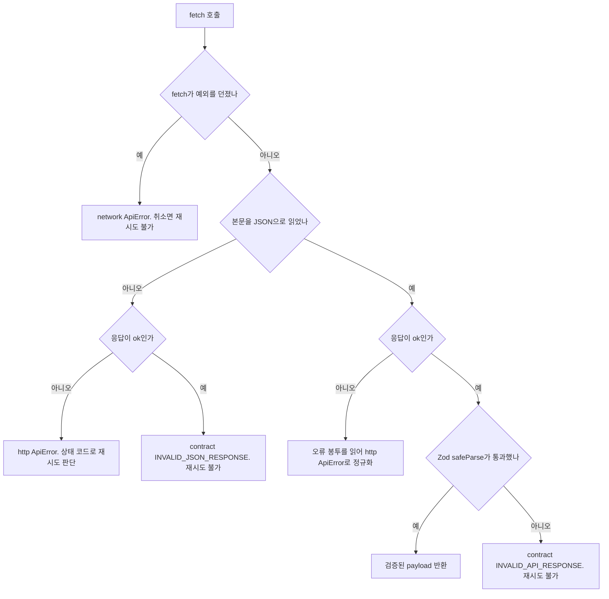

브라우저 쪽 데이터 로딩 규칙은 네 곳에서 정해져요. [src/shared/api/request-json.ts](repo://src/shared/api/request-json.ts#L66-L132)의 `requestJson`이 응답을 Zod 스키마로 검증하고 실패를 `ApiError`로 정규화해요. [src/shared/api/api-error.ts](repo://src/shared/api/api-error.ts#L27-L29)의 `shouldRetryQuery`가 그 오류를 재시도할지 정해요. [src/_app/providers/query-provider.tsx](repo://src/_app/providers/query-provider.tsx#L6-L22)의 `createQueryClient`가 캐시·재시도 기본값을 깔아요. 마지막으로 각 슬라이스의 `queryOptions` 팩터리가 캐시 키와 폴링 주기를 정해요.

목록·상세 화면의 갱신 주기를 바꾸거나, 새 오류 코드를 재시도 대상에 넣으려면 이 페이지의 표를 먼저 확인하세요. 오류 봉투의 형태와 요청 제한 수치는 [HTTP API 표면과 요청 접수 규칙](http-api-surface.md)이 소유하니, 여기서는 클라이언트가 그 차이를 어떻게 흡수하는지만 다뤄요.

## 응답 검증과 오류 정규화

`requestJson`은 성공 응답만 화면으로 넘겨요. `fetch` 결과의 본문을 JSON으로 읽고, `response.ok`가 아니면 오류로 던지고, 맞으면 `schema.safeParse`를 통과한 값만 반환해요([request-json.ts](repo://src/shared/api/request-json.ts#L113-L132)). 그래서 화면 코드는 "서버가 계약을 지켰는가"를 다시 검사할 필요가 없어요.

검증 실패는 재시도 불가로 확정돼요. 스키마에 맞지 않는 성공 응답은 `kind: "contract"`, `code: "INVALID_API_RESPONSE"`가 되고 `retryable`은 기본값 `false`예요. 이때 메시지는 고정 문구이고 원본 payload는 `cause`에만 들어가므로 응답 본문이 화면 문구로 새지 않아요([request-json.ts](repo://src/shared/api/request-json.ts#L123-L131), [tests/client-server-state-query.test.ts](repo://tests/client-server-state-query.test.ts#L49-L65), [tests/msw-query.test.ts](repo://tests/msw-query.test.ts#L94-L121)).

| `ApiErrorKind` | 생기는 지점 | `status` | 대표 `code` | `retryable` |
| --- | --- | --- | --- | --- |
| `network` | `fetch` 자체가 실패했어요 | `null` | `NETWORK_ERROR` | `true` |
| `network` | 요청이 `AbortSignal`로 취소됐어요 | `null` | `REQUEST_ABORTED` | `false` |
| `http` | 응답이 `ok`가 아니에요 | 응답 상태 | 서버가 준 코드 또는 `null` | payload의 `retryable`이 boolean이면 그 값, 아니면 `status === 429 \|\| status >= 500` |
| `http` | 실패 응답의 본문이 JSON이 아니에요 | 응답 상태 | `null` | 같은 상태 규칙 |
| `contract` | 성공 응답이 스키마와 달라요 | 응답 상태 | `INVALID_API_RESPONSE` | `false` |
| `contract` | 성공 응답의 본문이 JSON이 아니에요 | 응답 상태 | `INVALID_JSON_RESPONSE` | `false` |
| `contract` | 호출 자체가 잘못됐어요(`body`와 `json` 동시 지정) | `null` | `AMBIGUOUS_REQUEST_BODY` | `false` |
| `contract` | query 함수가 필요한 식별자 없이 실행됐어요 | `null` | `MISSING_VOCAL_PROFILE_ID`, `MISSING_ANALYSIS_JOB_ID`, `MISSING_ADMIN_CONVERSION_ID`, `INVALID_ADMIN_CONVERSION_ID` | `false` |

그림: `requestJson`이 성공 반환과 `network`·`http`·`contract` 실패를 나누는 순서예요.

`ApiErrorKind`는 세 값(`network`, `http`, `contract`)만 가져요. `retryable`을 옵션으로 넘기지 않은 `ApiError`는 항상 재시도 불가라, 계약 위반과 4xx는 재시도 없이 한 번에 실패해요([api-error.ts](repo://src/shared/api/api-error.ts#L11-L25)). 화면은 이 값을 보고 재시도 버튼을 열지 정해요. 예를 들어 [normalizeProfileError](repo://src/_pages/profile/model/voice-scan.ts#L89-L100)가 `ApiError`를 화면 오류 계약으로 바꿔 `reasonCode`·`detail`·`retryable`을 채우고, 프로필 화면은 `retryable`일 때만 재시도 동작을 열어요([vocal-profile-workbench.tsx](repo://src/_pages/profile/ui/vocal-profile-workbench.tsx#L263-L278)).

## 두 오류 봉투를 같은 값으로 읽어요

오류 응답의 봉투 형태는 그룹마다 다르지만, 클라이언트 파서가 순서대로 확인해서 하나의 `code`·`message`·`retryable` 조합으로 만들어요([request-json.ts](repo://src/shared/api/request-json.ts#L20-L50)). 봉투 종류 자체와 각 그룹의 사용처는 [HTTP API 표면과 요청 접수 규칙](http-api-surface.md)이 정리해요.

| 확인 순서 | payload 모양 | 쓰는 `code` | 쓰는 `message` |
| --- | --- | --- | --- |
| 1 | 최상위 `detail`이 문자열 | `reasonCode`가 문자열이면 그 값, 아니면 `null` | `detail` |
| 2 | 최상위 `error`가 문자열 | `null` | `error` |
| 3 | `error`가 객체 | `error.code` | `error.message`, 없으면 `error.detail`, 둘 다 없으면 `Request failed ({status})` |
| 4 | 위 어디에도 해당하지 않음 | `null` | `Request failed ({status})` |

`retryable`은 payload에 boolean 값이 있으면 그 값을 우선하고, 없으면 상태 코드로 판단해요. 그래서 분석 접수 계열의 평면형 `reasonCode`·`detail` 응답도, 관리자 custom-mixing의 `detail`만 있는 얇은 응답도 같은 규칙으로 읽혀요([tests/client-server-state-query.test.ts](repo://tests/client-server-state-query.test.ts#L195-L212)). 실패 응답의 본문을 JSON으로 읽지 못하면 상태 코드만 남기고 `http` 종류로 내려요([request-json.ts](repo://src/shared/api/request-json.ts#L98-L111)).

## 재시도 판단: `shouldRetryQuery`

`createQueryClient`의 쿼리 기본 `retry`는 문자열이나 숫자가 아니라 `shouldRetryQuery` 함수예요. 재시도에는 세 조건이 모두 필요해요.

| 조건 | 값 |
| --- | --- |
| 오류 타입 | `error instanceof ApiError`여야 해요. 일반 `Error`나 예외 객체는 재시도하지 않아요 |
| 재시도 가능 표시 | `error.retryable`이 `true`여야 해요 |
| 시도 횟수 | `failureCount < 2`, 즉 최초 시도 뒤 두 번까지 다시 시도해요 |

재시도 간격은 `retryDelay`가 정하고 `Math.min(1_000 * 2 ** attemptIndex, 30_000)`이에요. 그래서 기본 정책에서 재시도는 1초, 2초 뒤에 일어나고 상한은 30초예요([query-provider.tsx](repo://src/_app/providers/query-provider.tsx#L9-L16)). 4xx처럼 `retryable: false`인 응답은 시도 횟수와 무관하게 한 번에 실패하고, 503처럼 재시도 가능한 응답은 최대 3번째 시도에서 성공할 수 있어요([tests/client-server-state-query.test.ts](repo://tests/client-server-state-query.test.ts#L105-L121), [tests/msw-query.test.ts](repo://tests/msw-query.test.ts#L47-L92)).

뮤테이션은 재시도하지 않아요. `mutations.retry`가 `false`라서 `POST`·`PATCH`·`DELETE`는 사용자가 다시 눌러야 실행돼요. 중복 실행을 막는 책임은 재시도 계층이 아니라 요청의 `idempotencyKey`와 서버 접수 로직에 있어요([query-provider.tsx](repo://src/_app/providers/query-provider.tsx#L17-L19), [티켓 원장과 멱등성](../concepts/ticket-ledger.md)).

`Retry-After` 헤더는 브라우저 재시도 간격에 쓰이지 않아요. 서버는 429·503 응답에 그 헤더를 붙이지만([limiter.ts](repo://src/shared/lib/admission/limiter.ts#L70-L79)), `requestJson`은 헤더를 읽지 않고 TanStack Query의 간격도 `retryDelay`가 결정해요. 그래서 서버가 긴 대기를 요구해도 클라이언트는 자기 backoff를 따라요.

## `createQueryClient` 기본 옵션

기본값을 먼저 외우면 각 화면이 무엇을 덮어쓰는지 보여요.

| 옵션 | 값 | 확인할 점 |
| --- | --- | --- |
| `queries.staleTime` | 30,000ms | 신선한 데이터는 다시 받지 않아요. 상세 화면은 `initialData`와 함께 같은 값을 명시해요 |
| `queries.gcTime` | 브라우저 300,000ms, server `Number.POSITIVE_INFINITY` | server client는 렌더마다 새로 만들어져요 |
| `queries.refetchOnWindowFocus` | `false` | 알림 목록과 티켓 지갑만 `true`로 덮어써요 |
| `queries.refetchOnReconnect` | `true` | 연결이 돌아오면 다시 조회해요 |
| `queries.retry` | `shouldRetryQuery` | 위의 세 조건을 그대로 써요 |
| `queries.retryDelay` | `Math.min(1_000 * 2 ** attemptIndex, 30_000)` | 1초, 2초 뒤 재시도 |
| `mutations.retry` | `false` | 뮤테이션은 자동 재시도하지 않아요 |

클라이언트 인스턴스 수명도 계약의 일부예요. `getQueryClient()`는 server 렌더에서 매번 새 client를 만들고, 브라우저에서는 모듈 수준 싱글턴 하나를 재사용해요. 그래서 브라우저 캐시 공유 범위는 탭 하나예요([query-provider.tsx](repo://src/_app/providers/query-provider.tsx#L6-L34)).

## 화면별 query key와 폴링 정지 조건

폴링은 `refetchInterval`이 `false`를 반환할 때 멈춰요. 정지 조건은 "진행 중이 아님"이 아니라 화면마다 정의한 활성 상태 목록이에요. 키와 주기를 바꾸려면 표의 출처 파일을 고치세요.

| 화면·데이터 | query key | 폴링 주기 | 정지 조건 | 출처 |
| --- | --- | --- | --- | --- |
| 추천 상세 | `["recommendation", "profile", profileId, catalogRevision, scoringVersion]` | 5,000ms | 모든 항목의 `synthesis.status`가 `preparing`·`queued`·`processing`이 아니에요 | [client.ts](repo://src/entities/recommendation/api/client.ts#L5-L21) |
| 믹싱 이력 목록 | `["mixing-job", "history", { page, q, status }]` | 5,000ms | 어떤 작업도 `pending`·`preparing`·`submitted`·`processing`이 아니에요 | [client.ts](repo://src/entities/mixing-job/api/client.ts#L15-L39) |
| 믹싱 작업 상세 | `["mixing-job", "detail", id]` | 5,000ms | 상태가 `pending`·`preparing`·`submitted`·`processing`이 아니에요 | [client.ts](repo://src/entities/mixing-job/api/client.ts#L79-L86) |
| 보컬 분석 작업 상세 | `["vocal-analysis", "jobs", id]` | 1,500ms | 상태가 `pending`도 `processing`도 아니고, 쿼리 오류도 재시도 불가예요 | [client.ts](repo://src/features/analyze-vocal-profile/api/client.ts#L12-L34) |
| 보컬 분석 작업 목록 | `["vocal-analysis", "jobs"]` | 3,000ms | 목록의 모든 작업이 종료 상태예요 | [client.ts](repo://src/features/analyze-vocal-profile/api/client.ts#L81-L87) |
| 알림 목록 | `["notifications", "list", { page, pageSize, unreadOnly }]` | 30,000ms 고정 | 없어요. 창 포커스 시에도 다시 조회해요 | [client.ts](repo://src/features/manage-notifications/api/client.ts#L39-L48) |
| 관리자 custom-mixing 상세 | `["admin-custom-mixing", "conversions", id]` | 2,500ms | 상태가 `queued`도 `processing`도 아니에요 | [client.ts](repo://src/features/admin-custom-mixing/api/client.ts#L14-L30) |

표에 없는 쿼리는 폴링하지 않아요. 관리자 프로필 목록, 보컬 분석 health, 티켓 지갑 조회가 그렇고, 이들은 필요할 때 `invalidateQueries`나 `refetch`로만 갱신돼요([client.ts](repo://src/features/admin-custom-mixing/api/client.ts#L63-L68), [client.ts](repo://src/features/analyze-vocal-profile/api/client.ts#L74-L79), [client.ts](repo://src/entities/ticket/api/client.ts#L18-L26)).

두 쿼리는 기본 정책을 더 덮어써요. 알림 목록은 `refetchOnWindowFocus: true`로 바꾸고, 티켓 지갑은 `enabled` 플래그와 `staleTime: 0`을 써서 계정 메뉴를 열 때마다 다시 받아요([tests/client-server-state-query.test.ts](repo://tests/client-server-state-query.test.ts#L123-L165)).

### 보컬 분석 상세만 오류 상태에서도 계속 폴링해요

[analysisJobPollingInterval](repo://src/features/analyze-vocal-profile/api/client.ts#L26-L30)은 작업이 활성 상태일 때 1,500ms를 반환하고, 그다음으로 쿼리 오류가 재시도 가능한 `ApiError`인지 확인해요. 그래서 아직 데이터가 없어도 네트워크가 끊긴 상황에서는 1.5초 간격으로 다시 붙어 보고, 404처럼 재시도 불가인 오류에서는 즉시 멈춰요([tests/client-server-state-query.test.ts](repo://tests/client-server-state-query.test.ts#L167-L193)). 다른 화면은 오류가 나면 기본 `retry` 정책에만 맡기고 폴링을 이어가지 않아요.

## 키는 팩터리에서 Zod로 정규화해 만들어요

캐시 키를 손으로 조립하지 마세요. 각 슬라이스의 키 팩터리가 필터를 Zod 스키마로 파싱한 뒤 배열을 만들어요. 그래서 URL 쿼리에서 온 `"2.9"`나 `["2","4"]` 같은 값이 `page: 2`로 정규화되고, 같은 화면 상태는 항상 같은 키를 만들어요([client.ts](repo://src/entities/mixing-job/api/client.ts#L17-L27), [contract.ts](repo://src/entities/mixing-job/model/contract.ts#L26-L39)).

같은 이유로 화면에 보이는 검색어·상태 필터가 키에 들어가요. 검색어나 상태가 다르면 다른 캐시 항목이 되고, 알림도 `unreadOnly`가 다르면 다른 키예요. 계정 메뉴의 벨 아이콘은 `{ page: 1, pageSize: 5, unreadOnly: true }`를, 알림 페이지는 URL 페이지네이션 값을 쓰므로 서로 다른 항목을 유지해요([client.ts](repo://src/features/manage-notifications/api/client.ts#L16-L23), [tests/client-server-state-query.test.ts](repo://tests/client-server-state-query.test.ts#L123-L141)).

추천 키에는 순위 계약 버전이 들어가요. `catalogRevision`과 `scoringVersion`이 키의 일부라, 서버가 새 개정이나 새 점수 버전으로 응답하면 다른 캐시 항목이 만들어져요. 서버가 준 초기 데이터가 없으면 두 자리 모두 `"current"`가 들어가요([client.ts](repo://src/entities/recommendation/api/client.ts#L31-L51)). 그러니 추천 캐시를 직접 패치할 때는 반드시 같은 `catalogRevision`·`scoringVersion`을 넘겨야 하고, [patchRecommendationSynthesis](repo://src/features/create-mixing/api/client.ts#L37-L56)가 그렇게 동작해요. 순위 계산 자체는 [추천과 키 적합도 계산](../workflows/recommendation-and-key-fit.md)이 설명해요.

## 서버가 조회한 초기 데이터가 캐시로 들어와요

page 단위 조회는 server component가 하고, 그 결과가 `initial` prop으로 클라이언트 컴포넌트에 전달돼요. 클라이언트 컴포넌트는 그 값을 `initialData`로 넘겨 같은 키의 캐시를 채워요([library-page.tsx](repo://src/_pages/library/ui/library-page.tsx#L12-L28), [mixing-detail-page.tsx](repo://src/_pages/mixing-detail/ui/mixing-detail-page.tsx#L13-L21), [recommendation-detail-page.tsx](repo://src/_pages/recommendation-detail/ui/recommendation-detail-page.tsx#L15-L27)). 이 생성 입력에서 확인한 `app/`·`src/` 코드에는 `prefetchQuery`, `dehydrate`, `HydrationBoundary` 사용이 없어서, 초기 데이터는 이 prop 경로로 들어와요.

`initialData`를 받은 상세 쿼리는 `staleTime: 30_000`을 명시해요. 서버가 방금 조회한 값이라 바로 다시 받지 않지만, 30초가 지나면 신선하지 않은 값이 돼요([client.ts](repo://src/entities/mixing-job/api/client.ts#L79-L86), [client.ts](repo://src/entities/recommendation/api/client.ts#L31-L51)). 알림 목록은 `initialData`만 넘기고 기본 `staleTime`을 그대로 써요.

키가 일치해야 효과가 있어요. `initialData`를 넘기면서 키를 다른 값으로 만들면 같은 데이터가 항목 두 개로 갈라져요. 초기 데이터를 받는 팩터리가 키를 파생값에서 다시 계산하는 이유예요.

## 뮤테이션 뒤에는 필요한 키만 갱신해요

뮤테이션이 성공하면 팩터리가 노출한 접두 키로 범위를 좁혀 무효화해요. 알림 읽음·모두 읽음은 `notificationKeys.lists()`를 무효화해서 페이지 목록과 계정 메뉴 목록을 함께 다시 받고, 믹싱 생성은 추천 프로필 키와 믹싱 이력 키만 무효화해요([client.ts](repo://src/features/manage-notifications/api/client.ts#L50-L82), [use-recommendation-mixing.ts](repo://src/features/create-mixing/api/use-recommendation-mixing.ts#L16-L48)).

생성 계열은 무효화 대신 결과를 캐시에 직접 써요. 믹싱 생성은 `onMutate`에서 해당 곡 항목의 `synthesis.status`를 `preparing`으로 패치해 추천 화면의 폴링을 먼저 켜고, 실패하면 `onError`에서 `failed`로 되돌려요. 보컬 분석은 접수 응답의 작업을 `["vocal-analysis", "jobs", id]` 키에 넣고 목록 키를 무효화해요([vocal-profile-workbench.tsx](repo://src/_pages/profile/ui/vocal-profile-workbench.tsx#L241-L260)). 관리자 custom-mixing도 같은 방식으로 생성된 작업을 자기 상세 키에 써요([admin-custom-mixing-panel.tsx](repo://src/features/admin-custom-mixing/ui/admin-custom-mixing-panel.tsx#L117-L138)).

캐시 갱신은 소유 범위를 넘지 않아요. 무효화 대상이 아닌 키는 그대로 남고, 뮤테이션 성공이 다른 사용자 키를 건드리지 않는지도 [tests/msw-query.test.ts](repo://tests/msw-query.test.ts#L161-L186)가 확인해요. 뮤테이션 자체는 재시도하지 않으므로, 재시도로 중복 요청을 만들 걱정은 하지 않아도 돼요.

## 재시도·폴링 규칙을 바꿀 때 확인할 테스트

아래 값 중 하나를 바꾸면 해당 테스트가 그대로 깨져요. `pnpm run test:query`가 [tests/client-server-state-query.test.ts](repo://tests/client-server-state-query.test.ts), [tests/api-contracts.test.ts](repo://tests/api-contracts.test.ts), [tests/msw-query.test.ts](repo://tests/msw-query.test.ts)를 포함해 돌아가요([package.json](repo://package.json#L26-L26)).

| 바꾸는 값 | 깨지는 테스트 |
| --- | --- |
| `shouldRetryQuery`의 재시도 횟수 조건 | [tests/client-server-state-query.test.ts](repo://tests/client-server-state-query.test.ts#L105-L121), [tests/msw-query.test.ts](repo://tests/msw-query.test.ts#L71-L92) |
| `createQueryClient`의 `staleTime`·`gcTime`·`refetchOn*`·`mutations.retry` | [tests/client-server-state-query.test.ts](repo://tests/client-server-state-query.test.ts#L105-L121) |
| 추천·믹싱의 폴링 주기나 정지 조건 | [tests/client-server-state-query.test.ts](repo://tests/client-server-state-query.test.ts#L229-L381), [tests/msw-query.test.ts](repo://tests/msw-query.test.ts#L123-L159) |
| 보컬 분석 상세·목록의 주기와 오류 시 계속 폴링 여부 | [tests/client-server-state-query.test.ts](repo://tests/client-server-state-query.test.ts#L167-L193) |
| 알림 목록의 주기·포커스 재조회·무효화 범위 | [tests/client-server-state-query.test.ts](repo://tests/client-server-state-query.test.ts#L123-L155) |
| 티켓 지갑의 `enabled`·`staleTime`·포커스 재조회 | [tests/client-server-state-query.test.ts](repo://tests/client-server-state-query.test.ts#L157-L165) |
| query key 구성과 서버 초기 데이터의 키 일치 | [tests/client-server-state-query.test.ts](repo://tests/client-server-state-query.test.ts#L229-L381) |
| 오류 봉투 파싱과 `code`·`retryable` 매핑 | [tests/client-server-state-query.test.ts](repo://tests/client-server-state-query.test.ts#L40-L103), [tests/client-server-state-query.test.ts](repo://tests/client-server-state-query.test.ts#L195-L212), [tests/msw-query.test.ts](repo://tests/msw-query.test.ts#L37-L121) |
| 응답 스키마 자체 | [tests/api-contracts.test.ts](repo://tests/api-contracts.test.ts#L119-L130), [tests/api-contracts.test.ts](repo://tests/api-contracts.test.ts#L132-L180) |

MSW(Mock Service Worker) handler가 폴링 전환을 재현해요. [tests/msw/handlers.ts](repo://tests/msw/handlers.ts#L107-L115)의 관리자 시퀀스와 [tests/msw/handlers.ts](repo://tests/msw/handlers.ts#L151-L160)의 추천 시퀀스가 활성 상태에서 종료 상태로 넘어가는 두 응답을 순서대로 돌려줘요.

## 더 볼 문서

| 알고 싶은 것 | 문서 |
| --- | --- |
| 오류 봉투 형태, 요청 제한, 업로드 본문 한도 | [HTTP API 표면과 요청 접수 규칙](http-api-surface.md) |
| 추천 응답이 어떤 값으로 계산되는지 | [추천과 키 적합도 계산](../workflows/recommendation-and-key-fit.md) |
| 추천·믹싱 작업이 서버에서 어떻게 처리되는지 | [AI 믹싱 작업 흐름](../workflows/ai-mixing.md), [보컬 프로필 분석 흐름](../workflows/vocal-profile-analysis.md) |
