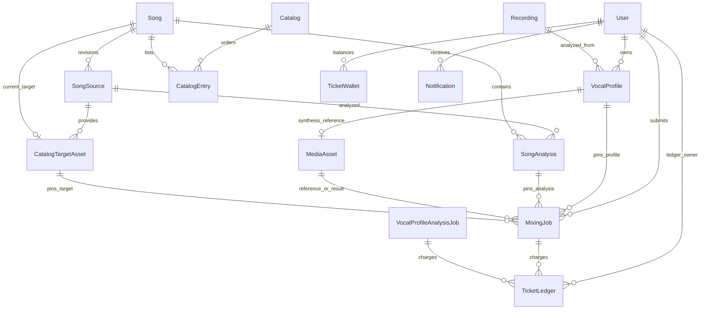
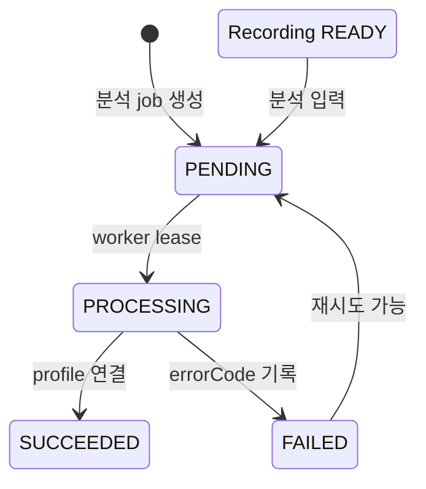

# 도메인 데이터 모델과 영속성 불변식

이 페이지는 `prisma/schema.prisma`의 모델을 런타임 코드와 함께 읽어, 보컬 프로필에서 추천·믹싱·티켓·알림까지 어떤 데이터가 고정되는지 설명한다. 인증·접근 정책은 [접근 제어](/openwiki/concepts/access-control.md), 추천 화면의 의미는 [카탈로그와 추천](/openwiki/concepts/catalog-and-recommendations.md), worker 운영은 [작업 처리](/openwiki/operations/job-processing.md)를 참고한다.

가장 중요한 경계는 **PostgreSQL이 식별자·관계·상태·분석 metadata를 소유하고 오디오 bytes는 외부 저장소가 소유한다**는 점이다. `Recording.storagePath`는 입력 녹음 위치를 가리키고, `MediaAsset`과 `CatalogTargetAsset`은 외부 project/file ID, URL, 파일 metadata를 저장한다. schema에는 audio bytes를 담는 컬럼이 없다.

## 핵심 관계

*그림은 현재 schema가 표현하는 핵심 관계다. `Recording`의 사용자 소유는 직접 `userId`가 아니라 `VocalProfile.userId`를 통한 논리적 연결이다.*

## 사용자, 녹음, 보컬 프로필

`User`는 인증 주체이며 `Session`, `Account`, `Verification`과 연결된다. 프로필·미디어·티켓·작업·알림은 사용자 ID를 직접 가진다. 사용자가 만든 `Song`과 `SongSource`도 작성자 ID를 가진다. 사용자 삭제 시 세션·계정·미디어·티켓·작업·알림은 `Cascade`되고, 곡·source의 작성자 연결은 `SetNull`되어 카탈로그 row 자체는 남는다.

`Recording`은 `USER_TEST`, `SONG_SOURCE`, `SVC_REFERENCE`, `SVC_TARGET` 종류와 `PENDING`, `READY`, `FAILED`, `DELETED` 상태를 가진 논리 레코드다. 저장 위치와 MIME type, 선택적 길이·크기·sample rate를 보유하며, `mediaAssetId @unique`로 외부 reference asset과 최대 하나 연결된다. `VocalProfile.recordingId`는 `Restrict`이므로 프로필이 참조하는 녹음을 삭제할 수 없다.

`VocalProfile`은 `USER` 또는 `SONG` 분석 결과다. MIDI 범위와 tessitura, voiced/pitch/clipping/RMS 지표, JSON `descriptors`, analyzer와 analyzerVersion을 저장한다. `(recordingId, analyzer, analyzerVersion)`은 unique하고, 사용자 프로필 번호 `(userId, profileNumber)`도 unique하다. 다음 번호의 소유자는 `User.nextVocalProfileNumber`다. seed는 외부 asset 없이 `READY` 녹음과 USER/SONG 프로필 fixture를 만들어 이 데이터 기반을 재현한다.

*`VocalProfileAnalysisJob`의 상태와 `RecordingStatus`는 서로 다른 lifecycle이다. 위 상태 이름은 각각 `VocalProfileAnalysisJobStatus`와 `RecordingStatus`의 현재 값에 근거한다.*

분석 persistence는 외부 업로드와 DB 쓰기를 보상한다. source 업로드가 실패하면 프로필을 만들지 않는다. synthesis reference만 실패하면 원본 reference와 프로필을 저장하고 `descriptors.synthesisReferenceStorage`에 fallback을 기록한다. DB 저장이 실패하면 이미 업로드한 외부 파일을 삭제하고 프로필 번호 증가도 되돌린다. 이 경계는 [persistence.ts](repo://src/entities/vocal-profile/api/persistence.ts#L70-L280)와 통합 테스트가 검증한다.

## 곡, source revision, 분석, 카탈로그

`Song`은 `(title, artist)` unique인 곡 정체성이다. 여러 `SongSource` revision과 `SongAnalysis`를 보유하지만, `activeSourceId`와 `currentAnalysisId` unique 포인터로 현재 선택을 명시한다. `Song.lifecycleStatus`는 `DRAFT`, `ACTIVE`, `ARCHIVED`이고 분석 status는 별도 `PENDING`, `READY`, `FAILED`다.

`SongSource`는 URL, `sourceVideoId`, label, revision과 `DRAFT`, `READY`, `SUPERSEDED`, `UNAVAILABLE` 상태를 저장한다. `(songId, revision)`과 `sourceVideoId`는 unique다. `SongAnalysis`는 source별 `pipelineContract` 결과이며 `(sourceId, pipelineContract)`가 unique하다. 음역·키·신뢰도·`cleanupConfirmed`와 pipeline/analyzer metadata, 실패 세부 정보도 이 row에 저장된다.

`Catalog`는 `slug`와 `revision`을 가진 publication 단위이고, `CatalogEntry`가 곡의 position과 상태를 가진다. catalog별 position과 song은 각각 unique하다. readiness 코드는 ACTIVE song에 활성 source, 현재 분석, 준비된 target, 게시된 entry가 모두 있어야 게시 가능하다고 판정한다. `CatalogTargetAsset`은 사용자 `MediaAsset`과 별개로 catalog target의 외부 metadata, `sha256`, source video ID를 보유한다.

추천은 현재 `RecommendationRun`/`RecommendationItem` row를 만들지 않는다. `getRecommendationResult`가 소유권을 확인한 USER 프로필과 published catalog를 RepeatableRead transaction에서 읽고, 분석 결과를 요청 시 ranking한다. 반환값에는 `catalogRevision`과 `scoringVersion`이 들어간다. catalog가 없거나 ranked 결과를 현재 source·analysis·target에 다시 연결할 수 없으면 retryable `CATALOG_NOT_READY`로 실패한다. 반면 `MixingJob`은 제출 순간의 `songAnalysisId`, `targetAssetId`, `catalogPosition`, `catalogRevision`, `recommendedShift`, `scoringVersion`을 직접 저장한다. 그러므로 catalog revision이 바뀌어도 이미 제출한 믹싱의 입력 snapshot은 바뀌지 않는다.

## 티켓과 알림의 불변식

`TicketWallet`은 `(userId, kind)` 복합 primary key로 종류별 balance를 보유한다. 종류는 `VOCAL_ANALYSIS`와 `AI_MIXING`이다. `TicketLedger`는 grant/debit/refund/adjustment, amount, `balanceAfter`, reason을 기록하며 unique `idempotencyKey`와 작업 ID를 통해 중복 요청과 원인을 추적한다. 작업에는 `ticketCost`와 `refundState`(`NONE`, `REQUIRED`, `REFUNDED`)가 있다.

`applyTicketChange`는 `Serializable` transaction에서 idempotency row를 먼저 확인하고 wallet을 조건부 갱신한 뒤 ledger에 갱신 후 잔액을 기록한다. 음수 변경은 현재 balance가 충분할 때만 적용하며, 부족하면 `InsufficientTicketsError`를 낸다. write conflict는 최대 3회 재시도하고, 같은 idempotency key가 같은 입력으로 경쟁 생성되면 기존 ledger를 반환한다. [ticket-ledger.integration.ts](repo://tests/ticket-ledger.integration.ts#L7-L68)는 가입 grant의 종류별 격리와 동시 debit의 단일 적용을 확인한다.

`Notification`은 사용자별 type, title, message, href, unique `dedupeKey`, 선택적 `readAt`을 저장한다. 현재 type은 ticket credit, 보컬 분석 성공/실패, mixing 성공/실패다. worker는 성공·실패 transaction 안에서 알림을 만들므로 작업 상태와 사용자 알림이 함께 기록되는 경로를 확인해야 한다.

## 작업 lifecycle과 외부 media

네 queue row는 DB에 durable 상태를 남긴다.

| 작업 | 상태 | 입력과 결과 |
|---|---|---|
| `SongAnalysisJob` | `PENDING`, `PROCESSING`, `SUCCEEDED`, `FAILED` | `SongSource` → `SongAnalysis` |
| `VocalProfileAnalysisJob` | `PENDING`, `PROCESSING`, `SUCCEEDED`, `FAILED` | 사용자·녹음·선택적 source asset → `VocalProfile` |
| `MixingJob` | `PENDING`, `PREPARING`, `SUBMITTED`, `PROCESSING`, `SUCCEEDED`, `FAILED`, `CANCELED` | profile·analysis·reference·target → result asset |
| `MediaCleanupJob` | `PENDING`, `PROCESSING`, `SUCCEEDED`, `FAILED` | 삭제 대기 `MediaAsset` |

worker는 `PENDING` job을 lease와 함께 claim하고 attempts, nextAttemptAt, heartbeat를 갱신한다. mixing은 reference와 target을 외부 URL에서 읽어 Modal conversion을 submit/poll한 뒤 결과 bytes를 다시 외부 저장소에 올리고 `MixingJob.resultAssetId`를 연결한다. submit 전 실패는 `refundState=REQUIRED`로 끝나고 자동 환불되며, submit 후 실패는 자동 환불하지 않는다. 입력 profile·song·analysis·reference·target은 `Restrict`로 보호하고, 결과 asset 연결은 `SetNull`이다.

`MediaAsset`에는 Leemage의 project/file ID, URL, fileName, MIME type, size만 저장한다. `REFERENCE`, `SYNTHESIS_REFERENCE`, `MIX_RESULT`를 kind로 구분하며 catalog target은 `CatalogTargetAsset`에 저장한다. 외부 삭제가 성공하면 row를 `DELETED`와 `deletedAt`으로 갱신하고, 정상 discard 경로에서는 그 row를 제거한다. 삭제가 실패하면 같은 transaction에서 `DELETE_PENDING`과 `MediaCleanupJob(PENDING)`을 기록한다. cleanup worker는 재시도 가능한 job을 claim하고 외부 삭제 성공 뒤 asset row를 삭제한다. 즉 `DELETED` metadata 보존과 cleanup 후 row 제거는 서로 다른 경로다.

## 변경·검증 순서

schema만 바꾸면 동작이 완성되지 않는다. 시간순 migration SQL에서 backfill, nullable 단계, FK·unique/index 변경, 마지막 `NOT NULL` 전환을 명시하고, 생성된 Prisma client와 runtime persistence를 함께 갱신한다. on-demand 추천 migration은 기존 추천 snapshot을 `MixingJob`의 analysis·target·position·revision·scoring 필드로 backfill한 뒤 구 추천 테이블을 제거했다.

모델을 바꿀 때는 다음을 확인한다.

1. `Cascade`, `Restrict`, `SetNull`이 데이터 보존 의도와 맞는지 확인한다.
2. revision 포인터와 `(sourceId, pipelineContract)`, `(songId, revision)`, catalog unique 제약을 함께 확인한다.
3. queue idempotency, lease, retry, refund transition을 함께 갱신한다.
4. 외부 업로드·DB transaction·삭제 보상 경로를 통합 테스트한다.

집중해서 읽을 테스트는 다음과 같다.

- [vocal-profile-persistence.integration.ts](repo://tests/vocal-profile-persistence.integration.ts#L70-L207): source/synthesis storage, DB 실패 보상, 프로필 번호 증가.
- [recommendation-persistence.integration.ts](repo://tests/recommendation-persistence.integration.ts#L8-L90): on-demand 계산, catalog revision identity, `SongAnalysis` 연결.
- [mixing-queue.integration.ts](repo://tests/mixing-queue.integration.ts#L1-L260): lease, Modal submit/poll, 실패 상태와 환불 경계.
- [ticket-ledger.integration.ts](repo://tests/ticket-ledger.integration.ts#L7-L68): 종류별 wallet, idempotency, 잔액 부족.

`DATABASE_URL`이 없으면 DB integration test는 skip된다. schema 또는 migration 변경 후에는 DB에 migration을 적용하고 Prisma client를 재생성한 다음 이 테스트들을 실행한다.
