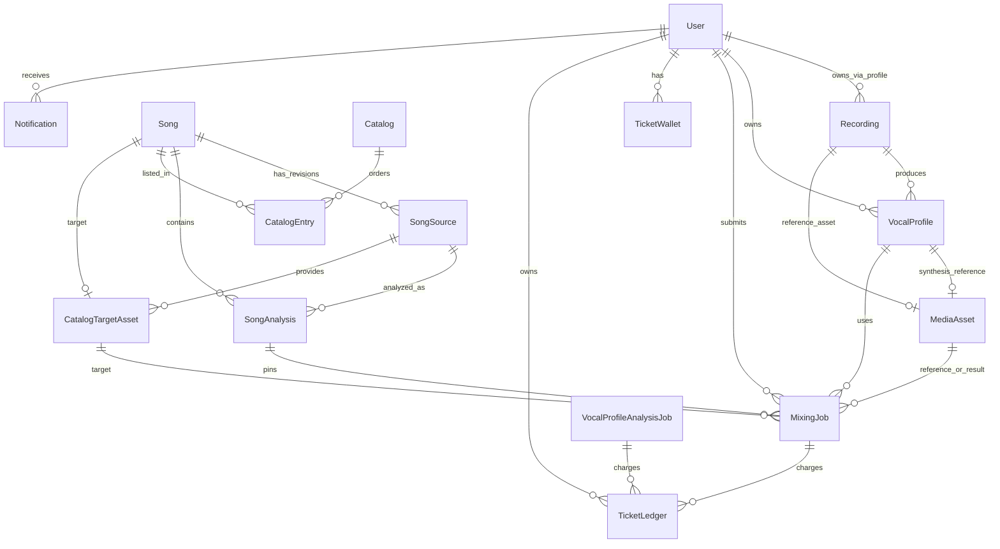
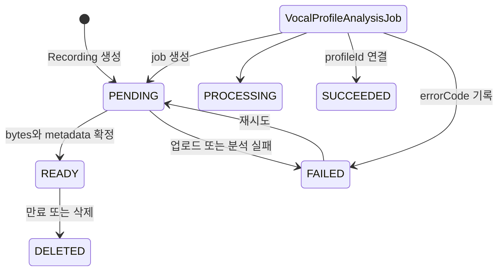

# 도메인 데이터 모델과 영속성

이 페이지는 `prisma/schema.prisma`가 정의하는 현재 PostgreSQL 모델을 읽는 방법을 설명한다. 인증과 접근 제어의 정책은 [접근 제어](/openwiki/concepts/access-control.md), 추천의 사용자 경험은 [카탈로그와 추천](/openwiki/concepts/catalog-and-recommendations.md), 워커 운영은 [작업 처리](/openwiki/operations/job-processing.md)를 참고한다.

핵심 경계는 **PostgreSQL은 식별자·관계·상태·분석 metadata를 소유하고, 오디오 bytes는 외부 파일 저장소가 소유한다**는 것이다. `Recording.storagePath`는 녹음의 저장 위치를 가리키고, `MediaAsset`과 `CatalogTargetAsset`은 외부 프로젝트·파일 ID와 URL을 저장한다. 두 모델 어디에도 audio bytes를 담는 `Bytes` 컬럼은 없다.

## 관계 한눈에 보기

*그림은 핵심 도메인 관계와 작업·티켓·미디어의 연결을 보여준다. `Recording`의 사용자 소유는 `VocalProfile.userId`를 통한 논리적 연결이다.*

## 사용자와 보컬 프로필

`User`는 인증 주체이며 `Session`, `Account`, `Verification`과 연결된다. 도메인 소유권은 `VocalProfile`, `MediaAsset`, 티켓 지갑·원장, 작업, 알림, 사용자가 만든 `Song`/`SongSource`에 걸쳐 `userId`로 표현된다. 사용자 삭제 시 세션·계정·미디어·티켓·작업·알림은 cascade되지만, 곡과 출처의 작성자 연결은 `SetNull`로 남은 카탈로그 데이터를 보존한다.

`Recording`은 `kind`(`USER_TEST`, `SONG_SOURCE`, `SVC_REFERENCE`, `SVC_TARGET`)와 `status`(`PENDING`, `READY`, `FAILED`, `DELETED`)를 가진 오디오 논리 레코드다. `storagePath`, MIME type, 길이·크기·sample rate를 저장하고, 선택적으로 하나의 `MediaAsset`을 가리킨다. `VocalProfile`은 녹음에 `Restrict`로 연결되므로 프로필이 남아 있는 동안 녹음을 삭제할 수 없다.

`VocalProfile`은 `sourceType`이 `USER` 또는 `SONG`인 분석 결과다. MIDI 범위, tessitura, voiced ratio, pitch stability, clipping ratio, RMS와 JSON `descriptors`, 분석기 이름·버전을 저장한다. 같은 `(recordingId, analyzer, analyzerVersion)` 조합은 하나만 허용하며, `(userId, profileNumber)`도 unique다. 사용자별 번호는 `User.nextVocalProfileNumber`가 다음 값을 소유한다.

*그림의 작업 상태는 `VocalProfileAnalysisJobStatus`, 녹음 상태는 `RecordingStatus`를 각각 나타낸다. 이 둘은 별도 lifecycle이다.*

분석 결과 저장은 보상 동작을 포함한다. 입력 source bytes 업로드가 실패하면 프로필과 metadata를 만들지 않는다. synthesis reference 업로드만 실패하면 원본 `MediaAsset`과 프로필을 저장하고 `descriptors.synthesisReferenceStorage`에 실패와 `analysis-source` fallback을 기록한다. 데이터베이스 저장이 실패하면 이미 외부에 업로드한 두 파일을 삭제하고 번호 증가도 되돌린다. 이 경계는 [vocal-profile-persistence.integration.ts](repo://tests/vocal-profile-persistence.integration.ts#L70-L207)가 검증한다.

## 곡, 분석, 카탈로그

`Song`은 `(title, artist)`가 unique인 곡의 정체성이다. 곡은 여러 `SongSource` revision과 `SongAnalysis`를 가질 수 있지만, `activeSourceId`와 `currentAnalysisId` 포인터로 현재 선택을 명시한다. `Song.lifecycleStatus`는 `DRAFT → ACTIVE → ARCHIVED`이며, 분석 상태는 별도로 `PENDING`, `READY`, `FAILED`다.

`SongSource`는 URL, `sourceVideoId`, label, revision 및 `DRAFT`, `READY`, `SUPERSEDED`, `UNAVAILABLE` 상태를 저장한다. `(songId, revision)`과 `sourceVideoId`는 unique다. `SongAnalysis`는 source별 `pipelineContract` 결과를 저장하며 `(sourceId, pipelineContract)`가 unique다. 분석 결과에는 곡의 음역·키·신뢰도·정리 확인(`cleanupConfirmed`)과 실패 세부 정보가 포함된다.

카탈로그는 `Catalog`와 순서를 가진 `CatalogEntry`로 구성된다. 카탈로그 상태는 `DRAFT`, `PUBLISHED`, `ARCHIVED`, 항목 상태는 `DRAFT`, `PUBLISHED`, `ARCHIVED`다. 한 카탈로그에서 position과 song은 각각 중복될 수 없다. `Song`이 실제로 게시 준비가 되려면 활성 source, 현재 분석, target asset, 게시된 catalog entry와 함께 lifecycle이 `ACTIVE`여야 한다. 통합 테스트는 이 포인터 조합이 readiness를 만들고, 동일 `sourceVideoId` 중복을 DB unique 제약(`P2002`)이 거부하는지 확인한다.

`CatalogTargetAsset`은 곡의 반주/target 파일에 대한 외부 metadata와 `sha256`, source video ID를 저장한다. `Song.targetAssetId`는 현재 target을 하나 가리키며, `MixingJob`은 사용한 target과 source 분석을 직접 pin한다. 따라서 카탈로그가 나중에 바뀌어도 이미 제출한 작업은 당시의 `catalogPosition`, `catalogRevision`, `recommendedShift`, `scoringVersion`을 보존한다.

추천은 현재 별도 `RecommendationRun`/`RecommendationItem` 테이블에 영속화하지 않는다. `getRecommendationResult(profileId)`가 published 카탈로그와 준비된 분석을 읽어 요청 시 계산하고, 반환 결과의 identity는 보컬 프로필 ID·카탈로그 revision·scoring version에 의해 달라진다. 같은 revision에서는 반복 결과가 같고, revision을 증가시키면 결과 metadata가 새 revision을 반영한다. 이 전환 과정에서 기존 추천 snapshot을 `MixingJob`의 불변 입력으로 backfill한 뒤 추천 테이블을 삭제한 migration이 근거다.

## 티켓, 알림, 작업

티켓은 현재 잔액과 감사 이력을 분리한다.

- `TicketWallet`은 `(userId, kind)` 복합 키와 `balance`를 가진다. 종류는 `VOCAL_ANALYSIS`, `AI_MIXING`이다.
- `TicketLedger`는 `SIGNUP_GRANT`, `USAGE_DEBIT`, `USAGE_REFUND`, `ADMIN_ADJUSTMENT`와 `amount`, `balanceAfter`, 사유를 기록한다.
- 원장 `idempotencyKey`는 unique이며 작업 ID와 연결할 수 있어 중복 차감과 환불을 추적한다.
- 작업의 `ticketCost`와 `refundState`(`NONE`, `REQUIRED`, `REFUNDED`)는 비용 처리 lifecycle을 작업 레코드에 고정한다.

`Notification`은 사용자별 type, title, message, href와 unique `dedupeKey`를 저장한다. 현재 type은 티켓 credit, 보컬 분석 성공/실패, mixing 성공/실패이며 `readAt`이 읽음 여부다. 알림은 사용자 삭제 시 cascade된다.

두 분석 queue와 mixing queue는 동일한 durable queue 패턴을 쓴다. `PENDING`에서 worker가 lease를 잡아 `PROCESSING`으로 바꾸고, `attempts`, `maxAttempts`, `nextAttemptAt`, lease/heartbeat를 갱신한다. 성공 시 완료 시각과 결과 FK를 기록하고, 실패 시 `errorCode`, `errorDetail`, `retryable`을 기록한다. 구체적인 상태는 다음과 같다.

| 작업 | 상태 enum | 주요 입력/결과 |
|---|---|---|
| `SongAnalysisJob` | `PENDING`, `PROCESSING`, `SUCCEEDED`, `FAILED` | `SongSource` → `SongAnalysis` |
| `VocalProfileAnalysisJob` | `PENDING`, `PROCESSING`, `SUCCEEDED`, `FAILED` | 사용자·녹음·선택적 source asset → `VocalProfile` |
| `MixingJob` | `PENDING`, `PREPARING`, `SUBMITTED`, `PROCESSING`, `SUCCEEDED`, `FAILED`, `CANCELED` | 프로필·곡 분석·reference·target → result asset |
| `MediaCleanupJob` | `PENDING`, `PROCESSING`, `SUCCEEDED`, `FAILED` | 삭제 실패한 `MediaAsset` |

작업 ID와 입력 FK에는 의도적인 삭제 보호가 있다. mixing이 참조하는 프로필, 곡, 분석, reference asset, target asset은 `Restrict`라서 사용 중인 입력을 지울 수 없다. 결과 asset만 `SetNull`이고, 외부 파일 삭제 실패는 asset을 `DELETE_PENDING`으로 만들고 `MediaCleanupJob`을 생성한다.

## 미디어 영속성 경계와 삭제 경로

`storeAnalyzerReferenceBytes`, `storeAnalyzerSynthesisReferenceBytes`, `storeMixingResult`는 bytes를 Leemage 외부 저장소로 업로드한 뒤 반환된 project/file ID, URL, 파일명, MIME type, 크기만 `MediaAsset`에 기록한다. `MediaAsset.kind`는 `REFERENCE`, `SYNTHESIS_REFERENCE`, `MIX_RESULT`로 구분한다. 카탈로그 target은 사용자 소유 `MediaAsset`과 별도의 `CatalogTargetAsset`이다.

외부 파일을 즉시 삭제하지 못하면 PostgreSQL transaction으로 `DELETE_PENDING` 상태와 cleanup job을 함께 기록한다. cleanup worker가 성공하면 외부 파일을 삭제하고 `DELETED`/`deletedAt`을 갱신한다. 이 방식은 DB row를 먼저 없애 외부 파일이 고아가 되는 문제를 줄인다.

## Schema 변경 경로

모델 변경은 `prisma/schema.prisma`만 수정하고 끝내지 않는다. `prisma/migrations`의 시간순 migration에 SQL을 추가해 기존 데이터 backfill, nullable 단계, FK·unique/index 변경, 마지막 `NOT NULL` 전환을 명시해야 한다. 예를 들어 on-demand 추천 전환은 기존 추천 item에서 `MixingJob`의 분석·target·position·revision·scoring snapshot을 backfill한 뒤 FK와 구 테이블을 제거했다. 운영 DB에는 저장소의 migration 순서를 적용하고, 생성된 Prisma client를 다시 생성한 뒤 통합 테스트를 실행한다.

현재 모델을 바꾸는 개발자는 다음을 함께 점검해야 한다.

1. 삭제 방향(`Cascade`, `Restrict`, `SetNull`)이 데이터 보존 의도와 맞는지 확인한다.
2. queue 입력의 unique/idempotency 제약과 재시도·환불 상태를 함께 갱신한다.
3. 외부 bytes 업로드와 DB transaction 사이의 보상/cleanup 경로를 테스트한다.
4. 카탈로그 readiness와 추천 revision snapshot을 검증한다.

## 집중해서 읽을 테스트

- `tests/song-catalog-db.integration.ts`: source revision, 분석, target, catalog entry, active pointers가 함께 저장되는 게시 준비 조건과 DB unique 제약을 검증한다.
- `tests/recommendation-persistence.integration.ts`: 추천이 on-demand로 계산되고 catalog revision이 cache identity에 반영되며 결과 item이 `SongAnalysis`를 가리키는지 검증한다.
- `tests/vocal-profile-persistence.integration.ts`: source/synthesis storage 및 DB 실패에서의 보상 동작, 프로필 번호 증가를 검증한다.

`DATABASE_URL`이 없으면 위 integration test들은 skip된다. 데이터베이스가 필요한 변경은 해당 환경 변수를 설정하고 migration 적용 상태를 확인한 뒤 실행한다.
