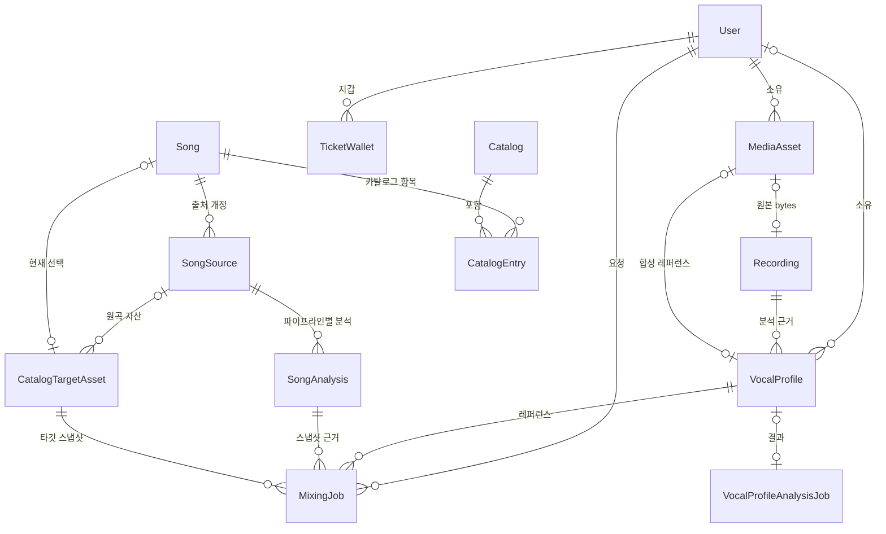

Prisma 스키마는 PostgreSQL에 저장되는 모든 행의 소유 관계와 상태를 정의해요. 스키마 파일은 [prisma/schema.prisma](repo://prisma/schema.prisma#L1-L8) 하나이고, 생성된 client는 손으로 쓰지 않는 코드예요. 이 페이지는 "이 행은 누구 것이고, 어떤 값이 가능한가"를 확인할 때 쓰는 조회용 문서예요. 작업 점유·재시도 절차는 [Job 큐와 lease 복구 계약](../operations/job-processing.md)이 소유하니 여기서는 컬럼의 의미만 다뤄요.

## 먼저 알아둘 스키마 계약

| 항목 | 값 | 근거 |
| --- | --- | --- |
| 스키마 파일 | `prisma/schema.prisma` | [prisma.config.ts](repo://prisma.config.ts#L6-L15) |
| migration 디렉터리 | `prisma/migrations` | [prisma.config.ts](repo://prisma.config.ts#L6-L15) |
| DB provider | `postgresql` | [migration_lock.toml](repo://prisma/migrations/migration_lock.toml#L1-L3) |
| seed 명령 | `tsx prisma/seed.ts` | [prisma.config.ts](repo://prisma.config.ts#L6-L15) |
| datasource URL | 환경 변수 `DATABASE_URL` | [prisma.config.ts](repo://prisma.config.ts#L6-L15) |
| 생성 client 출력 | `src/shared/db/generated/prisma` | [prisma/schema.prisma](repo://prisma/schema.prisma#L1-L4) |

생성 경로는 커밋 대상이 아니에요. [.gitignore](repo://.gitignore#L46-L47)가 `src/shared/db/generated/prisma/`를 제외하고, steiger도 같은 경로를 `ignores`로 빼서 FSD(Feature-Sliced Design) 검사 대상에서 뺀다는 설명을 달아 두었어요([steiger.config.ts](repo://steiger.config.ts#L6-L10)).

런타임 client는 [src/shared/db/prisma.ts](repo://src/shared/db/prisma.ts#L1-L35)에서 만들어요. `DATABASE_URL`이 없으면 즉시 오류를 던지고, `PrismaPg` 어댑터에 `runtimeLimits()`의 풀 크기·연결 타임아웃·statement/query 타임아웃을 넘겨요. 개발 환경에서는 `globalForPrisma`에 캐시해 핫 리로드마다 새 풀이 생기지 않게 해요. 서버 코드는 [src/shared/db/index.server.ts](repo://src/shared/db/index.server.ts#L1-L14)를 통해서만 `prisma`와 enum 타입을 가져와요.

자주 쓰는 명령은 `pnpm run db:generate`, `pnpm run db:migrate`(개발), `pnpm run db:migrate:deploy`(배포), `pnpm run db:status`, `pnpm run db:seed`예요([package.json](repo://package.json#L35-L40)). 스키마 변경은 `prisma/migrations/` 아래 migration 파일로 남기세요. 저장소의 db script에는 migration 이력을 쓰지 않는 `prisma db push`가 없고, 배포 절차도 추적되는 migration 파일을 기준으로 해요.

## 핵심 모델 한눈에 보기

| 모델 | 소유·관계 | 핵심 unique / index | 상태 필드 |
| --- | --- | --- | --- |
| `Recording` | `VocalProfile[]`의 분석 근거, `MediaAsset`과 1:1(`mediaAssetId` unique, `onDelete: SetNull`) | `mediaAssetId` unique, `@@index([kind, status])`, `@@index([expiresAt])` | `RecordingKind`, `RecordingStatus`(기본 `PENDING`), `expiresAt` |
| `VocalProfile` | `Recording` N:1(`Restrict`), `User?` N:1(`SetNull`), `MediaAsset?`(`synthesisReferenceAssetId` unique, `SetNull`), `Song?` 1:1, `MixingJob[]`, `VocalProfileAnalysisJob?` | `@@unique([recordingId, analyzer, analyzerVersion])`, `@@unique([userId, profileNumber])` | `sourceType`(`USER`/`SONG`), 상태 enum 없음(수치 + `analyzer`/`analyzerVersion`) |
| `Song` | `SongSource[]`, `SongAnalysis[]`(`Restrict`), `CatalogEntry[]`, `MixingJob[]`; `activeSourceId`·`currentAnalysisId`·`vocalProfileId`·`targetAssetId`가 각각 unique optional 포인터 | `@@unique([title, artist])`, `@@index([lifecycleStatus, createdAt])` | `lifecycleStatus`(`DRAFT`/`ACTIVE`/`ARCHIVED`), `analysisStatus`(`PENDING`/`READY`/`FAILED`) |
| `SongSource` | `Song` N:1(`Restrict`), `SongAnalysis[]`, `SongAnalysisJob?` 1:1, `CatalogTargetAsset[]` | `@@unique([songId, revision])`, `sourceVideoId` unique, `@@index([songId, status, createdAt])` | `SongSourceStatus`(기본 `DRAFT`) |
| `SongAnalysis` | `Song`·`SongSource` N:1(`Restrict`), `MixingJob[]` | `@@unique([sourceId, pipelineContract])`, `@@index([status, updatedAt])` | `SongAnalysisStatus`(기본 `PENDING`), `cleanupConfirmed` |
| `SongAnalysisJob` | `SongSource` 1:1(`sourceId` unique), `SongAnalysis?`(`analysisId` unique) | `idempotencyKey` unique, `@@index([status, nextAttemptAt, leaseExpiresAt, createdAt])` | `SongAnalysisJobStatus`(기본 `PENDING`) |
| `Catalog` / `CatalogEntry` | `Catalog` 1:N entry(`onDelete: Cascade`), entry는 `Song` N:1(`Restrict`) | `slug` unique, `@@unique([catalogId, position])`, `@@unique([catalogId, songId])` | `CatalogStatus`·`CatalogEntryStatus`(둘 다 기본 `DRAFT`) |
| `MediaAsset` | `User` N:1(`Cascade`); `Recording?`, `VocalProfile?`(합성 레퍼런스), `MixingJob[]`, `VocalProfileAnalysisJob[]`가 참조 | `@@unique([externalProjectId, externalFileId])`, `@@index([userId, kind, createdAt])` | `kind`, `status`(기본 `READY`) |
| `CatalogTargetAsset` | `SongSource?` N:1(`sourceId`, `Restrict`), `Song?` 역참조, `MixingJob[]` | `@@unique([externalProjectId, externalFileId])`, `@@index([sourceVideoId])`, `@@index([sourceId, status, createdAt])` | `status`(기본 `READY`) |
| `MediaOperation` | 외부 저장소 작업 의도; `User`/`assetId`는 문자열 참조만 하고 FK가 없어요 | `@@index([status, nextAttemptAt])`, `@@index([assetId])` | `operation`(`UPLOAD`/`DELETE`), `status` 문자열(기본 `PENDING`) |
| `TicketWallet` / `TicketLedger` | 지갑은 `@@id([userId, kind])`; 원장은 `User` N:1(`Cascade`), `actorUserId`(`SetNull`), `mixingJobId`·`vocalProfileAnalysisJobId`(`SetNull`) | `idempotencyKey` unique, `@@index([userId, kind, createdAt])` | `kind`, `type`, 작업 행의 `refundState` |
| `Notification` | `User` N:1(`Cascade`) | `dedupeKey` unique, `@@index([userId, readAt, createdAt])` | `type`, `readAt` |
| `VocalProfileAnalysisJob` | `User` N:1(`Cascade`), `MediaAsset?`(`sourceAssetId`, `SetNull`), `VocalProfile?`(`vocalProfileId` unique, `SetNull`) | `recordingId` unique, `@@unique([userId, idempotencyKey])` | `VocalProfileAnalysisJobStatus`(기본 `PENDING`), `refundState`(기본 `NONE`) |
| `MixingJob` | `User`(`Cascade`)는 소유, `VocalProfile`·`Song`·`SongAnalysis`·`referenceAsset`·`targetAsset`은 `Restrict`, `resultAsset`은 `SetNull` | `@@unique([userId, idempotencyKey])`, `@@index([status, nextAttemptAt, leaseExpiresAt, createdAt])`, `@@index([vocalProfileId, songAnalysisId, createdAt])` | `MixingJobStatus`(기본 `PENDING`), `refundState` |
| `ExternalJobReconciliation` | `jobType`/`jobId` 문자열로 외부 작업 정리 대상을 가리켜요(FK 없음) | `@@unique([jobType, jobId])`, `@@index([status, createdAt])` | `status` 문자열(기본 `PENDING`) |
| `SignupGrantIntent` | `@@id([userId, kind])`, `User` FK 없음 | `@@id([userId, kind])` | 없음(금액과 사유만 기록) |

행 정의는 [prisma/schema.prisma](repo://prisma/schema.prisma#L130-L186)에서 시작해 [Notification](repo://prisma/schema.prisma#L523-L538)과 [Job 3종](repo://prisma/schema.prisma#L540-L627), 그리고 [독립 의도 3종](repo://prisma/schema.prisma#L629-L677)까지 이어져요.

자주 헷갈리는 소유 관계만 추린 ER(Entity-Relationship) 개요예요. 자산 행과 외부 bytes의 대응은 [미디어 저장과 정리 의도](../operations/media-storage.md)가 설명해요.

## 헷갈리기 쉬운 관계

### 하나의 Recording이 여러 VocalProfile을 만들 수 있어요

`VocalProfile`의 unique는 `recordingId` 단독이 아니라 `@@unique([recordingId, analyzer, analyzerVersion])`이에요([prisma/schema.prisma](repo://prisma/schema.prisma#L151-L186)). 그래서 같은 녹음에 분석기나 분석기 버전이 다른 프로필이 여러 개 붙을 수 있고, 같은 분석기·같은 버전으로 다시 분석하면 기존 행과 충돌해요. `VocalProfileAnalysisJob`은 `vocalProfileId`가 unique라 프로필 하나당 성공 결과 하나만 연결돼요.

`Recording`과 `VocalProfileAnalysisJob.recordingId` 사이에는 FK가 없어요([prisma/schema.prisma](repo://prisma/schema.prisma#L540-L574)). 워커가 `VocalProfileAnalysisJob.recordingId`와 같은 id로 `Recording` 행을 직접 만들고 프로필을 연결하는 방식이라([src/entities/vocal-profile/api/persistence.ts](repo://src/entities/vocal-profile/api/persistence.ts#L232-L245)), 두 행의 연결은 id 규약으로 유지돼요. 이 저장 순서는 [보컬 프로필 분석 흐름](../workflows/vocal-profile-analysis.md)에서 더 자세히 다뤄요.

### VocalProfile 번호는 USER 프로필에만 붙어요

`@@unique([userId, profileNumber])`는 사용자별 프로필 번호의 중복을 막아요. 번호는 `User.nextVocalProfileNumber`를 트랜잭션 안에서 1 증가시켜 배정하고, 표시 이름은 `보컬 프로필 {번호}`로 만들어요([src/entities/vocal-profile/api/persistence.ts](repo://src/entities/vocal-profile/api/persistence.ts#L24-L32)). 과거 행에는 migration이 `sourceType = 'USER'`인 행만 `ROW_NUMBER()`로 번호를 채웠고, `profileNumber > 0`과 `displayName` 길이 1~40자 CHECK 제약을 함께 추가했어요([20260811120000_vocal_profile_identity/migration.sql](repo://prisma/migrations/20260811120000_vocal_profile_identity/migration.sql#L1-L41)).

`userId`는 nullable이라 곡 쪽 프로필(`sourceType = 'SONG'`)은 사용자 없이 존재할 수 있어요. 실제로 seed fixture도 `SONG` 프로필을 `userId` 없이 만들고 `Song.vocalProfileId`로 연결해요([prisma/seed.ts](repo://prisma/seed.ts#L87-L123)). 사용자 화면 조회는 `sourceType: "USER"`를 항상 조건에 넣어요([src/entities/vocal-profile/api/history.ts](repo://src/entities/vocal-profile/api/history.ts#L56-L64)).

### 출처 하나에 원곡 자산이 여러 개이고, 현재 자산은 Song이 가리켜요

`CatalogTargetAsset.sourceId`는 optional이라 자산이 어느 출처에도 묶이지 않을 수 있고(import 시에는 채워요), `SongSource` 하나에 자산이 여러 개 쌓일 수 있어요([prisma/schema.prisma](repo://prisma/schema.prisma#L218-L239), [prisma/schema.prisma](repo://prisma/schema.prisma#L446-L471)). "지금 쓸 자산"은 `Song.targetAssetId`(unique optional)가 가리켜요. 그래서 자산을 교체해도 이전 행은 남고, 공개된 출처를 바꾸면 이전에 READY였던 다른 출처가 `SUPERSEDED`로 내려가요([src/features/manage-song-catalog/api/admin-service.ts](repo://src/features/manage-song-catalog/api/admin-service.ts#L229-L276)).

준비 여부는 이 포인터들이 서로 맞는지로 판정해요. [catalogReadiness](repo://src/entities/song-catalog/lib/readiness.ts#L5-L45)는 `lifecycleStatus === "ACTIVE"`, active source의 `READY`, 현재 분석의 `READY` + `cleanupConfirmed`, 타깃 자산의 `READY`, 그리고 `currentAnalysis.sourceId`·`targetAsset.sourceId`가 `activeSourceId`와 같은지를 검사해요. 조건이 어긋나면 `ANALYSIS_SOURCE_MISMATCH`, `TARGET_SOURCE_MISMATCH` 같은 이유 코드를 돌려줘요. 곡을 공개 상태로 만드는 절차는 [곡 카탈로그 등록과 공개](../workflows/song-catalog-lifecycle.md)가 소유해요.

### MixingJob은 참조 대상을 스냅샷 컬럼으로 고정해요

`MixingJob` 행은 생성 시점에 고른 참조 대상과 추천 근거를 스냅샷 컬럼으로 함께 남겨요. 어떤 값을 고정하는지는 아래 표에서 확인하세요.

| 컬럼 | 무엇을 고정하는지 | 근거 |
| --- | --- | --- |
| `referenceAssetId` | `MixingReference` FK(`onDelete: Restrict`)로 고정한 믹싱 레퍼런스 `MediaAsset`이에요. | [schema.prisma](repo://prisma/schema.prisma#L582) |
| `targetAssetId` | `MixingTarget` FK(`onDelete: Restrict`)로 고정한 원곡 타깃 `CatalogTargetAsset`이에요. | [schema.prisma](repo://prisma/schema.prisma#L583) |
| `songAnalysisId` | 작업을 만들 때 쓴 `SongAnalysis` 행을 `Restrict` FK로 계속 가리켜요. | [schema.prisma](repo://prisma/schema.prisma#L581) |
| `catalogPosition` | 생성 시점에 추천된 카탈로그 항목의 위치(`item.catalogOrder`)예요. | [mixing-queue.ts](repo://src/features/create-mixing/api/mixing-queue.ts#L125) |
| `catalogRevision` | 추천을 계산한 카탈로그 개정 번호(`result.catalogRevision`)예요. | [mixing-queue.ts](repo://src/features/create-mixing/api/mixing-queue.ts#L127) |
| `scoringVersion` | 추천 점수의 기준 버전(`result.scoringVersion`)이에요. | [mixing-queue.ts](repo://src/features/create-mixing/api/mixing-queue.ts#L128) |
| `recommendedShift` | 추천된 반음 단위 조옮김 값(`item.recommendedShift`)이에요. | [mixing-queue.ts](repo://src/features/create-mixing/api/mixing-queue.ts#L126) |

나중에 카탈로그가 바뀌어도 이미 만들어진 작업은 당시 근거를 그대로 유지해요. 대신 새 요청은 접수 시점에 현재 값과 비교해서 불일치하면 `MIXING_RECOMMENDATION_STALE`로 거절해요([src/features/create-mixing/api/mixing-queue.ts](repo://src/features/create-mixing/api/mixing-queue.ts#L81-L101)). 참조 자산 선택 규칙과 전체 흐름은 [AI 믹싱 작업 흐름](../workflows/ai-mixing.md)에 있어요.

## Job 계열 공통 컬럼

`MixingJob`, `VocalProfileAnalysisJob`, `SongAnalysisJob`은 같은 이름의 점유·재시도 컬럼을 공유해요([prisma/schema.prisma](repo://prisma/schema.prisma#L285-L314), [prisma/schema.prisma](repo://prisma/schema.prisma#L540-L574), [prisma/schema.prisma](repo://prisma/schema.prisma#L576-L627)). 조회·전이 알고리즘은 [Job 큐와 lease 복구 계약](../operations/job-processing.md)으로 보내고, 여기서는 컬럼 의미만 정리해요.

| 컬럼 | 기본값 | 의미 |
| --- | --- | --- |
| `status` | `PENDING` | 작업의 공개 상태. `PREPARING`·`SUBMITTED`는 `MixingJob`에만 있어요. |
| `attempts` | `0` | 점유(claim)할 때마다 1 증가해요. `maxAttempts`와 비교해 재시도 여부를 판단해요. |
| `maxAttempts` | `3` | 재시도 상한. `MixingJob`은 `mixingMaxAttempts()`, 보컬 분석은 `vocalProfileAnalysisMaxAttempts()`로 생성 시 덮어써요([src/shared/config/server-env.ts](repo://src/shared/config/server-env.ts#L34-L52)). |
| `nextAttemptAt` | `now()` | 후보 선정 조건이에요. 이 시각이 지나야 다시 점유될 수 있어요. |
| `leaseOwner` / `leaseExpiresAt` | `NULL` | 점유자와 점유 만료 시각. 만료된 진행 중 행은 다른 워커가 회수해요. |
| `heartbeatAt` | `NULL` | 마지막으로 점유를 갱신한 시각이에요. |
| `deadlineAt` | `NULL` | claim 시 `COALESCE(startedAt, now)`에 작업별 간격을 더해 한 번만 채워요. 보컬 분석은 15분, 믹싱과 곡 분석은 75분이에요([vocal worker](repo://src/_app/background-jobs/vocal-profile-analysis/worker.ts#L47-L83), [mixing worker](repo://src/_app/background-jobs/mixing/worker.ts#L97-L136), [song worker](repo://src/_app/background-jobs/song-analysis/worker.ts#L33-L64)). |
| `submissionState` | `NOT_SUBMITTED` | 외부 서비스 접수 확실성. `NOT_SUBMITTED` → `UNKNOWN` → `SUBMITTED`로 진행해요. |
| `submissionStartedAt` | `NULL` | 접수를 시도하기 직전에 기록하는 시각이에요. 외부 job id를 아직 못 받은 채 이 시각이 오래됐으면 복구 예산 초과로 봐요([mixing worker](repo://src/_app/background-jobs/mixing/worker.ts#L312-L318)). |
| `errorCode` / `errorDetail` / `retryable` | `NULL` | 마지막 실패의 코드·상세·재시도 가능 여부예요. |
| `startedAt` / `completedAt` | `NULL` | 첫 점유 시각과 종료 확정 시각이에요. |

`submissionState`는 migration [20260913010000_production_readiness_core](repo://prisma/migrations/20260913010000_production_readiness_core/migration.sql#L1-L14)에서 `TEXT NOT NULL DEFAULT 'NOT_SUBMITTED'`로 추가됐어요. enum이 아니라 문자열이라 값 검증은 코드가 해요.

전이는 두 워커에서 관찰돼요. 믹싱 워커는 외부 제출 직전에 `UNKNOWN`을 쓰고([src/_app/background-jobs/mixing/worker.ts](repo://src/_app/background-jobs/mixing/worker.ts#L371-L377)), 응답이 명확한 4xx/429면 `NOT_SUBMITTED`로 되돌린 뒤([src/_app/background-jobs/mixing/worker.ts](repo://src/_app/background-jobs/mixing/worker.ts#L398-L414)) 외부 job id를 받으면 `SUBMITTED`로 확정해요. 곡 분석 워커도 같은 순서로 `UNKNOWN` → `SUBMITTED`를 기록해요([src/_app/background-jobs/song-analysis/worker.ts](repo://src/_app/background-jobs/song-analysis/worker.ts#L171-L205)). 접수 여부가 불확실한 채 끝난 작업은 환불을 보류하고 `MODAL_SUBMISSION_UNCONFIRMED`로 남기며, 처리는 [복구 스크립트 운영 절차](../operations/recovery-runbook.md)가 담당해요([src/_app/background-jobs/mixing/worker.ts](repo://src/_app/background-jobs/mixing/worker.ts#L187-L291)).

재시도를 다시 열 때는 접수 흔적까지 초기화해요. 곡 분석 재시도는 `status`를 `PENDING`으로, `attempts`를 `0`으로 되돌리고 새 `externalRequestId`를 발급하며 `submissionState`를 `NOT_SUBMITTED`, `submissionStartedAt`·`externalJobId`를 `NULL`로 지워요([src/features/manage-song-catalog/api/admin-service.ts](repo://src/features/manage-song-catalog/api/admin-service.ts#L197-L227)). `externalRequestId`는 정리 대상 키에 `SONG:{externalRequestId}` 형태로 쓰여, 같은 출처를 재시도해도 이전 접수와 구분돼요([src/_app/background-jobs/song-analysis/worker.ts](repo://src/_app/background-jobs/song-analysis/worker.ts#L81-L92)).

## 상태 enum과 가능한 값

| enum | 값 | 기본값과 관찰된 전이 |
| --- | --- | --- |
| `RecordingKind` | `USER_TEST`, `SONG_SOURCE`, `SVC_REFERENCE`, `SVC_TARGET` | 현재 코드는 `USER_TEST`만 만들고, `SONG_SOURCE`는 seed fixture에서만 써요. `SVC_*`를 쓰는 경로는 없어요([src/entities/vocal-profile/api/persistence.ts](repo://src/entities/vocal-profile/api/persistence.ts#L117-L130), [prisma/seed.ts](repo://prisma/seed.ts#L33-L61)). |
| `RecordingStatus` | `PENDING`, `READY`, `FAILED`, `DELETED` | 기본 `PENDING`. 프로필 저장 시 `READY`로 만들어요. 나머지 값으로 바꾸는 경로는 찾지 못했어요. |
| `VocalProfileSourceType` | `USER`, `SONG` | 사용자 분석 결과는 `USER`, 곡 쪽 프로필은 `SONG`이에요. |
| `SongLifecycleStatus` | `DRAFT`, `ACTIVE`, `ARCHIVED` | 기본 `DRAFT`. 공개 시 `ACTIVE`([src/features/manage-song-catalog/api/admin-service.ts](repo://src/features/manage-song-catalog/api/admin-service.ts#L262-L271)), 보관 시 `ARCHIVED`로 바꿔요. |
| `SongSourceStatus` | `DRAFT`, `READY`, `SUPERSEDED`, `UNAVAILABLE` | 기본 `DRAFT`. 생성 시 `DRAFT`, 공개 시 `READY`, 다른 출처를 공개하면 이전 출처가 `SUPERSEDED`가 돼요. `UNAVAILABLE`로 쓰는 경로는 현재 코드에서 찾지 못했어요. |
| `SongAnalysisStatus` | `PENDING`, `READY`, `FAILED` | 기본 `PENDING`. 분석 성공 시 `READY`와 `cleanupConfirmed = true`, 실패 시 `FAILED`를 upsert해요([src/_app/background-jobs/song-analysis/worker.ts](repo://src/_app/background-jobs/song-analysis/worker.ts#L224-L312)). |
| `SongAnalysisJobStatus` | `PENDING`, `PROCESSING`, `SUCCEEDED`, `FAILED` | 기본 `PENDING`. `PENDING` → `PROCESSING` → `SUCCEEDED`/`FAILED`, 재시도 시 `PENDING`으로 돌아가요. |
| `CatalogStatus` · `CatalogEntryStatus` | `DRAFT`, `PUBLISHED`, `ARCHIVED` | 각각 기본 `DRAFT`. entry를 `PUBLISHED`로 올려야 추천 대상이 되고, 곡을 보관하면 entry도 `ARCHIVED`가 돼요. |
| `MediaAssetKind` | `REFERENCE`, `SYNTHESIS_REFERENCE`, `MIX_RESULT` | 용도별로 저장 함수가 나뉘어요([src/shared/media/media-service.ts](repo://src/shared/media/media-service.ts#L39-L100)). |
| `MediaAssetStatus` | `READY`, `DELETE_PENDING`, `DELETED`, `FAILED` | 기본 `READY`. 삭제 경로는 상태를 바꾸지 않고 행을 지운 뒤 `MediaOperation`을 남기므로, `DELETE_PENDING`·`DELETED`가 나오는 곳은 스냅샷 검증 스키마와 테스트 fixture뿐이에요([src/shared/media/operations.ts](repo://src/shared/media/operations.ts#L87-L112), [src/entities/song-catalog/model/contract.ts](repo://src/entities/song-catalog/model/contract.ts#L45-L53)). |
| `MediaCleanupStatus` | `PENDING`, `PROCESSING`, `SUCCEEDED`, `FAILED` | 기본 `PENDING`. 회수 시 `PROCESSING`, 실패 시 `FAILED`로 되돌려요([src/shared/media/cleanup.ts](repo://src/shared/media/cleanup.ts#L6-L48)). |
| `MixingJobStatus` | `PENDING`, `PREPARING`, `SUBMITTED`, `PROCESSING`, `SUCCEEDED`, `FAILED`, `CANCELED` | 기본 `PENDING`. 점유 시 `PENDING` → `PREPARING`, poll 중 `SUBMITTED`/`PROCESSING`, 성공 시 `SUCCEEDED`, 실패 시 `FAILED`예요. 재시도는 접수 전이면 `PENDING`, 접수 후면 `SUBMITTED`로 돌아가요([src/_app/background-jobs/mixing/worker.ts](repo://src/_app/background-jobs/mixing/worker.ts#L212-L249)). |
| `VocalProfileAnalysisJobStatus` | `PENDING`, `PROCESSING`, `SUCCEEDED`, `FAILED` | 기본 `PENDING`. 재시도 시 `PENDING`, 실패 확정 시 `FAILED`예요. |
| `TicketRefundState` | `NONE`, `REQUIRED`, `REFUNDED` | 기본 `NONE`. 실패 확정 시 `REQUIRED`, 환불 트랜잭션이 성공하면 `REFUNDED`가 돼요([src/_app/background-jobs/mixing/worker.ts](repo://src/_app/background-jobs/mixing/worker.ts#L156-L172)). |
| `NotificationType` | `TICKET_CREDIT`, `VOCAL_PROFILE_SUCCEEDED`, `VOCAL_PROFILE_FAILED`, `MIXING_SUCCEEDED`, `MIXING_FAILED` | 작업을 종료 확정하는 같은 트랜잭션에서 알림을 만들어요. `dedupeKey` unique가 중복 알림을 막아요([prisma/schema.prisma](repo://prisma/schema.prisma#L523-L538)). |

`MixingJobStatus.CANCELED`는 값이 정의돼 있고 종료 상태 필터·표시·필터 매핑에서 참조되지만([src/entities/mixing-job/api/deletion.ts](repo://src/entities/mixing-job/api/deletion.ts#L7-L27), [src/entities/mixing-job/api/history.ts](repo://src/entities/mixing-job/api/history.ts#L93-L101)), 이 값을 쓰는 쓰기 경로는 현재 코드에서 찾지 못했어요. 취소를 만들려면 새 경로가 필요하다는 뜻이에요.

문자열로 관리하는 상태도 있어요. `MediaOperation.status`는 `UPLOADING` → `STORED`, `PROCESSING` → `COMPLETED`/`RECOVER`/`UNRESOLVED`, 운영자 해소 시 `RESOLVED_BY_OPERATOR`로 움직여요([src/shared/media/operations.ts](repo://src/shared/media/operations.ts#L6-L179), [scripts/reconcile-media.ts](repo://scripts/reconcile-media.ts#L34-L52)). `ExternalJobReconciliation.status`는 `PENDING`에서 자동 정리 성공 시 `CLEANED`, 실패 시 `UNRESOLVED`, 운영자 해소 시 `RESOLVED_{outcome}`이 돼요([src/_app/background-jobs/mixing/reconciliation.ts](repo://src/_app/background-jobs/mixing/reconciliation.ts#L5-L64), [scripts/reconcile-external-job.ts](repo://scripts/reconcile-external-job.ts#L37-L83)).

## 멱등성과 불변식은 unique 제약이 담당해요

중복 요청과 중복 지급을 막는 장치는 애플리케이션 로직과 DB 제약 양쪽에 있어요. 제약 이름을 알고 있으면 충돌 오류(`P2002`)를 정확히 해석할 수 있어요.

| 제약 | 막는 중복 | 근거 |
| --- | --- | --- |
| `@@unique([userId, idempotencyKey])` | 같은 사용자가 같은 요청 키로 작업을 두 번 만드는 것 | [MixingJob](repo://prisma/schema.prisma#L620-L622), [VocalProfileAnalysisJob](repo://prisma/schema.prisma#L571-L573) |
| `idempotencyKey` unique | 곡 분석 작업, 관리자의 곡 등록 요청 | [SongAnalysisJob](repo://prisma/schema.prisma#L285-L296) |
| `TicketLedger.idempotencyKey` unique | 티켓 차감·환불·지급의 이중 반영 | [prisma/schema.prisma](repo://prisma/schema.prisma#L499-L521) |
| `Notification.dedupeKey` unique | 같은 사건에 대한 알림 중복 생성 | [prisma/schema.prisma](repo://prisma/schema.prisma#L523-L538) |
| `SignupGrantIntent` `@@id([userId, kind])` | 가입 지급 금액의 재산정 | [src/entities/ticket/api/ticket-service.ts](repo://src/entities/ticket/api/ticket-service.ts#L145-L179) |
| `ExternalJobReconciliation @@unique([jobType, jobId])` | 같은 작업의 정리 레코드 중복 | [prisma/schema.prisma](repo://prisma/schema.prisma#L664-L677) |

티켓 지갑은 `@@id([userId, kind])`로 사용자·종류별 잔액 한 행을 유지하고, 원장 행이 `balanceAfter`와 `actorUserId`를 남겨요. 원장 불변식은 [티켓 원장과 멱등성](../concepts/ticket-ledger.md)이 자세히 다뤄요.

## 스키마를 바꿀 때 지킬 것

1. `prisma/schema.prisma`를 고치고 `pnpm run db:migrate`로 migration을 만들어 `prisma/migrations/` 아래 파일로 남기세요. 배포에는 `pnpm run db:migrate:deploy`를 써요([package.json](repo://package.json#L36-L38)).
2. migration에는 기존 행을 어떻게 채울지도 함께 쓰세요. `VocalProfile` 번호 배정과 CHECK 제약이 그 예예요([20260811120000_vocal_profile_identity/migration.sql](repo://prisma/migrations/20260811120000_vocal_profile_identity/migration.sql#L1-L41)). 새 enum 값을 NOT NULL 컬럼에 넣을 때는 `submissionState`처럼 기본값을 정해 두세요([20260913010000_production_readiness_core/migration.sql](repo://prisma/migrations/20260913010000_production_readiness_core/migration.sql#L1-L14)).
3. `pnpm run db:generate`로 client를 다시 만들고, `src/shared/db/index.server.ts`가 새 enum 타입을 노출하는지 확인하세요([src/shared/db/index.server.ts](repo://src/shared/db/index.server.ts#L1-L14)).
4. 생성 경로를 손으로 고치거나 커밋하지 마세요. 그 경로는 gitignore 대상이고 FSD 검사에서 제외돼요([.gitignore](repo://.gitignore#L46-L47), [steiger.config.ts](repo://steiger.config.ts#L6-L10)).
5. unique 제약을 추가하거나 바꾸면 `P2002`를 해석하는 코드와 멱등성 키 생성 지점을 함께 확인하세요. 스키마의 제약은 이미 저장된 행에도 즉시 적용돼요.
