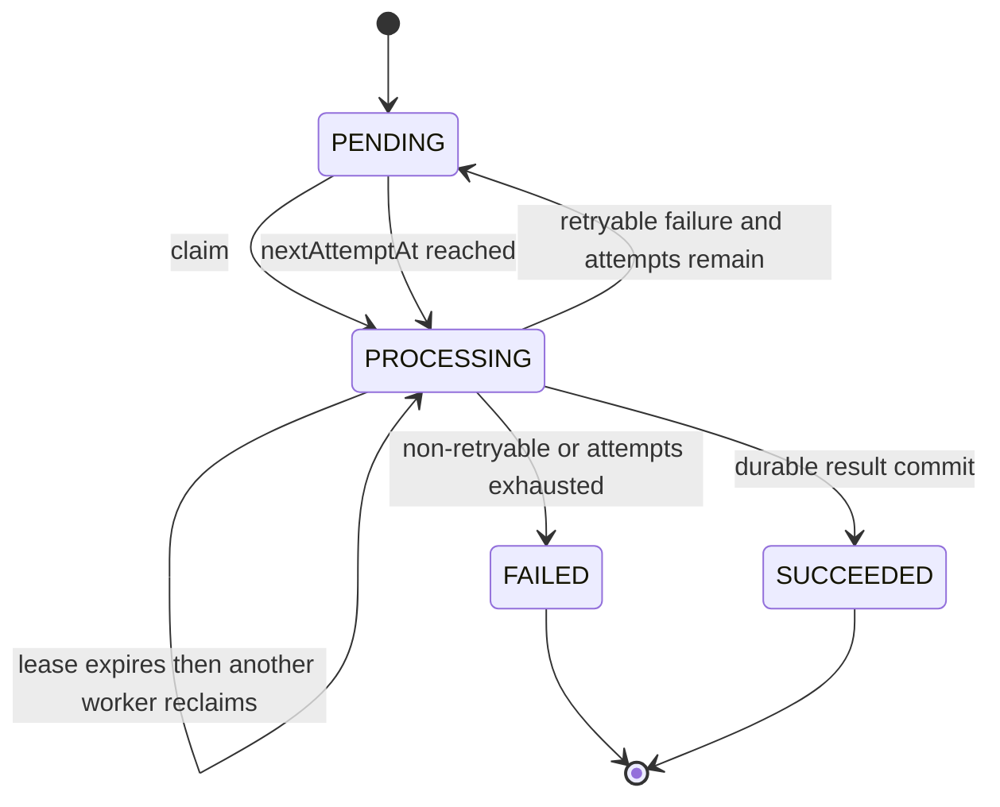
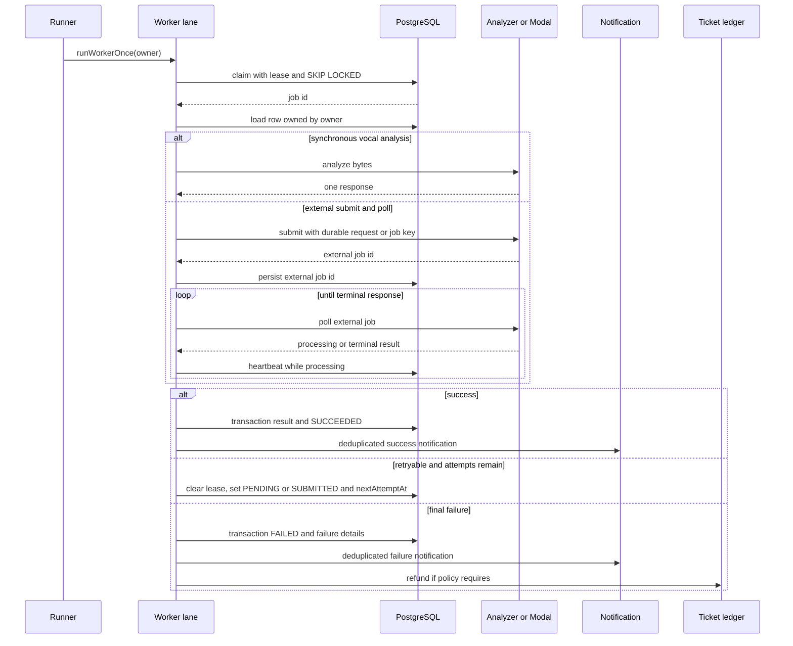

# PostgreSQL 큐와 lease 기반 worker

이 페이지는 세 worker를 운영하거나 수정할 때 **누가 작업을 소유하고, 프로세스가 죽으면 어떻게 다시 집는지, 외부 분석 결과를 어떻게 중복 없이 확정하는지**를 빠르게 확인하기 위한 문서다. 큐 메시지 자체가 작업 상태를 보장하는 구조가 아니라 PostgreSQL의 `*AnalysisJob`/`MixingJob` row가 durable source of truth다. 각 worker는 `PENDING` 또는 만료된 진행 작업을 원자적으로 claim하고, 성공·실패 때 lease를 해제한다.

관련 도메인 모델은 [job과 ticket ledger 스키마](repo://prisma/schema.prisma#L536-L617), 실행 진입점은 [package scripts](repo://package.json#L9-L23)를 참조한다. 곡 추천과 믹싱의 상위 흐름은 [/openwiki/workflows/recommendation-and-mixing.md](/openwiki/workflows/recommendation-and-mixing.md), 보컬 분석 사용자 흐름은 [/openwiki/workflows/vocal-analysis.md](/openwiki/workflows/vocal-analysis.md)에서 이어서 읽는다.

## 공통 실행 모델

`scripts/mixing-worker.ts`, `scripts/song-analysis-worker.ts`, `scripts/vocal-profile-analysis-worker.ts`는 각각 server-only `run*Worker()`를 호출한다. runner는 설정된 concurrency만큼 lane을 만들고 lane별로 `process.pid`, lane index, random UUID를 합친 고유 `owner`를 만든다. 작업이 없으면 1초 쉰다. `SIGINT`와 `SIGTERM`은 새 반복을 멈추게 하지만 현재 작업을 강제 취소하지는 않는다.

세 claim SQL은 다음 조건을 함께 검사한다.

- `attempts < maxAttempts`이고 `nextAttemptAt <= now`여야 한다.
- `PENDING`이거나 lease가 없거나 만료된 진행 상태여야 한다.
- 생성 시각이 빠른 row부터 `FOR UPDATE SKIP LOCKED`로 한 건을 고른다.
- 같은 update에서 상태, `leaseOwner`, `leaseExpiresAt`, `heartbeatAt`, 최초 `startedAt`을 기록하고 `attempts`를 증가시킨다.

따라서 잠긴 row를 기다리느라 다른 lane이 멈추지 않고, lease가 만료된 row는 새 owner가 재점유할 수 있다. `leaseOwner` 조건을 확인하지 않은 후속 쓰기는 현재 소유자와 경쟁할 수 있으므로, 외부 submit 뒤에는 특히 소유권을 검증한다.



이 상태도는 세 큐의 공통 lifecycle을 나타낸다. 믹싱은 외부 변환을 접수한 뒤 `SUBMITTED`를 거치며, `PREPARING`도 claim 직후의 상태로 사용한다. 스키마상 믹싱에는 `CANCELED`도 있지만 이 worker들의 claim·실패 경로가 이를 설정하지는 않는다. [세 worker의 claim 구현](repo://src/_app/background-jobs/mixing/worker.ts#L92-L130)은 이 원자적 패턴의 대표 예다.

### lease와 heartbeat

lease 만료는 작업을 실패로 확정하는 신호가 아니라 **재점유 가능성**이다. 새 worker는 만료 시각을 다시 검사하고 attempt를 하나 더 소비한다. 작업이 살아 있는 동안 heartbeat는 `leaseExpiresAt`을 lease 기간만큼 미래로 연장한다.

- 믹싱은 외부 polling 중 각 poll 뒤 `SUBMITTED` 또는 `PROCESSING`으로 heartbeat한다. lease를 잃으면 update count가 1이 아니어서 중단한다.
- 곡 분석은 별도 60초 interval heartbeat를 실행하고, 종료 시 정리한다. heartbeat update에는 `status=PROCESSING`과 owner 조건이 있다.
- 보컬 프로필 분석은 claim 때 lease를 기록하지만 worker 내부의 주기적 heartbeat는 없다. 따라서 분석 호출이 lease보다 길어질 수 있다면 `VOCAL_PROFILE_ANALYSIS_LEASE_SECONDS`를 충분히 크게 잡아야 한다.

### 프로세스 재시작 복구

프로세스가 종료되면 lease 해제 코드가 실행되지 않을 수 있다. 이 경우 row는 진행 상태와 만료된 `leaseExpiresAt`을 그대로 남기고, 다음 프로세스가 만료 조건으로 재claim한다. runner가 재시작 자체를 감지하거나 별도 recovery job을 실행하는 것은 아니다.

외부 job ID를 이미 기록한 경우에는 재제출하지 않는 것이 핵심이다. 믹싱은 `modalJobId`가 있으면 `/v1/conversions/{id}`를 바로 poll하고, 곡 분석은 `externalJobId`가 있으면 `/v1/jobs/{id}`를 바로 poll한다. 반면 submit 응답을 받았지만 ID 저장 전에 프로세스가 죽는 경우까지 완전한 exactly-once를 보장하지는 않는다. 외부 API의 `requestId`는 곡 분석 submit에 전달되며, 재시도 시 adapter가 이를 활용할 수 있다.

## worker별 처리 차이

| worker | 입력과 분석 경계 | 외부 작업 lifecycle | 성공 결과 | 실패·환불 |
|---|---|---|---|---|
| 보컬 프로필 분석 | READY reference asset을 내려 받아 `analyzeVocalProfileBytes` 호출 | 동기 단일 응답. 별도 submit/poll 없음 | 분석 bytes의 hash·크기·MIME을 검증한 뒤 profile persistence | 영구 실패 시 알림, source asset 정리, 유료 ticket refund |
| 곡 분석 | READY `CatalogTargetAsset`을 내려 받아 analyzer에 전송 | `/v1/jobs` submit 후 `externalJobId` poll | `SongAnalysis`를 pipeline contract로 upsert하고 job을 성공 처리 | retryable이면 PENDING; 최종 실패 시 `SongAnalysis=FAILED`. ticket refund 로직은 없음 |
| 믹싱 | reference와 catalog target을 내려 받아 FormData 구성 | `/v1/conversions` submit 후 `modalJobId` poll | 결과 audio를 압축·저장하고 `MixingJob`과 알림을 transaction으로 확정 | 접수 전 실패만 refund 대상. 접수 후 실패는 외부 job이 존재하므로 refund하지 않음 |

### 1. 보컬 프로필 분석: 동기 단일 응답

`processClaimedVocalProfileAnalysisJob`은 먼저 같은 `recordingId`와 user의 profile이 이미 있으면 이를 재사용해 성공 처리한다. 그렇지 않으면 queued `sourceAsset`을 검증하고 bytes를 읽어 [분석 adapter](repo://src/_app/background-jobs/vocal-profile-analysis/worker.ts#L235-L317)에 한 번 호출한다. 반환된 source bytes가 원본과 SHA-256, byte length, MIME에서 다르면 `ANALYZER_SOURCE_MISMATCH` non-retryable 오류다. persistence가 성공한 뒤 `SUCCEEDED`와 profile ID를 transaction으로 기록하고 dedupe notification을 만든다.

재시도 가능한 analyzer/client 오류는 지수 backoff(최대 30초) 후 `PENDING`으로 돌린다. 재시도 불가 오류이거나 attempt가 소진되면 `FAILED`로 끝내고, ticket cost가 양수면 `refundState=REQUIRED`로 만든다. 환불은 idempotency key `vocal-analysis-refund:{job.id}`를 사용하며 runner가 매 lane 반복마다 최대 10건을 reconcile한다. 따라서 환불 API 실패가 작업 최종 실패를 되돌리지는 않고 다음 반복에서 다시 시도된다.

### 2. 곡 분석: submit과 poll의 분리

claim 시 READY `CatalogTargetAsset`이 없으면 아예 claim하지 않는다. 처리 중 target bytes를 내려 받은 뒤 analyzer `/v1/jobs`에 `requestId=job.id`, `sourceVideoId`와 파일을 submit하고, 응답의 외부 ID를 owner 검증 update로 저장한다. 이후 `PROCESSING`이면 poll interval(기본 2.5초)만큼 기다리고, `SUCCEEDED`면 수치·descriptors·pipeline metadata를 `SONG_ANALYSIS_PIPELINE_CONTRACT`에 맞춰 upsert한다. `FAILED` 응답에서는 외부 ID를 지운 후 analyzer가 지정한 retryability로 실패 경로에 들어간다. 이 부분은 [submit/poll 및 durable commit](repo://src/_app/background-jobs/song-analysis/worker.ts#L127-L199)과 [READY upsert](repo://src/_app/background-jobs/song-analysis/worker.ts#L200-L289)에 구현되어 있다.

기본 backoff는 `5 * 2^(attempt-1)`초, 최대 60초다. 단, `SongAnalyzerError`가 아닌 예외는 retryable로 정규화된다. 마지막 attempt 또는 non-retryable 오류는 job과 `SongAnalysis`를 `FAILED`로 만든다. 곡 분석 worker는 ticket ledger를 변경하지 않는다.

### 3. 믹싱: 접수 전후의 의미가 다르다

믹싱은 claim 직후 `PENDING → PREPARING`으로 바뀐다. `modalJobId`가 없을 때만 reference와 READY target을 fetch하고 `SYNTHESIS_PRESET` 및 추천 pitch shift를 FormData에 넣어 Modal `/v1/conversions`에 submit한다. 유효한 `queued` 응답을 받으면 ID와 `SUBMITTED`를 저장한다. 이미 ID가 있으면 이 준비·submit 단계를 건너뛰므로 재시작 후 같은 변환을 다시 만들지 않는다. [믹싱 submit/poll 경로](repo://src/_app/background-jobs/mixing/worker.ts#L257-L353)를 기준으로 변경해야 한다.

Modal이 `succeeded`를 반환하면 audio를 받아 비어 있지 않은지 확인하고 압축한다. 결과 asset을 먼저 저장한 뒤, job을 `SUCCEEDED`로 만들고 asset ID와 성공 notification을 한 transaction에서 기록한다. transaction이 실패하면 새 asset을 폐기한다. Modal polling 실패 같은 retryable 오류는 `SUBMITTED`를 유지하고 backoff를 적용한다. submit 전 오류는 `PENDING`으로 되돌린다. 기본 backoff는 2의 거듭제곱(최대 30초)이다.

non-retryable 오류 또는 attempt 소진 시 `FAILED`와 실패 notification을 기록한다. `submitted=false`일 때만 `refundState=REQUIRED`로 만들고 자동 환불한다. `submitted=true`이면 외부 변환 비용·상태를 알 수 없으므로 환불하지 않는다. worker 시작 시 required refund와 media cleanup도 reconcile한다.

## 실패 처리 sequence



이 sequence의 `T` 호출은 보컬 프로필과 submit 전 믹싱에만 해당한다. 곡 분석에는 refund 단계가 없다. 모든 오류 detail은 DB에 길이 제한을 두어 저장하고, 로그에는 일부 detail만 남긴다.

## 설정과 운영

환경 변수는 모두 정수 범위 검증을 받는다. 기본값은 [server 환경 설정](repo://src/shared/config/server-env.ts#L30-L74)에 정의되어 있다.

| 환경 변수 | 기본값 | 범위 | 의미 |
|---|---:|---:|---|
| `MIXING_WORKER_CONCURRENCY` | 1 | 1–32 | 믹싱 lane 수 |
| `MIXING_LEASE_SECONDS` | 120 | 30–3600초 | 믹싱 lease |
| `MIXING_POLL_INTERVAL_MS` | 5000 | 100–60000ms | Modal poll 주기 |
| `SONG_ANALYSIS_WORKER_CONCURRENCY` | 1 | 1–8 | 곡 분석 lane 수 |
| `SONG_ANALYSIS_LEASE_SECONDS` | 300 | 180–3600초 | 곡 분석 lease |
| `SONG_ANALYSIS_POLL_INTERVAL_MS` | 2500 | 250–30000ms | analyzer poll 주기 |
| `VOCAL_PROFILE_ANALYSIS_WORKER_CONCURRENCY` | 1 | 1–16 | 보컬 분석 lane 수 |
| `VOCAL_PROFILE_ANALYSIS_LEASE_SECONDS` | 300 | 180–3600초 | 보컬 분석 lease |

운영에서는 poll 시간이 lease보다 길어지지 않게 하고, concurrency를 외부 analyzer/Modal rate limit과 DB 용량에 맞춰 조정한다. 외부 서비스 설정이 없으면 믹싱은 `MODAL_NOT_CONFIGURED`, 곡 분석은 analyzer 설정 오류로 non-retryable 처리된다. 실행은 다음 명령으로 분리할 수 있다.

```bash
pnpm run worker:mixing
pnpm run worker:vocal-profile-analysis
pnpm run worker:song-analysis
```

## 변경 시 지켜야 할 불변식

1. claim update와 lease 소유자 조건을 유지한다. 외부 호출 뒤 DB write에는 가능한 한 `leaseOwner=owner` 조건을 둔다.
2. 외부 job ID를 저장한 뒤에는 재시작·lease 재점유 시 재submit하지 않는다. ID를 의도적으로 지우는 경우에만 외부 job이 종료되었는지 확인한다.
3. 성공 결과와 `SUCCEEDED` 전환은 함께 재실행해도 안전해야 한다. 분석은 unique key/upsert, 알림은 dedupe key, 환불은 idempotency key가 중복을 막는다.
4. retryable 여부와 attempt 상한을 함께 평가한다. retryable 오류라도 상한을 넘으면 최종 `FAILED`다.
5. 최종 실패의 알림·asset 정리·refund 정책은 worker별 경계를 바꾸지 않는다. 특히 믹싱의 submit 전후 refund 경계를 유지한다.

## 집중 테스트

세 통합 테스트는 실제 PostgreSQL이 없으면 skip된다. 핵심 회귀 테스트는 다음과 같다.

- `pnpm run test:song-analysis-queue`: target이 준비되기 전에는 claim하지 않고, 두 owner가 동시에 중복 claim하지 않으며, 만료 lease를 재점유해 외부 submit/poll 후 `SongAnalysis=READY`와 외부 ID를 저장하는지 검증한다. retryable 503은 `PENDING`으로 돌아간다. [테스트](repo://tests/song-analysis-queue.integration.ts#L36-L187)
- `pnpm run test:mixing:db`: enqueue, claim, lease recovery, Modal 접수 전 refund 경계를 포함한 durable 흐름을 검증한다. [테스트 시작부](repo://tests/mixing-queue.integration.ts#L7-L40)
- `pnpm run test:vocal-profile-analysis-queue`: 동기 analyzer 응답, source 검증, profile persistence, 성공 notification과 실패 시 refund를 검증한다. [실행 스크립트](repo://package.json#L44-L50)

변경 후에는 먼저 해당 queue 통합 테스트를 실행하고, lease 조건·외부 ID·최종 정리 정책을 바꿨다면 세 queue 테스트를 모두 실행한다.
