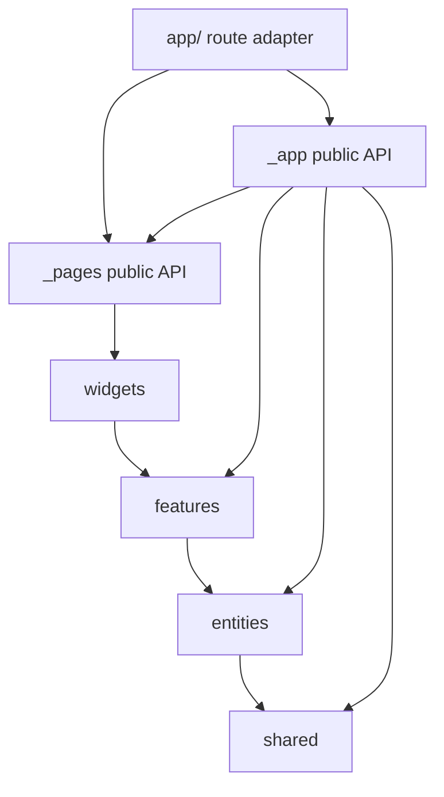
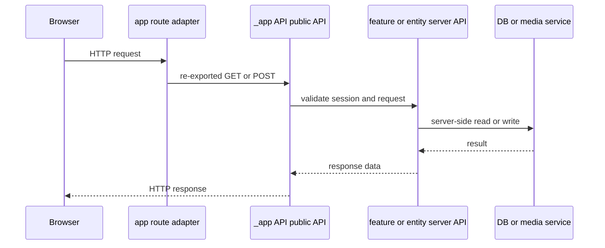

# Feature-Sliced Design 경계

이 저장소의 FSD 경계는 단순한 폴더 규칙이 아니라 import graph와 Next.js 진입점에 적용되는 변경 안전장치다. 애플리케이션 코드는 다음 방향으로만 의존한다.

```text
_app → _pages → widgets → features → entities → shared
```

상위 레이어가 하위 레이어를 조립할 수는 있지만, 하위 레이어가 상위 레이어를 참조하거나 서로 다른 slice의 구현 segment를 직접 참조해서는 안 된다. 따라서 cross-layer 변경은 새 구현을 임의의 상위 폴더에 두고 우회하는 방식이 아니라, 해당 slice의 public API를 갱신하고 허용된 방향으로 소비하는 방식으로 진행해야 한다.



이 그림은 production import의 허용된 FSD 의존 방향과 root `app/` adapter의 진입점을 보여준다.

## 레이어와 public API

- `src/_app/`은 layout, provider, metadata, API route와 background-job orchestration을 소유한다. `_app`은 물리적으로 접두사가 붙은 App layer이므로 Steiger의 두 filesystem 규칙은 이 폴더에서 명시적으로 꺼져 있다.
- `src/_pages/`는 route 단위 화면 조립, `src/widgets/`는 여러 use case를 묶는 화면 단위, `src/features/`는 사용자 use case, `src/entities/`는 도메인 모델, `src/shared/`는 공통 기반이다. 이는 `steiger.config.ts`가 recommended FSD 설정을 적용하고 `_app`·`_pages` 접두사 예외만 정규화하는 방식과 일치한다.
- slice 밖에서 `api/`, `model/`, `ui/`, `lib`, `config` 같은 내부 segment를 직접 import하지 않는다. 예를 들어 `src/entities/recommendation/index.ts`는 client가 쓸 `./api/client`, `index.model`, UI만 공개하고, `index.model.ts`는 runtime-neutral contract·presentation·ranking 등을 별도 공개한다.
- public API는 용도별로 나뉜다. 이름 없는 `index.ts`는 browser-safe 진입점, `index.model.ts`는 client/server 양쪽에서 사용할 수 있는 runtime-neutral 계약·모델, `index.server.ts`는 server capability를 공개하는 진입점이다. `src/features/create-mixing/index.server.ts`처럼 server entry는 먼저 `server-only`를 import하고 queue와 model만 export한다.
- 한 slice 내부에서는 내부 segment 접근이 허용되지만, 다른 slice나 layer에서는 root `@/features/...`, `@/entities/...` 등 public API를 사용해야 한다. 같은 slice 내부 예외는 test가 importer와 target의 layer·slice가 동일한지로 판정한다.

## Browser-safe, model, server 경계

### Browser-safe API

`index.ts`는 client component, page UI, widget에서 사용할 수 있는 표면이다. `src/shared/api/index.ts`가 `requestJson`, `ApiError`, request schema처럼 브라우저 요청과 계약에 필요한 항목만 export하는 것이 대표적이다. entity와 feature의 일반 index도 client API, model, UI를 조합해 공개한다.

Browser-safe 진입점의 runtime import graph는 server module에 도달하면 안 된다. architecture test는 파일 첫 부분의 `"use client"` directive를 root로 삼아 runtime import를 따라가며, 직접 import뿐 아니라 re-export를 통한 전이 경로도 검사한다. 다만 `import type`은 runtime graph에서 제외되므로 타입 공유는 타입 전용 import로 유지해야 한다.

### Model API

`index.model.ts`는 실행 환경과 무관한 계약, schema, 상태·표현 mapping, 순수 domain helper를 위한 표면이다. Route handler도 `src/entities/recommendation/index.model`에서 `RecommendationError`를 가져오고, feature는 `src/entities/recommendation/index.model`의 모델을 사용한다. 모델 표면에 DB client, request header, secret, 외부 server SDK를 넣으면 browser-safe 경계를 오염시키므로 분리해야 한다.

### Server-only API와 secret-bearing 모듈

`index.server.ts` 및 `.server.ts` 파일은 명시적으로 서버 전용이다. 특히 다음은 브라우저 bundle에 절대 도달하면 안 된다.

- `src/shared/db/index.server.ts`와 `src/shared/db/prisma.ts`: `server-only`로 보호된 Prisma Client와 DB 타입·접속 표면.
- `src/shared/config/server-env.ts`: `process.env`에서 ticket 비용, worker 설정, Modal URL/API key를 읽는 server configuration.
- `src/shared/media/`의 server entry와 service: 권한이 필요한 media storage·audio proxy 접근.
- 인증·세션 및 관리자 정책의 `src/features/authentication/index.server.ts`, `api/session.ts`, `model/admin-policy.ts` 같은 server module.

server entry의 소비자는 `_app/api-routes`, server page, feature의 server API, background worker처럼 서버에서 실행되는 코드여야 한다. 예를 들어 mixing route는 `@/_app/api-routes/mixing-jobs/index.server`를 통해 entity server API를 사용한다. `server-only` 표식은 문서상의 힌트가 아니라 Next.js가 잘못된 client import를 막는 보호 장치이며, architecture test도 `.server.*`, `server-only`, `next/headers`, `next/server`, DB 경로를 server reachability로 간주한다. secret-bearing 모듈을 browser-safe index로 재-export하거나 client에서 우회 import하지 않는다.

## Root `app/`는 얇은 route adapter

Next.js의 실제 route 파일은 `app/`에 있지만 구현 소유자는 `_app`·`_pages` public API다. page adapter는 export만 전달하고, API adapter는 필요한 static Next.js route config만 선언한 뒤 handler를 re-export한다.

```tsx
// app/(product)/profile/page.tsx
export { metadata, ProfilePage as default } from "@/_pages/profile/index.server";
```

```ts
// app/api/mixing-jobs/route.ts
export const runtime = "nodejs";
export { mixingJobsGet as GET, mixingJobsPost as POST } from "@/_app/api-routes/mixing-jobs/index.server";
```

root adapter에는 business logic, 함수·클래스 구현, 일반 변수 선언을 추가하지 않는다. architecture test는 `app/**`의 내부 import가 `_app` 또는 `_pages`의 `index`, `index.server` 등 public API인지 확인하고, 허용된 변수도 `runtime`, `preferredRegion`, `dynamic`, `dynamicParams`, `revalidate`, `fetchCache`, `maxDuration` 중 하나인 static 값으로 제한한다. 따라서 route 설정이 동적으로 계산되거나 handler 구현이 route 파일에 들어가면 adapter 경계 위반이다.



이 sequence는 route 파일이 제어 흐름을 소유하지 않고 `_app` handler에서 server-side use case와 저장소로 위임하는 경계를 나타낸다.

## 자동 검사와 실패 해석

검사 명령은 다음 두 단계다.

```bash
pnpm run check:architecture
```

`package.json`의 명령은 먼저 `steiger ./src`를 실행하고 이어서 `pnpm run test:architecture-boundaries`를 실행한다. Steiger recommended 설정은 FSD 의존 방향과 public API 규칙을 검사하며, 설정에는 generated Prisma만 ignore하고, skeleton story·특정 queue·App/worker consumer 목록에 한정한 rule 완화가 있다. 이 좁은 예외를 새로운 cross-layer 우회 수단으로 확대해서는 안 된다.

`tests/fsd-architecture-boundaries.test.ts`는 세 가지를 독립적으로 검증한다.

1. **Public API 검사**: `_pages`, widgets, features, entities slice 사이의 `api`·`model`·`ui`·`lib`·`config` 내부 segment cross-slice import를 찾아 public API 사용을 요구한다.
2. **Client/server reachability 검사**: `"use client"` 파일에서 runtime import를 재귀적으로 추적해 server entry, `server-only`, DB·request server capability 도달을 실패시킨다. type-only import는 제외한다.
3. **Root adapter 검사**: `app/` 파일의 구현문과 `_app`·`_pages` 이외의 target import를 거부하고, Next.js route config의 static 값만 허용한다.

전체 프로젝트에 대해서도 이 세 함수의 위반 목록이 모두 빈 배열이어야 한다. 실패 시에는 import를 더 깊은 내부 경로로 바꾸어 통과시키지 말고, (1) 대상 slice의 root public API에 필요한 export를 추가하고, (2) client에서는 browser-safe 또는 model API만 사용하고, (3) server capability는 `.server` 진입점 뒤에 두고, (4) root `app/`에는 adapter와 static config만 남기는 순서로 수정한다. 수정 후 `pnpm run check:architecture`와 변경된 feature의 집중 테스트를 다시 실행한다.

## 안전한 확장 규칙

새 entity/feature 기능은 먼저 외부 소비자가 필요한 browser-safe·model·server 표면을 구분해 각 `index*.ts`에 명시적으로 export한다. UI가 server data를 필요로 하더라도 client component에 server fetcher를 넘기지 말고, page/API handler 같은 server consumer에서 호출한 뒤 직렬화된 결과나 기존 client API 계약으로 전달한다. 새 Next.js route는 `app/`에 얇은 adapter만 만들고 구현은 `src/_app/api-routes` 또는 `src/_pages`에 둔다.

새 예외가 필요해 보이면 `steiger.config.ts`의 기존 좁은 예외가 정말 해당 경로의 역할을 설명하는지 먼저 확인한다. 특히 server-only·DB·secret 모듈을 client로 끌어오는 변경이나 enforced dependency direction을 bypass하는 import는 허용되는 확장점이 아니다.
