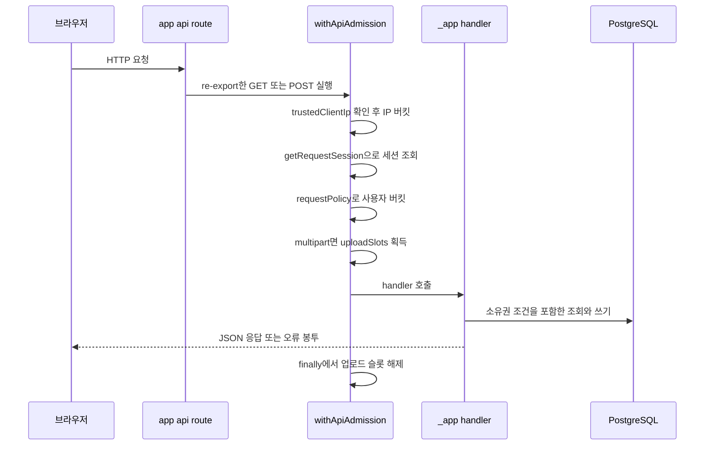

브라우저가 보내는 요청은 [app/api/mixing-jobs/route.ts](repo://app/api/mixing-jobs/route.ts#L1-L3) 같은 Route Handler가 받아서 `src/_app/api-routes/**`의 handler로 넘기고, 그 사이에서 세션 확인과 요청 제한이 먼저 적용돼요. 이 페이지는 "어떤 경로가 어떤 handler로 연결되고, 어떤 규칙을 먼저 통과하는가"를 확인할 때 쓰는 조회용 문서예요. 요청 제한 수치, 업로드 본문 한도, 오류 봉투, 그리고 새 API를 추가할 때 지켜야 할 adapter 규약을 다뤄요. 세션과 관리자 권한의 검증 위치는 [인증과 소유권 경계](../integrations/auth-and-ownership.md)가 소유하고, 큐 용량·lease 규칙은 [Job 큐와 lease 복구 계약](../operations/job-processing.md)이 소유해요. 두 오류 봉투와 재시도 가능 여부를 브라우저가 어떻게 해석하는지는 [브라우저 상태와 API 오류 계약](client-data-flow.md)에 있어요.

## 요청 처리 경로와 adapter 규약

`app/api/**/route.ts`는 구현을 담지 않는 얇은 adapter예요. 각 파일은 `runtime`을 선언하고 `src/_app/api-routes/**/index.server.ts`의 handler를 HTTP 메서드 이름으로 re-export하는 두 문장 정도로 끝나요.

```ts
export const runtime = "nodejs";

export { mixingJobsGet as GET, mixingJobsPost as POST } from "@/_app/api-routes/mixing-jobs/index.server";
```

현재 트리의 `app/api/**/route.ts`는 35개이고, 그중 31개가 `export const runtime = "nodejs"`를 선언해요. `app/api/admin/custom-mixing/` 아래 route 파일 4개(`route.ts`, `profiles/route.ts`, `[id]/route.ts`, `[id]/audio/route.ts`)에만 이 선언이 없어요. 35개 파일의 모듈 참조는 모두 `@/_app/api-routes/**` re-export 하나뿐이라, Prisma나 `node:*` 같은 server 모듈이 route 계층으로 새지 않아요.

이 구조는 관례이면서 검증 대상이에요. [tests/fsd-architecture-boundaries.test.ts](repo://tests/fsd-architecture-boundaries.test.ts#L278-L310)가 `app/` 아래 파일에 세 가지 규칙을 적용해요.

| 규칙 | 위반으로 잡히는 문장·참조 | 검사 범위 |
| --- | --- | --- |
| public API 밖 import | `@/`나 `.`로 시작하는 참조가 `src/_app`·`src/_pages` public API(`index.*.ts`) 밖을 가리켜요 | [L283-L292](repo://tests/fsd-architecture-boundaries.test.ts#L283-L292) |
| import·export·directive 외의 문장 | `import` 문, `export` 문, directive 문자열 문장이 아닌 statement예요(예: 함수 선언) | [L294-L306](repo://tests/fsd-architecture-boundaries.test.ts#L294-L306), fixture 확인 [L360-L379](repo://tests/fsd-architecture-boundaries.test.ts#L360-L379) |
| 정적 route config가 아닌 변수 선언 | export 표시가 없거나, 이름이 아래 목록의 route config 이름이 아니거나, 값이 정적 리터럴이 아닌 변수 선언이에요 | [L294-L306](repo://tests/fsd-architecture-boundaries.test.ts#L294-L306), [정적 값 판정](repo://tests/fsd-architecture-boundaries.test.ts#L235-L253) |

세 번째 규칙이 route config로 인정하는 이름은 다음 일곱 개예요([L28-L36](repo://tests/fsd-architecture-boundaries.test.ts#L28-L36)).

- `runtime`
- `preferredRegion`
- `dynamic`
- `dynamicParams`
- `revalidate`
- `fetchCache`
- `maxDuration`

새 엔드포인트를 추가할 때 구현은 `src/_app/api-routes/`의 handler에 넣고 route 파일에는 re-export만 남기세요.



브라우저 요청이 adapter와 admission 래퍼를 지나 handler까지 도달하는 순서예요. 세션이 없으면 handler를 호출하지 않고 401을 반환해요.

## API 그룹 표면

`withApiAdmission`으로 감싼 handler는 모두 세션이 필요해요. 세션이 없으면 handler 본문에 도달하기 전에 401 봉투가 나가요. 예외는 Better Auth가 직접 처리하는 `/api/auth/[...all]`과 준비 상태 확인용 `/api/vocal-profiles/health`예요.

| 경로 그룹 | 메서드 | 대표 handler | 세션 |
| --- | --- | --- | --- |
| `/api/auth/[...all]` | GET, POST | [auth-route.ts](repo://src/_app/api-routes/auth/auth-route.ts#L1-L7) | 필요 없음(인증 흐름 자체) |
| `/api/vocal-profile-analysis-jobs`, `/[id]` | GET, POST | [vocal-profile-analysis-jobs-route.ts](repo://src/_app/api-routes/vocal-profiles/vocal-profile-analysis-jobs-route.ts#L71-L133) | 필요 |
| `/api/vocal-profiles`, `/[id]` | GET, POST, PATCH, DELETE | [vocal-profiles-route.ts](repo://src/_app/api-routes/vocal-profiles/vocal-profiles-route.ts#L17-L100), [vocal-profile-detail-route.ts](repo://src/_app/api-routes/vocal-profiles/vocal-profile-detail-route.ts#L17-L113) | 필요 |
| `/api/vocal-profiles/[id]/audio`, `/[id]/synthesis-reference/audio` | GET | [vocal-profile-audio-route.ts](repo://src/_app/api-routes/vocal-profiles/vocal-profile-audio-route.ts#L6-L31), [synthesis-reference audio](repo://src/_app/api-routes/vocal-profiles/vocal-profile-synthesis-reference-audio-route.ts#L6-L41) | 필요 |
| `/api/vocal-profiles/health` | GET | [vocal-profile-health-route.ts](repo://src/_app/api-routes/vocal-profiles/vocal-profile-health-route.ts#L5-L20) | 필요 없음 |
| `/api/recommendations`, `/[id]` | POST, GET | [recommendations-route.ts](repo://src/_app/api-routes/recommendations/recommendations-route.ts#L29-L54), [recommendation-detail-route.ts](repo://src/_app/api-routes/recommendations/recommendation-detail-route.ts#L22-L36) | 필요 |
| `/api/mixing-jobs`, `/[id]`, `/[id]/audio` | GET, POST, DELETE | [mixing-jobs-route.ts](repo://src/_app/api-routes/mixing-jobs/mixing-jobs-route.ts#L15-L76), [mixing-job-detail-route.ts](repo://src/_app/api-routes/mixing-jobs/mixing-job-detail-route.ts#L6-L50), [mixing-job-audio-route.ts](repo://src/_app/api-routes/mixing-jobs/mixing-job-audio-route.ts#L5-L40) | 필요 |
| `/api/account/tickets`, `/api/account/ticket-balance`, `/api/account/onboarding/completion` | GET, POST | [tickets-route.ts](repo://src/_app/api-routes/account/tickets-route.ts#L5-L17), [ticket-balance-route.ts](repo://src/_app/api-routes/account/ticket-balance-route.ts#L5-L11), [onboarding-completion-route.ts](repo://src/_app/api-routes/account/onboarding-completion-route.ts#L5-L11) | 필요 |
| `/api/notifications`, `/[id]`, `/read-all` | GET, PATCH, POST | [notifications-route.ts](repo://src/_app/api-routes/notifications/notifications-route.ts#L5-L17), [notification-read-route.ts](repo://src/_app/api-routes/notifications/notification-read-route.ts#L6-L19), [notifications-read-all-route.ts](repo://src/_app/api-routes/notifications/notifications-read-all-route.ts#L5-L11) | 필요 |
| `/api/admin/*`(catalog, custom-mixing, mixing-jobs, overview, ticket-adjustments, users) | GET, POST, DELETE | [catalog-route.ts](repo://src/_app/api-routes/admin/catalog/catalog-route.ts#L13-L50), [admin index.server.ts](repo://src/_app/api-routes/admin/index.server.ts#L1-L7) | 필요 + 관리자 이메일 allowlist(거부 시 403) |

세션 외에 소유권 조건이 하나 더 붙어요. 예를 들어 믹싱 작업 상세는 `findFirst({ where: { id, userId } })` 형태로 조회하고, 남의 자원이면 존재 여부를 구분하지 않고 404를 반환해요([mixing-job-detail-route.ts](repo://src/_app/api-routes/mixing-jobs/mixing-job-detail-route.ts#L6-L14)). 관리자 경계도 같은 handler 안에서 `requireAdminApi`로 검사하고, 응답이 있으면 그대로 반환해요([catalog-route.ts](repo://src/_app/api-routes/admin/catalog/catalog-route.ts#L13-L23)). 권한 정책 자체는 [인증과 소유권 경계](../integrations/auth-and-ownership.md)를 보세요.

오디오 파일 경로(`/[id]/audio`, `/[id]/synthesis-reference/audio`)는 외부 저장소 URL을 노출하지 않고 server에서 bytes를 중계해요. `Range` 요청 전달과 캐시 헤더 처리는 [미디어 저장과 정리 의도](../operations/media-storage.md)가 설명해요. `/api/admin/catalog/export`는 JSON 본문 대신 `Content-Disposition: attachment`가 붙은 파일 다운로드로 응답해요([export-route.ts](repo://src/_app/api-routes/admin/catalog/export-route.ts#L6-L22)).

## admission(요청 제한) 규칙

`withApiAdmission`은 handler를 호출하기 전에 정해진 순서로 버킷을 확인해요([src/_app/api-routes/admission.ts](repo://src/_app/api-routes/admission.ts#L11-L33)). 먼저 신뢰할 수 있는 클라이언트 IP 버킷을, 다음으로 세션을 확인하고, 세션이 있으면 경로와 메서드로 정한 그룹 버킷을 통과시켜요. `Content-Type`이 `multipart/form-data`로 시작하면 업로드 슬롯까지 잡고, 응답 후 `finally`에서 슬롯을 해제해요. 제한 초과는 `AdmissionError`로 모아서 `admissionResponse`가 응답으로 바꿔요.

| 그룹 | 매칭 조건 | rate(분당 토큰) | burst |
| --- | --- | --- | --- |
| `audio` | 경로가 `/audio`, `/reference`, `/synthesis-reference`로 끝남 | 240 | 60 |
| `submission` | POST이면서 경로에 `mixing-jobs`, `vocal-profiles`, `vocal-profile-analysis-jobs` 포함 | 6 | 3 |
| `admin-write` | `/api/admin/`로 시작하고 메서드가 GET·HEAD가 아님 | 10 | 3 |
| `recommendation` | `/api/recommendations`로 시작 | 30 | 10 |
| `read` | 위 조건에 해당하지 않는 나머지 | 180 | 60 |

그룹 판정은 위에서 아래 순서로 먼저 맞는 조건을 채택해요([src/shared/lib/admission/limiter.ts](repo://src/shared/lib/admission/limiter.ts#L60-L68)). 그래서 `/api/admin/...` 경로라도 `/audio`로 끝나면 `audio` 그룹이 되고, 관리자 조회(`GET`)는 `read` 그룹으로 계산돼요.

| 버킷 | 키 | rate / burst | 적용 조건 |
| --- | --- | --- | --- |
| IP 버킷 | `ip:${ip}` | 600 / 120 | `trustedClientIp`가 값을 반환할 때만 |
| 사용자 그룹 버킷 | `user:${userId}:${group}` | 그룹 표 값 | 세션이 확인된 뒤 |
| 인증 버킷 | `auth:${ip ?? "untrusted-ingress"}` | 120 / 30 | `withAuthAdmission` 경로(`/api/auth/[...all]`, `/api/vocal-profiles/health`) |
| 업로드 슬롯 | 사용자 단위 1개, 전체 `UPLOAD_CONCURRENCY`(기본 2, 허용 1~20) | - | `multipart/form-data` 요청 |

`trustedClientIp`는 `TRUST_PROXY_CLIENT_IP`가 정확히 `"true"`일 때만 동작해요. 그때 `TRUSTED_CLIENT_IP_HEADER`가 지정한 헤더 값을 읽고, 값이 없거나 `isIP` 검증을 통과하지 못하면 `null`을 반환해요. 변수를 켜 두고 헤더 이름을 비워 두면 오류를 던져요([limiter.ts](repo://src/shared/lib/admission/limiter.ts#L49-L55)). 프록시를 신뢰하지 않는 기본 구성에서는 IP 버킷이 항상 건너뛰어지고, `withAuthAdmission` 경로는 모든 요청이 `auth:untrusted-ingress` 버킷 하나를 공유해요.

`TokenBuckets`는 항목 수 상한 10,000개를 두고, 새 키를 추가할 때 10분 넘게 갱신되지 않은 항목을 먼저 정리해요. 정리 후에도 가득 차 있으면 `LIMITER_CAPACITY` 503을 던져요. 토큰이 1개 미만이면 `RATE_LIMITED` 429를 던지고, 재시도 대기 시간을 `max(1, ceil((1 - 토큰 수) * 60 / rate))`초로 계산해요([limiter.ts](repo://src/shared/lib/admission/limiter.ts#L14-L33)). 업로드 슬롯은 같은 사용자의 동시 업로드를 `UPLOAD_ALREADY_ACTIVE` 429로 막고, 전체 슬롯이 차면 `UPLOAD_CAPACITY` 503을 던져요([limiter.ts](repo://src/shared/lib/admission/limiter.ts#L36-L47)). 환경 변수 이름과 기본값은 [환경 변수와 런타임 한도](../operations/configuration.md)에 모여 있어요.

큐 용량은 이 래퍼가 아니라 작업을 접수하는 트랜잭션 안에서 검사해요. 접수 함수는 advisory transaction lock으로 직렬화한 뒤 전역·사용자 큐 한도를 확인하고, 초과하면 같은 `AdmissionError`를 던져요([src/shared/lib/admission/queue.ts](repo://src/shared/lib/admission/queue.ts#L7-L23)). 그래서 동시 POST 두 건이 같은 작업을 중복 생성하지 않아요. 상태 집합과 재시도 규칙은 [Job 큐와 lease 복구 계약](../operations/job-processing.md)을 보세요.

## 업로드와 본문 크기 한도

multipart 요청은 `multipartBodyLimit(fileLimitBytes)` = 파일 상한 + 1MiB로 계산해요. 1MiB는 multipart 경계·헤더 오버헤드 몫이에요([src/shared/api/multipart.server.ts](repo://src/shared/api/multipart.server.ts#L11-L25)). 상한은 선언된 `Content-Length`로 한 번, 스트림을 읽으면서 누적 바이트로 다시 한 번 확인하고, 초과하면 `MultipartBodyTooLargeError`를 던져요. 읽기 전체에는 `runtimeLimits().uploadMs`(기본 180,000ms) 타임아웃이 걸리고, 클라이언트가 연결을 끊으면 `request.signal`로 읽기를 취소해요([multipart.server.ts](repo://src/shared/api/multipart.server.ts#L27-L74)).

| 대상 | 파일 상한 | 실제 본문 상한 | 근거 |
| --- | --- | --- | --- |
| 보컬 프로필 분석 오디오 | 25MiB | 25MiB + 1MiB | [contract.ts](repo://src/features/analyze-vocal-profile/model/contract.ts#L4-L14) |
| 관리자 곡 target 음원 | 49,000,000 bytes | 49,000,000 + 1MiB | [target-assets.ts](repo://src/features/manage-song-catalog/api/target-assets.ts#L10-L28), [catalog/http.ts](repo://src/_app/api-routes/admin/catalog/http.ts#L13-L22) |
| 카탈로그 스냅샷 import | 20MiB | 20MiB + 1MiB | [import-route.ts](repo://src/_app/api-routes/admin/catalog/import-route.ts#L12-L39) |
| admin custom mixing target | 256MiB | 256MiB + 1MiB | [contract.ts](repo://src/features/admin-custom-mixing/model/contract.ts#L3-L7), [custom-mixing-route.ts](repo://src/_app/api-routes/admin/custom-mixing/custom-mixing-route.ts#L29-L37) |
| JSON 본문 | 해당 없음 | 1MiB | [multipart.server.ts](repo://src/shared/api/multipart.server.ts#L76-L79) |

JSON 본문은 `readBoundedJson`이 같은 리더를 1MiB 상한과 `runtimeLimits().metadataMs`(기본 15,000ms) 타임아웃으로 호출한 뒤 `JSON.parse`해요([multipart.server.ts](repo://src/shared/api/multipart.server.ts#L76-L79)). 라우트가 `readBoundedJson(request).catch(() => null)` 형태로 감싸는 이유는 파싱 실패를 400 봉투로 바꾸기 위해서예요.

Route Handler와 별개로 Server Action에는 Next.js 설정 상한이 하나 더 있어요. [next.config.ts](repo://next.config.ts#L3-L10)가 `experimental.serverActions.bodySizeLimit`을 `"300mb"`로 올리고, 주석에 "Keep large audio Server Actions aligned with the multipart Route Handlers"라고 적어 두었어요. 큰 오디오는 Route Handler 경로를 쓰고, 이 설정은 그 경로와 어긋나지 않게 맞춘 값이에요.

## 오류 봉투와 Retry-After

응답 오류는 두 가지 봉투 형태로 나뉘어요. 어느 그룹이 어느 형태를 쓰는지가 서버 쪽 계약이고, 두 형태를 브라우저가 같은 값으로 흡수하는 규칙은 [브라우저 상태와 API 오류 계약](client-data-flow.md)에 있어요.

| 봉투 | 형태 | 쓰는 곳 |
| --- | --- | --- |
| `error` 객체 | `{ error: { code, message, retryable? } }` (+ `details`, `issues`, `kind` 같은 추가 필드) | 세션 401, 믹싱·알림·추천·관리자 catalog·티켓 조정 handler |
| `reasonCode` 평면형 | `{ reasonCode, detail, retryable }` | 분석 접수 계열 handler(`/api/vocal-profile-analysis-jobs`, `/api/vocal-profiles`, 분석 작업 상세, 프로필 PATCH·DELETE) |

```json
{ "error": { "code": "MIXING_NOT_FOUND", "message": "믹싱 작업을 찾을 수 없어요.", "retryable": false } }
```

```json
{ "reasonCode": "UNSUPPORTED_AUDIO", "detail": "Use a WAV, MP3, M4A, or WebM audio file.", "retryable": false }
```

세션 없음은 `error` 형태로 `UNAUTHENTICATED` 401을 반환하고, 관리자 권한 부족은 `FORBIDDEN` 403을 반환해요([session.ts](repo://src/features/authentication/api/session.ts#L36-L44), [admin.ts](repo://src/features/authentication/api/admin.ts#L17-L26)).

분석 접수 계열은 실패 원인마다 상태 코드를 나눠요. `INVALID_UPLOAD` 400, `PAYLOAD_TOO_LARGE` 413, `UNSUPPORTED_AUDIO` 415, 티켓 부족 402, 그리고 진행 중인 분석이 있으면 `ANALYSIS_BUSY` 429에 `Retry-After: 10`을 붙여요([vocal-profile-analysis-jobs-route.ts](repo://src/_app/api-routes/vocal-profiles/vocal-profile-analysis-jobs-route.ts#L24-L69)). `admin/custom-mixing` 계열은 `reasonCode` 없이 `detail`만 있는 더 얇은 형태를 반환해요([custom-mixing-route.ts](repo://src/_app/api-routes/admin/custom-mixing/custom-mixing-route.ts#L14-L20)).

제한 초과 응답은 두 형태를 한 payload에 함께 담아요. `admissionResponse`는 `error` 객체와 최상위 `reasonCode`, `retryable`을 모두 넣고 `Retry-After`와 `Cache-Control: no-store` 헤더를 붙여요([limiter.ts](repo://src/shared/lib/admission/limiter.ts#L70-L79)). 그래서 429·503 응답에는 `code`와 재시도 표시가 두 형태로 함께 들어 있어요.

## 새 API를 추가할 때의 확인 지점

1. 구현은 `src/_app/api-routes/<그룹>/`에 두고 `index.server.ts`에 handler를 export하세요. route 파일에는 `runtime` 선언과 re-export만 남기세요.
2. handler를 `withApiAdmission`으로 감싸세요. 그러면 세션 401, 그룹 버킷, 업로드 슬롯이 자동으로 붙어요.
3. 세션 이후에는 소유권 조건을 쿼리에 넣고, 남의 자원에는 404를 반환하세요.
4. 오류 봉투는 같은 그룹의 기존 형태를 따르세요. 새 형태를 만들면 브라우저가 `code`와 재시도 가능 여부를 읽지 못할 수 있어요([브라우저 상태와 API 오류 계약](client-data-flow.md)).
5. 분석 작업처럼 오래 걸리는 접수는 큐 한도까지 확인해야 해요. 그 규칙은 [Job 큐와 lease 복구 계약](../operations/job-processing.md)에 있어요.

## 관련 확인 명령과 문서

| 확인 대상 | 명령 또는 문서 |
| --- | --- |
| 제한 버킷·업로드 슬롯·접수 직렬화 | `pnpm run test:readiness`([tests/admission.test.ts](repo://tests/admission.test.ts#L12-L44), [tests/admission.integration.ts](repo://tests/admission.integration.ts#L41-L88)) |
| multipart 상한과 `Content-Length` 거부 | `pnpm run test:query`([tests/bounded-multipart.test.ts](repo://tests/bounded-multipart.test.ts#L9-L46)) |
| 라우트 응답 계약 스키마 | `pnpm run test:query`([tests/api-contracts.test.ts](repo://tests/api-contracts.test.ts#L77-L212)) |
| route adapter 경계 | `pnpm run test:architecture-boundaries`([tests/fsd-architecture-boundaries.test.ts](repo://tests/fsd-architecture-boundaries.test.ts#L360-L386)) |
| 서버 기동과 워커 실행 | [로컬 실행과 배포](../operations/local-runtime.md) |
| 도메인 절차(믹싱, 보컬 분석) | [AI 믹싱 흐름](../workflows/ai-mixing.md), [보컬 프로필 분석 흐름](../workflows/vocal-profile-analysis.md) |
| 전체 경계와 계층 | [시스템 지도와 경계](system-map.md) |
