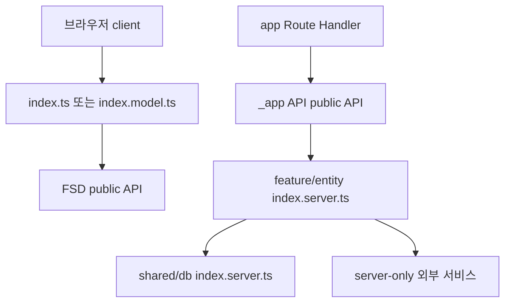

# 모듈 경계와 서버 역량

이 페이지의 핵심 규칙은 간단하다. `app/`은 Next.js 규약을 FSD public API에 연결하는 얇은 adapter로만 두고, 실제 조립·라우팅·use case 구현은 `src/`에 둔다. `src` 안에서는 다음 방향으로만 의존한다.

```text
_app → _pages → widgets → features → entities → shared
```

따라서 새 코드를 어디에 넣을지 결정할 때는 파일의 편의보다 **누가 이 기능을 소유하는지**, **어떤 계층을 호출하는지**, **브라우저 번들에 들어가도 되는지**를 먼저 확인한다. 전체 시스템의 런타임 흐름은 [시스템 지도](/openwiki/architecture/system-map.md), 인증·소유권 제약은 [접근 제어](/openwiki/concepts/access-control.md), 검증 명령과 테스트 분류는 [테스트 전략](/openwiki/testing/test-strategy.md)에서 이어서 확인한다.

## 두 겹의 경계

### `app/`은 route adapter다

`app/`의 page와 Route Handler는 Next.js가 요구하는 파일 이름과 export를 제공한다. 구현을 직접 담지 않고 `_app` 또는 `_pages`의 root public API만 re-export한다. 예를 들어 `app/(product)/profile/page.tsx`는 `@/_pages/profile/index.server`에서 `metadata`와 `ProfilePage`를 가져오며, `app/api/vocal-profile-analysis-jobs/route.ts`는 `runtime`을 선언하고 `@/_app/api-routes/vocal-profiles/index.server`의 handler를 `GET`·`POST`로 연결한다.

Route 파일에 비즈니스 함수나 다른 계층의 내부 segment import를 추가하면 adapter 경계가 깨진다. root App 파일에 허용되는 변수는 `runtime`, `preferredRegion`, `dynamic`, `dynamicParams`, `revalidate`, `fetchCache`, `maxDuration` 같은 문서화된 Next.js route config이며 값도 정적이어야 한다. 이 제한은 route 설정을 제외한 구현을 FSD public API 뒤로 밀어 변경 위치를 예측 가능하게 만든다.

### `_app`과 `_pages`는 조립 계층이다

`src/_app`은 layout, provider, metadata, API route, background job처럼 애플리케이션 전체를 조립한다. `src/_pages`는 route별 화면을 구성한다. 예를 들어 `_pages/profile/index.server.ts`는 서버 전용 page public API로 `ProfilePage`와 `metadata`를 내보내고, 같은 slice의 `index.ts`는 `ProfileLoading`만 내보낸다. 즉 page slice도 browser-safe 표면과 server 표면을 분리할 수 있다.

API route 구현은 `_app/api-routes`에 두고, 여기서 인증·입력 검증·use case 호출·응답 변환을 조합한다. vocal profile 분석 POST는 `requireApiSession`으로 세션을 확인하고 multipart 입력과 `Idempotency-Key`를 검증한 뒤 `enqueueVocalProfileAnalysis`를 호출해 `202`와 job payload를 반환한다. 이 경로의 정책과 영속화는 route 파일에 복제하지 말고 해당 feature의 server API를 변경한다.

## FSD slice의 public API

다른 slice나 `_app`에서 `api/`, `model/`, `ui/`, `lib/`, `config/` 내부 파일을 직접 import하지 않는다. slice 밖에서는 `@/features/<slice>`, `@/entities/<slice>` 같은 root public API를 사용한다. boundary test는 같은 slice 내부의 segment 접근은 허용하지만, 다른 slice에서 내부 segment를 참조하면 `use @/... public API` 오류로 잡는다.

public API는 용도별로 나뉜다.

| entrypoint | 공개할 수 있는 것 | 사용 위치와 주의점 |
| --- | --- | --- |
| `index.ts` | browser-safe API, UI, client 호출, 모델 계약 | 브라우저와 서버 모두에서 사용할 수 있어야 한다. `features/analyze-vocal-profile/index.ts`는 client API와 model contract를 함께 노출한다. |
| `index.model.ts` | runtime-neutral schema·type·순수 모델 로직 | 서버 역량이 없는 계약을 공유할 때 사용한다. route도 입력 schema를 `index.model`에서 가져올 수 있다. |
| `index.server.ts` | DB, secret, session, server-only API, 서버 조립 | 서버 코드와 worker만 import한다. entrypoint 첫 줄의 `import "server-only"`가 실수로 브라우저 그래프에 들어오는 것을 막는다. |
| 이름에 `.server`가 붙은 entrypoint | 위 server 표면의 세분화된 진입점 | 예: `src/entities/vocal-profile/index.analyzer.server.ts`는 analyzer API만, `index.server.ts`는 persistence·history·profile service까지 공개한다. 필요한 최소 표면을 선택한다. |

예를 들어 `src/entities/vocal-profile/index.ts`는 client API, `index.model`, 결과 UI를 re-export하지만 DB API는 노출하지 않는다. 반대로 `src/entities/vocal-profile/index.server.ts`는 `server-only`를 선언하고 analyzer·history·persistence·profile-service API를 내보낸다. `src/shared/db/index.server.ts`도 같은 방식으로 `prisma`, `PrismaClient`, schema enum과 타입을 서버에만 공개한다.



이 다이어그램은 브라우저 표면과 server-only 표면이 public API에서 갈라지는 현재 import 경계를 보여준다.

## browser-safe와 server-only를 판단하는 법

`"use client"` 파일에서 runtime import 그래프를 따라가 `server-only`, `next/headers`, `next/server`, `@/shared/db` 또는 `.server` entrypoint에 도달하면 안 된다. boundary test는 직접 import뿐 아니라 public API를 거치는 전이 import도 검사한다. type-only import는 runtime 그래프에서 제외하므로 서버 타입을 공유할 때는 반드시 `import type`을 사용한다.

`index.model.ts`는 이 경계의 안전한 공유 지점이다. 예컨대 분석 route는 `analysisAudioFileSchema`와 `MAX_PROFILE_ANALYSIS_AUDIO_BYTES`를 `@/features/analyze-vocal-profile/index.model`에서 가져오고, 실제 queue 접근은 `index.server`에서 가져온다. client feature는 `requestJson`으로 `/api/...`를 호출하며 DB나 credential이 필요한 외부 API를 직접 호출하지 않는다.

다음 변경은 안전하지 않다.

- client component에서 `@/shared/db/index.server`, `@/features/*/index.server`, 또는 server-only를 transitively re-export하는 `index.ts`를 runtime import하는 것
- 다른 slice에서 `@/features/x/model/...` 또는 `@/entities/x/api/...`를 직접 import하는 것
- `app/` route에 인증·DB·비즈니스 로직을 새로 구현하는 것
- server 전용 코드를 browser-safe `index.ts`에 re-export해 public surface를 오염시키는 것

이 경우에는 먼저 필요한 계약을 `index.model.ts`로 옮기고, 브라우저 동작은 API endpoint를 통해 server feature를 호출하며, 서버 조립은 `index.server.ts`를 통해 유지한다.

## 변경 전후 검증

경계 변경은 lint 설정만 믿지 말고 전용 fixture와 실제 source tree 검사를 함께 통과시킨다.

```bash
pnpm test:architecture-boundaries
```

이 테스트는 세 가지를 확인한다.

1. cross-slice 내부 segment import를 거부하고 root public API 사용을 허용한다.
2. client의 직접·전이 server import를 거부하고 type-only import는 허용한다.
3. `app/`의 얇은 adapter는 허용하되 `_app`·`_pages` public API가 아닌 import와 구현 statement를 거부한다.

Steiger 설정(`steiger.config.ts`)은 `@feature-sliced/steiger-plugin` recommended config를 기본으로 사용한다. 생성된 Prisma Client 경로 `src/shared/db/generated/prisma/**`는 검사에서 제외한다. `_app`과 `_pages`의 접두사 계층명에 대한 두 규칙은 물리 폴더명과 Steiger 인식 차이 때문에 해당 범위에서만 완화한다. 특정 feature·entity가 App endpoint나 worker에서 소비되어 `fsd/insignificant-slice`를 오탐하는 목록도 좁은 범위로만 끈다. 예외를 추가할 때는 규칙을 전역으로 끄지 말고, 왜 public consumer가 필요한지 주석과 boundary test로 함께 남긴다.

변경 후에는 `src/`와 `app/`의 import 경로를 public API 기준으로 다시 확인한다. server-only 위반은 빌드 시점까지 기다리지 말고 fixture를 추가해 전이 그래프를 고정하는 것이 안전하다. 경계를 넘나드는 새 기능이라면 먼저 model contract, 그다음 server use case, 마지막으로 `_app` adapter와 client 호출 순서로 나누어 구현한다.
