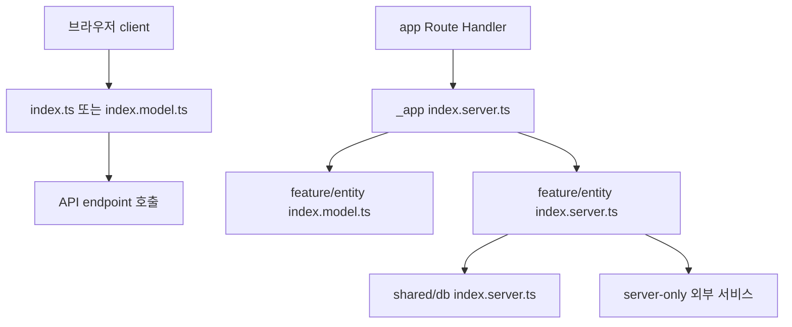
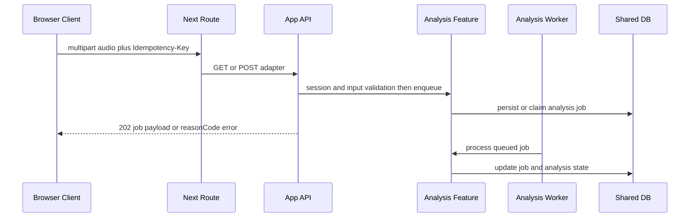

# Feature-Sliced 모듈과 공개 API 경계

새 코드를 배치할 때는 파일의 위치보다 **소유자**, **호출 방향**, **브라우저 번들 포함 여부**를 먼저 결정한다. 현재 구조의 기본 의존 방향은 다음과 같다.

```text
_app → _pages → widgets → features → entities → shared
```

`app/`은 Next.js 파일 규약을 구현하는 얇은 adapter다. 실제 화면 조립, API use case, 영속화, worker 실행은 `src/`의 공개 API 뒤에 둔다. 전체 요청 흐름은 [시스템 지도](/openwiki/architecture/system-map.md), 인증·소유권은 [접근 제어](/openwiki/concepts/access-control.md), 검증 명령의 분류는 [테스트 전략](/openwiki/testing/test-strategy.md)에서 이어서 확인한다.

## 계층별 소유권과 허용 의존

| 계층 | 소유하는 책임 | 허용하는 하위 의존 | 외부에 공개하는 표면 |
| --- | --- | --- | --- |
| `app/` | Next.js `page.tsx`, `route.ts`의 파일명·export·정적 route config | `src/_app` 또는 `src/_pages`의 root public API만 | Next.js entrypoint 자체 |
| `src/_app` (App) | 전역 layout, provider, metadata, API Route 조립, background job 진입점 | 모든 하위 계층의 public API | `index.ts`, `index.server.ts` |
| `src/_pages` (Pages) | route 단위 화면 조립과 loading UI | `widgets`, `features`, `entities`, `shared` | 페이지별 `index.ts`, 필요하면 `index.server.ts` |
| `src/widgets` (Widgets) | 여러 기능을 묶은 독립적인 화면 블록과 product shell | `features`, `entities`, `shared` | slice root `index.ts` 또는 서버 전용 `index.server.ts` |
| `src/features` (Features) | 사용자가 수행하는 업무 동작과 그 server use case | `entities`, `shared` | slice root `index.ts`, `index.model.ts`, `index.server.ts` |
| `src/entities` (Entities) | 도메인 데이터, 조회·영속화·표현 계약 | `shared` | slice root `index.ts`, `index.model.ts`, 세분화된 server entrypoint |
| `src/shared` (Shared) | 도메인에 종속되지 않은 API client, DB, 설정, UI, media, 순수 유틸리티 | 다른 상위 계층에 의존하지 않음 | 기능별 root API; 서버 자원은 `.server` 표면 |

이 표의 방향은 단순한 디렉터리 관례가 아니다. 다른 slice가 `api/`, `model/`, `ui/`, `lib/`, `config/` 같은 내부 segment를 직접 참조하면 안 된다. 같은 slice 내부에서는 segment 접근이 허용되지만, slice 밖에서는 `@/features/<slice>` 또는 `@/entities/<slice>` 같은 root API를 사용한다. 이 규칙을 어기면 Steiger 또는 전용 boundary test가 `use @/... public API` 오류를 보고한다.

## 공개 API를 browser-safe와 server-only로 나누기

공개 API 파일의 이름은 import graph의 계약이다.

| 진입점 | 공개할 내용 | 사용 규칙 |
| --- | --- | --- |
| `index.ts` | 브라우저에서 실행 가능한 UI, client API, 공개 모델 계약 | client와 server 양쪽에서 import할 수 있어야 한다. DB·secret·`server-only`를 re-export하지 않는다. |
| `index.model.ts` | runtime-neutral schema, type, 순수 모델 로직 | Route와 client가 함께 써야 하는 입력 계약을 둔다. 서버 자원은 참조하지 않는다. |
| `index.server.ts` | DB, secret, session, server-only API, 서버 조립 | server code와 worker만 import한다. 첫 줄의 `import "server-only"`로 잘못된 client 사용을 차단한다. |
| `index.<역할>.server.ts` | 특정 서버 역할의 최소 표면 | 예를 들어 `src/entities/vocal-profile/index.analyzer.server.ts`처럼 analyzer만 필요한 소비자에게 전체 persistence API를 열지 않는다. |

예를 들어 `src/features/analyze-vocal-profile/index.ts`는 `./api/client`와 `./model/contract`만 공개한다. `index.model.ts`는 계약만 re-export하고, `index.server.ts`는 `server-only`를 선언한 뒤 `./api/analysis-queue`만 공개한다. `src/entities/vocal-profile/index.ts`는 client API·model·결과 UI를 공개하지만 DB API는 노출하지 않는다. 서버 표면은 analyzer, history, persistence, profile-service를 별도의 `index.server.ts`에서 공개한다. `src/shared/api/index.ts`의 `requestJson` 같은 브라우저 표면과 `src/shared/api/index.server.ts`의 multipart 유틸리티도 같은 분리 원칙을 따른다.



이 다이어그램은 브라우저가 server-only 자원에 직접 닿지 않고 API 경계를 통해 서버 use case를 호출하는 현재 import 구조를 보여준다.

## Server/Client 경계를 지키는 방법

`"use client"` 파일에서 runtime import 그래프를 끝까지 따라갔을 때 `server-only`, `next/headers`, `next/server`, `@/shared/db` 또는 `.server` entrypoint에 도달하면 안 된다. 전용 테스트는 직접 import뿐 아니라 browser-safe public API가 server-only 모듈을 transitively re-export하는 경우도 찾는다. 서버 타입만 공유할 때는 `import type`을 사용한다. 테스트는 type-only import를 runtime 그래프에서 제외한다.

따라서 다음은 금지된다.

- client component에서 `@/shared/db/index.server`, `@/features/*/index.server`를 runtime import하는 것
- server 전용 모듈을 browser-safe `index.ts`에서 re-export하는 것
- 다른 slice에서 `@/features/x/model/...` 또는 `@/entities/x/api/...`를 직접 import하는 것
- `app/` route에 인증, DB, 비즈니스 로직을 구현하는 것

공유해야 하는 schema나 type은 먼저 `index.model.ts`로 옮긴다. 브라우저 동작은 `requestJson` 등 client API로 endpoint를 호출하고, 인증·DB·credential·queue 조립은 server public API가 맡는다.

## API Route와 worker adapter의 흐름

`app/api/vocal-profile-analysis-jobs/route.ts`는 `runtime = "nodejs"`를 선언하고 `@/_app/api-routes/vocal-profiles/index.server`의 GET·POST를 re-export할 뿐이다. 실제 Route 구현은 `src/_app/api-routes`에 있다. 이 구현은 `requireApiSession`으로 세션을 확인하고, bounded multipart 입력과 `Idempotency-Key`, audio schema를 검증한 뒤 `@/features/analyze-vocal-profile/index.server`의 `enqueueVocalProfileAnalysis`를 호출한다. 성공하면 `202`와 job payload를 반환하고, 입력 오류·티켓 부족·busy·queue 실패를 상태 코드와 `reasonCode`로 변환한다. 이 정책을 `app/`에 복제하지 말고 해당 feature의 server API를 변경한다.



이 흐름은 요청을 받는 API adapter와 비동기 작업을 실행하는 worker adapter가 같은 server 소유 경계를 사용함을 보여준다.

worker의 프로세스 진입점은 `scripts/vocal-profile-analysis-worker.ts`다. 이 스크립트는 환경 변수를 읽은 뒤 `src/_app/background-jobs/vocal-profile-analysis/index.server`의 `runVocalProfileAnalysisWorker`를 동적으로 import한다. App background-job runner는 `vocalProfileAnalysisWorkerConcurrency()`만큼 lane을 만들고, 각 lane에서 환불 보상 정합성을 먼저 조정한 후 작업을 한 번 처리한다. 처리할 작업이 없으면 1초 쉬며, `SIGINT`·`SIGTERM`은 새 반복을 멈추게 한다. 새 worker adapter는 `scripts/`에 업무 로직을 두지 말고 해당 기능을 소유하는 `_app/background-jobs/<job>/index.server.ts`에 server 진입점을 만든다.

## `app/` adapter가 허용하는 코드

root `app/` 파일은 import/export와 지시문만 포함할 수 있다. 예외는 `runtime`, `preferredRegion`, `dynamic`, `dynamicParams`, `revalidate`, `fetchCache`, `maxDuration` 같은 문서화된 Next.js route config이며 값은 정적이어야 한다. 예를 들어 profile page adapter는 `_pages/profile/index.server`의 `metadata`와 `ProfilePage`를 사용하고, `_pages/profile/index.ts`는 browser-safe loading UI만 공개한다. route adapter가 내부 segment를 직접 가져오거나 helper·함수·비즈니스 변수를 정의하면 구현을 FSD public API 뒤로 옮긴다.

## 설정과 검증

`steiger.config.ts`는 `@feature-sliced/steiger-plugin`의 recommended config를 기본으로 사용한다. 생성된 `src/shared/db/generated/prisma/**`는 hand-written FSD source가 아니므로 제외한다. `_app`의 `fsd/no-segmentless-slices`와 `fsd/typo-in-layer-name`, `_pages`의 `fsd/typo-in-layer-name`은 접두사 계층명을 Steiger가 물리 폴더명과 다르게 인식하는 범위에서만 완화한다. App endpoint나 worker가 소비하는 일부 feature·entity의 `fsd/insignificant-slice`도 명시된 파일 glob에서만 끈다. 예외를 늘릴 때는 전역 규칙을 끄지 말고 소비 이유를 주석과 boundary test로 남긴다.

```bash
pnpm test:architecture-boundaries
pnpm check:architecture
```

`pnpm test:architecture-boundaries`는 다음을 fixture와 실제 source tree에 대해 확인한다.

1. cross-slice 내부 segment import를 거부하고 root public API를 허용한다.
2. client의 직접·전이 server import를 거부하고 type-only import는 허용한다.
3. `app/`의 얇은 adapter는 허용하되 `_app`·`_pages` public API가 아닌 import와 구현 statement를 거부한다.

`pnpm check:architecture`는 Steiger 검사와 위 boundary test를 함께 실행한다. 변경 후에는 새 import가 어느 계층을 가리키는지, client graph에 server 표면이 전이되지 않는지, root `app/`이 adapter로 남았는지를 이 두 명령으로 확인한다.

## 변경 단위 결정표

- **새 화면 조각**: 한 화면에서만 조립하면 `_pages`, 여러 화면에서 재사용하는 업무 조합이면 `widgets`에 둔다. 버튼·입력·일반 UI는 `shared/ui`에 둔다.
- **새 사용자 동작**: 사용자의 업무 의도를 소유하는 `features/<name>`에 둔다. 도메인 데이터 자체의 조회·영속화는 관련 `entities/<name>`에 둔다.
- **새 API endpoint**: Next.js 파일은 `app/api/**/route.ts`에 얇게 두고, 인증·검증·응답 조합은 `_app/api-routes`의 server public API에 둔다. feature/entity 계약은 각각 `index.model.ts`와 `index.server.ts`로 나눈다.
- **새 worker adapter**: 실행 스크립트는 `scripts/`에 최소 진입점만 두고, polling·lane·신호 처리와 업무 실행은 `_app/background-jobs` 및 소유 feature/entity의 server API에 둔다.
- **새 공통 기능**: 특정 도메인에 속하지 않을 때만 `shared`에 둔다. 특정 feature를 위해 만든 helper를 shared로 올려 의존 방향을 흐리지 않는다.

구현 순서는 보통 **model contract → server use case → `_app` adapter → client API 호출**이다. 경계를 넘는 import가 필요해졌다면 내부 파일을 예외로 노출하기보다 공개 API의 최소 표면을 먼저 설계하고, 직접·전이 import를 고정하는 fixture를 추가한다.
