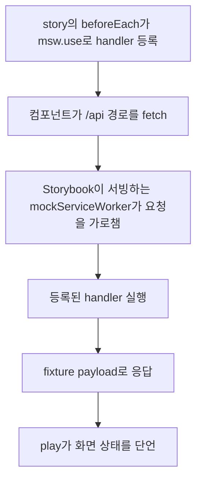

공용 UI 컴포넌트나 story를 건드릴 때는 어디에 둘지 정하고, 같은 자리에 story를 쓰고, 아래 명령을 돌리면 돼요. 순서는 배치 → story → fixture → 검사예요.

## 컴포넌트를 둘 위치 정하기

여러 slice가 함께 쓰는 외형과 상호작용 계약이면 `src/shared/ui/<name>/`에 두세요. `components.json`의 `components`·`ui` alias가 `@/shared/ui`를 가리키므로, shadcn CLI로 만드는 primitive도 같은 위치에 생기고 스타일 병합은 `@/shared/lib/cn`을 통해요([components.json](repo://components.json#L15-L21), [src/shared/ui/button/button.tsx](repo://src/shared/ui/button/button.tsx#L1-L6)).

한 slice의 데이터·상태에 묶인 화면 조각이면 그 slice의 `ui` segment에 두세요. 두 곳 이상에서 필요해지는 순간이 `src/shared/ui`로 옮길 시점이에요.

| 두는 곳 | 판단 기준 | 실제 예 |
| --- | --- | --- |
| `src/shared/ui/<name>/` | 제품 전용 데이터를 모르는 외형·동작 계약이고 여러 slice가 써요 | [src/shared/ui/button/button.tsx](repo://src/shared/ui/button/button.tsx#L40-L47), [src/shared/ui/voice-orb/voice-orb.tsx](repo://src/shared/ui/voice-orb/voice-orb.tsx#L318-L325) |
| `src/<layer>/<slice>/ui/` | 그 slice의 api·model 결과를 조합한 화면 조각이에요 | [src/widgets/library/ui/mixing-library.tsx](repo://src/widgets/library/ui/mixing-library.tsx#L7-L20) |

각 컴포넌트 폴더는 `index.ts`로 public API를 노출해요([src/shared/ui/button/index.ts](repo://src/shared/ui/button/index.ts#L1-L1)). 소비하는 쪽은 `@/shared/ui/button`처럼 폴더 경로로 import하고 내부 파일을 직접 가리키지 않아요.

slice 안쪽은 아래 다섯 segment로 나뉘고, slice 밖에서는 어느 segment도 직접 import할 수 없어요. FSD 경계 테스트가 `_pages`·`widgets`·`features`·`entities` layer의 slice에서 다른 slice의 segment를 직접 가리키는 참조를 위반으로 모으고, 같은 layer의 같은 slice 안에서만 통과시켜요([tests/fsd-architecture-boundaries.test.ts](repo://tests/fsd-architecture-boundaries.test.ts#L26-L27), [tests/fsd-architecture-boundaries.test.ts](repo://tests/fsd-architecture-boundaries.test.ts#L154-L175)).

| segment | 무엇을 두는가 | 이 저장소의 예 |
| --- | --- | --- |
| `api` | 서버·외부 시스템 호출과 그 query·mutation 옵션 | [src/entities/mixing-job/api/client.ts](repo://src/entities/mixing-job/api/client.ts#L41-L66), [src/features/create-mixing/api/mixing-queue.ts](repo://src/features/create-mixing/api/mixing-queue.ts#L1-L10) |
| `model` | Zod 계약과 상태·타입 정의 | [src/entities/mixing-job/model/contract.ts](repo://src/entities/mixing-job/model/contract.ts#L1-L16) |
| `ui` | 그 slice의 데이터·상태를 쓰는 화면 조각과 컴포넌트 | [src/entities/mixing-job/ui/mixing-status-badge.tsx](repo://src/entities/mixing-job/ui/mixing-status-badge.tsx#L1-L16) |
| `lib` | 표시 변환·점수 계산처럼 UI 없이 도는 순수 로직 | [src/entities/mixing-job/lib/presentation.ts](repo://src/entities/mixing-job/lib/presentation.ts#L1-L13), [src/entities/recommendation/lib/ranking.ts](repo://src/entities/recommendation/lib/ranking.ts#L1-L9) |
| `config` | 그 slice 전용 설정 상수 | 이 입력에서 확인한 slice에는 아직 예가 없어요. 공용 설정은 `src/shared/config/`에 있어요 |

## story는 컴포넌트 옆에 두기

Storybook은 `src` 아래의 story만 찾아요. [.storybook/main.ts](repo://.storybook/main.ts#L3-L11)의 glob이 `../src/**/*.stories.@(js|jsx|mjs|ts|tsx)`이고, 경계 테스트는 파일 이름에 `.stories.`가 들어간 파일만 story로 인식해요([tests/storybook-production-boundary.test.ts](repo://tests/storybook-production-boundary.test.ts#L51-L57)). 그래서 새 story는 대상 컴포넌트와 같은 디렉터리에 `<name>.stories.tsx`로 만드세요.

meta는 `@storybook/nextjs-vite`의 `Meta`·`StoryObj`로 타입을 맞추고 default export로 내보내요. Storybook sidebar의 `title` 접두사는 layer를 그대로 따르는 관례예요.

| `title` 접두사 | 위치 | 예 |
| --- | --- | --- |
| `Shared UI/...`, `Shared/Motion/...` | `src/shared/ui/**` | [src/shared/ui/button/button.stories.tsx](repo://src/shared/ui/button/button.stories.tsx#L6-L23), [src/shared/ui/voice-orb/voice-orb.stories.tsx](repo://src/shared/ui/voice-orb/voice-orb.stories.tsx#L6-L25) |
| `Entities/...`, `Features/...`, `Widgets/...`, `Pages/...` | 각 layer slice의 `ui/` | [src/widgets/library/ui/mixing-library.stories.tsx](repo://src/widgets/library/ui/mixing-library.stories.tsx#L9-L31) |
| `App/...` | `src/_app/**` | [src/_app/layout/product-route-states.stories.tsx](repo://src/_app/layout/product-route-states.stories.tsx#L7-L16) |

`title` 접두사는 관례이고 검사로 강제되지 않아요. 반대로 story 파일 자체는 `src` 트리에 있으므로 FSD 경계 테스트가 수집하는 소스에 포함돼요. 테스트는 `app`, `src`, `scripts`만 스캔하니, story가 `tests/msw/handlers.ts` 같은 `tests/` 파일을 상대 경로로 import하는 것은 계층 위반으로 잡히지 않아요([tests/fsd-architecture-boundaries.test.ts](repo://tests/fsd-architecture-boundaries.test.ts#L95-L113)).

story에 무엇을 넣을지는 컴포넌트 성격에 따라 달라요. 상태별 조합은 story를 나누고, 사용자 상호작용 결과는 `play`에서 `storybook/test`의 `expect`·`userEvent`·`waitFor`로 단언해요. 예를 들어 버튼 story는 클릭 후 `onClick` 호출을 확인하고([button.stories.tsx](repo://src/shared/ui/button/button.stories.tsx#L29-L35)), 스켈레톤 story는 `[role="status"]`와 `aria-busy="true"`, `data-slot="skeleton"` 개수를 확인해요([src/shared/ui/skeleton/skeletons.stories.tsx](repo://src/shared/ui/skeleton/skeletons.stories.tsx#L25-L44)).

`Shared UI/Skeletons`처럼 여러 layer의 로딩 UI를 한 story에 모으는 경우가 있어요. 이 파일은 `src/shared/ui/skeleton/`에 있으면서 `@/_pages/*`의 loading 컴포넌트를 import하므로 계층 의존 방향을 거슬러요. 그래서 steiger는 이 파일에 한해 `fsd/no-public-api-sidestep`과 `fsd/forbidden-imports`를 꺼 둬요([steiger.config.ts](repo://steiger.config.ts#L27-L34)). 새 story에서 같은 방식이 필요하면 예외를 늘리기 전에 그 항목이 왜 예외인지 먼저 확인하세요.

## Storybook이 story를 실행하는 환경

story를 실행하는 설정은 `.storybook/`과 `vitest.config.ts` 두 곳에 나뉘어 있어요.

| 설정 | 값 | 확인할 지점 |
| --- | --- | --- |
| framework | `@storybook/nextjs-vite`, `nextjs.appDirectory: true` | [.storybook/main.ts](repo://.storybook/main.ts#L6-L9), [.storybook/preview.tsx](repo://.storybook/preview.tsx#L45-L47) |
| addon | `@storybook/addon-docs`, `@storybook/addon-a11y`, `@storybook/addon-vitest` | [.storybook/main.ts](repo://.storybook/main.ts#L5-L5) |
| decorator | story마다 새 `QueryClientProvider`(`createQueryClient(false)`), `TooltipProvider`, `Toaster`를 씌워요 | [.storybook/preview.tsx](repo://.storybook/preview.tsx#L12-L33) |
| MSW(Mock Service Worker) | `addonMsw()`를 붙여 story별 handler 등록을 켜요 | [.storybook/preview.tsx](repo://.storybook/preview.tsx#L25-L26) |
| 접근성 | `a11y: { test: "error" }`라서 위반이 있으면 story 테스트가 실패해요 | [.storybook/preview.tsx](repo://.storybook/preview.tsx#L34-L37) |
| 스타일 | `../src/_app/styles/globals.css`를 import해 제품 토큰을 그대로 써요 | [.storybook/preview.tsx](repo://.storybook/preview.tsx#L10-L10) |
| 레이아웃 | 기본값은 `layout: "centered"`, 전체 화면이 필요하면 story에서 `fullscreen`으로 덮어써요 | [.storybook/preview.tsx](repo://.storybook/preview.tsx#L44-L44), [mixing-library.stories.tsx](repo://src/widgets/library/ui/mixing-library.stories.tsx#L16-L18) |

테스트 실행기는 `vitest.config.ts`의 `storybook` project예요. provider는 `@vitest/browser-playwright`, instance는 headless `chromium` 하나이고, plugin은 `storybookTest({ configDir: ".storybook" })`으로 `.storybook`을 읽어요([vitest.config.ts](repo://vitest.config.ts#L4-L6), [vitest.config.ts](repo://vitest.config.ts#L38-L54)). 명령은 두 가지예요. 브라우저에서 직접 확인하려면 `pnpm run storybook`(port 6006), 검사처럼 한 번에 돌리려면 `pnpm run test:storybook --run`을 쓰세요([package.json](repo://package.json#L12-L13), [package.json](repo://package.json#L59-L59)).

## MSW fixture를 재사용하기

story가 API 응답을 필요로 하면 이미 있는 handler를 재사용하세요. 공용 handler와 fixture는 [tests/msw/handlers.ts](repo://tests/msw/handlers.ts#L19-L35)와 [tests/msw/fixtures.ts](repo://tests/msw/fixtures.ts#L7-L14)에 모여 있고, story는 `beforeEach({ msw })`에서 그 handler를 등록해요([src/widgets/library/ui/mixing-library.stories.tsx](repo://src/widgets/library/ui/mixing-library.stories.tsx#L4-L31)).

```tsx
beforeEach({ msw }) {
  msw.use(mixingHistoryHandler());
}
```

공용 handler가 없는 응답은 story 안에서 `msw`의 `http.get`·`http.post`로 직접 만들어요. `vocal-profile-library.stories.tsx`가 분석 작업 응답을 그렇게 정의하고 필요한 story에서만 등록해요([src/widgets/library/ui/vocal-profile-library.stories.tsx](repo://src/widgets/library/ui/vocal-profile-library.stories.tsx#L70-L72), [src/widgets/library/ui/vocal-profile-library.stories.tsx](repo://src/widgets/library/ui/vocal-profile-library.stories.tsx#L140-L147)). 여러 story가 같은 응답을 필요로 하게 되면 그때 handler를 `tests/msw/handlers.ts`로 올리세요.



story 하나가 서버 응답을 받아 화면을 그리는 경로예요.

가로채기를 담당하는 서비스 워커 스크립트는 `.storybook/public/mockServiceWorker.js`에 있어요. 이 위치는 `.storybook/main.ts`의 `staticDirs: ["./public"]`이 정적 자산으로 서빙하고, `package.json`의 `msw.workerDirectory`가 같은 경로를 가리켜요([.storybook/main.ts](repo://.storybook/main.ts#L10-L10), [package.json](repo://package.json#L142-L146)). 생성·벤더 성격의 파일이니 내용을 옮겨 적거나 고치지 말고 위치와 역할만 기억하세요.

story와 MSW fixture가 확인하는 것은 story가 등록한 응답뿐이에요. 서버 데이터, 인증, DB 경로는 이 방식으로 증명되지 않으니, 그 범위가 궁금하면 [storybook fixture가 덮는 브라우저 검사 계층](../testing/verification.md)을 보세요. 쿼리 캐시 키와 재시도 판단은 [브라우저 상태와 API 오류 계약](client-data-flow.md)이 소유해요.

## Storybook은 개발 전용이어야 해요

Storybook 도구와 MSW(Mock Service Worker) 워커가 제품 빌드에 섞이지 않아야 한다는 계약은 [tests/storybook-production-boundary.test.ts](repo://tests/storybook-production-boundary.test.ts#L28-L74)가 강제해요. 새 패키지를 추가하거나 script를 고칠 때는 아래 조건을 확인하세요.

| 조건 | 강제하는 내용 | 근거 |
| --- | --- | --- |
| Storybook·Vitest·MSW·Playwright 패키지는 `devDependencies`에만 있어요 | `storybook`, `@storybook/nextjs-vite`, `@storybook/addon-docs`, `@storybook/addon-a11y`, `@storybook/addon-vitest`, `msw-storybook-addon`, `vitest`, `@vitest/browser`, `@vitest/browser-playwright`, `@vitest/runner`, `playwright`, `vite`가 `dependencies`에 있으면 실패해요 | [tests/storybook-production-boundary.test.ts](repo://tests/storybook-production-boundary.test.ts#L13-L36) |
| `build`, `start`, `start:web` script에 storybook이 섞이지 않아요 | 세 script 문자열에 `storybook`이 들어가면 실패해요 | [tests/storybook-production-boundary.test.ts](repo://tests/storybook-production-boundary.test.ts#L38-L41) |
| MSW 워커는 `.storybook/public/`에만 있어요 | `staticDirs: ["./public"]`이고, `.storybook/public/mockServiceWorker.js`는 존재해야 하며 `public/mockServiceWorker.js`는 없어야 해요 | [tests/storybook-production-boundary.test.ts](repo://tests/storybook-production-boundary.test.ts#L43-L49) |
| story 파일이 server 모듈을 import하지 않아요 | `server-only`, `next/headers`, `next/server`, `index.server`, `@/shared/db`, `@prisma/*`가 story 파일의 `from "..."` 문자열에 있으면 실패해요 | [tests/storybook-production-boundary.test.ts](repo://tests/storybook-production-boundary.test.ts#L59-L74) |

`public/`는 Next.js 제품 앱이 정적 자산으로 서빙하는 디렉터리라서, mock 워커가 그쪽에 있으면 제품 정적 자산에 섞여요. 그래서 워커는 Storybook 전용 정적 디렉터리에만 두고 검사로 막아요. `pnpm run build-storybook`의 산출물인 `storybook-static/`도 `.gitignore`로 제외돼 있어요([.gitignore](repo://.gitignore#L13-L16)).

## Base UI 컨트롤을 Link로 렌더링할 때

Base UI 컨트롤의 `render` prop에 Next.js `Link`를 넘겨 링크처럼 쓰는 경우에는 `nativeButton={false}`를 함께 붙이세요. 붙이지 않으면 컨트롤이 `button` 시맨틱을 유지해 접근성 트리와 링크 동작이 어긋나요.

이 규칙은 [tests/base-ui-link-button.test.ts](repo://tests/base-ui-link-button.test.ts#L41-L68)가 `app/`과 `src/`의 `.tsx` 파일을 TypeScript AST로 훑어 강제해요. `Button`, `DropdownMenuItem`, `TabsTrigger`가 `render={<Link ... />}`를 쓰는데 `nativeButton={false}`가 없으면 그 파일과 컨트롤 이름을 담아 실패하고, 현재 검증 대상이 10개 이상인지도 확인해요. 직접 돌려보려면 `pnpm run test:base-ui`를 쓰세요([package.json](repo://package.json#L55-L55)).

```tsx
<Button nativeButton={false} render={<Link href="/admin/songs" />} size="sm">
```

[src/_pages/admin/ui/admin-page.tsx](repo://src/_pages/admin/ui/admin-page.tsx#L110-L128)의 실제 사용 예예요.

## 변경 후 돌릴 명령

| 명령 | 무엇을 확인하나요 |
| --- | --- |
| `pnpm run test:storybook --run` | headless chromium에서 모든 story의 렌더, `play` 단언, 접근성 검사를 실행해요 |
| `pnpm run test:process-scripts` | Storybook 개발 전용 경계를 `storybook-production-boundary.test.ts`로 확인해요 |
| `pnpm run test:base-ui` | Base UI 컨트롤을 `Link`로 렌더링할 때 `nativeButton={false}`가 붙었는지 확인해요 |
| `pnpm run check:architecture` | `steiger ./src`와 FSD 경계 테스트로 slice public API와 계층 위반을 확인해요 |
| `pnpm run check` | Biome, ESLint, typecheck, `check:architecture`를 한 번에 돌려요 |

공용 컴포넌트는 대개 여러 화면에 닿으니, 마지막에는 `pnpm test`로 전체 회귀를 한 번 돌리는 편이 안전해요. `pnpm test`의 단계 목록에는 `pnpm run test:storybook --run`도 들어 있어요([package.json](repo://package.json#L23-L23)). 각 명령이 묶고 있는 파일 목록과 검사 계층별 증명 범위는 [변경 검증 경로](../testing/verification.md)에 정리돼 있어요.

GLSL 셰이더처럼 `play`로 확인하기 어려운 구현 세부는 소스 문자열을 검사하는 별도 테스트가 있어요. [tests/voice-orb-shader.test.ts](repo://tests/voice-orb-shader.test.ts#L16-L45)가 `src/shared/ui/voice-orb/voice-orb.tsx`의 셰이더 함수와 premultiplied alpha 설정을 정규식으로 고정해요. 다만 이 파일은 `package.json`의 어떤 script에도 묶여 있지 않아서 `pnpm test`가 대신 돌려주지 않아요. 셰이더를 고쳤다면 이 테스트도 직접 실행하세요.

## 변경 전 체크리스트

- [ ] 컴포넌트가 두 곳 이상의 slice에서 쓰이면 `src/shared/ui/<name>/`에 두고 `index.ts`로 노출했어요.
- [ ] story 파일 이름에 `.stories.`가 들어가고 컴포넌트 옆에 있어요.
- [ ] 새 공통 variant나 상태를 추가했다면 story에 그 조합이 있어요.
- [ ] 접근성 위반이 story 테스트를 실패시키므로 `role`·accessible name·`aria-busy` 같은 상태를 story에서 확인했어요.
- [ ] 서버 응답이 필요하면 `tests/msw/handlers.ts`의 handler를 재사용하고, story 전용 응답만 story 안에서 정의했어요.
- [ ] story가 위 'Storybook은 개발 전용이어야 해요' 절의 조건 표에 있는 금지 import에 해당하지 않아요.
- [ ] Base UI 컨트롤을 `Link`로 렌더링하면 `nativeButton={false}`를 붙였어요.
- [ ] Storybook 전용 패키지를 `dependencies`로 올리거나 `build`·`start` script에 storybook을 섞지 않았어요.

## 다음에 볼 문서

- 검사 계층별로 무엇이 증명되고 무엇이 증명되지 않는지는 [변경 검증 경로](../testing/verification.md)가 소유해요.
- 쿼리 키, 폴링 주기, 재시도 판단은 [브라우저 상태와 API 오류 계약](client-data-flow.md)에 있어요.
- 새 코드를 어느 layer에 둘지, layer 사이 의존 방향이 어떤지는 [시스템 지도와 경계](system-map.md)를 보세요.
