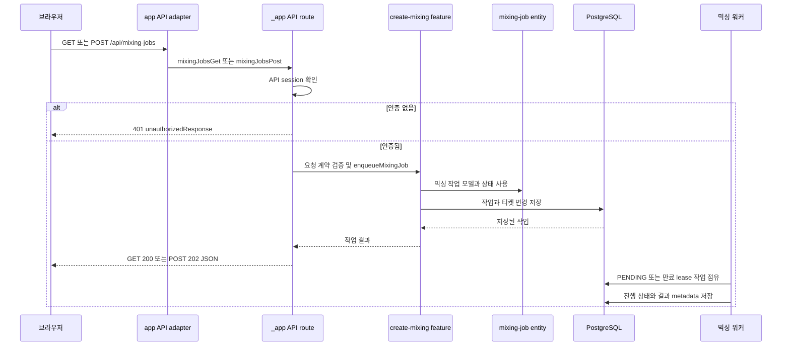

# Next.js와 Feature-Sliced 시스템 경계 이해하기

새 기능을 넣거나 기존 동작을 바꿀 때는 `app/`에 로직을 추가하지 말고, 요청을 소유한 FSD slice의 public API 뒤에 구현하세요. 브라우저 요청은 Next.js App Router의 route adapter를 거쳐 `src/_app/`의 서버 진입점으로 들어가고, 그 진입점이 `features`, `entities`, `shared`의 공개 API를 조합해요. 이 규칙을 지키면 라우팅 규약과 도메인·서버 기능을 서로 다른 변경으로 검증할 수 있어요.

## 경계의 핵심 규칙

레이어 방향은 아래쪽으로만 흐르는 단방향 구조예요.

```text
_app → _pages → widgets → features → entities → shared
```

`_app`은 애플리케이션 조립과 외부 진입점을 담당하고, `_pages`는 화면을 구성해요. `widgets`는 독립적인 페이지 UI 블록을, `features`는 사용자 동작과 애플리케이션 사용 사례를, `entities`는 도메인 모델과 도메인 UI를 소유해요. `shared`는 특정 도메인에 종속되지 않는 공통 라이브러리와 인프라를 제공해요. 상위 레이어가 하위 레이어를 사용할 수는 있지만, 하위 레이어가 상위 레이어를 참조하거나 같은 레이어의 다른 slice 내부를 직접 찌르면 안 돼요.

slice 사이의 import는 대상 slice의 root public API만 사용하세요. 예를 들어 `@/features/create-mixing`은 브라우저에서 안전한 API와 모델 계약을 내보내고, `@/features/create-mixing/index.server`는 서버 전용 큐 기능까지 내보내요. `api/`, `model/`, `ui/`, `lib/` 같은 내부 segment를 다른 slice에서 직접 import하면 boundary test가 위반으로 보고해요. 실제 공개 표면은 [`create-mixing`의 세 진입점](repo://src/features/create-mixing/index.ts#L1-L4)에서 비교할 수 있어요.

`index.ts`는 browser-safe API, `index.model.ts`는 실행 환경에 중립적인 계약, `index.server.ts`는 DB·secret·서버 capability를 구분해요. 이 구분은 파일 이름만의 약속이 아니에요. boundary test는 `.server.ts` 파일과 `server-only`, `next/headers`, `next/server`, `@/shared/db`에 이르는 runtime import를 서버 모듈로 판정해요. 따라서 `"use client"` 파일은 서버 모듈을 직접 또는 다른 모듈을 통해 간접적으로 import하면 안 돼요. 타입 전용 import는 runtime 의존성으로 세지 않지만, 실행 코드가 서버 capability를 끌어오지 않는지 확인하세요.

## Next.js 요청이 서버 기능으로 흐르는 과정

root `app/`은 Next.js가 요구하는 파일과 FSD public API를 연결하는 어댑터예요. `app/layout.tsx`는 `@/_app/layout/index.server`에서 `RootLayout`과 `generateMetadata`를 re-export하고, 제품 layout도 같은 public API에서 `ProductLayout`과 `productMetadata`를 가져와요. 페이지 어댑터도 같은 방식으로 `@/_pages/profile/index.server`의 `ProfilePage`와 `metadata`를 노출해요. root App 파일에는 이런 export와 정적인 Next.js route config 외의 구현을 두지 마세요.

대표적인 믹싱 요청은 다음 순서로 처리돼요.



이 다이어그램은 [`app/api/mixing-jobs/route.ts`](repo://app/api/mixing-jobs/route.ts#L1-L3)가 route convention을 `_app` 서버 public API에 위임하고, 실제 handler가 인증·검증·큐 등록을 수행하는 현재 흐름을 요약해요. `POST`는 JSON body를 `createMixingRequestSchema`로 검증해요. 잘못된 요청은 400, 인증이 없으면 401, 티켓이 부족하면 402를 반환하고, 정상적으로 큐에 넣으면 직렬화한 작업과 함께 202를 반환해요. `GET`은 인증된 사용자의 `page`, `q`, `status` 필터로 이력을 조회해요. 상세한 응답과 예외 변환은 [`mixing-jobs-route.ts`](repo://src/_app/api-routes/mixing-jobs/mixing-jobs-route.ts#L12-L68)에서 확인하세요.

HTTP 요청이 끝난 뒤의 오래 걸리는 처리는 route handler가 직접 수행하지 않아요. `enqueueMixingJob`이 PostgreSQL에 작업을 기록하면 믹싱 워커가 새 `PENDING` 작업 또는 lease가 없거나 만료된 작업을 원자적으로 점유해요. 아직 유효한 lease를 가진 작업은 다른 워커가 처리 중인 것으로 보고 점유하지 않아요. 이 수명 주기와 재시작 후 복구를 바꿀 때는 [믹싱과 복구 흐름](../workflows/mixing-and-recovery.md)과 [외부 서비스 경계](../integrations/external-services.md)를 함께 확인하세요.

## public API를 지키며 변경하는 방법

### 화면이나 위젯을 바꿀 때

1. 먼저 변경의 소유자를 정하세요. 화면 조합이면 `_pages`, 재사용 가능한 화면 블록이면 `widgets`, 사용자 동작이면 `features`, 도메인 표현이나 모델이면 `entities`에 둬요.
2. 같은 slice 안에서는 내부 segment를 사용할 수 있지만, 다른 slice에서 필요하면 root `index.ts`, `index.model.ts`, 또는 `index.server.ts`에 의도한 공개 항목을 re-export하세요.
3. 클라이언트 컴포넌트가 서버 데이터나 secret을 필요로 한다면 직접 import하지 말고 서버 page·API와 browser-safe 계약을 사이에 두세요.
4. root `app/`에서는 `_app` 또는 `_pages`의 `index` 계열 public API만 re-export하세요. 실제 조합 로직과 Route Handler 구현은 `src/`에 유지하세요.

`index.server.ts`는 단순히 “서버에서 먼저 실행되는 index”가 아니라 서버 capability의 경계예요. Route Handler나 서버 page가 DB와 인증을 사용해야 할 때 이 진입점을 선택하고, 클라이언트 UI가 공유해야 하는 schema·presentation·타입은 browser-safe 또는 model 진입점에서 가져오세요. 서버 전용 진입점을 `index.ts`에서 다시 내보내면 클라이언트 그래프에 서버 의존성이 전이될 수 있으니 피하세요.

### root `app/` 파일을 바꿀 때

root App adapter는 import/export와 정적 Next.js route config만 포함할 수 있어요. boundary test는 구현 선언을 발견하면 “FSD public API 뒤로 옮기라”고 실패하고, `_app`·`_pages`가 아닌 경로 또는 내부 segment로 import하면 실패해요. 새 route는 `app/<route>/route.ts`에 어댑터를 만들고, handler는 `src/_app/api-routes/<slice>/index.server.ts`에서 공개하세요. 새 화면은 `app/<route>/page.tsx`에서 `src/_pages/<slice>/index.server.ts`를 연결하는 형태를 우선하세요.

## 변경 전후에 확인할 검사

경계만 바꿨다면 전체 suite보다 먼저 변경 범위 테스트를 실행하세요.

```bash
pnpm run test:architecture-boundaries
pnpm run check:architecture
pnpm run typecheck
```

`tests/fsd-architecture-boundaries.test.ts`는 세 가지를 함께 검사해요. slice 간 내부 segment 우회, 클라이언트에서 서버 모듈로 이어지는 직접·전이 runtime import, root `app/` adapter의 구현과 잘못된 import를 fixture로 거부해요. 마지막 통합 테스트는 현재 `app`, `src`, `scripts` 트리를 실제로 수집해 세 경계가 모두 위반 없이 유지되는지 확인해요. 테스트의 판정 로직과 fixture는 [`FSD 경계 테스트`](repo://tests/fsd-architecture-boundaries.test.ts#L154-L229)와 [`root App adapter 테스트`](repo://tests/fsd-architecture-boundaries.test.ts#L272-L385)에서 읽을 수 있어요.

검사가 실패하면 import 경로를 짧게 고치는 데서 끝내지 말고, 잘못된 소유권을 먼저 바로잡으세요. 다른 slice가 내부 segment를 요구한다면 public API를 설계해 필요한 계약만 공개하세요. 클라이언트 그래프가 서버에 닿는다면 `index.ts`와 `index.server.ts`의 export를 분리하세요. root `app/`에 구현이 생겼다면 해당 코드를 `_app` 또는 `_pages`로 옮기고 adapter를 re-export로 줄이세요.

## 다음에 읽을 곳

- 도메인 모델과 데이터 소유권은 [도메인 데이터 모델](../concepts/domain-data-model.md)에서 확인하세요.
- 로컬 실행과 진입점은 [빠른 시작](../quickstart.md)에서 확인하세요.
- 변경에 맞는 검사 선택은 [변경 검증](../testing/change-validation.md)에서 이어서 읽으세요.
