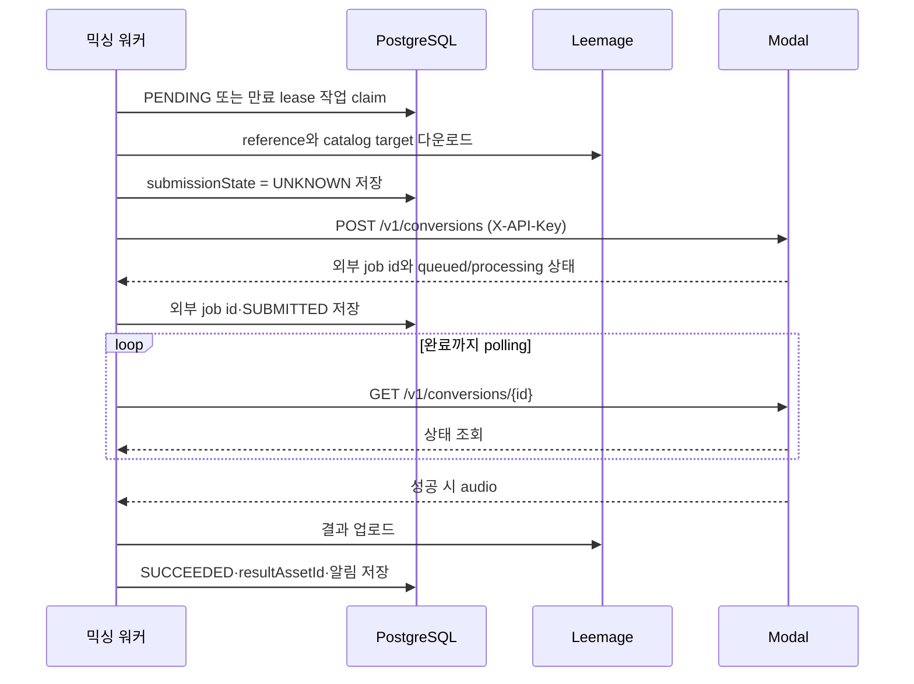

# 웹 요청·DB·워커·외부 처리의 시스템 경계 이해하기

## 이 페이지의 결론

짧은 HTTP 요청과 오래 걸리는 외부 처리를 분리해요. Next.js API는 인증·입력 검증과 작업 접수를 맡고, Prisma/PostgreSQL은 작업 상태·lease·파일 metadata의 저장소가 돼요. 영속 워커는 DB에서 작업을 원자적으로 점유한 뒤 미디어 저장소와 Modal을 호출하고, 각 결과를 다시 DB에 기록해요.

그래서 믹싱이나 분석을 바꿀 때는 API route만 고치지 말고, **큐 상태를 소유한 DB 모델**, **lease를 갱신하는 워커**, **외부 호출과 결과 저장을 연결하는 경계**를 함께 확인하세요. 현재 구현을 기준으로 한 다음 흐름이 이 페이지의 독자 질문인 “요청부터 저장·워커·외부 서비스까지 책임 경계가 어디인가요?”에 대한 답이에요.

```mermaid
flowchart LR
    B[브라우저] --> A[Next.js API adapter]
    A --> H[_app API handler]
    H -->|인증·검증| D[(Prisma / PostgreSQL)]
    H -->|202 접수 결과| B
    D -->|PENDING 작업| W[영속 워커]
    W -->|lease·상태·결과 metadata| D
    W --> M[Modal 서비스]
    W --> S[Leemage 미디어 저장소]
    S -->|파일 URL·provider ID| D
```

## 각 경계가 소유하는 것

| 경계 | 현재 코드가 맡는 책임 | 맡지 않는 책임 |
| --- | --- | --- |
| Next.js `app/` adapter | route convention과 `runtime = "nodejs"`를 `_app` public API에 연결해요 | 인증, DB 접근, 외부 처리 구현을 넣지 않아요 |
| `_app` API handler와 feature | 세션 확인, 요청 계약 검증, 사용 사례 호출, HTTP 응답 변환을 맡아요 | 오래 걸리는 믹싱·분석을 요청 수명 안에서 기다리지 않아요 |
| Prisma/PostgreSQL | `MixingJob`과 분석 작업, 상태·시도 횟수·lease·외부 job ID·파일 metadata를 저장해요 | 음원 바이트나 Modal 실행 자체를 소유하지 않아요 |
| 영속 워커 | 작업 점유, lease heartbeat, 재시도·복구, 외부 호출, 성공·실패 기록을 맡아요 | 브라우저에 직접 HTTP 응답을 만들지 않아요 |
| Leemage | 업로드한 사용자 레퍼런스와 최종 결과 파일을 보관해요 | 애플리케이션의 작업 상태를 대체하지 않아요 |
| Modal | 보컬·곡 분석 또는 SoulX-Singer 믹싱 같은 외부 AI 처리를 실행해요 | 내부 작업의 최종 상태와 사용자 알림을 소유하지 않아요 |

README의 시스템 구성도 [Next.js, Prisma/PostgreSQL, Leemage, durable background workers, Modal의 연결](repo://README.md#L127-L147)을 한눈에 보여줘요. PostgreSQL에는 파일 자체가 아니라 외부 project·file ID와 URL 같은 metadata를 남기는 구조예요.

## 믹싱 요청이 접수되고 끝나는 과정

`app/api/mixing-jobs/route.ts`는 `GET`과 `POST`를 `_app/api-routes/mixing-jobs/index.server`에서 가져오는 얇은 adapter예요. 실제 handler는 `withApiAdmission`으로 감싼 뒤 세션을 확인해요. `POST`는 제한된 JSON body를 `createMixingRequestSchema`로 검증하고, `enqueueMixingJob`에 `userId`, `vocalProfileId`, `songAnalysisId`, `idempotencyKey`를 전달해요. 이 호출자와 응답 계약은 [`mixing-jobs-route.ts`](repo://src/_app/api-routes/mixing-jobs/mixing-jobs-route.ts#L15-L76)에서 확인하세요.

- 인증 세션이 없으면 `unauthorizedResponse()`로 401을 반환해요.
- body를 읽지 못하거나 schema가 맞지 않으면 `INVALID_REQUEST`와 400을 반환해요.
- 티켓이 부족하면 `INSUFFICIENT_TICKETS`와 티켓 정보가 담긴 402를 반환해요.
- 정상적으로 작업을 저장하면 직렬화한 작업과 함께 202를 반환해요.
- `MixingError`는 오류의 `status`와 `retryable`을 응답에 반영하고, 그 밖의 enqueue 실패는 500으로 변환해요.

`GET`은 인증된 사용자의 `page`, `q`, `status` 필터로 믹싱 이력을 조회해요. API의 성공 응답은 “외부 처리가 끝났다”는 뜻이 아니라 “DB에 작업이 접수됐다”는 뜻이에요. 실제 `POST` adapter와 server export는 [`route.ts`](repo://app/api/mixing-jobs/route.ts#L1-L3)와 [`index.server.ts`](repo://src/_app/api-routes/mixing-jobs/index.server.ts#L1-L5)를 함께 읽어야 정확해요.

## DB가 큐와 소유권을 유지하는 방식

`enqueueMixingJob`이 만든 작업은 PostgreSQL의 `PENDING` 상태에서 시작해요. 믹싱 워커의 `claimNextMixingJob`은 `FOR UPDATE SKIP LOCKED`로 후보 하나를 원자적으로 고르고, `leaseOwner`, `leaseExpiresAt`, `heartbeatAt`, `attempts`를 함께 갱신해요. 새 작업은 `PREPARING`으로 바뀌고, 이미 외부 처리 중이던 작업은 만료한 lease를 가진 경우에만 다시 점유할 수 있어요. 아직 유효한 lease를 가진 작업은 다른 워커가 가져가지 않아요.

Prisma client는 `DATABASE_URL`로 PostgreSQL에 연결하고 DB pool·connection timeout·query timeout을 runtime limits로 설정해요. 개발 환경에서는 `globalThis`에 client를 보관해 재생성도 막아요. DB 연결 생성과 이 경계의 설정은 [`prisma.ts`](repo://src/shared/db/prisma.ts#L11-L35)에서 확인하세요.

## 워커가 외부 시스템을 호출하는 순서

영속 워커는 DB를 작업 큐이자 복구 기준으로 사용해요. 믹싱의 한 번의 실행은 환불·외부 job reconciliation·미디어 정리를 먼저 시도한 다음 작업을 점유하고 처리해요.



믹싱 워커는 Modal 설정이 없거나 다운로드·제출·상태 조회·결과 다운로드에 실패하면 오류 코드를 정규화해요. 네트워크와 5xx 등은 재시도 가능한 실패가 될 수 있지만, deadline·시도 횟수 초과나 잘못된 응답은 종료 실패가 될 수 있어요. 제출 직전에는 `submissionState = UNKNOWN`을 저장해 제출 결과를 모르는 장애를 구분해요. 외부 job ID를 확인하기 전 실패하면 `PENDING`으로 재시도하거나 필요한 환불을 기록하고, 제출을 확인한 뒤 실패하면 `SUBMITTED` 재시도 또는 reconciliation 대상으로 남겨요. 이 흐름의 실제 상태 전환은 [`mixing worker`](repo://src/_app/background-jobs/mixing/worker.ts#L187-L290)와 [`외부 제출·polling·결과 저장`](repo://src/_app/background-jobs/mixing/worker.ts#L293-L561)에 있어요.

보컬 프로필 분석은 믹싱과 외부 수명 주기가 달라요. 워커가 DB lease를 점유하고 analyzer에 파일 바이트를 보내 단일 동기 HTTP 응답을 기다린 뒤 결과를 DB에 저장해요. 곡 카탈로그 분석은 외부 job ID를 저장하고 완료까지 polling해요. 두 분석 워커도 만료 lease를 다시 점유하고, 실패를 retryable 여부와 attempt 한도에 따라 DB에 기록해요. 따라서 외부 서비스의 “동기 응답”과 “외부 job polling”을 같은 계약으로 취급하면 안 돼요. 대표적인 점유·실패 경계는 [`song-analysis worker`](repo://src/_app/background-jobs/song-analysis/worker.ts#L33-L127)와 [`vocal-profile-analysis worker`](repo://src/_app/background-jobs/vocal-profile-analysis/worker.ts#L47-L83)에서 확인하세요.

## 미디어 저장과 DB 저장의 경계

미디어 저장소는 파일 바이트를 보관하고, PostgreSQL은 애플리케이션이 그 파일을 참조할 수 있는 metadata를 보관해요. `uploadTrackedAsset`은 먼저 `MediaOperation` 의도를 DB에 만들고 Leemage에 업로드해요. 업로드가 끝나면 하나의 DB transaction에서 domain asset과 `STORED` operation을 기록해요. 업로드 또는 후속 저장이 실패하면 operation을 `RECOVER`로 남겨 나중에 복구할 수 있어요. 이 흐름은 [`media operations`](repo://src/shared/media/operations.ts#L6-L61)에서 확인하세요.

삭제도 외부 I/O보다 먼저 DB transaction에서 참조 여부를 확인하고 cleanup operation을 만든 뒤 domain row를 삭제해요. 워커가 외부 파일 삭제를 완료하면 operation을 `COMPLETED`로 바꾸고, 실패가 반복되면 `RECOVER`를 거쳐 `UNRESOLVED`가 될 수 있어요. 그래서 파일 업로드·삭제를 domain transaction 안에서 직접 완료됐다고 가정하지 말고 `MediaOperation` 수명 주기도 확인하세요.

## 코드를 바꿀 때 경계를 찾는 방법

레이어 방향은 `_app → _pages → widgets → features → entities → shared`로 아래쪽만 향해요. slice 사이 import는 대상 slice의 root public API를 사용하세요. `index.ts`는 browser-safe API, `index.model.ts`는 실행 환경 중립 계약, `index.server.ts`는 DB·secret·서버 capability를 구분해요. 실제 공개 표면은 [`create-mixing public API`](repo://src/features/create-mixing/index.ts#L1-L4)에서 비교할 수 있어요.

`"use client"` 파일이 서버 전용 모듈을 직접 또는 전이 runtime import로 끌어오면 안 돼요. root `app/` 파일도 `_app` 또는 `_pages`의 public API를 연결하는 adapter로 유지하세요. 경계 규칙을 바꿀 때는 [`FSD 경계 테스트`](repo://tests/fsd-architecture-boundaries.test.ts#L154-L229)와 실제 트리 통합 검사를 먼저 실행하세요.

```bash
pnpm run test:architecture-boundaries
pnpm run check:architecture
pnpm run typecheck
```

검사가 실패하면 import 경로만 줄이지 말고 소유권을 다시 정하세요. API 계약을 바꾸면 route handler와 enqueue feature, DB 상태를 함께 확인하세요. 워커의 외부 호출을 바꾸면 lease·재시도·reconciliation·미디어 operation을 함께 확인하세요. DB 모델이나 상태를 바꾸면 해당 워커와 조회 API가 같은 상태를 해석하는지 확인하세요.

## 다음에 읽을 곳

- 작업 상태와 도메인 소유권은 [도메인 데이터 모델](../concepts/domain-data-model.md)에서 확인하세요.
- Modal·Leemage 같은 외부 시스템 계약은 [외부 서비스 경계](../integrations/external-services.md)에서 이어서 읽으세요.
- lease와 실패 복구를 실제 운영 관점에서 보려면 [믹싱과 복구 흐름](../workflows/mixing-and-recovery.md)을 확인하세요.
- 분석별 수명 주기는 [보컬 분석](../workflows/vocal-analysis.md)과 [추천곡 카탈로그](../workflows/recommendations-and-catalog.md)를 참고하세요.
- timeout과 worker runtime 설정은 [구성과 런타임](../operations/configuration-and-runtime.md)에서 찾으세요.
