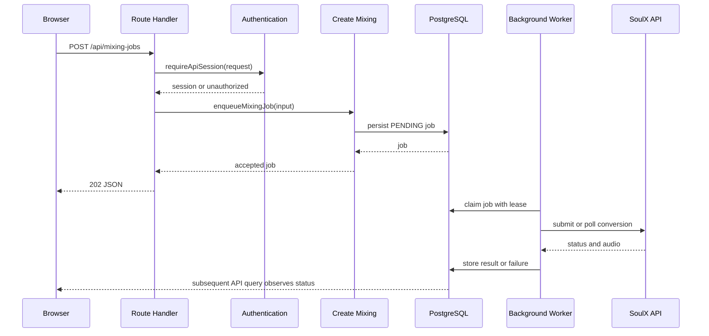

# 시스템 경계와 요청 표면

새 기능을 추가할 때는 `app/`에 로직을 넣지 말고, 요청의 진입점과 실제 소유자를 먼저 나눈다. 이 저장소의 현재 경계는 다음 한 문장으로 요약된다.

> root `app/`은 Next.js 라우팅 규약을 만족하는 얇은 adapter이고, 애플리케이션 동작은 `src/_app/`, 화면 조합은 `src/_pages/`, 업무 흐름은 `src/features/`, 도메인은 `src/entities/`, 공통 인프라는 `src/shared/`가 소유한다.

[README의 프로젝트 구조와 root App 규칙](repo://README.md#L210-L229)도 이 구성을 명시한다. 장시간 작업과 외부 서비스 계약은 [durable-workers.md](/openwiki/architecture/durable-workers.md), 도메인 데이터 의미는 [domain-data-model.md](/openwiki/concepts/domain-data-model.md), 외부 연동별 설정은 [external-services.md](/openwiki/integrations/external-services.md)에서 이어서 확인한다.

## 경계 지도

| 경계 | 소유 책임 | 허용되는 의존 방향 |
| --- | --- | --- |
| `app/` | URL, HTTP method, Next.js metadata·loading·error 규약을 `src` 공개 API에 연결 | `src/_app` 또는 `src/_pages`의 `index.*` 공개 API만 import |
| `src/_app/` | App adapter, provider, Route Handler 구현, background worker 진입점 | 하위 FSD 계층과 `shared` 인프라를 조합 |
| `src/_pages/` | 한 URL 화면의 서버 데이터 조합과 페이지 UI | entities, features, widgets, shared |
| `src/widgets/` | 여러 기능을 묶은 독립적인 화면 블록 | 공개 API를 통한 하위 계층 |
| `src/features/` | 사용자 action과 application use case, 입력 계약 | entities와 shared |
| `src/entities/` | 도메인 모델, 영속 데이터 접근, 도메인 직렬화·UI | shared |
| `src/shared/` | DB, media, config, API client, 공통 UI·library | 특정 feature/entity를 역참조하지 않는 기반 계층 |
| `scripts/` | 프로세스 실행용 worker launcher와 검증 명령 | `_app`의 공개 server 진입점 |
| `services/` | Modal에 배포되는 Python 분석기와 외부 변환 API | 웹 애플리케이션이 HTTP로 호출하는 외부 경계 |

이 표에서 “공개 API”는 slice 루트의 `index.ts`, `index.server.ts` 등을 뜻한다. 예를 들어 library 페이지는 [`app/(product)/library/page.tsx`](repo://app/(product)/library/page.tsx#L1)에서 `@/_pages/library/index.server`만 re-export하고, 페이지 구현은 [`src/_pages/library/ui/library-page.tsx`](repo://src/_pages/library/ui/library-page.tsx#L1-L29)에서 entities·features·widgets를 조합한다.

## 브라우저 요청과 서버 실행

### 페이지 요청

`app/(product)/library/page.tsx` 같은 파일은 default export를 제공하는 Next.js adapter다. 인증, query parsing, DB 조회, 화면 조합을 root `app/`에 복제하지 않는다. `_pages`의 server 공개 API가 그 책임을 맡는다. product layout도 [`app/(product)/layout.tsx`](repo://app/(product)/layout.tsx#L1)에서 `_app/layout`을 연결할 뿐이다.

### Route Handler

API adapter도 같은 규칙을 따른다. [`app/api/mixing-jobs/route.ts`](repo://app/api/mixing-jobs/route.ts#L1-L4)는 Node.js runtime을 선언하고 `_app/api-routes/mixing-jobs/index.server`의 handler를 method에 매핑한다. 실제 handler는 [`mixing-jobs-route.ts`](repo://src/_app/api-routes/mixing-jobs/mixing-jobs-route.ts#L1-L68)에서 다음 순서를 실행한다.

1. `requireApiSession(request)`으로 세션을 확인한다. 세션이 없으면 `unauthorizedResponse()`로 종료한다.
2. `GET`은 URL search parameter를 `mixingHistoryFiltersSchema`로 검증하고 entity의 이력을 반환한다.
3. `POST`는 JSON을 `createMixingRequestSchema`로 검증한다. 실패하면 `400 INVALID_REQUEST`를 반환한다.
4. 유효한 요청은 `enqueueMixingJob`에 위임하고, 작업이 접수되면 직렬화한 job과 `202`를 반환한다.
5. 티켓 부족, 도메인 `MixingError`, 알 수 없는 예외를 각각 `402`, 도메인 status, `500` 응답으로 변환한다.



이 다이어그램은 요청이 외부 변환 완료까지 붙잡고 있지 않음을 보여준다. [`scripts/mixing-worker.ts`](repo://scripts/mixing-worker.ts#L1-L7)는 별도 프로세스로 `_app/background-jobs/mixing`을 시작한다. worker가 결과를 저장하고 나면 브라우저는 API를 다시 조회해 상태를 관찰한다.

## FSD 공개 API와 검증되는 금지선

[`tests/fsd-architecture-boundaries.test.ts`](repo://tests/fsd-architecture-boundaries.test.ts#L154-L174)는 다른 slice가 `api`, `model`, `ui`, `lib`, `config` 같은 내부 segment를 직접 import하지 못하게 한다. 같은 slice 안에서는 내부 import를 허용하지만, slice 밖에서는 `@/<layer>/<slice>` 공개 API를 사용해야 한다. 이 검사는 정적 import뿐 아니라 runtime `import()`와 runtime export도 검사하고, type-only import는 runtime 의존성으로 세지 않는다.

root App adapter에는 더 좁은 계약이 있다. [`findRootAppAdapterViolations`](repo://tests/fsd-architecture-boundaries.test.ts#L272-L310)는 `app/` 파일이 `_app` 또는 `_pages`의 `index.*` 공개 API만 참조하는지 검사한다. adapter의 top-level 내용은 지시문, import/export, 또는 정적 Next.js route config(`runtime`, `dynamic`, `revalidate` 등)만 허용한다. 함수 선언이나 business logic을 넣으면 실패한다.

client/server 경계도 import graph로 검사한다. [`tests/fsd-architecture-boundaries.test.ts`](repo://tests/fsd-architecture-boundaries.test.ts#L177-L229)의 server marker는 `.server.*`, `server-only`, `next/headers`, `next/server`, `@/shared/db`다. `"use client"` 파일에서 이 모듈까지 runtime으로 도달하면 위반이다. 따라서 브라우저 컴포넌트는 DB와 server-only 모듈을 직접 호출하지 않고 API 또는 server component가 전달한 데이터를 사용해야 한다.

전체 프로젝트에 대해 세 규칙을 동시에 실행하는 테스트는 [`tests/fsd-architecture-boundaries.test.ts`](repo://tests/fsd-architecture-boundaries.test.ts#L381-L386)에 있다. Steiger도 FSD recommended config를 사용하며, 생성된 Prisma 경로와 실제 worker·Route Handler 소비처럼 도구가 인식하지 못하는 좁은 예외만 [`steiger.config.ts`](repo://steiger.config.ts#L4-L65)에서 명시한다. 예외를 추가할 때는 “구조가 맞지 않아서”가 아니라, 해당 소비 경계가 왜 일반 FSD 규칙과 다른지 주석과 함께 최소 범위로 추가해야 한다.

## 브라우저 상태의 소유권

브라우저 상태는 전역 store가 아니라 사용하는 UI slice가 소유한다. 현재 코드는 React local state, URL query string, React Query cache를 구분한다.

- 메뉴 열림, 녹음 상태, 파일, 선택 항목처럼 특정 컴포넌트의 일시 상태는 해당 client component의 `useState`가 소유한다.
- 공유 가능한 필터나 새로고침해도 의미가 있어야 하는 필터는 URL이 소유한다. [`recommendation-results.tsx`](repo://src/_pages/recommendation-detail/ui/recommendation-results.tsx#L29-L76)는 recommendation route에서 `history.replaceState`로 query를 갱신하고 `popstate`와 전용 이벤트를 구독한다. route 밖 preview에서는 local state를 사용한다.
- 서버 데이터는 `useQuery`와 query options가 소유한다. 같은 컴포넌트는 [`recommendation-results.tsx`](repo://src/_pages/recommendation-detail/ui/recommendation-results.tsx#L79-L103)에서 initial data 또는 `runId`로 recommendation query를 만들고, mutation은 `useRecommendationMixing` feature에 위임한다.

이 분리는 서버 영속 상태와 화면 상호작용 상태를 섞지 않게 한다. 새 상태를 추가할 때는 URL에 남겨야 하는지, 서버의 source of truth인지, 아니면 한 화면에서만 필요한지부터 결정한다. 인증·티켓·작업 상태를 local state에 복제해 권한이나 결제 판단에 사용해서는 안 된다.

## Worker와 외부 서비스의 소유권

웹 계층은 작업을 DB에 접수하고, worker는 DB queue의 작업을 lease로 점유한다. [`src/_app/background-jobs/mixing/worker.ts`](repo://src/_app/background-jobs/mixing/worker.ts#L92-L159)는 `PENDING` 작업 또는 lease가 만료된 처리 작업만 `FOR UPDATE SKIP LOCKED`로 선택하고, owner·lease 만료 시각·heartbeat·시도 횟수를 기록한다. heartbeat가 현재 owner의 갱신 한 행을 확인하지 못하면 lease 상실로 실패한다.

worker가 외부 서비스에 전달하는 secret은 server boundary 안에 있다. mixing worker는 `MODAL_API_URL`과 `MODAL_API_KEY`를 읽고, reference asset과 catalog target을 가져온 뒤 외부 변환 작업을 제출·poll한다. 외부 HTTP 오류는 상태에 따라 retryable로 분류된다. 재시도 가능하고 최대 시도 횟수 전이면 job을 다시 `PENDING` 또는 `SUBMITTED`로 돌리고, 최종 실패면 `FAILED`와 notification을 기록한다. 변환 서비스에 접수되기 전 실패에는 ticket refund를 idempotency key와 함께 적용한다. 이 실패·재시도·환불 정책은 [`worker.ts`](repo://src/_app/background-jobs/mixing/worker.ts#L161-L255)에 구현되어 있다.

사용자 오디오와 최종 결과의 bytes는 media service가 소유하고, PostgreSQL은 job·소유권·상태·외부 ID와 asset metadata를 소유한다. 외부 서비스가 처리 중이라는 사실을 화면이 직접 추측하지 않도록, worker가 DB 상태를 갱신하고 Route Handler가 직렬화해 제공하는 경로를 유지한다. 서비스 교체 시에도 feature/entity의 계약과 `_app` worker adapter를 통해 연결하며, client component에 API key나 외부 SDK를 넣지 않는다.

## 변경 시 확인 순서

1. 새 화면이면 `src/_pages/<slice>` 또는 기존 page slice의 공개 server API와 UI를 정하고, `app/`에는 re-export adapter만 둔다.
2. 사용자 action이면 `src/features/<slice>`에 입력 schema와 use case를 둔다. 도메인 조회·직렬화는 `src/entities/<slice>`에 둔다.
3. 브라우저 상태를 local, URL, React Query 중 하나로 선택하고 서버 권한·잔액·작업 상태를 client state로 승격하지 않는다.
4. 오래 걸리거나 재시도되어야 하는 작업은 Route Handler에서 외부 API를 기다리지 말고 DB queue와 `_app/background-jobs` worker로 분리한다.
5. 변경 후 `tests/fsd-architecture-boundaries.test.ts`의 fixture와 전체 프로젝트 검사를 실행한다. FSD 예외가 정말 필요한 경우에만 `steiger.config.ts`의 가장 좁은 glob에 근거를 남긴다.

```bash
pnpm exec tsx --test tests/fsd-architecture-boundaries.test.ts
pnpm exec steiger src
```

두 검사는 서로 대체 관계가 아니다. boundary test는 root adapter, client/server runtime graph, 공개 API를 프로젝트 규칙으로 검증하고, Steiger는 FSD 파일 구조와 계층 규칙을 검증한다.
