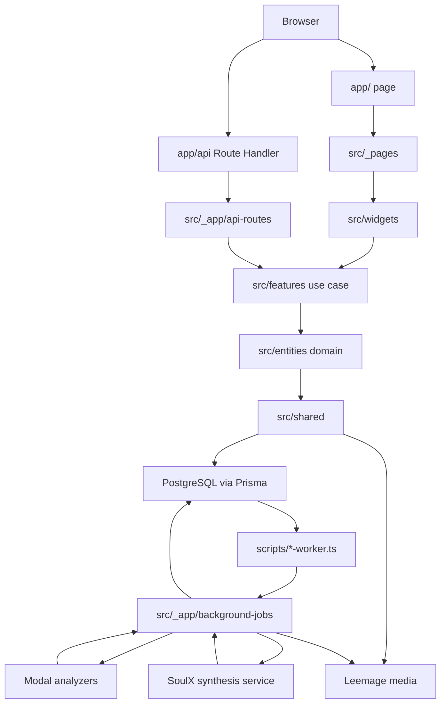
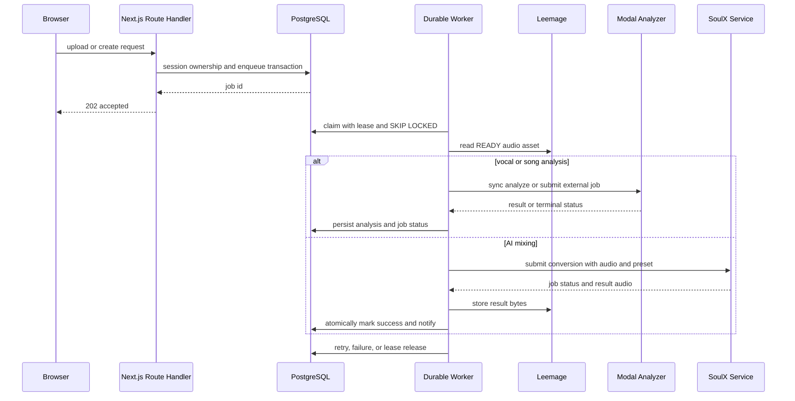

# 시스템 지도와 런타임 경계

이 문서는 현재 추적된 코드와 schema를 기준으로 한 런타임 지도다. `docs/prd/system-architecture.md`는 방향을 설명하는 보조 문서이며, 실제 동작은 아래의 route handler·feature public API·worker·Prisma schema를 우선한다.

## 한눈에 보는 경계

- **Next.js adapter (`app/`)**: App Router page와 Route Handler를 Next.js 규약에 맞게 노출한다. 실제 서버 orchestration은 `src/_app/`의 handler와 provider가 맡는다. 예를 들어 `app/api/vocal-profile-analysis-jobs/route.ts`는 `runtime = "nodejs"`를 선언하고 `_app`의 server entrypoint만 re-export한다.
- **FSD 계층 (`src/`)**: `_app`은 조립·API·worker, `_pages`는 route 화면, `widgets`는 여러 use case를 묶는 UI, `features`는 use case, `entities`는 도메인 모델, `shared`는 DB·media·config·공통 API/UI다. 일반적인 의존 방향은 `_app → _pages → widgets → features → entities → shared`다.
- **public API와 capability**: slice 바깥 소비자는 `@/features/foo`, `@/entities/foo` 같은 root public API를 사용한다. `index.model.ts`는 runtime-neutral contract, `index.ts`는 browser-safe API, `index.server.ts`와 `.server` 모듈은 DB·secret·`server-only` capability를 노출한다. `steiger.config.ts`와 `tests/fsd-architecture-boundaries.test.ts`는 내부 segment 우회와 client→server 도달을 검사한다.
- **데이터와 파일**: 관계·상태·소유권·hash·외부 asset 식별자는 PostgreSQL(Prisma)이 소유하고, 오디오 bytes는 Leemage가 소유한다. `MediaAsset`/`CatalogTargetAsset`은 두 시스템 사이의 metadata pointer다. Leemage 삭제 실패는 `DELETE_PENDING`과 `MediaCleanupJob`으로 durable하게 남긴다.
- **외부 분석·합성**: `services/vocal-profile-modal/`과 `services/song-catalog-analyzer/`는 CPU Modal 분석 adapter이고 `services/vocal-analysis-core/`는 공유 분석 core다. `services/soulx-singer-svc/`는 합성 경계다. 브라우저에는 외부 credential을 주지 않으며 worker가 server-only API key로 호출한다.

이 그림은 브라우저 요청, FSD server capability, durable worker, 외부 서비스와 저장소의 실제 경계를 보여준다.

## 브라우저 요청 경로

짧은 요청은 Route Handler가 `requireApiSession`으로 세션을 확인하고 feature server API를 호출한 뒤 JSON을 반환한다. 예컨대 보컬 분석 POST는 bounded multipart로 `audio`를 읽고, idempotency key·MIME·25 MB 제한을 검증한다. 통과하면 `enqueueVocalProfileAnalysis`가 job을 만들고 `202`와 job payload를 반환한다. GET은 동일한 사용자에게 보이는 job과 정책만 조회한다. mixing·recommendation·catalog·notification도 같은 adapter → `_app` handler → feature/entity → Prisma 경로를 따른다.

소유권 검증은 server-side에서 한다. 따라서 client component가 DB나 secret 모듈을 runtime import하지 않도록 public API와 `.server` 경계를 유지해야 한다. UI는 내부 DB enum을 그대로 전부 재현하지 않고, recommendation 응답에서는 mixing 상태를 `preparing`·`queued`·`processing`·`succeeded`·`failed`로 축약한다. 반면 mixing job API는 `submitted`, `canceled`를 포함한 DB 상태를 소문자로 직렬화한다.

## Durable job과 worker

세 worker entrypoint는 dotenv를 읽은 뒤 server runner를 동적으로 import한다.

- `scripts/vocal-profile-analysis-worker.ts` → vocal profile runner: PostgreSQL의 `PENDING` 또는 만료된 `PROCESSING` job을 claim하고 source asset을 읽어 Modal의 단일 동기 HTTP 분석 결과를 저장한다. 응답의 source bytes·MIME·SHA-256이 queued upload와 다르면 저장하지 않는다. 성공 시 profile metadata와 선택적 synthesis reference를 각각 PostgreSQL/Leemage에 확정하고 알림을 만든다.
- `scripts/song-analysis-worker.ts` → song analysis runner: READY `CatalogTargetAsset`이 있는 job만 claim한다. target bytes를 Modal song analyzer에 제출하고 `externalJobId`를 저장한 뒤 terminal 상태까지 poll한다. 성공한 분석값은 pipeline contract와 함께 `SongAnalysis`에 upsert한다. 따라서 `externalJobId`가 이미 있으면 재제출하지 않고 polling을 재개할 수 있다.
- `scripts/mixing-worker.ts` → mixing runner: reference와 READY catalog target을 Leemage에서 읽고 `SYNTHESIS_PRESET` 및 추천 pitch shift를 포함해 SoulX/Modal `/v1/conversions`에 제출한다. `modalJobId`를 저장하고 상태를 heartbeat하며, 성공 audio를 압축·Leemage에 업로드한 뒤 PostgreSQL transaction으로 job과 성공 알림을 확정한다.

모든 claim은 `attempts < maxAttempts`, `nextAttemptAt` 도달, 그리고 `FOR UPDATE SKIP LOCKED`를 사용한다. 활성 lease가 있는 작업은 중복 claim하지 않으며, lease가 만료되면 다른 worker가 회수할 수 있다. song analysis는 processing 중 별도 heartbeat interval을 사용하고, mixing은 polling loop에서 heartbeat한다.

이 sequence는 일반 API 접수 후 실제 처리와 분석·합성별 외부 경계를 구분한다.

## 혼합 작업의 상태와 실패 의미

`MixingJob`은 `PENDING → PREPARING → SUBMITTED → PROCESSING → SUCCEEDED|FAILED`(또는 사용자 취소 `CANCELED`) 흐름을 가진다. 새 job은 추천 item의 snapshot인 `vocalProfileId`, `songAnalysisId`, `referenceAssetId`, `targetAssetId`, `catalogRevision`, `scoringVersion`, `recommendedShift`를 보존한다. 그러므로 이후 추천 결과가 바뀌어도 실행 중인 job의 입력 의미가 바뀌지 않는다.

믹싱 preflight/다운로드/접수 단계의 일시 HTTP 오류는 bounded exponential backoff로 재시도하며, `maxAttempts`를 넘거나 비재시도 오류면 terminal `FAILED`가 된다. 접수 전에 실패한 경우에만 `refundState = REQUIRED`로 두고 idempotency key를 가진 ticket refund가 한 번 실행된다. 외부 job이 이미 접수된 뒤의 실패에는 자동 환불하지 않는다. 성공 결과 업로드 뒤 DB transaction이 실패하면 결과 asset을 폐기해 orphan bytes를 줄인다.

보컬 분석 실패도 오류 code·detail·retryable과 함께 기록하고, ticket cost가 있으면 `REQUIRED → REFUNDED` 보상 경로를 사용한다. 분석 source가 없어졌거나 analyzer가 다른 bytes를 반환한 경우는 조용한 fallback 없이 실패한다. song analysis는 재시도 시 외부 제출 전 상태로 되돌릴 수 있고, 완료된 분석은 pipeline contract별 unique key로 upsert된다.

## 저장·보안 불변식

1. 사용자 데이터 조회·변경은 session과 resource ownership을 server에서 검증하고, 관리자 경로는 별도 allowlist를 확인한다.
2. 브라우저는 Modal·SoulX·Leemage credential을 직접 사용하지 않는다. key는 server와 worker 환경에만 둔다.
3. PostgreSQL schema 변경은 `prisma/migrations/`를 통해서만 한다. job·ticket·notification 상태와 외부 asset reference는 DB가 source of truth다.
4. Modal vocal analyzer는 request-scoped temporary directory만 사용하며 사용자 데이터를 Volume/Dict/PostgreSQL/Leemage에 보관하지 않는다. production mixing의 target은 진단용 `/v1/song-target`이 아니라 사전 등록된 READY Leemage catalog asset이다.
5. `Recording` 하나에 analyzer/version별 여러 `VocalProfile`이 가능하고, `SongSource` 하나에도 여러 target asset이 가능하다. 현재 추천 대상은 공개 catalog entry와 active source/current analysis/target 연결로 결정된다.

## 실행·검증 포인트

개발과 운영의 기본 프로세스는 `package.json`의 `dev`/`start`가 web과 세 worker를 함께 실행하는 구성이다. 개별 운영 점검은 `pnpm run worker:mixing`, `pnpm run worker:vocal-profile-analysis`, `pnpm run worker:song-analysis`를 사용한다. Modal vocal service의 현재 baseline은 CPU 2 core, 4096 MiB, timeout 120초, scale-to-zero이며 `X-API-Key` 인증을 요구한다.

변경 시 특히 다음 검증을 통과해야 한다.

- `pnpm run test:architecture-boundaries`: FSD public API 우회와 client에서 server capability로 이어지는 runtime import를 검사한다.
- `pnpm run test:vocal-profile-analysis-queue`, `pnpm run test:mixing:db`: enqueue transaction, idempotency, lease·상태·환불 같은 durable 경계를 검증한다.
- `pnpm run test:media`, `pnpm run test:catalog-targets`: Leemage asset lifecycle과 READY target 전제를 검증한다.
- `services/vocal-profile-modal/test_*.py`: analyzer transport, source envelope, runtime 계약을 검증한다.

새 외부 provider나 긴 작업을 추가할 때는 브라우저 호출이 아니라 server feature adapter와 PostgreSQL job/lease owner를 먼저 만들고, bytes는 Leemage pointer로 분리한다. 그 다음 `scripts/*-worker.ts`의 독립 process와 bounded retry·cleanup·notification을 연결해야 이 시스템의 내구성 경계를 보존할 수 있다.
