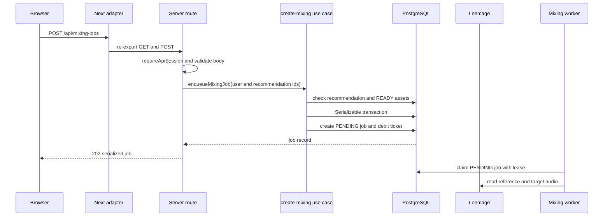
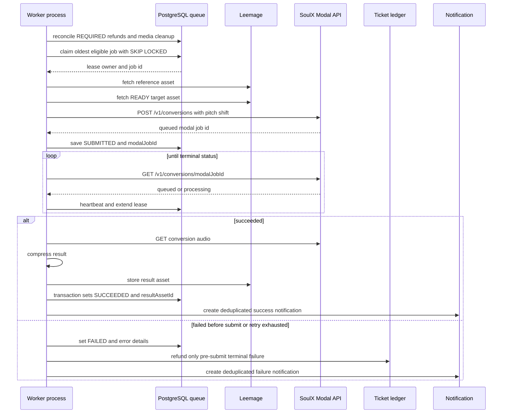

# 시스템 지도와 런타임 경계

이 페이지는 Copysinger의 **현재 실행 경로**를 빠르게 찾기 위한 지도다. 브라우저 요청은 Next.js의 얇은 adapter를 통해 서버 use case를 호출하고, 오래 걸리는 분석·믹싱은 PostgreSQL에 durable job으로 기록한 뒤 독립 worker가 처리한다. 다음 페이지도 함께 읽으면 좋다: [데이터 모델](./data-model.md), [모듈 경계](./module-boundaries.md), [외부 서비스](../integrations/external-services.md), [Job 처리](../operations/job-processing.md).

> 이 문서의 “현재”는 tracked source, Prisma schema, 설정과 테스트가 확인하는 동작이다. PRD의 제품 요구사항이나 향후 설계는 현재 실행 사실로 해석하지 않는다. 시스템의 상위 의도는 `docs/prd/system-architecture.md`에 있지만, 세부 사실은 해당 source를 우선한다.

## 한눈에 보는 경계

| 경계 | 현재 위치 | 책임과 허용 범위 |
| --- | --- | --- |
| Next.js adapter | `app/` | App Router의 page·Route Handler 규약을 맞추는 얇은 진입점이다. API Route Handler는 Node.js runtime을 명시하고 FSD public API를 re-export한다. |
| App 조립·서버 orchestration | `src/_app/` | layout, provider, API route 조립, background job runner를 소유한다. |
| Pages·widgets | `src/_pages/`, `src/widgets/` | route 화면과 여러 use case를 조합한다. |
| Features | `src/features/` | 인증, 추천, 믹싱 같은 사용자 action과 use case를 구현한다. |
| Entities | `src/entities/` | 믹싱 작업, 티켓, 보컬 프로필, 곡 같은 domain model과 domain UI를 구현한다. |
| Shared | `src/shared/` | PostgreSQL 접근, config, media storage, 공통 API·UI와 library를 제공한다. |
| 비동기 실행 | `scripts/*-worker.ts`, `src/_app/background-jobs/` | PostgreSQL job을 claim하고 Modal CPU analyzer 또는 SoulX-Singer Modal API를 호출한다. 세 worker는 별도 script entrypoint로 실행된다. |
| 외부 경계 | Leemage, Modal | 오디오 bytes는 Leemage에 두고, 분석·변환은 배포된 Modal 서비스에 위임한다. |

### FSD 방향과 server 경계는 별개의 규칙이다

slice 사이의 의존 방향은 다음과 같다.

```text
_app → _pages → widgets → features → entities → shared
```

대상 slice의 내부 파일을 직접 가져오지 말고 root public API를 사용한다. `index.ts`는 browser-safe API, `index.model.ts`는 runtime-neutral contract, `index.server.ts` 또는 `.server` entrypoint는 DB·secret 같은 server capability를 노출한다. 따라서 FSD의 “아래 계층으로 향하는 방향”이 browser/server 경계를 없애지는 않는다. `index.server.ts`를 client component 경로로 끌어오면 안 된다.

root `app/`은 이 규칙을 적용하는 adapter다. 예를 들어 `app/api/mixing-jobs/route.ts`는 `@/_app/api-routes/mixing-jobs/index.server`에서 `GET`과 `POST`를 re-export한다. 전역 layout도 `app/layout.tsx`에서 `_app`의 `RootLayout`과 metadata를 re-export하고, 실제 layout은 `QueryProvider`, `TooltipProvider`, `Toaster`를 서버 쪽 조립 경로에서 구성한다.

이 구조는 `steiger.config.ts`와 `tests/fsd-architecture-boundaries.test.ts`가 검사한다. 테스트는 slice 간 내부 segment 접근을 public API 위반으로 보고, client module이 `.server`·DB·`next/headers`·`next/server`에 도달하는 경로도 검사한다.

## 브라우저 요청 경로

대표적으로 `POST /api/mixing-jobs`는 인증된 사용자의 추천을 믹싱 job으로 전환하는 경로다.



캡션: 믹싱 접수는 즉시 응답하고, 실제 오디오 처리는 PostgreSQL job을 통해 worker로 넘긴다.

실제 `POST` handler는 먼저 `requireApiSession`을 통과시킨다. JSON body가 유효하지 않으면 `400 INVALID_REQUEST`를 반환한다. `enqueueMixingJob`은 다음 조건을 같은 `Serializable` transaction 안에서 확인·기록한다.

1. 사용자 보컬 프로필이 요청 사용자 소유이고 `sourceType`이 `USER`인지 확인한다.
2. 곡 분석이 `READY`인지, 곡이 `ACTIVE`인지 확인한다.
3. 추천의 catalog revision·position과 현재 공개 catalog, analysis, `READY` target asset의 연결이 그대로인지 확인한다. 바뀌었으면 `409 MIXING_RECOMMENDATION_STALE`이다.
4. 사용할 reference asset을 선택할 수 있는지 확인한다. 없으면 `422 MIXING_REFERENCE_UNAVAILABLE`이다.
5. 요청 snapshot을 `MixingJob`에 저장하고, 비용이 0보다 크면 같은 transaction에서 `USAGE_DEBIT` ticket ledger를 만든다.

사용자와 `idempotencyKey`의 조합은 DB unique key다. 같은 입력으로 요청 키를 다시 보내면 기존 job을 반환하며, 다른 프로필·분석을 같은 키로 보내면 `409 IDEMPOTENCY_CONFLICT`다. transaction write conflict는 최대 세 번 재시도한다. 접수 성공의 HTTP status는 `202`이며, 이는 변환 완료를 뜻하지 않는다. 인증 실패는 `401`, 잔액 부족은 `402`, 분류된 `MixingError`는 해당 error status로 응답한다. 분류되지 않은 예외는 `500 MIXING_ENQUEUE_FAILED`이고, 재시도 소진으로 만들어진 `MIXING_ENQUEUE_FAILED`는 `503`으로 응답한다.

`GET /api/mixing-jobs`는 같은 session 경계를 거쳐 `page`, `q`, `status`를 검증하고 사용자 소유의 history를 반환한다. 상세·오디오·삭제 route도 `src/_app/api-routes/mixing-jobs/`의 server public API에 속한다. 외부 API credential을 요구하는 Leemage와 Modal 호출은 브라우저가 아니라 서버와 worker가 수행한다.

## PostgreSQL job과 worker 경로

`MixingJob`은 입력 asset의 ID, `recommendedShift`, catalog/scoring snapshot, `modalJobId`, 시도 횟수, lease, 오류, 결과 asset ID를 함께 보유한다. 상태 enum은 `PENDING → PREPARING → SUBMITTED → PROCESSING → SUCCEEDED` 또는 `FAILED`이며 `CANCELED`도 schema와 API에 존재한다. recommendation 응답은 이 상태를 화면용 소문자 집합으로 축약하지만, mixing job API는 DB 상태를 소문자로 직렬화한다.



캡션: worker는 lease를 갱신하며 외부 변환을 poll하고, 결과 metadata와 알림을 PostgreSQL transaction으로 확정한다.

실행 진입점은 `scripts/mixing-worker.ts`가 환경 파일을 읽고 `runMixingWorker`를 호출하는 방식이다. runner는 설정된 concurrency만큼 lane을 만들고 각 lane에 `process id`, lane 번호, UUID를 합친 owner를 부여한다. job이 없으면 1초 쉰다. `SIGINT`·`SIGTERM`을 받으면 새 loop를 멈춘다.

### claim과 재시작 불변식

`claimNextMixingJob`은 다음을 모두 만족하는 가장 오래된 job을 `FOR UPDATE SKIP LOCKED`로 원자적으로 선택한다.

- `attempts < maxAttempts`
- `nextAttemptAt <= now`
- `PENDING`이거나, `PREPARING`·`SUBMITTED`·`PROCESSING`이고 lease가 없거나 만료됨

claim은 `PENDING`을 `PREPARING`으로 바꾸고 attempts를 증가시키며 owner, heartbeat, lease 만료 시각을 기록한다. 유효한 lease를 가진 작업은 다른 worker가 claim하지 않는다. 외부 job ID가 이미 있으면 worker는 재제출하지 않고 그 ID의 상태를 이어서 조회한다. heartbeat update가 한 행을 갱신하지 못하면 lease 상실로 간주한다.

### 외부 호출과 실패

worker는 `MODAL_API_URL`과 `MODAL_API_KEY`가 없으면 `MODAL_NOT_CONFIGURED`로 중단한다. reference와 target audio를 Leemage의 `externalUrl`에서 읽고, target이 없거나 `READY`가 아니면 `CATALOG_TARGET_UNAVAILABLE`이다. `/v1/conversions`에 reference·target과 `SYNTHESIS_PRESET`을 보내며 `auto_pitch_shift`는 `false`, `pitch_shift`는 job의 `recommendedShift`로 고정한다.

네트워크 오류와 HTTP `408`, `425`, `429`, `5xx`는 단계별 정책에 따라 retryable일 수 있다. retryable 오류는 최대 시도 전까지 exponential backoff(최대 30초) 후 submit 전이면 `PENDING`, submit 후면 `SUBMITTED`로 되돌린다. `MODAL_JOB_FAILED` 같은 외부 terminal 실패는 재시도하지 않고, submit 후 terminal failure는 환불하지 않는다. submit 전 최종 실패는 `refundState=REQUIRED`로 기록한 뒤 `ensureMixingRefund`가 idempotency key `mixing:refund:<job id>`로 한 번 환불하고 `REFUNDED`로 만든다.

성공 시 worker는 변환 audio가 비어 있지 않은지 확인하고 압축한 bytes를 Leemage에 저장한다. 이어 PostgreSQL transaction에서 `SUCCEEDED`, `resultAssetId`, `completedAt`을 기록하고 성공 알림을 만든다. 이 transaction이 실패하면 방금 저장한 result asset을 폐기한다. 실패 시 오류 code/detail과 `retryable`을 저장하고 사용자에게 deduplicated notification을 만든다. 따라서 PostgreSQL에는 상태·소유권·외부 job ID·오류·asset metadata를, 실제 오디오 bytes에는 Leemage를 사용한다.

## 다른 durable worker

같은 구조는 보컬 프로필과 곡 카탈로그 분석에도 적용된다. 분석 job은 PostgreSQL에 먼저 기록되고 `scripts/vocal-profile-analysis-worker.ts` 또는 `scripts/song-analysis-worker.ts`가 `_app/background-jobs/` runner를 시작한다. 보컬 프로필 분석은 Modal CPU analyzer의 단일 동기 HTTP 응답을 기다리며 외부 job ID를 저장하거나 poll하지 않는다. 곡 카탈로그 분석은 Modal에 외부 job을 제출하고 ID를 저장한 뒤 terminal 상태까지 poll한다. 이 구분은 PRD의 바람직한 구조가 아니라 현재 worker 구현의 차이다.

## 운영·변경 시 확인할 것

- 로컬은 PostgreSQL을 먼저 띄우고 `pnpm run db:migrate:deploy`, `pnpm run db:generate`, `pnpm dev`로 웹과 worker를 함께 실행한다. 운영 설정의 이름과 기본값은 `.env.example` 및 `src/shared/config/`에서 확인한다.
- Modal API URL과 key는 server/worker 환경에만 제공한다. client component나 browser bundle에 secret을 넣지 않는다.
- job schema 변경은 `prisma/schema.prisma`를 직접 운영 DB에 맞추지 말고 `prisma/migrations/`로 migration을 만든다.
- 믹싱을 변경할 때는 enqueue transaction, claim 경쟁, lease 만료 복구, submit 전·후 실패, 환불 멱등성, 성공 결과 cleanup을 함께 검토한다.

집중 회귀 테스트는 `tests/mixing-queue.integration.ts`다. 두 owner가 동시에 claim해도 한 명만 얻는지, 만료 lease를 회수하는지, retry 전에는 너무 이른 job을 건너뛰는지, submit 전 오류만 환불되는지, submit 후 실패는 환불하지 않는지, 성공 결과를 저장하고 상태를 확정하는지를 실제 DB 경로로 확인한다. FSD와 client/server 경계는 `tests/fsd-architecture-boundaries.test.ts`를 실행해 검증한다.
