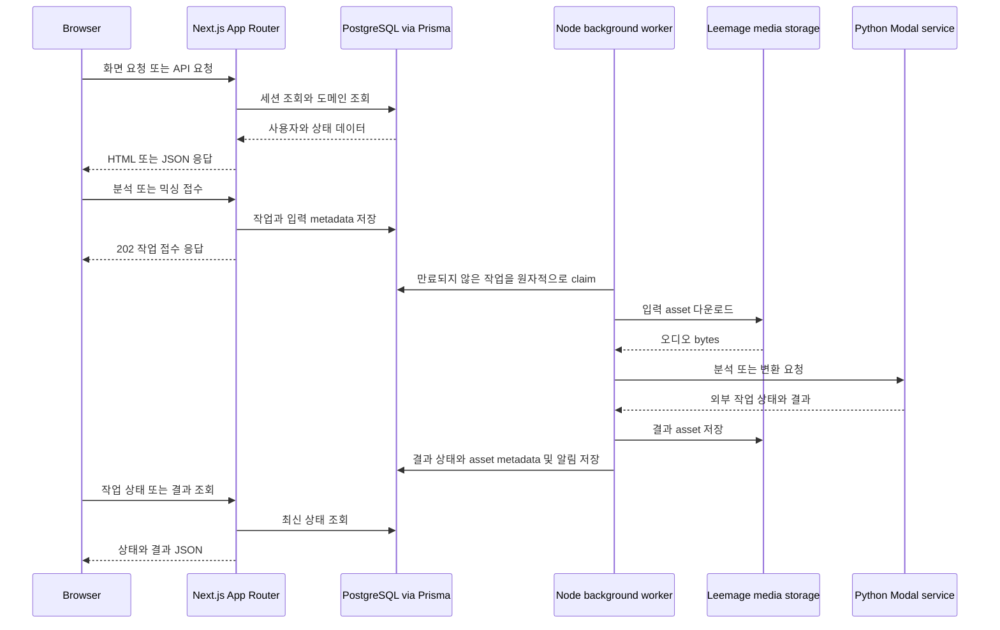

# System Architecture and Runtime Boundaries

## 한눈에 보는 시스템

Copysinger는 브라우저가 직접 무거운 오디오 처리를 수행하는 애플리케이션이 아니라, **Next.js App Router를 동기 웹/API 경계로 두고 PostgreSQL을 작업 상태의 기준 저장소로 사용하는 비동기 시스템**이다. 공개·제품·관리자 화면은 `app`의 얇은 route adapter가 `src/_pages`와 `src/_app`의 public API를 노출하는 구조이며, API도 같은 방식으로 `_app/api-routes`에 위임한다.

이 흐름은 `app/api/mixing-jobs/route.ts`의 Node runtime adapter, `src/_app/api-routes/mixing-jobs/mixing-jobs-route.ts`의 인증·검증·접수, `src/_app/background-jobs/mixing/worker.ts`의 claim과 외부 호출, 그리고 `shared/media`를 통한 asset 저장에서 확인된다. 다만 모든 기능이 같은 외부 경로를 쓰는 것은 아니다. 보컬 프로필 분석과 곡 카탈로그 분석은 별도의 Python Modal analyzer를 사용하고, AI 믹싱은 Modal conversion API를 사용한다.

## 요청 진입점과 표면

### Root `app`는 adapter다

- `app/layout.tsx`는 `@/_app/layout/index.server`의 `RootLayout`과 metadata를 export한다.
- `app/(product)/layout.tsx`는 `ProductLayout`을 export한다. 인증된 요청에만 `ProductShell`과 onboarding snapshot을 추가하고, 인증되지 않은 요청은 children을 그대로 통과시킨다. 실제 각 페이지의 정확한 callback URL 인증은 페이지가 담당한다.
- 제품·공개·관리자 `page.tsx` 파일은 구현을 포함하지 않고 `_pages/*`의 page public API를 re-export한다. 예를 들어 `/profile`은 `@/_pages/profile/index.server`를 통해 `ProfilePage`를 노출한다.
- `app/api/**/route.ts`는 HTTP method와 필요한 정적 route config만 선언하고 `_app/api-routes/**`의 handler를 re-export한다. `/api/mixing-jobs`는 `runtime = "nodejs"`이며 `GET`과 `POST`를 제공한다.

따라서 App Router 파일에 업무 로직, 데이터 접근, 임의 helper를 추가하는 것은 경계를 우회하는 변경이다. 새 웹 진입점은 `_pages` 또는 `_app`의 public API를 만들고 route adapter에서는 그것을 연결해야 한다.

### 브라우저·페이지·API의 역할 분리

페이지 public API는 서버 세션 검사를 포함할 수 있다. `ProfilePage`는 `requirePageSession("/profile")`을 호출한 뒤 `VocalProfileWorkbench`를 렌더링한다. 반면 API handler는 `requireApiSession(request)`으로 인증하고, 실패 시 `401`을 반환한다. 예컨대 믹싱 `POST`는 Zod schema를 먼저 검증하고, 성공하면 `enqueueMixingJob`을 호출한 뒤 `202`와 직렬화된 job을 반환한다. 티켓 부족은 `402`, 잘못된 요청은 `400`, enqueue 실패는 `500`으로 외부 표면에 표현된다.

브라우저용 서버 상태와 전역 UI 기반은 root layout이 제공한다. `RootLayout`은 `QueryProvider`, `TooltipProvider`, `Toaster`, 전역 CSS와 한국어 문서 언어를 설치한다. 이 레이어는 도메인 업무를 소유하지 않고 앱 전체의 실행 기반만 조립한다.

## FSD 소유권과 의존 방향

디렉터리 이름만으로 판단하지 않고 현재 Steiger 설정과 architecture test가 실제로 강제하는 모델은 다음과 같다.

- `src/_app`: App layer다. layout, providers, metadata, API route entrypoint, background-job runner를 소유한다.
- `src/_pages`: 페이지 조합과 페이지 UI를 소유한다.
- `src/widgets`: 여러 기능을 묶는 화면 단위 조합을 소유한다.
- `src/features`: 사용자 행동과 유스케이스를 소유한다. 예를 들면 인증, 믹싱 접수, 보컬 분석, 카탈로그 관리가 여기에 있다.
- `src/entities`: 도메인 객체와 영속성 규칙을 소유한다. ticket, mixing job, vocal profile, notification 같은 상태의 조회·변경 API가 대표적이다.
- `src/shared`: DB client, config, media, audio, UI처럼 전역 기반을 소유한다. 생성된 Prisma client는 `src/shared/db/generated/**` 예외로 명시되어 있다.

FSD public API는 각 slice의 `index` 또는 `index.server`다. 다른 slice가 `api`, `model`, `ui`, `lib`, `config` 같은 내부 segment를 직접 import하지 않고 `@/layer/slice` public API를 사용해야 한다. architecture test는 cross-slice 내부 segment import를 거부하고, type-only import은 runtime client graph 위반으로 세지 않는다.

추가로 client graph는 `"use client"`에서 시작해 runtime import를 따라가며 `server-only`, `next/headers`, `next/server`, `@/shared/db`에 도달하는 것을 금지한다. 즉 브라우저 컴포넌트에 DB·request header·서버 전용 기능을 transitive하게 끌어오지 말고, 서버 조합과 API를 경계로 사용해야 한다. 이 테스트는 직접 import뿐 아니라 재-export를 통한 간접 도달도 검사한다.

## PostgreSQL 작업 큐와 worker 수명주기

웹 요청은 분석·믹싱 자체를 기다리지 않고 DB에 job을 기록한다. `scripts/mixing-worker.ts`, `scripts/song-analysis-worker.ts`, `scripts/vocal-profile-analysis-worker.ts`는 환경 변수를 로드한 뒤 각각 `_app/background-jobs/*/index.server`의 runner를 동적 import해 별도 프로세스로 실행한다. 로컬 `pnpm dev`에서는 웹과 이 worker들이 함께 시작된다.

각 runner는 설정된 concurrency만큼 lane을 만들고, lane마다 process ID·index·random UUID 조합의 owner를 만든다. worker의 claim SQL은 `FOR UPDATE SKIP LOCKED`로 경쟁하는 worker를 분리하고, `attempts < maxAttempts`, `nextAttemptAt <= now`, 그리고 pending 또는 lease 만료 상태만 선택한다. claim 시 owner, lease 만료 시각, heartbeat, 시작 시각, attempts를 원자적으로 갱신한다. 이 때문에 프로세스가 죽으면 lease가 만료된 job을 다른 worker가 회수할 수 있다.

- **보컬 분석**: `VocalProfileAnalysisJob`을 claim하고 입력 asset bytes를 분석 client에 전달한다. 성공 시 프로필과 job을 transaction으로 완료하고 성공 알림을 기록한다. 실패 시 retryable이면 지연 후 `PENDING`으로 돌리고, 최종 실패면 `FAILED`와 `refundState = REQUIRED`를 기록한 뒤 환불 reconciliation이 티켓을 되돌린다.
- **곡 분석**: 준비된 `CatalogTargetAsset`이 있는 job만 claim한다. Modal analyzer에 `requestId`, YouTube video ID, audio bytes와 metadata를 제출하고 외부 job을 저장한 뒤 polling한다. 성공 결과는 pipeline contract와 함께 `SongAnalysis`에 upsert한다. 실패는 backoff와 max-attempts를 적용해 재시도하거나 `FAILED`로 확정한다.
- **AI 믹싱**: claim 후 레퍼런스 asset과 준비된 catalog target을 읽고 `POST /v1/conversions`로 `prompt_audio`, `target_audio`, preset과 추천 pitch shift를 보낸다. 반환된 외부 job ID를 `SUBMITTED`로 저장하고 polling한다. 성공 결과는 압축해 Leemage에 저장한 뒤 DB transaction에서 job을 `SUCCEEDED`로, result asset과 알림을 함께 기록한다.

믹싱 worker는 매 cycle마다 required 환불과 media cleanup도 reconciliation한다. 외부 Modal 접수 전에 실패하면 환불을 요구하고, 접수 후 실패하면 외부 작업이 이미 존재할 수 있으므로 자동 환불하지 않는다. 재시도 가능한 HTTP 상태와 네트워크 오류는 backoff 대상이지만, 설정 누락·잘못된 응답·빈 audio·준비되지 않은 target 같은 preflight 오류는 즉시 재시도 불가로 분류된다. SIGINT와 SIGTERM은 runner를 중지시켜 현재 lane이 안전하게 빠져나가도록 한다.

## Python Modal 서비스 경계

Python 서비스는 Next.js 프로세스 안에 import되는 라이브러리가 아니라 HTTP 외부 서비스다. `services/song-catalog-analyzer/modal_app.py`는 CPU·메모리·container 수·timeout·Modal retry를 가진 catalog analyzer image를 정의하고, FastAPI endpoint에서 API key를 검증한다. 업로드 확장자, YouTube video ID, 빈 입력, 100 MB 상한을 검증한 뒤 FFmpeg로 표준화하고 Demucs로 vocal stem을 분리한다. 이후 librosa와 공유 `vocal-analysis-core`로 pitch·key·음성 descriptor를 생성한다.

곡 분석 worker는 `submitSongAnalysis`와 `pollSongAnalysis`를 통해 이 외부 계약을 감싼다. 믹싱 worker는 `MODAL_API_URL`, `MODAL_API_KEY`를 읽어 `/v1/conversions`, `/v1/conversions/{id}`, `/audio`를 호출한다. 따라서 Modal API 계약이나 analyzer version을 바꿀 때에는 해당 feature client, worker persistence contract, Python service test를 함께 변경해야 하며, DB job에 저장된 외부 ID와 pipeline contract의 호환성을 고려해야 한다.

## 상태·데이터·실패의 기준

PostgreSQL은 사용자, 소유권, job 상태, attempts, lease, 외부 job ID, 분석 revision과 파일 metadata의 runtime source of truth다. 실제 오디오 bytes는 Leemage에 두고 DB에는 external URL, MIME type, file name과 관계를 둔다. 카탈로그도 song identity, source revision, analysis revision, 공개 상태와 target asset을 분리하므로 source 교체가 기존 추천·믹싱 근거를 덮어쓰지 않는다.

이 구조의 핵심 불변식은 다음과 같다.

1. 사용자 입력과 결과 asset은 job의 사용자 소유권과 함께 처리되고 API는 세션 없는 요청을 허용하지 않는다.
2. 한 번에 하나의 유효 lease만 job을 처리한다. heartbeat 갱신은 현재 `leaseOwner`와 일치할 때만 성공해야 한다.
3. retry와 환불은 idempotency key를 사용한다. worker가 재시작되어도 티켓 장부와 완료 알림이 중복 기록되지 않아야 한다.
4. 외부 결과를 Leemage에 먼저 저장하더라도 최종 DB transaction이 실패하면 media asset을 폐기해 orphan을 정리한다.
5. 처리 중인 작업은 동기 HTTP 요청의 timeout에 묶이지 않는다. API는 접수 결과를 반환하고, 조회 API와 알림이 eventual completion을 전달한다.

## 설정·운영·변경 지점

DB migration과 Prisma generate가 웹 및 worker가 공유하는 schema client를 준비한다. worker concurrency, lease seconds, polling interval, Modal URL·API key, media storage 설정은 `src/shared/config`와 환경 변수의 단일 경로를 사용한다. 운영 배포에는 PostgreSQL, Google OAuth, Leemage, 배포된 Modal 분석·믹싱 서비스, production audio 변환용 FFmpeg가 필요하다.

안전한 확장은 다음 순서를 따른다.

1. 외부 HTTP 표면이면 `app/api`에 route config와 re-export만 추가한다.
2. 입력·응답 계약과 서버 유스케이스는 feature public API에 둔다.
3. 도메인 상태 변경과 transaction은 entity API에 두고, DB·media·config 접근은 shared 서버 모듈을 통해 사용한다.
4. 오래 걸리는 처리는 DB-backed job과 `_app/background-jobs` runner/worker로 분리하고 lease, retry, notification, 환불 semantics를 명시한다.
5. 새 client UI는 서버 전용 모듈에 runtime import하지 않도록 분리하고 slice public API만 참조한다.

## 실제로 의미 있는 검증

`tests/fsd-architecture-boundaries.test.ts`는 세 가지를 fixture와 실제 project source tree 양쪽에서 검증한다. 첫째 cross-slice 내부 segment import와 public API 우회를 잡는다. 둘째 직접·transitive server import를 client graph에서 잡되 type-only import는 허용한다. 셋째 root `app`가 `_app`·`_pages` public API만 re-export하는 얇은 adapter인지, route config가 정적이고 문서화된 이름만 쓰는지 검사한다. 이 테스트는 디렉터리 관례가 아니라 현재 변경 가능한 의존 방향의 실행 가능한 계약이므로, architecture refactor의 첫 검증 지점으로 삼아야 한다.
