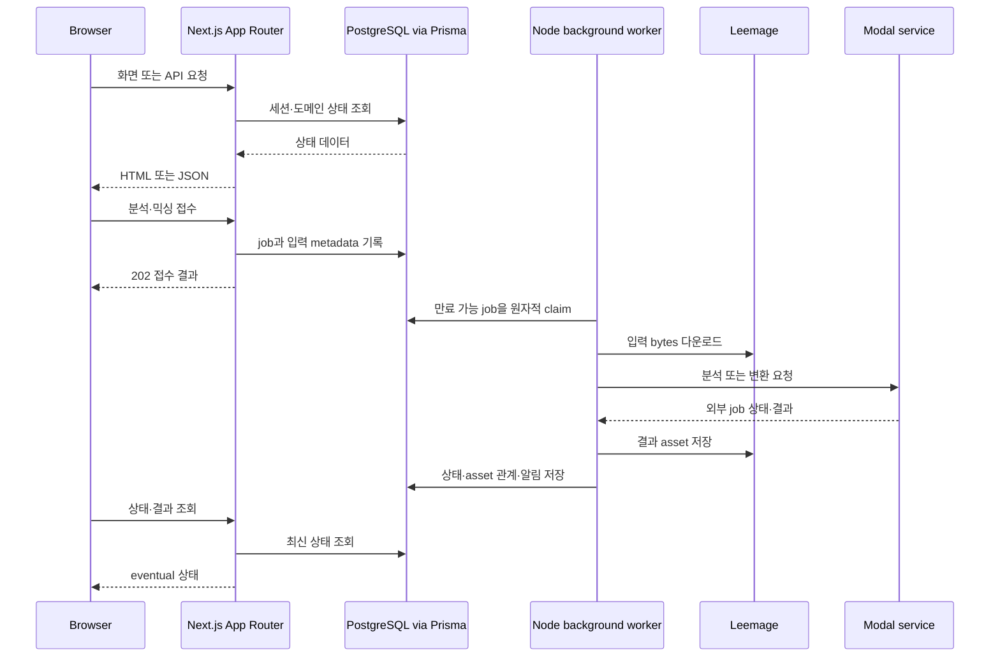
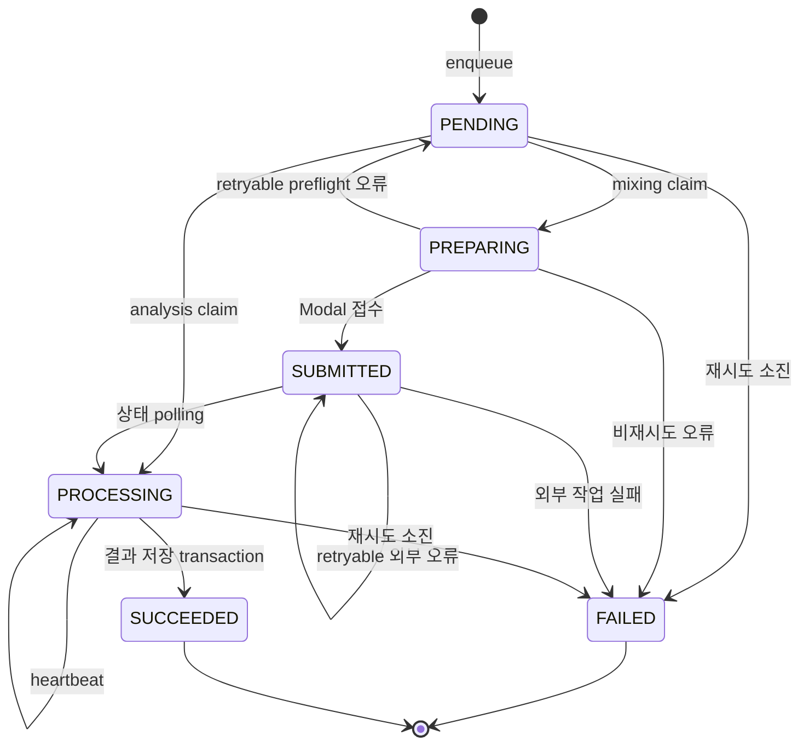

# 시스템 아키텍처와 런타임 경계

## 시스템 개요

Copysinger는 브라우저가 오디오 처리를 기다리는 구조가 아니라 **Next.js App Router를 동기 HTTP 경계로 삼고 PostgreSQL을 durable job의 기준 저장소로 삼는 비동기 시스템**이다. README가 설명하는 구성은 Better Auth·Google OAuth, Prisma·PostgreSQL, Leemage, 세 종류의 background worker와 Modal 기반 분석·믹싱 서비스의 조합이다.

*이 다이어그램은 요청 접수부터 worker 처리와 결과 조회까지의 주요 런타임 경계를 보여준다.*

## HTTP와 FSD 진입점

- `app/layout.tsx`는 `@/_app/layout/index.server`의 `RootLayout`과 metadata를 내보낸다. root layout은 `QueryProvider`, `TooltipProvider`, `Toaster`, 전역 CSS와 한국어 문서 언어를 조립하지만 도메인 업무를 소유하지 않는다.
- 제품 layout은 인증된 요청에 `ProductShell`과 onboarding snapshot을 추가하고, 실제 페이지 구현은 `src/_pages` public API에 둔다. root `page.tsx`들은 `_pages/*/index.server`를 re-export하는 얇은 adapter다.
- `app/api/mixing-jobs/route.ts`는 `runtime = "nodejs"`와 `GET`·`POST` re-export만 선언한다. 실제 handler는 `src/_app/api-routes/mixing-jobs/mixing-jobs-route.ts`에 있으며 `requireApiSession`으로 인증하고, `POST` body를 Zod로 검증한 뒤 `enqueueMixingJob`을 호출한다. 성공은 `202`, 인증 실패는 `401`, 입력 오류는 `400`, 티켓 부족은 `402`, enqueue 미분류 실패는 `500`이다. `GET`은 인증된 사용자 자신의 mixing history만 조회한다.

따라서 App Router adapter에 업무 로직이나 DB 접근을 넣지 않는다. 새 화면은 `_pages` 조합으로, 새 HTTP 표면은 `_app/api-routes`의 public API로 구현하고 route 파일은 연결과 정적 route config만 맡긴다.

## FSD 의존 방향

현재 architecture test가 검사하는 slice는 `_pages`, `widgets`, `features`, `entities`다. 역할은 다음과 같다.

- `src/_app`: layout·provider·metadata·API entrypoint·background-job runner
- `src/_pages`: 페이지 조합과 페이지 UI
- `src/widgets`: 여러 기능을 묶는 화면 단위
- `src/features`: 사용자 행동과 유스케이스
- `src/entities`: 도메인 객체·영속성 규칙과 상태 변경 API
- `src/shared`: DB client, config, media, audio, UI 같은 전역 기반

다른 slice는 `api`, `model`, `ui`, `lib`, `config` 같은 내부 segment가 아니라 `@/layer/slice`의 `index` 또는 `index.server` public API를 사용한다. 예외적으로 같은 slice 내부 참조는 허용된다. `src/shared/db/generated/**`는 architecture scan에서 제외되는 생성 코드다.

`"use client"`에서 시작하는 runtime import graph는 `server-only`, `next/headers`, `next/server`, `@/shared/db` 또는 `.server` entrypoint에 도달하면 안 된다. type-only import는 client runtime graph로 세지 않지만, re-export를 통한 간접 도달도 검사 대상이다.

## PostgreSQL job과 worker lifecycle

웹 요청은 분석·믹싱을 수행하지 않고 job을 PostgreSQL에 기록한 뒤 반환한다. `scripts/mixing-worker.ts`, `scripts/song-analysis-worker.ts`, `scripts/vocal-profile-analysis-worker.ts`가 각각 runner를 별도 프로세스로 실행하며, 로컬 `pnpm dev`에서는 웹과 세 worker가 함께 시작된다. runner는 설정된 concurrency만큼 lane을 만들고 각 lane의 owner를 process ID·lane index·random UUID로 구성한다. SIGINT/SIGTERM은 새 cycle을 멈추고 lane들이 빠져나가게 한다.

claim은 `FOR UPDATE SKIP LOCKED`와 한 번의 UPDATE로 수행된다. `attempts < maxAttempts`, `nextAttemptAt <= now`인 job 중 새 `PENDING` 또는 lease가 없거나 만료된 처리 중 job만 고른다. 유효한 lease를 가진 다른 worker의 job은 고르지 않는다. claim은 owner, lease 만료 시각, heartbeat, 시작 시각과 attempts를 갱신한다. 따라서 worker가 죽어도 lease 만료 뒤 다른 worker가 회수할 수 있고, heartbeat는 현재 owner일 때만 lease를 연장한다.

*믹싱과 분석 job에서 공통으로 관찰되는 claim·재시도·완료 흐름이다. 구체적인 enum 전이는 job 종류별로 다르다.*

세 worker의 책임은 다르다.

- **보컬 프로필 분석**은 사용자 `REFERENCE` asset을 owner와 함께 읽고 분석 client에 전달한다. source bytes·MIME type·SHA-256이 queued source와 일치하는지 확인한 뒤 프로필과 job 완료, 성공 알림을 transaction으로 저장한다. 최종 실패는 `FAILED`와 `refundState = REQUIRED`로 만들고 source asset을 정리한 후 idempotent 환불 reconciliation을 수행한다.
- **곡 카탈로그 분석**은 `CatalogTargetAsset`이 `READY`인 job만 claim한다. target bytes와 YouTube metadata를 Modal analyzer에 제출하고 external job ID를 저장한 뒤 polling한다. 성공 결과는 pipeline contract와 함께 `SongAnalysis`에 upsert하고, 실패는 backoff·max attempts에 따라 `PENDING` 재시도 또는 `FAILED` 확정한다.
- **AI 믹싱**은 reference와 catalog target을 다운로드해 `prompt_audio`, `target_audio`, preset과 추천 pitch shift를 `/v1/conversions`에 보낸다. queued external ID는 `SUBMITTED`로 저장하고 polling한다. 성공 audio는 압축 후 Leemage에 저장하고 DB transaction에서 job·결과 asset 관계·알림을 함께 확정한다.

## Modal과 미디어 경계

Modal은 Next.js 프로세스에 import되는 라이브러리가 아니라 HTTP 외부 서비스다. 곡 analyzer는 별도 CPU 서비스로 업로드 확장자, YouTube video ID, 빈 입력과 100 MB 제한을 검증한 뒤 FFmpeg·Demucs·librosa 기반 분석을 수행한다. 곡 worker는 `submitSongAnalysis`/`pollSongAnalysis`로 그 계약을 감싼다. 믹싱 worker는 `MODAL_API_URL`·`MODAL_API_KEY`로 `/v1/conversions`, `/v1/conversions/{id}`, `/audio`를 호출한다.

실제 media bytes는 Leemage에 저장하고 PostgreSQL에는 사용자 소유권, external URL, MIME type, file name, 크기와 관계 metadata를 둔다. 외부 접수 전 실패는 mixing ticket 환불을 `REQUIRED`로 기록한 뒤 reconciliation하며, Modal job이 이미 접수된 뒤의 실패는 외부 작업이 존재할 수 있으므로 자동 환불하지 않는다.

## 불변식과 실패 semantics

1. job·입력 asset·결과 asset은 사용자 소유권과 함께 조회·변경한다. 인증 없는 API 요청은 허용하지 않는다.
2. 유효 lease는 하나만 인정한다. heartbeat와 상태 갱신은 해당 `leaseOwner`를 조건으로 해야 한다.
3. idempotency key는 중복 접수와 ticket ledger 환불을 막는다. 같은 mixing 요청을 동시에 enqueue해도 하나의 job과 하나의 debit만 남는다.
4. retryable 네트워크·HTTP 오류는 지연 후 재시도한다. 설정 누락, 잘못된 Modal 응답, 빈 audio, 준비되지 않은 target 같은 preflight 오류는 재시도하지 않는다. 최종 실패는 error code/detail, 완료 시각, 알림을 남긴다.
5. Modal 결과를 Leemage에 먼저 저장할 수 있으므로, 결과 asset을 DB transaction에서 연결·`SUCCEEDED`로 확정하지 못하면 `discardMediaAsset`으로 orphan을 정리한다. 이 실패는 외부 작업 이후이므로 환불하지 않는다.
6. 장시간 처리는 HTTP timeout과 분리된다. API는 접수 결과를 반환하고 상태 조회와 notification이 eventual completion을 전달한다.

## 설정과 안전한 변경 지점

worker concurrency, lease seconds, polling interval, Modal endpoint/key와 Leemage 설정은 `src/shared/config` 및 환경 변수의 단일 경로를 사용한다. 운영에는 PostgreSQL, Google OAuth, Leemage, 배포된 Modal 분석·믹싱 서비스와 production audio 변환용 FFmpeg가 필요하다. 비밀값 자체나 ignored 환경 파일 값은 문서에 기록하지 않는다.

안전한 변경 순서는 다음과 같다.

1. HTTP 표면은 `app/api`에 정적 config와 public API re-export만 추가한다.
2. 입력·응답 계약과 서버 유스케이스는 feature public API에 둔다.
3. 상태 변경·transaction은 entity API에 두고 DB·media·config 접근은 shared 서버 모듈을 사용한다.
4. 장시간 처리는 해당 DB job의 state, lease, retry, external ID, notification·환불 규칙을 먼저 정한 뒤 `_app/background-jobs` runner/worker에 연결한다.
5. Modal API나 pipeline contract를 바꾸면 feature client, worker persistence, Python service test와 저장된 external ID 호환성을 함께 검토한다.
6. client UI는 server-only 모듈을 runtime import하지 않고 slice public API만 참조한다.

## 집중 검증 지점

`tests/fsd-architecture-boundaries.test.ts`는 실제 project source tree와 fixture를 대상으로 (1) cross-slice 내부 segment import, (2) 직접·transitive server import의 client graph 유입, (3) root `app` adapter와 정적·허용된 route config를 검사한다. architecture refactor 때 첫 검증 지점이다.

`tests/mixing-queue.integration.ts`는 PostgreSQL을 사용해 동시 enqueue의 idempotency와 단일 debit, `SKIP LOCKED` 경쟁 claim, 만료 lease recovery, preflight 실패 환불, retry backoff/max attempts, Modal 접수 후 실패 시 무환불, finalization 실패 시 `SUBMITTED` 재시도와 media cleanup 경계를 검증한다. worker lifecycle이나 ticket/media semantics를 바꿀 때 이 테스트를 우선 실행하고, Modal 계약을 바꿀 때는 analyzer·client 계약 테스트도 함께 갱신한다.
