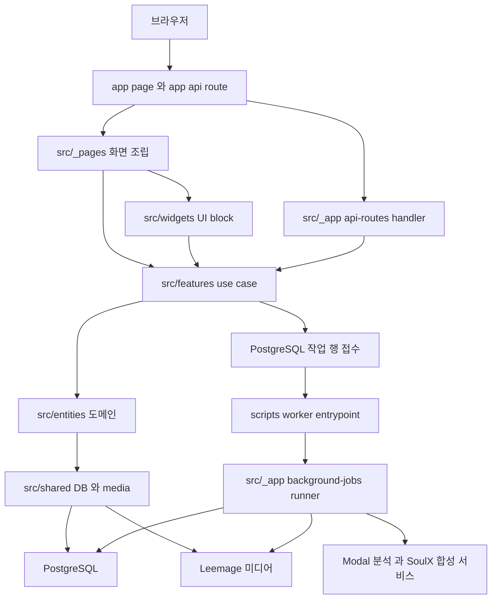
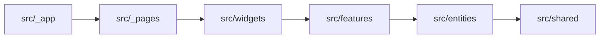

이 저장소에는 런타임이 두 갈래로 있어요. 브라우저 요청을 그 자리에서 처리하는 Next.js 서버와, PostgreSQL에 접수된 오래 걸리는 작업을 이어받는 독립 워커 프로세스예요. 그래서 새 코드의 자리를 정하는 첫 질문은 "이 코드가 어느 런타임에서 도는가"이고, 두 번째 질문은 "웹 코드라면 FSD(Feature-Sliced Design) 계층 중 어느 책임인가"예요. 애플리케이션 밖에는 Knowledge 문서 자동화를 돌리는 `ops/`와 `.github/workflows/`가 따로 있어요.

두 축이 정해지면 디렉터리와 import 대상까지 함께 정해져요. 바로 아래 표가 각 경계가 무엇을 소유하고 무엇을 거부하는지 답하고, 애플리케이션 밖에 있는 `ops/`와 `.github/workflows/`도 같은 표에 넣었어요. 그다음 두 절이 경계를 만든 런타임 분리와 계층 의존 방향을 설명해요. 사람이 관리하는 상위 경계 설명은 [docs/prd/system-architecture.md](repo://docs/prd/system-architecture.md#L7-L27)와 [docs/agents/constitution.md](repo://docs/agents/constitution.md#L22-L31)에 있고, 이 페이지는 tracked 코드·설정·테스트에서 그 내용을 다시 확인한 결과예요.

## 경계마다 두는 것과 두지 않는 것

| 경계 | 무엇을 두는가 | 무엇을 두지 않는가 |
| --- | --- | --- |
| `app/` (Next.js adapter) | App Router 규약을 맞추는 page·layout·loading·error·not-found·`route.ts` 파일. `@/_app/*`·`@/_pages/*` public API re-export와 정적 route config | 비즈니스 로직, `src/_app`·`src/_pages` public API 밖의 내부 모듈 import, import·export·directive와 route config 변수 선언 외의 문장 |
| `src/_app/` (App layer) | root·product layout, provider, `robots`·`sitemap` metadata, 폰트·전역 스타일, HTTP handler(`api-routes/`), 오래 걸리는 백그라운드 작업 러너와 워커(`background-jobs/`) | 특정 도메인의 계산·조회 규칙. 그 규칙은 `features`·`entities`가 소유하고 여기서는 호출만 해요 |
| `src/_pages/` | URL 하나에 대응하는 화면 조립과 route별 metadata·loading·not-found 컴포넌트 | 재사용 가능한 use case, DB 접근, 여러 화면이 공유하는 순수 로직 |
| `src/widgets/` | 독립적으로 재사용되는 화면 block(제품 shell, 라이브러리 목록, 생성 funnel)과 그 block이 필요로 하는 client·server public API | 특정 route의 URL·metadata 결정, 도메인 영속 로직 |
| `src/features/` | 사용자 action과 application use case(인증, 보컬 분석 접수, 추천 생성, 믹싱 접수, 관리자 조작) | HTTP 응답 형태 결정(`src/_app/api-routes/` 책임), Next.js route 규약, 도메인 테이블의 단독 소유 |
| `src/entities/` | 도메인 model·계약·표시 로직과 도메인 API(보컬 프로필, 추천, 곡 카탈로그, 믹싱 작업, 티켓, 알림) | 여러 도메인을 조합한 use case, 화면 조립 |
| `src/shared/` | 도메인을 모르는 공통 기반 — DB client, Leemage 미디어, config와 환경 변수, API 오류·요청 파싱, admission limiter, 공용 UI와 범용 library | 특정 도메인의 규칙. 도메인 이름이 들어가면 `entities`나 `features`로 올라가요 |
| `prisma/` | `schema.prisma`, `migrations/`, development seed | 애플리케이션 조회 로직. 생성된 Prisma client는 `src/shared/db/generated/prisma`로 출력되고 Git에 커밋하지 않아요 |
| `scripts/*-worker.ts` | 워커 프로세스 entrypoint(믹싱·보컬 프로필 분석·곡 분석)와 운영·검증 script(`reconcile-*`, `recover-*`, `verify-*`, `benchmark-*`) | 재사용되는 domain 로직. entrypoint는 환경 변수를 읽고 `src/_app/background-jobs/`의 실행 함수를 import하는 짧은 파일이에요 |
| `services/` (Python Modal 서비스) | HTTP 계약을 가진 Modal app(`vocal-profile-modal`, `song-catalog-analyzer`, `soulx-singer-svc`)과 두 분석 서비스가 이미지에 함께 패키징하는 공유 core(`vocal-analysis-core`) | Node.js 코드, DB 직접 접근, 검증되지 않은 로컬 분석 fallback |
| `ops/knowledge-dispatcher/` | Coolify가 스케줄하는 작은 Node 컨테이너. 한국 시간 기준 사이클을 판정하고 GitHub Actions API로 Knowledge 워크플로를 디스패치하는 `dispatch.mjs`와 그 파일을 담아 8080 포트를 노출하는 이미지 정의 | 애플리케이션 런타임 코드. DB·`src/`·`app/`에 의존하지 않고 GitHub Actions API만 호출해요 |
| `.github/workflows/` | 이번 생성 입력에서 확인된 tracked 워크플로 파일. 현재 Knowledge 생성용 `lee-spec-kit-knowledge.yml` 하나예요 | 애플리케이션 빌드·테스트를 실행하는 워크플로. 그런 워크플로는 확인되지 않았어요 |
| 외부 미디어 저장소(Leemage) | 권한이 확인된 오디오 바이트 | 관계·상태·소유권·해시·외부 자산 참조. 그 값들은 PostgreSQL에 남아요 |

`app/` 행은 실제 파일에서 그대로 확인돼요. [app/api/mixing-jobs/route.ts](repo://app/api/mixing-jobs/route.ts#L1-L3)는 `runtime` 선언과 handler re-export 두 문장으로 끝나고, [app/admin/page.tsx](repo://app/admin/page.tsx#L1-L1)와 [app/robots.ts](repo://app/robots.ts#L1-L1)도 re-export 한 줄이에요. `src/_app/`은 이 adapter 뒤의 실제 조립을 맡아요 — [layout/index.server.ts](repo://src/_app/layout/index.server.ts#L1-L4)가 root·product layout과 metadata를, [api-routes/mixing-jobs/index.server.ts](repo://src/_app/api-routes/mixing-jobs/index.server.ts#L1-L5)가 HTTP handler 묶음을 내보내요.

`prisma/` 경계는 스키마와 migration이 한 곳에 있어야 한다는 규칙이에요. [prisma/schema.prisma](repo://prisma/schema.prisma#L1-L8)의 generator가 client를 `src/shared/db/generated/prisma`로 출력하고, 그 경로는 [.gitignore](repo://.gitignore#L46-L47)에 들어 있어요. seed와 migration 경로는 [prisma.config.ts](repo://prisma.config.ts#L6-L15)가 정해요.

`services/`는 웹 트리 밖의 Python 런타임이에요. [services/vocal-analysis-core/README.md](repo://services/vocal-analysis-core/README.md#L1-L7)가 밝히듯 이 core는 두 인증된 Modal CPU 서비스가 함께 패키징하는 librosa·pYIN 분석 package이고, HTTP 서버도 로컬 분석 런타임도 제공하지 않아요.

최상위 `ops/`는 웹·워커가 아닌 운영 자동화 코드를 두는 자리예요. 이번 생성 입력에서 확인되는 항목은 Coolify가 스케줄하는 작은 Node 컨테이너 `ops/knowledge-dispatcher/` 하나이고, 이 컨테이너가 [dispatch.mjs](repo://ops/knowledge-dispatcher/dispatch.mjs#L30-L80)로 Knowledge 워크플로 실행을 디스패치해요. 스케줄링 주체가 Coolify라는 책임 구분은 워크플로 헤더 주석에도 적혀 있고([.github/workflows/lee-spec-kit-knowledge.yml](repo://.github/workflows/lee-spec-kit-knowledge.yml#L1-L5)), 컨테이너 환경은 [Dockerfile](repo://ops/knowledge-dispatcher/Dockerfile#L1-L6)이 `node:22-alpine` 이미지에 이 파일을 복사하고 8080 포트를 노출하도록 정의해요. 컨테이너가 돌리는 코드의 import는 Node 내장 모듈 `node:http`·`node:path`·`node:url` 세 개뿐이고([dispatch.mjs](repo://ops/knowledge-dispatcher/dispatch.mjs#L1-L3)), 애플리케이션 DB나 `src/`·`app/` 코드에는 손대지 않으므로 두 런타임 갈래에는 속하지 않아요.

`.github/workflows/`에는 이번 생성 입력에서 [.github/workflows/lee-spec-kit-knowledge.yml](repo://.github/workflows/lee-spec-kit-knowledge.yml#L1-L27) 하나만 tracked 상태로 확인돼요. 이 파일의 작업은 Knowledge 생성을 맡는 `knowledge`([.github/workflows/lee-spec-kit-knowledge.yml](repo://.github/workflows/lee-spec-kit-knowledge.yml#L23-L24))와 Knowledge PR 안전 검사를 맡는 `verify-knowledge-pr`([.github/workflows/lee-spec-kit-knowledge.yml](repo://.github/workflows/lee-spec-kit-knowledge.yml#L411-L412)) 두 개이고, 애플리케이션 빌드·테스트를 실행하는 워크플로는 확인되지 않았어요. 그 검증 명령은 [package.json](repo://package.json#L23-L34)의 `test`·`check` script로 돌려요. 디스패처 판정 규칙과 워크플로 트리거·게이트는 [Knowledge 생성과 CI 자동화](../operations/knowledge-automation.md)가 소유하니 그 페이지에서 확인하세요.

## 브라우저 요청 경로와 워커 경로가 갈라져요

브라우저는 자기 서버의 경로만 호출하고, 자격 증명이 필요한 Modal 호출과 오디오 바이트 저장은 서버나 워커가 대신해요. 아래 흐름도가 그 분리를 한눈에 보여줘요.

브라우저 요청은 `app/` adapter에서 시작해 FSD 계층을 내려가 PostgreSQL·Leemage에서 끝나고, 오래 걸리는 작업은 같은 두 저장소를 워커 경로로 다시 돈다는 뜻이에요.

요청 쪽에서는 [src/_app/api-routes/admission.ts](repo://src/_app/api-routes/admission.ts#L11-L33)의 `withApiAdmission`이 handler 호출 전에 IP 버킷, 세션 확인, 사용자 그룹별 요청 제한, multipart 업로드 슬롯을 적용해요. 경로별 rate·burst 수치와 오류 봉투 계약은 [HTTP API 표면과 요청 접수 규칙](http-api-surface.md)이 소유해요.

작업 쪽에서는 [src/_app/background-jobs/mixing/runner.ts](repo://src/_app/background-jobs/mixing/runner.ts#L11-L48)가 동시성 설정만큼 lane을 열고 `runMixingWorkerOnce`를 반복 호출하며 실패 시 지수 backoff로 쉬어요. 점유·lease·heartbeat·deadline 규칙은 [Job 큐와 lease 복구 계약](../operations/job-processing.md)이 소유하니 여기서는 다시 그리지 않아요.

`pnpm dev`와 `pnpm start`는 웹과 워커 세 개를 `concurrently --kill-others-on-fail`로 함께 감독해요([package.json](repo://package.json#L10-L21)). 그 감독 때문에 워커 하나가 실패하면 프로세스 묶음 전체가 끝나고, [tests/process-scripts.test.ts](repo://tests/process-scripts.test.ts#L29-L44)가 그 감독 대상과 script 이름을 고정해요. 워커 프로세스는 각각 [scripts/mixing-worker.ts](repo://scripts/mixing-worker.ts#L1-L7), [scripts/vocal-profile-analysis-worker.ts](repo://scripts/vocal-profile-analysis-worker.ts#L1-L9), [scripts/song-analysis-worker.ts](repo://scripts/song-analysis-worker.ts#L1-L6)가 시작하고, 세 파일 모두 환경 변수를 읽은 뒤 `src/_app/background-jobs/**`의 실행 함수를 import하는 짧은 entrypoint예요. 로컬 실행 순서와 배포 절차는 [로컬 실행과 배포](../operations/local-runtime.md)를 보세요.

## 계층은 한 방향으로만 의존해요

웹 코드의 계층 의존 방향이에요. 화살표는 "import할 수 있는 대상"을 가리켜요.

아래 계층이 위 계층을 import하면 경계 위반이에요. 화살표 방향으로 가는 한 중간 계층을 건너뛰는 것은 위반이 아니에요. 실제로 [src/_app/layout/product-layout.tsx](repo://src/_app/layout/product-layout.tsx#L1-L10)는 `src/_app`에서 `@/widgets/product-shell`과 `@/features/authentication/index.server`를 함께 import하며 `_pages`를 거치지 않아요. 같은 layer의 다른 slice를 쓸 때도 그 slice의 root public API를 통해요 — [src/features/create-mixing/api/mixing-queue.ts](repo://src/features/create-mixing/api/mixing-queue.ts#L1-L10)가 `@/entities/mixing-job/index.server`와 `@/features/create-recommendation/index.server`를 그렇게 가져와요.

slice 밖에서 내부 segment를 직접 import하면 경계 위반이에요. [tests/fsd-architecture-boundaries.test.ts](repo://tests/fsd-architecture-boundaries.test.ts#L154-L175)가 이 규칙을 TypeScript AST로 검사해요.

| 판단 항목 | 규칙 | 근거 |
| --- | --- | --- |
| 내부로 보는 segment 이름 | `api`·`model`·`ui`·`lib`·`config` 다섯 가지예요 | [검사 상수](repo://tests/fsd-architecture-boundaries.test.ts#L26-L27) |
| slice로 세는 layer | `_pages`·`widgets`·`features`·`entities`예요. `src/_app`과 `src/shared`는 이 검사에서 slice가 아니에요 | [검사 상수](repo://tests/fsd-architecture-boundaries.test.ts#L26-L27) |
| 같은 layer·같은 slice 안의 내부 import | 위반이 아니에요 | [검사 본문](repo://tests/fsd-architecture-boundaries.test.ts#L165-L167) |
| 다른 slice나 slice 밖에서 내부 segment import | 위반이에요. `@/<layer>/<slice>` root public API를 써야 해요 | [검사 본문](repo://tests/fsd-architecture-boundaries.test.ts#L168-L171) |

entrypoint가 무엇을 노출할 수 있는지는 이름으로 구분돼요.

| entrypoint | 노출 범위 | 실제 예 |
| --- | --- | --- |
| `index.ts` | 브라우저에서도 안전한 API — client component, hook, 계약, 표시 로직 | [src/widgets/product-shell/index.ts](repo://src/widgets/product-shell/index.ts#L1-L6) |
| `index.model.ts` | 런타임 중립 계약 — Zod schema와 type. DB·secret 없음 | [src/entities/vocal-profile/index.model.ts](repo://src/entities/vocal-profile/index.model.ts#L1-L8) |
| `index.server.ts` | `server-only`를 먼저 import하고 DB·secret·server capability를 노출 | [src/entities/vocal-profile/index.server.ts](repo://src/entities/vocal-profile/index.server.ts#L1-L6) |
| `<name>.server.ts` | `index.server.ts`와 별도로 server capability를 이름별로 나눠 노출 | [src/entities/vocal-profile/index.analyzer.server.ts](repo://src/entities/vocal-profile/index.analyzer.server.ts#L1-L3), [src/shared/media/index.leemage-client.server.ts](repo://src/shared/media/index.leemage-client.server.ts#L1-L3) |

`index.server.ts`의 첫 줄 `import "server-only"`는 실수로 client bundle에 server 모듈이 섞이는 것을 막는 표시예요([src/entities/vocal-profile/index.server.ts](repo://src/entities/vocal-profile/index.server.ts#L1-L6)). DB client도 `@/shared/db`라는 server entrypoint 밖으로 나가지 않아요([src/shared/db/index.server.ts](repo://src/shared/db/index.server.ts#L1-L14)). 그래서 Route Handler가 입력 schema만 필요할 때는 [src/features/analyze-vocal-profile/index.model.ts](repo://src/features/analyze-vocal-profile/index.model.ts#L1-L1)처럼 `index.model.ts`를 써요.

`src/shared`는 slice로 나뉘지 않고 segment로만 나뉘어요. 그래서 가져올 때는 segment 이름 뒤에 그 segment가 여는 파일 이름을 붙여요. 아래 표가 segment별로 실제로 쓰는 이름이에요.

| segment | 여는 이름 | 가져오는 예 | 근거 |
| --- | --- | --- | --- |
| `api` | 브라우저용 `index.ts`, server용 `index.server.ts` | `@/shared/api` | [index.ts](repo://src/shared/api/index.ts#L1-L3), [index.server.ts](repo://src/shared/api/index.server.ts#L1-L3) |
| `config` | `index.server.ts`. origin·metadata 도우미는 `site-metadata.ts` | `@/shared/config/index.server`, `@/shared/config/site-metadata` | [index.server.ts](repo://src/shared/config/index.server.ts#L1-L3), [robots.ts](repo://src/_app/metadata/robots.ts#L1-L3) |
| `db` | `index.server.ts` 하나 | `@/shared/db/index.server` | [index.server.ts](repo://src/shared/db/index.server.ts#L1-L14) |
| `lib` | 그 아래 디렉터리마다 자체 `index` 이름 파일 | `@/shared/lib/runtime/index.server`, `@/shared/lib/admission/index.server`, `@/shared/lib/cn` | [runtime](repo://src/shared/lib/runtime/index.server.ts#L1-L5), [admission](repo://src/shared/lib/admission/index.server.ts#L1-L4), [cn/index.ts](repo://src/shared/lib/cn/index.ts#L1-L1), [cn.ts](repo://src/shared/lib/cn/cn.ts#L1-L5) |
| `media` | `index.server.ts`가 대표이고 capability별 server 이름이 따로 있어요 | `@/shared/media/index.server` | [index.server.ts](repo://src/shared/media/index.server.ts#L1-L8), [index.leemage-client.server.ts](repo://src/shared/media/index.leemage-client.server.ts#L1-L3), [index.audio-proxy.server.ts](repo://src/shared/media/index.audio-proxy.server.ts#L1-L3) |
| `ui` | 컴포넌트 디렉터리마다 자체 `index.ts` | `@/shared/ui/button`, `@/shared/ui/status-notice` | [button/index.ts](repo://src/shared/ui/button/index.ts#L1-L1), [status-notice/index.ts](repo://src/shared/ui/status-notice/index.ts#L1-L1) |

`src/shared/lib/lifecycle-status-colors.ts`처럼 하위 디렉터리 없이 segment 바로 아래에 놓이는 단일 파일도 있고, 그때는 파일 이름까지 써서 `@/shared/lib/lifecycle-status-colors`로 가져와요([src/entities/mixing-job/ui/mixing-status-badge.tsx](repo://src/entities/mixing-job/ui/mixing-status-badge.tsx#L1-L6)).

slice가 있는 `entities`·`features`·`widgets`·`_pages`에서도 같은 방식으로 `@/entities/mixing-job/index.server`처럼 slice 이름 뒤에 entrypoint 이름을 붙여요([src/features/create-mixing/api/mixing-queue.ts](repo://src/features/create-mixing/api/mixing-queue.ts#L1-L10)).

entrypoint 네 종류를 모든 slice가 다 갖는 것은 아니에요. `src/entities/song-catalog/`에는 [index.model.ts](repo://src/entities/song-catalog/index.model.ts#L1-L3)와 [index.server.ts](repo://src/entities/song-catalog/index.server.ts#L1-L6)만 있어요. 새 파일을 추가하기 전에 그 slice가 이미 어떤 이름을 쓰는지 먼저 보세요.

## 자주 추가하는 것과 둘 자리

| 추가하려는 것 | 둘 자리 | 함께 볼 문서 |
| --- | --- | --- |
| 새 HTTP 엔드포인트 | handler를 `src/_app/api-routes/**`에 두고 `app/api/**/route.ts`에는 re-export만 | [HTTP API 표면과 요청 접수 규칙](http-api-surface.md) |
| 새 URL 화면 | `src/_pages/<slice>/`에 조립하고 `app/`의 page 파일은 re-export만 | — |
| 여러 화면이 쓰는 UI block | `src/widgets/<slice>/` | [공용 UI와 Storybook 경계](shared-ui-and-storybook.md) |
| 새 사용자 action·use case | `src/features/<slice>/` | — |
| 새 도메인 규칙·표시 로직 | `src/entities/<slice>/` | [데이터 모델과 수명 주기 상태](data-model.md) |
| 관리자 화면과 관리자 API | `app/admin`·`app/api/admin`은 re-export만, 화면은 `src/_pages/admin*`, handler는 `src/_app/api-routes/admin/`, 로직은 `src/features/*` | [관리자 콘솔과 커스텀 믹싱](../operations/admin-console.md) |
| 두 곳 이상이 쓰는 공용 컴포넌트 | `src/shared/ui/<name>/`과 그 `index.ts` | [공용 UI와 Storybook 경계](shared-ui-and-storybook.md) |
| PostgreSQL schema 변경 | `prisma/schema.prisma` 수정 후 `prisma/migrations/`에 migration 추가 | [데이터 모델과 수명 주기 상태](data-model.md) |
| 오래 걸리는 새 작업 | `src/_app/background-jobs/<job>/`에 러너·워커, `scripts/<job>-worker.ts` 진입점, `package.json` 스크립트 | [Job 큐와 lease 복구 계약](../operations/job-processing.md) |
| 분석 알고리즘 변경 | 해당 Modal app과 `services/vocal-analysis-core/` | [Modal 서비스와 외부 계약](../integrations/modal-services.md) |
| Knowledge 자동화 스케줄·게이트 변경 | `ops/knowledge-dispatcher/`의 디스패처와 `.github/workflows/lee-spec-kit-knowledge.yml` | [Knowledge 생성과 CI 자동화](../operations/knowledge-automation.md) |

워커 코드도 같은 public API를 소비자로 써요. [src/_app/background-jobs/vocal-profile-analysis/worker.ts](repo://src/_app/background-jobs/vocal-profile-analysis/worker.ts#L1-L16)는 `@/entities/*/index.server`와 `@/shared/*/index.server`만 import하고, `src/entities`의 내부 파일을 직접 열지 않아요.

## 경계를 강제하는 설정과 테스트

`pnpm run check:architecture`가 `steiger ./src`와 `pnpm run test:architecture-boundaries`를 차례로 돌려요([package.json](repo://package.json#L31-L31)). steiger는 FSD plugin의 recommended 규칙을 적용하고, [steiger.config.ts](repo://steiger.config.ts#L4-L66)에서 아래 예외만 꺼요.

| 예외 범위 | 꺼진 규칙 | 이유 |
| --- | --- | --- |
| `./src/shared/db/generated/prisma/**` | 검사 대상 제외 | 생성된 Prisma client는 손으로 쓴 FSD source가 아니에요 |
| `./src/_app/**` | `fsd/no-segmentless-slices`, `fsd/typo-in-layer-name` | `_app`은 App layer로 인식되지만 물리 폴더 이름은 두 규칙의 검사 대상이에요 |
| `./src/_pages/**` | `fsd/typo-in-layer-name` | 같은 prefixed-layer 이름 문제예요 |
| `src/shared/ui/skeleton/skeletons.stories.tsx` | `fsd/no-public-api-sidestep`, `fsd/forbidden-imports` | 페이지 loading UI를 시각 회귀로 확인하는 테스트 fixture예요 |
| `src/features/create-mixing/api/mixing-queue.ts` | `fsd/forbidden-imports` | queue가 추천 read model을 데이터로 소비해요 |
| `src/entities/mixing-job/**`, `src/features/analyze-vocal-profile/**`, `src/features/create-mixing/**`, `src/features/create-recommendation/**`, `src/features/development-conversion/**`, `src/features/inspect-admin-operations/**`, `src/features/manage-tickets/**`, `src/entities/song-catalog/**`, `src/features/admin-custom-mixing/**`, `src/features/manage-song-catalog/**`, `src/widgets/library/**` | `fsd/insignificant-slice` | Steiger가 `_app` Route Handler와 워커 소비자를 slice 참조로 세지 않아요. create-mixing 예외가 함께 가리는 MixingJob Entity도 같은 목록에 있어요 |

이 예외 목록은 손으로 관리하니 실제 트리와 어긋난 항목이 남기도 해요. `fsd/insignificant-slice` 목록에 있는 `./src/features/development-conversion/**`는 이 생성 입력에서 확인된 `src/features/`의 디렉터리 목록에는 나타나지 않아요.

`tests/fsd-architecture-boundaries.test.ts`는 FSD plugin과 별개로 세 가지 규칙을 TypeScript AST로 직접 검사해요.

| 검사 | 막는 것 | 근거 |
| --- | --- | --- |
| slice public API | slice 밖에서 다른 slice의 `api`·`model`·`ui`·`lib`·`config` segment를 import하는 것. `@/features/analyze` 같은 root public API만 허용해요 | [tests/fsd-architecture-boundaries.test.ts](repo://tests/fsd-architecture-boundaries.test.ts#L154-L175) |
| client graph의 server import | `"use client"` 파일에서 runtime import를 따라가다 `.server.ts` 파일, `src/shared/db/**`, `server-only`, `next/headers`, `next/server`, `@/shared/db` 중 하나에 닿는 것. type-only import는 통과해요 | [tests/fsd-architecture-boundaries.test.ts](repo://tests/fsd-architecture-boundaries.test.ts#L185-L229) |
| root `app/` adapter | `src/_app`·`src/_pages`의 `index*.ts` public API 밖 import, import·export·directive 외의 문장, `runtime`·`revalidate` 등 정적 route config가 아닌 변수 선언 | [tests/fsd-architecture-boundaries.test.ts](repo://tests/fsd-architecture-boundaries.test.ts#L278-L310) |

세 검사는 먼저 virtual fixture로 위반 검출 자체를 확인하고([tests/fsd-architecture-boundaries.test.ts](repo://tests/fsd-architecture-boundaries.test.ts#L316-L379)), 마지막에는 실제 `app/`·`src/`·`scripts/` 트리 전체가 위반 0건인지 단언해요([tests/fsd-architecture-boundaries.test.ts](repo://tests/fsd-architecture-boundaries.test.ts#L381-L386)). 그래서 경계를 어긴 변경은 `pnpm run check:architecture`에서 멈춰요. 어떤 명령을 언제 돌릴지는 [변경 검증 경로](../testing/verification.md)에서 고르세요.

## 다음에 볼 문서

- 요청 접수 순서와 오류 응답: [HTTP API 표면과 요청 접수 규칙](http-api-surface.md)
- 작업 점유·lease·복구: [Job 큐와 lease 복구 계약](../operations/job-processing.md)
- 테이블 관계와 상태 전이: [데이터 모델과 수명 주기 상태](data-model.md)
- 브라우저 캐시·재시도 판단: [브라우저 상태와 API 오류 계약](client-data-flow.md)
- 세션·소유권·관리자 권한: [인증과 소유권 경계](../integrations/auth-and-ownership.md)
- 로컬 실행과 배포: [로컬 실행과 배포](../operations/local-runtime.md)
- Knowledge 문서 생성·CI 자동화: [Knowledge 생성과 CI 자동화](../operations/knowledge-automation.md)

이 페이지는 tracked 코드·스키마·설정·테스트에서 파생한 온보딩 evidence이고 정본이 아니에요. 제품 요구사항은 `docs/prd/`, 프로젝트 정책은 사람이 관리하는 curated docs, 실행 가능한 런타임 사실은 tracked 코드·설정·테스트가 기준이에요. `docs/features/`는 이 생성 입력에서 제외되어 있어서 그 내용은 확인하지 못했어요.
