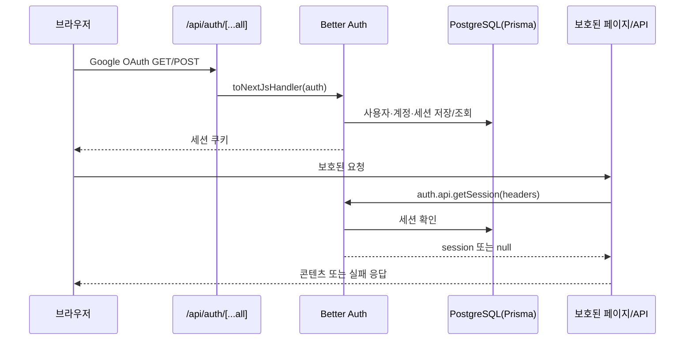

# 인증과 사용자 데이터 소유권

이 페이지는 로그인한 사용자의 요청이 어디에서 신뢰되는지, 그 사용자에게 속한 데이터만 어떻게 조회·변경되는지, 관리자 기능이 어떻게 별도로 잠기는지를 설명한다. 새 server route나 feature를 만들 때의 기본 규칙은 **server boundary에서 세션을 얻고, 세션의 `user.id`를 resource 조회·작업 조건에 직접 넣는 것**이다. 클라이언트가 보낸 사용자 ID나 화면에 관리 메뉴가 보이는지는 권한 근거가 아니다.

## 인증·인가·소유권의 경계

세 검사는 서로 다른 책임을 가진다.

| 검사 | 질문 | 코드 경계 | 실패 동작 |
| --- | --- | --- | --- |
| 인증(authentication) | 요청에 유효한 사용자가 있는가? | `getRequestSession()`, `requirePageSession()`, `requireApiSession()` | 페이지는 `/login?callbackURL=...`로 redirect하고 API는 `401 UNAUTHENTICATED`를 반환 |
| 인가(authorization) | 인증된 사용자가 관리자 기능을 사용할 수 있는가? | `requireAdminPage()`, `requireAdminApi()` | 관리자 페이지는 `notFound()`, 관리자 API는 `403 FORBIDDEN` |
| 소유권(ownership) | 이 사용자가 지정한 profile·asset·job·wallet을 사용할 수 있는가? | 각 server feature의 service/repository query | `userId`가 맞지 않는 행을 찾지 못하게 하거나 작업을 거부 |

인증 feature는 세션과 정책을 제공하지만 resource 접근을 대신 결정하지 않는다. API route는 세션 검사를 먼저 하고, 그 결과의 `session.user.id`만 feature service에 전달한다. service는 그 ID를 Prisma `where` 또는 SQL 조건에 포함해 다시 검증한다.

## OAuth가 세션을 만드는 흐름

`app/api/auth/[...all]/route.ts`의 `GET`·`POST`는 `src/_app/api-routes/auth/auth-route.ts`로 위임되고, 이 route는 `toNextJsHandler(auth)`로 Better Auth를 연결한다. Better Auth 설정은 `src/features/authentication/api/auth.ts`가 소유한다. email/password는 꺼져 있고 Google provider만 사용하며 scope는 `openid`, `email`, `profile`이다.

`getRequestSession(request?)`은 매 요청마다 request headers를 Better Auth의 `auth.api.getSession()`에 전달한다. 따라서 페이지 렌더링, API 호출, `router.refresh()` 뒤의 서버 렌더링은 현재 쿠키에 해당하는 세션을 다시 확인한다. 세션이 있으면 `ensureSignupTicketGrants(session.user.id)`도 호출해 가입 티켓 지급 보장을 적용한다.

새 user 생성 뒤에는 Better Auth의 `databaseHooks.user.create.after`도 같은 티켓 보장을 호출한다. 두 경로는 신규 사용자와 이후 세션 조회에서 사용자 ID를 ticket wallet의 소유자 키로 사용한다.

인증 설정은 안전한 환경 동작을 가진다. `resolveAuthSecret()`은 development/test에서만 로컬 기본 secret을 허용하고, 그 밖의 환경에서 명시적인 `BETTER_AUTH_SECRET`이 없으면 예외를 발생시킨다. `googleAuthConfigured()`는 필요한 OAuth 설정이 모두 존재하는지만 확인한다. OAuth credential 자체와 환경 파일 값은 이 문서에 기록하지 않는다.

## 페이지·API의 인증 실패 계약

- 페이지는 `requirePageSession(returnTo)`를 호출한다. 세션이 없으면 `returnTo`를 URL-encode한 `/login?callbackURL=...`로 redirect하고, 있으면 세션을 반환한다. `/profile`, `/account` 같은 호출자가 정확한 return path를 넘긴다.
- API는 `requireApiSession(request)`으로 request headers를 전달한다. route가 `null`을 받으면 `unauthorizedResponse()`를 반환해야 한다. 응답은 HTTP `401`이며 JSON `error.code`는 `UNAUTHENTICATED`이다.
- `ProductLayout`은 인증을 강제하는 경계가 아니다. 세션이 없으면 children을 그대로 렌더링하고, 각 product Page가 자기 경로에서 `requirePageSession()`을 호출한다. 인증된 경우에만 persistent `ProductShell`과 사용자·관리자 상태를 덧붙인다.

로그인 callback은 `safeCallbackURL()`로 제한한다. `/`로 시작하는 local path만 허용하고 `//`, 역슬래시, 외부 origin은 기본값 `/profile`로 대체한다. OAuth가 끝난 뒤 외부 주소로 redirect되는 것을 막는 입력 검사다.

로그아웃은 클라이언트의 `authClient.signOut()`이 성공한 뒤 `/`로 이동하고 `router.refresh()`로 서버 세션과 shell을 다시 렌더링한다. 실패하면 현재 화면을 유지하고 오류 toast를 표시한다. 개발 인증 우회 상태에서는 로그아웃 메뉴 대신 `개발 인증 우회 사용 중`을 표시하므로, 이 UI 동작을 일반 OAuth 로그아웃으로 해석하면 안 된다.

## 사용자별 resource ownership

인증된 ID는 route에서 service로 흐르고, service의 조회 조건에서 다시 소유권을 확인한다. 새 resource API는 ID만으로 조회하지 말고 다음 순서를 따른다.

1. route가 `requireApiSession(request)`으로 세션을 얻는다.
2. `session.user.id`를 service/entity 함수에 넘긴다.
3. resource ID와 `userId`를 Prisma `where` 또는 SQL 조건에 함께 넣는다.
4. 연결된 media asset도 같은 `userId`, 허용된 `kind`, 현재 `status`를 확인한다.

이 규칙은 다음 기능에 적용된다.

- **프로필·분석**: vocal profile 상세·이력·reference는 profile ID와 `userId`를 함께 조건으로 사용한다. 사용자 profile은 `sourceType: "USER"`인 것만 다룬다. 분석 job 목록·상세와 idempotency 조회도 `userId`로 제한한다.
- **추천**: `getRecommendationResult()`는 user vocal profile을 `id`와 선택된 `userId`로 조회한다. 추천에 연결된 mixing job도 같은 user와 profile을 조건으로 읽는다. 추천 profile의 smart reference와 source reference는 profile owner와 `userId`가 같고, 각각 `SYNTHESIS_REFERENCE`/`REFERENCE` kind이며 `READY`일 때만 mixing capability로 사용할 수 있다.
- **믹싱**: mixing queue는 입력 user의 vocal profile을 `userId`와 `sourceType: "USER"`로 확인하고, idempotency key·job·결과를 같은 사용자에 귀속한다. reference 선택은 smart reference를 우선하되 소유자·kind·`READY` 검사를 통과한 경우에만 선택한다.
- **계정·온보딩·티켓**: account summary는 `account`에서 `userId`와 `providerId: "google"`을 함께 조회한다. 티켓 잔액·ledger와 onboarding snapshot/completion도 session user ID로 조회·변경한다. onboarding completion route는 세션이 없으면 먼저 `401`을 반환하고, 있으면 자기 user ID만 `completeOnboarding()`에 전달한다.

따라서 다른 사용자의 resource ID를 알아도 자기 세션의 `userId` 조건을 통과할 수 없다. 소유권 조건을 누락하면 profile을 읽는 것뿐 아니라 다른 사용자의 asset을 분석·추천·믹싱 작업에 연결하는 우회가 생길 수 있다.

## 관리자 접근과 티켓 조정

관리자는 별도 role 컬럼이 아니라 `ADMIN_EMAILS` allowlist로 판정한다. `adminEmails()`는 쉼표로 나눈 주소를 trim하고 소문자로 정규화하며 빈 값은 제외한다. `isAdminEmail()`도 세션 email을 같은 방식으로 정규화한다.

- `requireAdminPage()`는 먼저 세션을 확인한 뒤 allowlist 밖이면 `notFound()`를 호출한다. 일반 사용자에게 관리자 페이지의 존재를 노출하지 않는 경계다.
- `requireAdminApi(request)`는 세션이 없으면 `401 UNAUTHENTICATED`, 세션은 있지만 allowlist 밖이면 `403 FORBIDDEN`을 반환한다. 통과한 경우에만 `{ response: null, session }`을 반환한다.
- `/admin`은 이 검사를 데이터 조회보다 먼저 수행한다. 티켓 조정에는 관리자인 actor ID와 대상 user ID를 분리해 전달한다.

allowlist는 인증을 대체하지 않는다. 유효한 Better Auth session 또는 아래의 제한된 개발 session이 먼저 있어야 하고, 그 session의 email만 allowlist와 비교한다. 티켓 조정 service는 actor·target·사유를 ledger에 남기고 idempotency key를 사용한다. 잔액보다 큰 회수는 `InsufficientTicketsError`로 거부한다.

## 개발 인증 우회: 로컬·테스트 전용

`getRequestSession()`은 일반 Better Auth session보다 먼저 `getDevelopmentAuthBypassSession()`을 시도한다. 이는 운영 인증 방식이 아니다. `developmentAuthBypassUserId()`가 ID를 반환하는 조건은 모두 충족되어야 한다.

- `NODE_ENV`가 `development` 또는 `test`다.
- `DEV_AUTH_BYPASS_ENABLED`를 trim·소문자화한 값이 정확히 `true`다.
- `DEV_AUTH_BYPASS_USER_ID`가 공백이 아닌 값이다.

그 ID가 local database의 기존 user를 가리키지 않으면 명시적인 error를 던진다. 존재하는 user라면 token이 `dev-auth-bypass`인 24시간짜리 메모리 session 모양을 반환하고, session의 `userId`는 그 user row의 ID다. 임의의 ID만으로 권한을 만들 수는 없다. 이 session은 데이터베이스의 Better Auth session을 갱신하거나 로그아웃하는 운영 경로가 아니다.

production, `NODE_ENV` 미설정, flag가 `false`인 경우 우회는 `null`이고 Better Auth session만 사용한다. 우회 상태에서는 `ProductShell`에 개발 상태를 표시하고 onboarding snapshot 조회를 건너뛴다. 운영 배포에서 이 우회 변수를 인증 수단으로 사용하지 않는다.

## 온보딩 상태의 lifecycle과 실패 동작

온보딩 완료 시각은 user row의 `onboardingCompletedAt`이 소유한다. migration은 기존 user를 `CURRENT_TIMESTAMP`로 backfill하지만 미래 user를 위한 column default는 만들지 않는다. snapshot은 해당 user의 ticket wallets를 함께 읽어 `required`와 wallet 상태를 반환한다.

`completeOnboarding(userId)`는 아직 `onboardingCompletedAt`이 `null`인 자기 user만 갱신한다. 동시에 두 요청이 들어와도 완료 시각과 결과가 idempotent하게 유지되며, 다른 user의 상태는 바뀌지 않는다. 인증되지 않은 onboarding completion 요청은 route에서 business service를 호출하기 전에 `401 UNAUTHENTICATED`로 끝난다.

## 변경 전 확인할 테스트

- `tests/auth-navigation.test.ts`: production secret 누락의 fail-closed 동작, local callback path와 외부·모호한 callback 거부, product route/layout 경계를 확인한다. user menu의 로그아웃 refresh와 개발 우회 표시도 확인한다.
- `tests/auth-ownership.integration.ts`: 두 user를 만들고 한 user의 vocal profile과 Google account summary가 다른 user의 조건으로 조회되지 않는지 확인한다. `DATABASE_URL`이 없으면 skip한다.
- `tests/dev-auth-bypass.integration.ts`: production·미설정 환경에서 우회가 꺼지고 development/test의 정확한 flag 조합만 허용되는지, 존재하지 않는 DB user가 거부되는지 확인한다.
- `tests/new-user-onboarding.integration.ts`: 비인증 completion 요청의 `401`, account-owned snapshot/completion, 동시 완료 요청의 idempotency, migration backfill과 미래 user의 default 부재를 검증한다.
- 관리자와 티켓 조정 변경 시 `tests/admin-operations.integration.ts`도 실행한다. allowlist email 정규화, actor/target 기록, idempotent 조정, 음수 잔액 방지를 검증한다.

인증 boundary를 바꾸거나 새 resource API를 만들 때는 해당 route의 unauthenticated 응답과 교차 사용자 조회를 함께 테스트한다. 모듈 import와 server/client 경계는 [모듈 경계](/openwiki/architecture/module-boundaries.md), 실행 준비는 [빠른 시작](/openwiki/quickstart.md), 계정·티켓 흐름은 [계정과 티켓 workflow](/openwiki/workflows/account-and-tickets.md)에서 이어서 확인한다.
