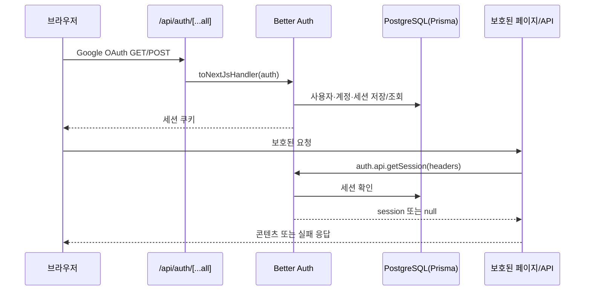

# 인증·소유권·관리자 접근 제어

이 페이지는 로그인한 사용자의 요청이 어디에서 신뢰되는지, 그 사용자에게 속한 데이터만 어떻게 조회·변경되는지, 관리자 기능이 어떻게 별도로 잠기는지를 설명한다. 변경할 때의 핵심 규칙은 **server boundary에서 세션을 얻고, 세션의 `user.id`를 resource 조회 조건에 직접 넣는 것**이다. 클라이언트의 사용자 ID나 화면 노출 여부를 권한 근거로 사용하지 않는다.

## 요청이 인증되는 경로

`app/api/auth/[...all]/route.ts`는 `GET`과 `POST`를 `src/_app/api-routes/auth/auth-route.ts`에 위임한다. 이 route는 Better Auth의 `toNextJsHandler(auth)`를 사용하며, 실제 `auth` 설정은 `src/features/authentication/api/auth.ts`가 소유한다.

`auth`는 email/password 로그인을 끄고 Google provider만 켠다. Google scope는 `openid`, `email`, `profile`이다. 새 사용자를 만들면 `databaseHooks.user.create.after`가 `ensureSignupTicketGrants(user.id)`를 호출해 가입 티켓 지급을 보장한다. `getRequestSession()`도 세션을 얻은 뒤 같은 보장을 다시 호출하므로, 세션을 읽는 일반 server 경계가 온보딩 자원을 준비한다.

`googleAuthConfigured()`는 `BETTER_AUTH_SECRET`, `BETTER_AUTH_URL`, `GOOGLE_CLIENT_ID`, `GOOGLE_CLIENT_SECRET`가 모두 비어 있지 않은지 확인한다. 값 자체나 secret은 문서에 기록하지 않는다. `resolveAuthSecret()`은 development/test에서만 로컬 기본 secret을 허용하고, 그 밖의 환경에서 명시적인 `BETTER_AUTH_SECRET`가 없으면 예외를 발생시킨다. 따라서 production은 secret 누락 시 fail closed 한다. 배포 전 설정 검사는 `scripts/verify-feature-config.ts`를 사용하며, OAuth client secret은 환경 변수로만 주입한다.

## 페이지와 API의 server boundary

페이지와 API는 서로 다른 실패 계약을 사용한다.

- 페이지는 `requirePageSession(returnTo)`를 호출한다. 세션이 없으면 `/login?callbackURL=...`로 redirect하고, 인증된 세션을 반환한다. `/profile`, `/account` 같은 페이지가 각자의 정확한 return path를 전달하므로 공통 layout이 callback URL을 추측하지 않는다.
- API는 `requireApiSession(request)`으로 request headers를 전달한다. 세션이 없으면 route가 `unauthorizedResponse()`를 반환해야 하며, JSON의 `error.code`는 `UNAUTHENTICATED`, HTTP status는 `401`이다.
- 예를 들어 vocal profile 목록과 업로드 API는 세션 검사를 먼저 수행한 다음 `session.user.id`를 history 조회와 분석 job 입력에 사용한다. 온보딩 완료 API도 같은 순서로 검사하고, 세션 사용자의 ID로만 완료 상태를 바꾼다.
- 인증 검사는 `ProductLayout`의 존재 여부로 대체되지 않는다. layout은 세션이 없으면 children을 그대로 렌더링하고, 실제 접근 차단은 각 Page가 `requirePageSession()`으로 수행한다. 인증된 경우에만 persistent `ProductShell`과 사용자·관리자 표시 상태를 추가한다.

로그인 callback은 `safeCallbackURL()`로 제한한다. 값은 `/`로 시작하는 local path여야 하고 `//`, 역슬래시, 외부 origin은 거부하며 기본값은 `/profile`이다. 이 검사는 OAuth 이후 외부 주소로 redirect되는 경로를 허용하지 않는 별도의 입력 경계다.

## 사용자 resource ownership

인증은 “누구인가”만 제공하고, 서비스 layer와 repository query가 “무엇을 볼 수 있는가”를 결정한다. 사용자 소유 resource를 다룰 때는 다음 invariant를 지킨다.

1. server route가 세션에서 `session.user.id`를 얻는다.
2. service/entity 함수에 그 ID를 넘긴다.
3. Prisma `where` 또는 SQL 조건에 resource ID와 함께 `userId`를 넣는다.
4. 연관 media asset도 같은 사용자의 `userId`, 허용된 `kind`, 현재 `status`를 확인한다.

vocal profile 상세·이력·reference 조회는 `id`와 `userId`를 함께 조건으로 사용하고, 사용자 profile은 `sourceType: "USER"`인 것만 노출한다. 분석 job, mixing job, mixing history와 결과 audio도 동일하게 `userId`를 조건으로 삼는다. recommendation은 profile 소유자를 확인하고 smart/source reference asset이 그 소유자이며 각각 허용된 kind와 `READY` 상태인지 확인한다. 이 조건을 빼면 ID를 아는 다른 사용자가 resource를 읽거나 후속 작업에 연결할 수 있으므로, 새 endpoint를 추가할 때도 ID-only 조회를 만들지 않는다.

account summary 역시 `account` 테이블에서 `userId`와 `providerId: "google"`을 함께 조회한다. 따라서 한 사용자의 Google 연결 여부가 다른 사용자에게 보이지 않는다. 가입 후 ticket wallet과 onboarding 상태도 session user ID로 조회한다. onboarding completion은 `onboardingCompletedAt: null`인 자기 user만 갱신하도록 구현되어 있으며, 동시 요청에서도 완료 결과가 idempotent하게 유지된다.

## 관리자 allowlist와 실패 semantics

관리자는 별도 role 컬럼이 아니라 `ADMIN_EMAILS` allowlist로 판정한다. `adminEmails()`는 쉼표로 구분한 주소를 trim하고 소문자로 정규화하며, `isAdminEmail()`도 입력 주소를 같은 방식으로 정규화한다. 빈 값은 관리자를 만들지 않는다.

- `requireAdminPage()`는 세션이 없거나 allowlist에 없는 경우 `notFound()`를 호출한다. 관리자 페이지의 존재를 일반 사용자에게 드러내지 않는 페이지 경계다.
- `requireAdminApi(request)`는 세션이 없으면 `401 UNAUTHENTICATED`, 세션은 있지만 allowlist에 없으면 `403 FORBIDDEN` JSON을 반환한다. 통과한 경우에만 `{ response: null, session }`을 반환한다.
- `/admin` 페이지는 `requireAdminPage()`를 데이터 조회보다 먼저 호출한다. 이후 운영 현황, 사용자 목록, mixing job을 조회하고 `TicketAdjustmentForm`을 제공한다. 관리자 티켓 조정 service에는 actor ID와 target ID가 분리되어 전달된다.

관리자 allowlist는 인증을 우회하지 않는다. 먼저 유효한 Better Auth session(또는 아래의 허용된 개발 session)이 있어야 하고, 그 session의 email만 allowlist와 비교한다. 티켓 조정은 actor, target, 사유를 ledger에 남기고 idempotency key를 사용하며, 잔액보다 큰 회수는 `InsufficientTicketsError`로 거부된다.

## 개발 인증 우회는 production 경로가 아니다

`getRequestSession()`은 일반 Better Auth session보다 먼저 `getDevelopmentAuthBypassSession()`을 시도한다. 그러나 `developmentAuthBypassUserId()`는 다음 조건을 모두 만족할 때만 사용자 ID를 반환한다.

- `NODE_ENV`가 `development` 또는 `test`다.
- `DEV_AUTH_BYPASS_ENABLED`의 trim 후 소문자 값이 정확히 `true`다.
- `DEV_AUTH_BYPASS_USER_ID`가 공백이 아닌 값이다.

그 ID가 local database의 기존 user를 가리키지 않으면 명시적인 error를 던진다. 성공하면 token이 `dev-auth-bypass`인 24시간짜리 메모리 session 모양을 만들어 반환한다. 이 session도 실제 user row를 참조하므로 임의의 ID로 권한을 만들 수 없다. `isDevelopmentAuthBypassSession()`은 token을 식별하는 표시용 정책 함수다.

따라서 production, `NODE_ENV` 미설정, flag가 `false`인 경우에는 우회가 `null`이고 Better Auth 세션만 사용한다. 우회 session은 product shell에 개발 상태를 표시하며, layout은 이 경우 onboarding snapshot 조회를 건너뛴다. OAuth secret 및 관리자 allowlist와 달리 이 우회 변수는 local/test 실행에서만 사용해야 한다.

## 변경 시 확인할 테스트

- `tests/auth-navigation.test.ts`: production secret 누락의 fail-closed 동작, callback URL의 local-path 제한, 로그인 화면, route group과 shell 경계를 확인한다.
- `tests/auth-ownership.integration.ts`: 두 user를 만들고 한 user의 vocal profile과 Google account summary가 다른 user의 조건으로 조회되지 않는지 확인한다. `DATABASE_URL`이 없으면 통합 검사를 skip한다.
- `tests/dev-auth-bypass.integration.ts`: production·미설정 환경에서 우회가 꺼지고, development/test의 정확한 flag 조합만 허용되며, 존재하지 않는 DB user가 거부되는지 확인한다.
- `tests/new-user-onboarding.integration.ts`: 비인증 onboarding 요청이 `401`을 받고, snapshot·completion이 account-owned이며 동시 완료 요청에 안전한지 확인한다. migration은 기존 user를 backfill하지만 미래 user에 column default를 두지 않는다.
- `tests/admin-operations.integration.ts`: email 대소문자와 공백을 정규화한 allowlist, actor/target 기록, idempotent ticket 조정, 음수 잔액 방지를 검증한다.

인증 boundary를 바꾸거나 새 resource API를 만들 때는 해당 route의 unauthenticated 응답과 교차 사용자 조회를 함께 테스트한다. 모듈 배치와 import 경계는 [모듈 경계](/openwiki/architecture/module-boundaries.md), 실제 환경 변수 주입과 배포 점검은 [설정 및 배포](/openwiki/operations/configuration-and-deployment.md)에서 이어서 확인한다.
