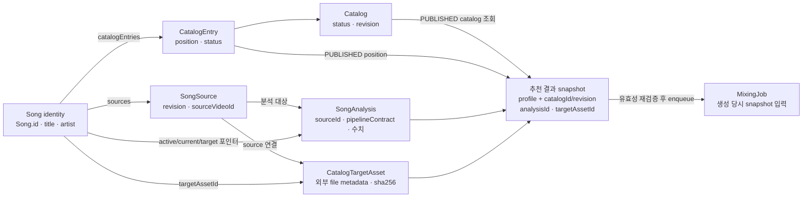
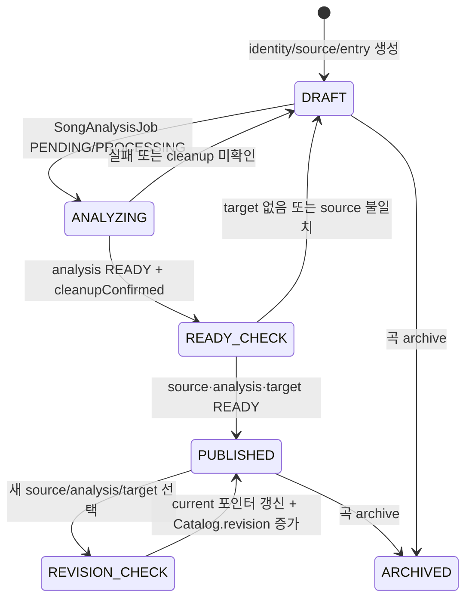

# 곡 카탈로그와 추천 스냅샷

이 페이지는 “추천에 보이는 곡”을 하나의 레코드로 취급하지 않는 이유를 설명한다. 시스템은 곡의 identity, YouTube 출처 revision, 해당 출처의 분석, 믹싱용 target asset, 카탈로그 공개 entry를 분리한다. 추천 API는 이 공개 조합과 사용자 vocal profile을 읽어 **profile별 결과 snapshot을 요청 시 계산**하고, 믹싱을 시작할 때 그 snapshot이 아직 유효한지 다시 확인한다.

현재 runtime의 기준 데이터는 관리자 화면이 아니라 PostgreSQL이다. 관리자 UI는 PostgreSQL 행을 검색하고 상태를 표시하는 운영 도구이며, UI에 “공개”로 보이는 `Song.lifecycleStatus`만으로 추천 가능 여부를 판단하면 안 된다. 실제 공개는 `Catalog`, `CatalogEntry`, `Song`, 현재 source·analysis·target의 조건을 함께 만족해야 한다. 데이터 모델의 전체 관계는 [데이터 모델](/openwiki/architecture/data-model.md), 분석과 점수화의 배경은 [보컬 분석과 추천](/openwiki/concepts/vocal-analysis-and-recommendations.md)에서 이어서 설명한다.

## 다섯 경계를 한눈에 보기

`Song`의 `activeSourceId`, `currentAnalysisId`, `targetAssetId`는 현재 공개 조합을 가리키는 포인터다. 실제 revision 행은 삭제하거나 덮어쓰지 않고 남는다. `MixingJob`은 `songAnalysisId`, `targetAssetId`, `catalogPosition`, `catalogRevision`, `scoringVersion`을 자체 저장하므로 생성 당시 어떤 입력으로 작업했는지 추적할 수 있다. ([`prisma/schema.prisma`](repo://prisma/schema.prisma#L188-L239), [`prisma/schema.prisma`](repo://prisma/schema.prisma#L241-L283), [`prisma/schema.prisma`](repo://prisma/schema.prisma#L312-L342), [`prisma/schema.prisma`](repo://prisma/schema.prisma#L442-L467), [`prisma/schema.prisma`](repo://prisma/schema.prisma#L569-L617))

| 경계 | 책임 | 변경의 의미 |
| --- | --- | --- |
| 곡 identity | `Song.id`, `title`, `artist` | 사용자에게 같은 곡으로 인식되는 논리적 곡이다. `title`+`artist`가 unique다. |
| source revision | `SongSource.revision`, `sourceVideoId` | 미리듣기 출처의 특정 버전이다. 같은 곡에 새 revision을 추가한다. |
| song analysis | `SongAnalysis.sourceId`, `pipelineContract` | 특정 source에 대해 계산한 음역·키·품질 수치다. `currentAnalysisId`가 선택된 결과를 가리킨다. analyzer는 ffmpeg 변환, Demucs vocal 분리, `analyze_wav`를 거쳐 결과와 analyzer version을 만든다. ([`modal_app.py`](repo://services/song-catalog-analyzer/modal_app.py#L141-L149), [`modal_app.py`](repo://services/song-catalog-analyzer/modal_app.py#L161-L218)) |
| target asset | `CatalogTargetAsset` | Leemage 외부 파일의 project/file ID, URL, 크기, `sha256`, `sourceVideoId` metadata다. 원본 bytes 자체가 아니다. |
| published entry | `Catalog` + `CatalogEntry` | 카탈로그에 노출할 곡의 position과 공개 상태다. `Catalog.revision`은 공개 조합이 바뀔 때의 invalidation 포인터다. |

## 공개는 조합의 상태 검사다

추천 조회의 `loadPublishedCatalog`는 `Catalog`와 `CatalogEntry`가 `PUBLISHED`이고, 곡이 `ACTIVE`이며, active source가 `READY`, current analysis가 `READY`이고 `cleanupConfirmed === true`, target이 `READY`인 행만 읽는다. 결과는 position 순서로 정렬된다. 별도의 `catalogReadiness`는 포인터 ID가 실제 연결 행과 같은지, analysis와 target이 active source에 연결됐는지, entry가 published인지까지 진단한다. 따라서 `Song.lifecycleStatus = ACTIVE`만으로는 공개 가능하다고 볼 수 없다. ([`published-catalog.ts`](repo://src/entities/song-catalog/api/published-catalog.ts#L6-L61), [`readiness.ts`](repo://src/entities/song-catalog/lib/readiness.ts#L5-L44))

이 diagram은 여러 모델의 상태를 합친 운영 경로다. `Song`은 `DRAFT → ACTIVE → ARCHIVED`, source는 `DRAFT → READY → SUPERSEDED/UNAVAILABLE`, catalog와 entry는 `DRAFT → PUBLISHED → ARCHIVED` enum을 사용한다. `PUBLISHED`는 하나의 enum 값이 아니라 공개 조건이 동시에 충족된 결과다. ([`prisma/schema.prisma`](repo://prisma/schema.prisma#L29-L65))

## source 교체와 target 선행 업로드

관리자 곡 생성은 한 transaction에서 DRAFT `Song`, revision 1의 DRAFT `SongSource`, DRAFT `CatalogEntry`, PENDING `SongAnalysisJob`을 만든다. source 교체도 기존 source를 수정하지 않고 마지막 revision보다 1 큰 source와 새 분석 job을 만든다. idempotency key를 다른 곡이나 출처에 재사용하면 conflict가 난다. ([`admin-service.ts`](repo://src/features/manage-song-catalog/api/admin-service.ts#L72-L137), [`admin-service.ts`](repo://src/features/manage-song-catalog/api/admin-service.ts#L139-L190))

target은 분석 완료 전에도 source에 대해 사전 업로드할 수 있다. 업로드 API는 49MB 이하의 지원 audio를 검증하고 파일 bytes의 SHA-256을 계산한다. 동일 `sourceId`와 digest의 READY asset이 있으면 Leemage를 다시 호출하지 않고 그 행을 재사용한다. target의 `sourceVideoId`는 source와 같아야 publish에 사용할 수 있다. ([`target-assets.ts`](repo://src/features/manage-song-catalog/api/target-assets.ts#L10-L67), [`admin-service.ts`](repo://src/features/manage-song-catalog/api/admin-service.ts#L215-L230))

publish는 transaction 안에서 선택한 source의 pipeline contract 분석이 READY이고 cleanup이 확인됐는지, 같은 source video의 READY target이 있는지 검사한다. 통과하면 이전 READY source를 `SUPERSEDED`로 만들고 entry를 PUBLISHED로 바꾸며, `activeSourceId`, `currentAnalysisId`, `targetAssetId`, lifecycle status를 함께 갱신한다. 공개 조합이 실제로 달라질 때만 `Catalog.revision`을 증가시킨다. 이전 target이 더 이상 `Song`이나 `MixingJob`에서 참조되지 않으면 외부 파일 삭제를 시도하고, 삭제 실패는 `DELETE_PENDING`으로 남긴다. ([`admin-service.ts`](repo://src/features/manage-song-catalog/api/admin-service.ts#L215-L261), [`target-assets.ts`](repo://src/features/manage-song-catalog/api/target-assets.ts#L69-L92))

결과적으로 source를 교체해도 기존 source·analysis 행과 이미 생성된 mixing job의 근거는 보존된다. 다만 새 source를 publish하면 새 추천은 새 current 조합과 증가한 catalog revision을 읽는다. 오래된 추천으로 새 믹싱을 요청하는 경우에는 아래의 revision 및 ID 검증이 요청을 막는다.

## profile별 추천 snapshot은 무엇을 고정하는가

`POST /api/recommendations`는 로그인 세션과 `userVocalProfileId`를 확인한 뒤 `getRecommendationResult`를 호출한다. `USER` vocal profile만 허용하며 필수 음역·품질 필드가 없으면 422다. 서비스는 `RepeatableRead` transaction에서 최초 PUBLISHED catalog를 고르고 그 slug의 공개 행을 읽은 다음 점수화한다. 응답에는 `catalogId`, `catalogRevision`, `scoringVersion`, 각 항목의 `songAnalysisId`, `targetAssetId`, position, 추천 shift와 점수가 들어간다. 이는 profile별 계산 결과를 구성하는 snapshot이지만, 별도 Recommendation snapshot 테이블에 저장하는 영속 캐시가 아니다. catalog가 없거나 점수화할 수 없으면 retryable 503을 반환한다. ([`recommendations-route.ts`](repo://src/_app/api-routes/recommendations/recommendations-route.ts#L27-L49), [`recommendation-service.ts`](repo://src/features/create-recommendation/api/recommendation-service.ts#L84-L119), [`recommendation-service.ts`](repo://src/features/create-recommendation/api/recommendation-service.ts#L152-L236))

profile마다 결과가 분리되는 이유는 점수화 입력이 사용자 profile이고, 응답에 해당 profile의 mixing reference capability와 기존 `MixingJob` 상태도 포함되기 때문이다. 같은 catalog revision이라도 profile 수치나 reference asset이 다르면 결과와 믹싱 가능 상태가 달라질 수 있다.

## 믹싱 enqueue가 snapshot을 다시 검증하는 이유

사용자가 추천 항목을 믹싱하면 `enqueueMixingJob`은 추천 결과를 다시 계산한 뒤 `Serializable` transaction에서 다음을 확인한다.

1. 요청 profile이 해당 사용자의 `USER` profile이고, analysis가 READY다.
2. 곡이 ACTIVE이고 current analysis ID가 추천 항목의 analysis ID와 같다.
3. 해당 catalog의 entry와 catalog가 PUBLISHED이며 revision과 position이 추천 snapshot과 같다.
4. target ID가 추천 항목과 같고 analysis source에 연결되어 있으며 READY다.
5. 사용자 소유의 reference asset을 선택할 수 있다.

하나라도 바뀌면 ticket debit이나 job 생성 전에 `MIXING_RECOMMENDATION_STALE` 409와 retryable flag를 반환한다. 검증을 통과한 `MixingJob`에는 snapshot의 position, revision, scoring version과 analysis/target ID가 기록된다. transaction write conflict는 최대 세 번 재시도하고, 같은 사용자와 idempotency key의 재요청은 기존 job을 반환한다. ([`mixing-queue.ts`](repo://src/features/create-mixing/api/mixing-queue.ts#L19-L43), [`mixing-queue.ts`](repo://src/features/create-mixing/api/mixing-queue.ts#L45-L90), [`mixing-queue.ts`](repo://src/features/create-mixing/api/mixing-queue.ts#L105-L148))

따라서 publish 직후의 새 추천은 새 revision을 반영하지만, publish 전에 만들어진 `MixingJob`은 자신이 저장한 analysis와 target을 계속 참조한다. 반대로 target 교체 직후 오래된 추천으로 enqueue하면 target ID 또는 catalog revision이 맞지 않아 stale로 거부된다. cleanup도 과거 mixing job이 target을 참조하는 동안에는 외부 파일을 삭제하지 않는다.

## snapshot export/import와 운영 불변식

카탈로그 snapshot은 추천 응답과 다른 운영 snapshot이다. export는 published entry 수와 readiness 행 수, position의 양의 정수·중복 여부를 검사한 뒤 catalog revision, 곡/source/analysis 정보와 target의 외부 metadata를 JSON으로 내보낸다. audio bytes, base64, 임시 경로, `storagePath`는 내보내지 않는다. import는 position·곡·source video·외부 target key 중복과 source-target video 불일치를 거부하고, identity key별 upsert를 transaction으로 수행한다. 반복 import는 새 행을 만들지 않으며 기존 catalog revision을 snapshot보다 낮추지 않는다. 외부 provider file ID의 실제 존재와 접근성은 import 이후 별도로 확인해야 한다. ([`catalog-snapshot.ts`](repo://src/entities/song-catalog/api/catalog-snapshot.ts#L7-L39), [`catalog-snapshot.ts`](repo://src/entities/song-catalog/api/catalog-snapshot.ts#L45-L189), [`catalog-import.ts`](repo://src/entities/song-catalog/api/catalog-import.ts#L22-L45), [`catalog-import.ts`](repo://src/entities/song-catalog/api/catalog-import.ts#L93-L161), [`catalog-import.ts`](repo://src/entities/song-catalog/api/catalog-import.ts#L164-L300))

## 관리자 UI를 확인할 때의 주의점

`/admin/songs` 페이지는 `findAdminCatalog`가 반환한 PostgreSQL 데이터를 `CatalogManager`용 view로 변환한다. UI는 source별 분석 준비 여부와 source video가 같은 READY target인지 계산해 표시하고, lifecycle 필터의 `ACTIVE`를 “공개”로 보여준다. 그러나 runtime 추천은 UI의 표시값을 읽지 않고 `loadPublishedCatalog`와 transaction 검증을 직접 수행한다. 운영자는 화면 상태와 실제 `Catalog.status`, `CatalogEntry.status`, current 포인터 및 asset status를 함께 확인해야 한다. ([`admin-song-catalog-page.tsx`](repo://src/_pages/admin-song-catalog/ui/admin-song-catalog-page.tsx#L28-L66), [`admin-song-catalog-page.tsx`](repo://src/_pages/admin-song-catalog/ui/admin-song-catalog-page.tsx#L69-L106), [`admin-service.ts`](repo://src/features/manage-song-catalog/api/admin-service.ts#L29-L60))

## 변경 전 확인할 테스트

- `tests/catalog-snapshot.integration.ts`: fresh 복원, 반복 import의 idempotency, revision 하향 방지, 중복 position/video/target, source URL 불일치와 금지 metadata를 검증한다. raw bytes와 base64가 snapshot에 들어가지 않는지도 확인한다. ([`catalog-snapshot.integration.ts`](repo://tests/catalog-snapshot.integration.ts#L8-L120), [`catalog-snapshot.integration.ts`](repo://tests/catalog-snapshot.integration.ts#L173-L212))
- `tests/catalog-target-assets.integration.ts`: source video 연결과 동일 SHA-256 파일의 target 재사용으로 외부 presign/upload가 중복되지 않는지 검증한다. ([`catalog-target-assets.integration.ts`](repo://tests/catalog-target-assets.integration.ts#L10-L92))
- `tests/recommendation-persistence.integration.ts`: 추천을 요청 시 계산하고, 같은 revision에서는 결과가 반복되며 catalog revision을 올리면 반환 snapshot의 revision이 바뀌는지 검증한다. ([`recommendation-persistence.integration.ts`](repo://tests/recommendation-persistence.integration.ts#L8-L97))
- `tests/recommendation-song-detail.test.tsx`와 `tests/catalog-target-assets.integration.ts`: 추천 항목 상세와 target 연결을 바꿀 때 응답의 analysis/target ID 계약을 함께 회귀시킨다.
- 관리자 lifecycle을 바꿀 때는 `tests/admin-song-catalog.integration.ts`와 publish readiness를 함께 확인하고, 추천·믹싱 snapshot 계약을 바꿀 때는 revision, analysis ID, target ID와 stale 409 경로를 우선 테스트한다. 자세한 작업 순서는 [카탈로그 관리](/openwiki/workflows/catalog-management.md), 다음 단계는 [추천에서 믹싱까지](/openwiki/workflows/recommendation-to-mixing.md)다.
