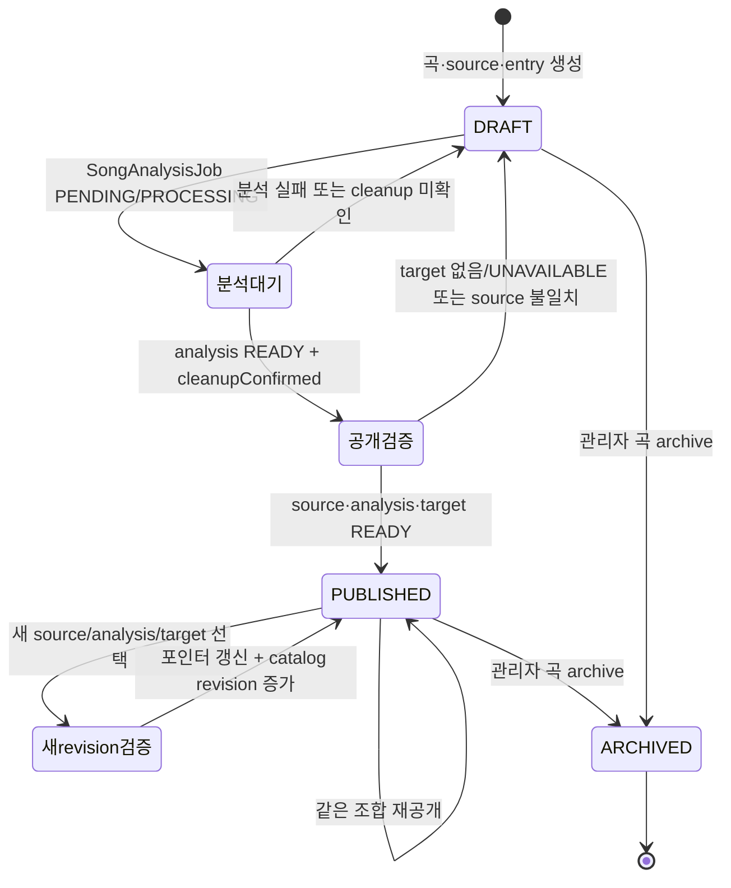

# 곡 카탈로그와 추천 대상 수명주기

이 문서의 핵심은 **곡을 공개한다는 것**이 하나의 플래그를 바꾸는 일이 아니라는 점이다. `Song`은 곡의 정체성과 현재 가리키는 revision을 소유하고, `SongSource`는 출처 revision을, `SongAnalysis`는 특정 출처와 pipeline 계약의 분석 결과를, `CatalogTargetAsset`은 믹싱에 사용할 외부 음원 파일의 metadata를 소유한다. `CatalogEntry`와 `Catalog`는 사용자에게 보이는 공개 경로를 소유한다.

따라서 관리자가 새 출처를 등록하거나 분석·target을 교체해도 과거 분석과 이미 생성된 믹싱 작업의 참조를 함부로 덮어쓰지 않는다. 추천은 공개된 한 카탈로그 revision을 읽고, 믹싱 enqueue는 그 revision과 ID 연결을 다시 검증한다. 자세한 데이터 모델 배경은 [데이터 모델](/openwiki/architecture/data-model.md), 추천 계산은 [보컬 분석과 추천](/openwiki/concepts/vocal-analysis-and-recommendations.md)을 함께 본다.

## 다섯 개의 분리된 책임

| 개념 | 저장 주체 | 의미 | 바뀔 때 보존되는 것 |
| --- | --- | --- | --- |
| 곡 identity | `Song.id`, `title`, `artist` | 사용자에게 같은 곡으로 인식되는 논리적 곡. `title`+`artist`가 unique다. | 기존 source·analysis·mixing job |
| source revision | `SongSource.revision`, `sourceVideoId` | 원본 출처와 그 revision. 같은 곡에 revision을 추가하며 기존 행은 남는다. | 이전 출처와 그 출처의 분석 |
| analysis revision | `SongAnalysis`의 `sourceId`+`pipelineContract` | 특정 source를 분석한 수치와 analyzer 계약. `currentAnalysisId`가 현재 선택을 가리킨다. | 다른 pipeline 계약의 결과, 과거 믹싱 참조 |
| target asset | `CatalogTargetAsset` | 외부 provider의 파일 ID·URL·크기·`sha256`·`sourceVideoId` metadata. 원본 bytes 자체가 아니다. | asset row와 이를 참조하는 mixing job |
| 공개 상태 | `Catalog.status`, `CatalogEntry.status`, `Song.lifecycleStatus` | 전체 카탈로그, 항목, 곡이 공개 경로에 포함될지 결정한다. | identity와 revision 행 |

`Song`은 `activeSourceId`, `currentAnalysisId`, `targetAssetId`를 별도로 보유한다. 즉 “현재 공개에 사용 중인 조합”을 가리키는 포인터와 각 revision의 실제 데이터가 분리된다. `MixingJob`은 다시 `songId`, `songAnalysisId`, `targetAssetId`, `catalogPosition`, `catalogRevision`, `scoringVersion`을 저장하므로, 생성 당시의 추천·믹싱 입력을 추적할 수 있다. ([`prisma/schema.prisma`](repo://prisma/schema.prisma#L188-L239), [`prisma/schema.prisma`](repo://prisma/schema.prisma#L241-L283), [`prisma/schema.prisma`](repo://prisma/schema.prisma#L312-L342), [`prisma/schema.prisma`](repo://prisma/schema.prisma#L442-L467), [`prisma/schema.prisma`](repo://prisma/schema.prisma#L639-L681))

> **bytes와 metadata의 경계**
>
> `CatalogTargetAsset`과 snapshot은 외부 asset의 metadata를 저장·운반한다. snapshot export는 `externalProjectId`, `externalFileId`, URL, 파일명, MIME type, 크기, `sha256`, source video ID와 분석 수치를 내보내지만 원본 음원 bytes를 내보내지 않는다. descriptor와 pipeline metadata에서도 `audioBytes`, base64, 임시 경로, `storagePath` 같은 키를 제거하거나 거부한다. 실제 업로드는 관리자가 파일을 제출할 때 Leemage에 보내고, 동일 source의 동일 `sha256` READY asset이 있으면 재사용한다. ([`src/entities/song-catalog/api/catalog-snapshot.ts`](repo://src/entities/song-catalog/api/catalog-snapshot.ts#L7-L39), [`src/entities/song-catalog/api/catalog-snapshot.ts`](repo://src/entities/song-catalog/api/catalog-snapshot.ts#L80-L189), [`src/features/manage-song-catalog/api/target-assets.ts`](repo://src/features/manage-song-catalog/api/target-assets.ts#L17-L67))

## 공개 조건과 상태 diagram

현재 추천에 들어가는 행은 `loadPublishedCatalog`의 단일 조건으로 결정된다. 카탈로그와 항목이 각각 `PUBLISHED`이고, 곡이 `ACTIVE`이며, active source가 `READY`, current analysis가 `READY`이고 `cleanupConfirmed === true`, target asset이 `READY`여야 한다. 분석은 active source와 같은 `sourceId`여야 하고 target도 active source에 연결돼야 한다. `catalogReadiness`는 이 조건을 ID 일치까지 포함해 검사한다. ([`src/entities/song-catalog/api/published-catalog.ts`](repo://src/entities/song-catalog/api/published-catalog.ts#L6-L61), [`src/entities/song-catalog/lib/readiness.ts`](repo://src/entities/song-catalog/lib/readiness.ts#L3-L44))

상태 이름은 서로 다른 모델의 enum을 합쳐 표현한 것이다. `Song`은 `DRAFT → ACTIVE → ARCHIVED`, `SongSource`는 `DRAFT → READY → SUPERSEDED/UNAVAILABLE`, `Catalog`와 `CatalogEntry`는 각각 `DRAFT → PUBLISHED → ARCHIVED`를 사용한다. diagram의 `PUBLISHED`는 이 세 계층의 공개 조건이 동시에 충족된 상태를 뜻한다. 개별 모델 enum과 관계는 schema에서 확인할 수 있다. ([`prisma/schema.prisma`](repo://prisma/schema.prisma#L29-L65))

### 관리자 변경 흐름

관리자 API는 `/api/admin/catalog`에서 목록·곡 생성 요청을 받고, 하위 route를 통해 source 등록, 분석 retry, publish, archive, target 업로드, snapshot import/export를 제공한다. 새 곡 생성은 하나의 transaction에서 `Song(DRAFT)`, revision 1의 `SongSource(DRAFT)`, `CatalogEntry(DRAFT)`, `SongAnalysisJob(PENDING)`을 함께 만든다. 기존 곡의 source 교체는 기존 행을 수정하지 않고 다음 `revision`의 source와 분석 job을 만든다. idempotency key가 다른 곡·출처에 재사용되면 conflict를 반환한다. ([`src/_app/api-routes/admin/catalog/index.server.ts`](repo://src/_app/api-routes/admin/catalog/index.server.ts#L1-L10), [`src/features/manage-song-catalog/api/admin-service.ts`](repo://src/features/manage-song-catalog/api/admin-service.ts#L72-L137), [`src/features/manage-song-catalog/api/admin-service.ts`](repo://src/features/manage-song-catalog/api/admin-service.ts#L139-L190))

publish는 source에 맞는 pipeline contract의 READY 분석과 cleanup 확인, 같은 `sourceVideoId`의 READY target, 카탈로그 entry를 transaction 안에서 확인한다. 통과하면 기존 READY source를 `SUPERSEDED`로 만들고, entry를 `PUBLISHED`로 만들며, `Song.activeSourceId`, `currentAnalysisId`, `targetAssetId`를 함께 갱신하고 `Song`을 `ACTIVE`로 만든다. 공개 조합이 실제로 바뀐 경우에만 `Catalog.revision`을 증가시킨다. 이전 target이 더 이상 `Song`이나 mixing job에서 참조되지 않으면 외부 파일을 삭제하고, 삭제 실패는 `DELETE_PENDING`으로 남긴다. ([`src/features/manage-song-catalog/api/admin-service.ts`](repo://src/features/manage-song-catalog/api/admin-service.ts#L215-L261), [`src/features/manage-song-catalog/api/target-assets.ts`](repo://src/features/manage-song-catalog/api/target-assets.ts#L69-L92))

archive는 해당 곡의 아직 archive되지 않은 모든 `CatalogEntry`를 archive하고 각 관련 카탈로그의 revision을 증가시킨 뒤 `Song.lifecycleStatus`를 `ARCHIVED`로 만든다. 이는 entry만 숨기는 것과 곡 identity를 archive하는 것을 한 transaction으로 묶는다. ([`src/features/manage-song-catalog/api/admin-service.ts`](repo://src/features/manage-song-catalog/api/admin-service.ts#L264-L275))

## 추천 snapshot과 믹싱의 안전한 경계

추천 요청은 사용자 `USER` vocal profile을 검증한 뒤, `PUBLISHED` 카탈로그를 transaction의 `RepeatableRead` 격리 수준에서 선택하고 `loadPublishedCatalog` 결과를 점수화한다. 응답에는 `catalogId`, `catalogRevision`, `scoringVersion`, 각 항목의 `songAnalysisId`와 `targetAssetId`가 포함된다. 따라서 추천 결과는 단순히 곡 제목 목록이 아니라 특정 카탈로그 revision과 analysis/target 조합을 담은 snapshot이다. 공개 카탈로그가 없거나 행이 점수화되지 않으면 retryable `503`을 반환한다. ([`src/features/create-recommendation/api/recommendation-service.ts`](repo://src/features/create-recommendation/api/recommendation-service.ts#L84-L119), [`src/features/create-recommendation/api/recommendation-service.ts`](repo://src/features/create-recommendation/api/recommendation-service.ts#L152-L236))

사용자가 믹싱을 요청하면 `enqueueMixingJob`은 추천 항목을 다시 읽고 `Serializable` transaction에서 다음을 확인한다.

1. song이 `ACTIVE`이고 현재 analysis ID가 요청 analysis ID와 같다.
2. 추천의 `catalogId`에 대한 entry와 catalog가 `PUBLISHED`이고 catalog revision·position이 snapshot과 같다.
3. target ID가 추천 항목의 ID와 같고, analysis의 source에 연결되어 있으며 `READY`다.
4. 사용자 소유의 `USER` vocal profile에서 사용할 reference asset을 선택할 수 있다.

하나라도 달라지면 티켓을 차감하거나 job을 만들기 전에 `MIXING_RECOMMENDATION_STALE`(409, retryable)을 반환한다. 검증 후 생성하는 `MixingJob`에는 snapshot의 position, revision, scoring version과 analysis/target ID가 기록된다. transaction write conflict는 최대 3회 재시도하고, idempotency key 재사용은 기존 동일 job을 반환한다. ([`src/features/create-mixing/api/mixing-queue.ts`](repo://src/features/create-mixing/api/mixing-queue.ts#L19-L43), [`src/features/create-mixing/api/mixing-queue.ts`](repo://src/features/create-mixing/api/mixing-queue.ts#L52-L121), [`src/features/create-mixing/api/mixing-queue.ts`](repo://src/features/create-mixing/api/mixing-queue.ts#L122-L148))

이 설계의 운영상 의미는 명확하다. publish 직후 새 추천은 새 revision을 읽지만, 이미 생성된 `MixingJob`은 자기 `songAnalysisId`와 `targetAssetId`를 계속 참조한다. 반대로 사용자가 오래된 추천으로 새 믹싱을 시작하면 catalog revision 또는 ID 검증이 실패해 최신 추천을 다시 받게 된다. target cleanup도 과거 mixing job이 참조하는 동안에는 외부 파일을 지우지 않는다.

## snapshot export/import와 불변식

`exportDatabaseSongCatalog`는 먼저 전체 published entry 수와 실제 readiness 행 수가 같은지, position이 양의 정수이며 중복되지 않는지 확인한다. 불완전한 카탈로그는 export하지 않는다. snapshot에는 카탈로그 revision과 순서가 포함되며, import는 다음을 검증·보장한다.

- position, 곡 identity, source video ID, 외부 target key가 snapshot 안에서 중복되지 않는다.
- target의 `sourceVideoId`가 source의 `sourceVideoId`와 같아야 한다.
- 곡은 `title`+`artist`, source는 `sourceVideoId`, 분석은 `sourceId`+`pipelineContract`, target은 외부 project/file ID로 upsert되어 반복 import가 새 행을 만들지 않는다.
- source·analysis·target이 모두 READY이고 analysis cleanup이 확인되며 source 연결이 맞을 때만 entry를 `PUBLISHED`로 만들고 곡 포인터를 ACTIVE 조합으로 갱신한다.
- import는 snapshot revision보다 기존 revision을 낮추지 않는다.

Import는 이 작업을 transaction으로 수행하고, 충돌하는 position·source·target 연결은 오류로 중단한다. snapshot은 외부 파일을 다시 업로드하지 않는다. target metadata를 복원할 뿐이므로, 외부 provider의 file ID가 실제로 존재하고 접근 가능한지는 별도 운영 검증이 필요하다. ([`src/entities/song-catalog/api/catalog-snapshot.ts`](repo://src/entities/song-catalog/api/catalog-snapshot.ts#L45-L77), [`src/entities/song-catalog/api/catalog-import.ts`](repo://src/entities/song-catalog/api/catalog-import.ts#L22-L45), [`src/entities/song-catalog/api/catalog-import.ts`](repo://src/entities/song-catalog/api/catalog-import.ts#L93-L161), [`src/entities/song-catalog/api/catalog-import.ts`](repo://src/entities/song-catalog/api/catalog-import.ts#L164-L257), [`src/entities/song-catalog/api/catalog-import.ts`](repo://src/entities/song-catalog/api/catalog-import.ts#L262-L300))

## 변경 시 확인할 테스트

- `tests/catalog-snapshot.integration.ts`는 fresh catalog 복원, 두 번 import해도 생성 수가 0인 idempotency, revision 하향 방지, source URL 불일치·금지 metadata·중복 position/video/target을 검증한다. 직렬화된 snapshot에 raw bytes·base64·임시 경로가 없는지도 확인한다. ([`tests/catalog-snapshot.integration.ts`](repo://tests/catalog-snapshot.integration.ts#L8-L120), [`tests/catalog-snapshot.integration.ts`](repo://tests/catalog-snapshot.integration.ts#L173-L212))
- `tests/catalog-target-assets.integration.ts`는 target upload가 source video ID와 연결되고 SHA-256 동일 파일의 두 번째 요청에서 외부 presign을 다시 호출하지 않는지 확인한다. ([`tests/catalog-target-assets.integration.ts`](repo://tests/catalog-target-assets.integration.ts#L10-L92))
- `tests/admin-song-catalog.integration.ts`는 관리자 생성·source 교체·분석 완료 후 publish·archive와 공개 조합의 변경을 검증하는 통합 경계다. 관리자 lifecycle 규칙을 바꿀 때 이 테스트와 publish readiness를 함께 갱신한다.
- 추천·믹싱 snapshot을 바꾸려면 `catalogRevision`, `songAnalysisId`, `targetAssetId`를 함께 추적하고, 오래된 추천을 409로 거부하는 경로를 우선 회귀 테스트해야 한다. 관련 사용자 흐름은 [카탈로그 관리](/openwiki/workflows/catalog-management.md)와 [추천에서 믹싱까지](/openwiki/workflows/recommendation-to-mixing.md)를 참조한다.
