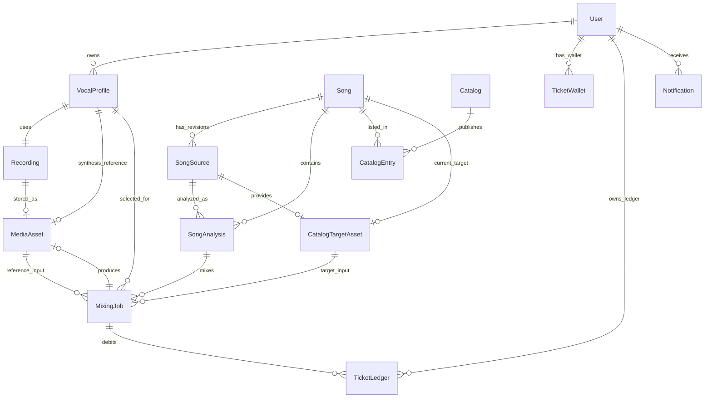

# 도메인 모델과 불변조건

이 문서는 `prisma/schema.prisma`가 정의하고 마이그레이션으로 실제 DB에 적용하는 durable data model의 기준이다. 애플리케이션 레이어의 표시용 상태는 enum을 소문자로 직렬화할 수 있지만, 저장 값과 관계·제약은 Prisma 모델을 따른다.

## 핵심 관계

위 그림은 주요 외래키 관계를 요약한다. `onDelete` 동작, 현재 revision을 가리키는 단일 포인터, 복합 unique/index는 다음 절을 함께 읽어야 한다.

## 사용자 소유와 보컬 프로필

- `User`가 보컬 프로필, 미디어 자산, 티켓 지갑·원장, 믹싱/보컬 분석 작업, 알림의 소유자다. 인증 계정과 세션은 사용자 삭제 시 cascade되고, 생성자(`Song.createdBy`, `SongSource.createdBy`)는 사용자가 삭제되어도 `SetNull`된다. 사용자 소유 조회는 대상 ID만이 아니라 `userId`를 함께 조건으로 사용해야 한다. (`repo://prisma/schema.prisma#L344-L366`, `repo://prisma/schema.prisma#L368-L400`)
- `VocalProfile`은 `sourceType`이 `USER` 또는 `SONG`인 분석 결과이며 MIDI 범위/분위수, tessitura, voiced/pitch/clipping/RMS 지표, `descriptors`, analyzer와 analyzer version을 보존한다. 동일 recording·analyzer·version 조합은 하나만 허용되고, 사용자별 `profileNumber`도 unique다. 번호는 사용자 행의 `nextVocalProfileNumber`를 원자적으로 증가시켜 할당하므로 표시 이름과 번호를 임의로 계산하지 않는다. (`repo://prisma/schema.prisma#L151-L186`, `repo://src/entities/vocal-profile/api/persistence.ts#L24-L32`)
- 사용자 분석 완료 시 원본 녹음은 `Recording(kind=USER_TEST, status=READY)`로 저장되고 `MediaAsset(kind=REFERENCE)`를 가리킨다. smart synthesis reference가 있으면 별도 `MediaAsset`로 연결할 수 있지만 저장 실패 시 원본 reference를 fallback으로 유지한다. DB 트랜잭션으로 프로필 저장이 실패하면 이미 업로드한 자산을 폐기한다. (`repo://src/entities/vocal-profile/api/persistence.ts#L34-L149`)
- 녹음은 `PENDING → READY/FAILED/DELETED` 상태와 MIME, 크기, sample rate, 만료 시각을 가진다. `VocalProfile.recordingId` 관계는 `Restrict`이므로 프로필이 참조하는 녹음을 먼저 삭제할 수 없다. 사용자 삭제는 사용자 소유 자산과 프로필을 cascade하지만, 자산과 녹음 사이의 optional pointer는 `SetNull`이다. (`repo://prisma/schema.prisma#L130-L149`, `repo://prisma/schema.prisma#L175-L180`)

## 곡, revision, 분석과 catalog publishing

`Song`은 `(title, artist)`가 natural uniqueness인 논리 곡이다. lifecycle은 `DRAFT`, `ACTIVE`, `ARCHIVED`이고, `activeSourceId`, `currentAnalysisId`, `vocalProfileId`, `targetAssetId`는 현재 선택된 구성요소를 가리키는 optional unique pointer다. 곡·source·analysis를 삭제할 때 핵심 참조는 `Restrict`이며, 현재 포인터가 가리키는 행이 사라지면 `SetNull`된다. (`repo://prisma/schema.prisma#L188-L216`)

`SongSource`는 곡의 immutable-ish source revision 단위다. 같은 곡에서 `revision`은 unique하고 `sourceVideoId`는 전역 unique다. source 상태는 `DRAFT`, `READY`, `SUPERSEDED`, `UNAVAILABLE`이다. 분석은 `(sourceId, pipelineContract)`별로 unique하며, `SongAnalysis`에는 원본 크기/재생시간과 분석 metrics, estimated key, analyzer identity, pipeline metadata, `cleanupConfirmed`, 오류 및 실행 시각이 함께 기록된다. 분석 작업(`SongAnalysisJob`)은 source마다 하나(`sourceId` unique), idempotency key도 unique이며 attempt/lease/heartbeat/재시도 시각으로 durable queue를 표현한다. (`repo://prisma/schema.prisma#L218-L310`)

`Catalog`은 unique slug와 `revision`, `DRAFT/PUBLISHED/ARCHIVED` 상태를 가진 발행 단위다. `CatalogEntry`는 catalog와 song의 연결이며 catalog 안의 position과 song 중복을 각각 unique하게 막는다. catalog 삭제는 entry에 cascade하지만 song 삭제는 entry에서 restrict한다. 카탈로그 import는 snapshot 내부의 position, 곡, source video, target 외부 식별자 중복과 target/source video 불일치를 먼저 거부하고, 같은 slug에 대해 revision을 낮추지 않는다. (`repo://prisma/schema.prisma#L312-L342`, `repo://src/entities/song-catalog/api/catalog-import.ts#L22-L45`, `repo://src/entities/song-catalog/api/catalog-import.ts#L262-L300`)

### 공개 가능한 곡의 readiness

곡을 추천/믹싱 입력으로 취급하려면 다음이 모두 동시에 참이어야 한다.

1. song lifecycle이 `ACTIVE`이고 active source가 존재하며 ID가 일치하고 `READY`다.
2. current analysis가 존재하고 ID가 일치하며 `READY`, `cleanupConfirmed=true`다.
3. analysis의 `sourceId`가 active source와 일치한다.
4. target asset이 존재하고 `READY`이며 같은 active source를 가리킨다.
5. 해당 catalog entry와 catalog 자체가 발행 상태다.

하나라도 어긋나면 deterministic readiness reason을 반환하며, 특히 source가 바뀐 뒤 이전 analysis/target을 재사용하지 않는다. 이 규칙은 `tests/song-catalog-domain.test.ts`에서 정상, source mismatch, 불완전 draft를 검증한다. (`repo://src/entities/song-catalog/lib/readiness.ts#L5-L44`, `repo://tests/song-catalog-domain.test.ts#L22-L61`)

## 미디어 자산과 정리

`MediaAsset`은 사용자 소유의 provider 외부 파일 메타데이터(`externalProjectId`, `externalFileId`, URL, 파일명, MIME, 크기)와 `READY`, `DELETE_PENDING`, `DELETED`, `FAILED` 상태를 저장한다. 외부 project/file 쌍은 unique다. `CatalogTargetAsset`은 카탈로그의 target 파일로, sha256·sourceVideoId와 optional source revision을 보존하며 외부 식별자도 unique다. 두 asset 종류 모두 원시 audio bytes를 DB에 넣는 모델이 아니라 외부 저장소 참조와 검증 메타데이터를 보유한다. (`repo://prisma/schema.prisma#L413-L467`)

삭제는 즉시 관계를 지우는 대신 asset 상태와 `deletedAt`/`lastError`를 남기고 `MediaCleanupJob(PENDING/PROCESSING/SUCCEEDED/FAILED)`가 재시도할 수 있다. 사용자 삭제 시 MediaAsset과 그 cleanup job은 cascade되지만, 믹싱이 참조하는 일반 asset과 catalog target은 `MixingJob`에서 `Restrict`되므로 작업 이력의 입력을 먼저 무효화하지 않는다. 결과 asset만 optional이며 삭제 시 mixing job의 `resultAssetId`가 `SetNull`된다. (`repo://prisma/schema.prisma#L469-L480`, `repo://prisma/schema.prisma#L429-L435`, `repo://prisma/schema.prisma#L601-L608`)

## 믹싱 작업과 durable job state

`MixingJob`은 사용자, 보컬 프로필, song, 특정 `SongAnalysis`, reference asset, catalog target을 모두 고정하고, 추천 position/shift, `catalogRevision`, `scoringVersion`을 snapshot으로 저장한다. 따라서 현재 catalog가 바뀌어도 실행 요청이 어떤 추천 입력을 승인받았는지 추적할 수 있다. 사용자와 idempotency key의 조합은 unique하다. enqueue는 해당 사용자 소유 `USER` profile과 READY analysis를 확인하고, catalog revision/position, current analysis, target source·상태가 추천 결과와 일치하지 않으면 `MIXING_RECOMMENDATION_STALE`로 거부한다. (`repo://src/features/create-mixing/api/mixing-queue.ts#L19-L43`, `repo://src/features/create-mixing/api/mixing-queue.ts#L45-L121`, `repo://prisma/schema.prisma#L569-L616`)

저장 상태는 `PENDING → PREPARING → SUBMITTED → PROCESSING → SUCCEEDED/FAILED/CANCELED`이며, `attempts`, `maxAttempts`, `nextAttemptAt`, lease owner/expiry, heartbeat, 외부 `modalJobId`, 오류, submitted/started/completed 시각이 worker 재시작과 재시도를 가능하게 한다. 공개 API는 상태를 소문자로 노출하고 실패 시 code/detail을 함께 준다. 작업 생성과 비용 debit은 serializable transaction 안에서 함께 처리한다. (`repo://prisma/schema.prisma#L99-L107`, `repo://prisma/schema.prisma#L569-L600`, `repo://src/entities/mixing-job/model/contract.ts#L4-L16`, `repo://src/features/create-mixing/api/mixing-queue.ts#L105-L148`)

## 티켓 지갑과 원장

티켓은 `VOCAL_ANALYSIS`와 `AI_MIXING`을 섞지 않는 사용자별 지갑이다. `TicketWallet`의 primary key는 `(userId, kind)`이고 balance는 현재 잔액, `TicketLedger`는 변경량과 변경 후 balance, 유형(`SIGNUP_GRANT`, `USAGE_DEBIT`, `USAGE_REFUND`, `ADMIN_ADJUSTMENT`), 이유, 작업 연결과 actor를 immutable 기록으로 남긴다. 원장 idempotency key는 전역 unique다. (`repo://prisma/schema.prisma#L87-L97`, `repo://prisma/schema.prisma#L483-L517`)

변경 적용은 idempotency key를 먼저 확인하고, 음수 debit이면 `balance >= 필요한 양` 조건부 update를 실행해 부족하면 `InsufficientTicketsError`를 낸다. wallet update와 ledger insert는 serializable transaction이며 write conflict는 제한적으로 재시도한다. 동일 요청의 동시 실행은 하나의 ledger 결과로 수렴하고, 다른 kind 잔액에는 영향을 주지 않는다. 가입 grant도 kind별 고유 key로 멱등 처리된다. (`repo://src/entities/ticket/api/ticket-service.ts#L42-L134`, `repo://tests/ticket-ledger.integration.ts#L7-L68`)

작업의 `ticketCost`와 `refundState(NONE/REQUIRED/REFUNDED)`는 비용 정책과 실패 후 환불 처리를 작업에 귀속시킨다. 원장에는 `mixingJobId` 또는 `vocalProfileAnalysisJobId`를 남기되 해당 작업 삭제 시 `SetNull`하므로 사용자 원장 기록은 보존된다. (`repo://prisma/schema.prisma#L495-L516`, `repo://prisma/schema.prisma#L536-L566`, `repo://prisma/schema.prisma#L583-L608`)

## 알림

`Notification`은 사용자별 type, title/message, 내부 상대 경로 `href`, optional sourceId, 읽음 시각을 저장한다. type은 ticket credit, vocal profile success/failure, mixing success/failure다. dedupeKey가 unique이므로 `createMany(..., skipDuplicates: true)`로 같은 사건의 재처리를 한 번만 만들며, key를 다른 payload로 재사용하면 오류다. href는 외부 URL이 아닌 `/`로 시작하는 internal relative path만 허용한다. 읽음 처리는 `(userId, id, readAt=null)` 조건으로 본인 알림만 갱신한다. (`repo://prisma/schema.prisma#L122-L128`, `repo://prisma/schema.prisma#L519-L534`, `repo://src/entities/notification/api/notification-service.ts#L38-L106`, `repo://src/entities/notification/api/notification-service.ts#L141-L153`)

## 안전한 변경 체크리스트

- relation의 `onDelete`와 optional/required 여부를 먼저 확인하고, `Restrict` 참조를 soft-delete나 상태 전이로 우회하지 않는다.
- 새 source/analysis/target을 만들 때 current pointer와 source identity를 함께 갱신하고 readiness 조건을 재검증한다.
- catalog snapshot에 position·song·외부 asset key 중복이 없는지, revision이 이전보다 후퇴하지 않는지 검증한다.
- queue/job 또는 티켓 변경은 idempotency key를 설계하고, wallet update·ledger insert·job insert의 transaction 경계를 유지한다.
- 외부 media 삭제는 DB 행 삭제와 분리된 cleanup 상태/재시도를 거친다.
- 소유 데이터 조회·변경에는 항상 `userId` 경계를 포함한다. 이 경계는 서로 다른 사용자에게 profile이 노출되지 않는 통합 테스트로 확인된다. (`repo://tests/auth-ownership.integration.ts#L7-L63`)
