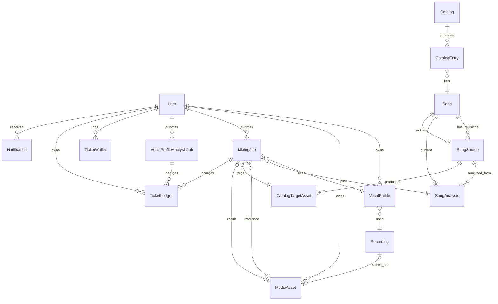
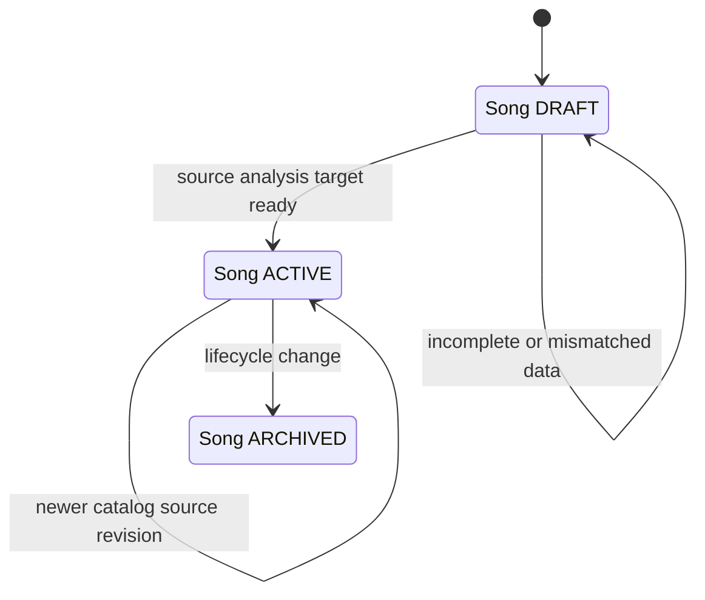
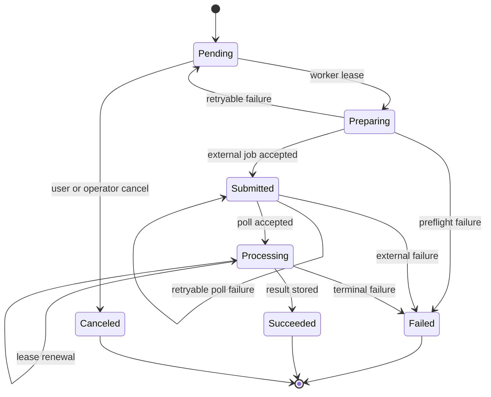

# 도메인 모델과 영속 상태

이 페이지는 현재 `prisma/schema.prisma`를 runtime 사실의 기준으로 삼아, 사용자의 음성 분석과 곡 카탈로그가 어떻게 믹싱 작업으로 이어지는지 설명한다. 새 기능을 추가할 때는 먼저 소유권과 revision 일치 여부를 확인하고, 외부 파일의 수명은 데이터베이스 행의 상태와 분리해서 다룬다.

추천 결과와 믹싱 화면의 흐름은 [/openwiki/workflows/recommendation-and-mixing.md](/openwiki/workflows/recommendation-and-mixing.md), 보컬 분석의 외부 경계는 [/openwiki/workflows/vocal-analysis.md](/openwiki/workflows/vocal-analysis.md), 외부 저장·분석 서비스는 [/openwiki/integrations/external-services.md](/openwiki/integrations/external-services.md)에서 이어서 본다.

## 한눈에 보는 관계

*그림은 사용자 소유 데이터, 곡의 revision·analysis·target, 그리고 작업·티켓의 영속 관계를 보여준다.*

### 핵심 엔터티

| 영역 | 영속 모델 | 책임과 연결 |
| --- | --- | --- |
| 사용자 음성 | `Recording`, `VocalProfile` | `Recording`은 오디오 메타데이터와 상태를 보유한다. 사용자 프로필은 `recordingId`를 필수로 가지며 분석 수치, `analyzer`와 `analyzerVersion`을 저장한다. `sourceType`은 `USER` 또는 `SONG`이다. |
| 곡 카탈로그 | `Song`, `SongSource`, `SongAnalysis`, `Catalog`, `CatalogEntry`, `CatalogTargetAsset` | 하나의 곡은 여러 source revision과 analysis를 가질 수 있다. `Song.activeSourceId`, `currentAnalysisId`, `targetAssetId`가 현재 조합을 가리킨다. `CatalogEntry`는 catalog 안의 위치와 공개 상태를 소유한다. |
| 외부 미디어 | `MediaAsset`, `CatalogTargetAsset` | 사용자 소유 reference/result 파일과 카탈로그 target 파일을 구분한다. 외부 provider 식별자는 `(externalProjectId, externalFileId)`로 unique하다. 삭제는 `DELETE_PENDING` → `DELETED` 및 `MediaCleanupJob`으로 비동기화된다. |
| 과금·통지 | `TicketWallet`, `TicketLedger`, `Notification` | wallet은 사용자·티켓 종류별 잔액의 현재값이고 ledger는 변동, `balanceAfter`, 사유와 대상 작업을 남기는 append 기록이다. 알림은 사용자에게 귀속되고 `dedupeKey`가 unique하다. |
| 비동기 작업 | `VocalProfileAnalysisJob`, `SongAnalysisJob`, `MixingJob` | retry/lease 필드(`attempts`, `nextAttemptAt`, `leaseOwner`, `leaseExpiresAt`)로 worker가 재시도와 동시 실행을 제어한다. 믹싱 작업은 실행에 사용한 profile, analysis, reference, target, catalog revision을 함께 pin한다. |

## 카탈로그 revision 교체와 readiness

카탈로그 import는 하나의 데이터베이스 transaction 안에서 snapshot의 곡들을 upsert한다. `Song`은 `(title, artist)`로 재사용되고, source는 `sourceVideoId`로 재사용되거나 해당 곡의 다음 `revision`으로 생성된다. 같은 source video가 다른 곡에 배정되거나, target이 다른 source에 연결되거나, target의 source video가 source와 다르면 import를 중단한다. catalog의 revision은 기존 값과 snapshot 값 중 큰 값으로 유지되므로 낮은 snapshot이 현재 revision을 되돌리지 않는다. ([catalog-import.ts](repo://src/entities/song-catalog/api/catalog-import.ts#L22-L45))

현재 곡이 공개 가능한지는 단순히 `CatalogEntry.status`만으로 결정되지 않는다. 다음 포인터와 상태가 모두 같은 source 계보를 가리켜야 한다.

- `Song.lifecycleStatus === ACTIVE`
- active source가 존재하고 `READY`
- current analysis가 존재하고 `READY`이며 `cleanupConfirmed === true`
- current analysis의 `sourceId`가 active source와 일치
- target이 존재하고 `READY`이며 target의 `sourceId`가 active source와 일치
- catalog entry가 `PUBLISHED`

이 조건이 깨지면 `catalogReadiness`는 `SONG_NOT_ACTIVE`, `ANALYSIS_SOURCE_MISMATCH`처럼 결정적인 이유를 반환한다. ([readiness.ts](repo://src/entities/song-catalog/lib/readiness.ts#L3-L44), [song-catalog-domain.test.ts](repo://tests/song-catalog-domain.test.ts#L22-L60)) import도 같은 규칙으로 source·analysis·target이 준비된 경우에만 entry를 `PUBLISHED`로 만들고 song의 active/current 포인터를 교체한다. 준비되지 않은 snapshot은 entry를 `DRAFT`로 남긴다. ([catalog-import.ts](repo://src/entities/song-catalog/api/catalog-import.ts#L211-L257))

*상태 전이는 Song lifecycle과 공개 가능성의 핵심 경로를 요약한다. 실제 enum에는 `DRAFT`, `ACTIVE`, `ARCHIVED`가 있다.*

믹싱 enqueue는 추천 결과를 그대로 신뢰하지 않는다. transaction 안에서 사용자 소유 `VocalProfile(sourceType=USER)`와 `READY` `SongAnalysis`를 다시 읽고, `Song`이 ACTIVE인지, analysis가 `currentAnalysisId`인지, entry가 공개되었는지, catalog revision·position·target·source 계보가 추천 결과와 일치하는지 검증한다. 하나라도 다르면 `MIXING_RECOMMENDATION_STALE`(409)로 거절하고 최신 추천을 요구한다. 통과한 값은 `MixingJob.catalogRevision`, `catalogPosition`, `songAnalysisId`, `targetAssetId`에 저장되므로 이후 catalog 교체가 이미 접수된 작업의 입력을 바꾸지 않는다. ([mixing-queue.ts](repo://src/features/create-mixing/api/mixing-queue.ts#L28-L89), [mixing-queue.ts](repo://src/features/create-mixing/api/mixing-queue.ts#L105-L131))

## 사용자 소유권과 미디어 수명

사용자 경계를 넘는 조회를 허용하지 않는 것이 현재 runtime 규칙이다. enqueue는 입력 profile을 `id + userId + sourceType=USER`로 조회하고, 분석 worker가 사용할 queued reference도 `id + userId + kind=REFERENCE + status=READY`로 확인한다. 따라서 ID만 알고 있는 다른 사용자의 profile이나 asset으로 작업을 만들 수 없다. `User` 삭제 시 사용자 소유 `MediaAsset`, job, wallet, ledger, notification은 cascade되지만, `Song`·`SongSource`·`SongAnalysis`·`MixingJob`이 참조하는 핵심 입력은 `Restrict`로 보호된다. ([mixing-queue.ts](repo://src/features/create-mixing/api/mixing-queue.ts#L45-L67), [persistence.ts](repo://src/entities/vocal-profile/api/persistence.ts#L159-L175), [schema.prisma](repo://prisma/schema.prisma#L413-L440))

분석이 성공하면 reference `MediaAsset`와 `Recording(status=READY)`를 함께 저장하고, smart synthesis reference가 있으면 별도 asset으로 저장한다. synthesis asset 저장이 실패해도 원본 분석 source fallback을 유지한다. 이후 DB 저장이 실패하면 이미 올린 asset을 폐기해 orphan을 줄인다. ([persistence.ts](repo://src/entities/vocal-profile/api/persistence.ts#L41-L57), [persistence.ts](repo://src/entities/vocal-profile/api/persistence.ts#L60-L89), [persistence.ts](repo://src/entities/vocal-profile/api/persistence.ts#L92-L149))

## 작업 lifecycle과 실패 의미

*`MixingJob`의 저장 상태와 worker lease·재시도 경로를 보여준다. retryable 실패는 terminal `FAILED`가 되기 전 `PENDING` 또는 `SUBMITTED`로 돌아갈 수 있다.*

`MixingJob`은 `PENDING → PREPARING → SUBMITTED → PROCESSING → SUCCEEDED`를 기본 경로로 사용하고, 실패 시 `errorCode`, `errorDetail`, `retryable`, 시각 필드를 남긴다. worker는 만료된 lease를 `FOR UPDATE SKIP LOCKED`로 다시 claim하고 attempt를 증가시키므로 같은 작업을 동시에 처리하지 않도록 한다. 외부 제출 전 실패가 terminal이면 `refundState=REQUIRED`로 기록하고 자동 환불을 시도한다. 외부에 이미 제출된 뒤의 실패는 서비스가 소비된 것으로 보고 `refundState=NONE`을 유지한다. ([schema.prisma](repo://prisma/schema.prisma#L99-L120), [worker.ts](repo://src/_app/background-jobs/mixing/worker.ts#L101-L130), [worker.ts](repo://src/_app/background-jobs/mixing/worker.ts#L187-L255))

보컬 분석 job도 `PENDING → PROCESSING → SUCCEEDED|FAILED`와 lease·retry 필드를 사용한다. 분석 비용이 있는 terminal failure는 `REQUIRED`가 되고, 환불 worker는 `REQUIRED`인 동안만 원장에 `USAGE_REFUND`를 기록한 뒤 `REFUNDED`로 전환한다. 믹싱 환불 key는 `mixing:refund:{job.id}`처럼 job 단위로 고정되어 재실행해도 중복 credit을 만들지 않는다. ([schema.prisma](repo://prisma/schema.prisma#L536-L567), [worker.ts](repo://src/_app/background-jobs/vocal-profile-analysis/worker.ts#L130-L158), [worker.ts](repo://src/_app/background-jobs/mixing/worker.ts#L146-L158))

## 티켓 원장 불변식과 idempotency

`TicketWallet`의 primary key는 `(userId, kind)`이므로 `VOCAL_ANALYSIS`와 `AI_MIXING` 잔액은 서로 섞이지 않는다. 모든 변동은 `TicketLedger.amount`와 transaction 후 잔액인 `balanceAfter`를 남긴다. 음수 debit은 잔액이 충분할 때만 conditional update가 성공하며, 아니면 `InsufficientTicketsError`를 던진다. wallet 변경과 ledger insert는 하나의 transaction에 묶이고 isolation level은 `Serializable`이다. write conflict은 최대 세 번 재시도한다. ([ticket-service.ts](repo://src/entities/ticket/api/ticket-service.ts#L42-L105), [ticket-service.ts](repo://src/entities/ticket/api/ticket-service.ts#L107-L133))

idempotency key는 결과를 안전하게 재시도하기 위한 입력 계약이다.

- `MixingJob`은 `(userId, idempotencyKey)`가 unique하다. 같은 key를 같은 profile·analysis로 재요청하면 기존 job을 반환하고, 다른 입력이면 `IDEMPOTENCY_CONFLICT`를 반환한다. job 생성과 usage debit은 같은 transaction에 있다.
- `VocalProfileAnalysisJob`도 사용자·key 조합이 unique하다. `recordingId` 역시 unique라 같은 녹음의 중복 분석 job을 막는다.
- `TicketLedger.idempotencyKey`가 unique하다. 같은 key를 다른 사용자·종류·type·amount로 재사용하면 오류이며, 동시 중복 요청은 동일 ledger를 반환한다.
- `Notification.dedupeKey`가 unique하다. `createMany(..., skipDuplicates: true)` 후 기존 row의 모든 입력을 비교해 key 재사용 변조를 거부한다.

이 보장은 단순한 API 편의가 아니라 중복 과금·중복 환불·중복 사용자 알림을 막는 영속 제약이다. 동시 signup grant 두 번과 동일 debit 두 번이 각각 한 번만 반영되고 티켓 종류가 격리되는 통합 테스트가 이를 검증한다. ([mixing-queue.ts](repo://src/features/create-mixing/api/mixing-queue.ts#L31-L43), [ticket-service.ts](repo://src/entities/ticket/api/ticket-service.ts#L48-L61), [notification-service.ts](repo://src/entities/notification/api/notification-service.ts#L68-L106), [ticket-ledger.integration.ts](repo://tests/ticket-ledger.integration.ts#L7-L68))

## 알림과 운영상 확인 지점

알림은 `userId`에 귀속된 내부 상대 경로 `href`만 허용한다. 제목은 120자, 메시지는 500자, dedupe key는 200자 이내로 정규화한다. 읽음은 `readAt`을 기록하는 사용자 범위 update이며, 목록은 최신 `createdAt`, `id` 순으로 페이지네이션한다. 작업 worker는 성공·실패를 각각 job별 dedupe key로 알리므로 lease 만료나 재시도 때문에 같은 결과 알림을 반복하지 않는다. ([notification-service.ts](repo://src/entities/notification/api/notification-service.ts#L30-L43), [notification-service.ts](repo://src/entities/notification/api/notification-service.ts#L109-L153))

변경 전에는 다음을 확인한다.

1. catalog import라면 snapshot 내부 position·곡·source video·target 중복과 source-video 계보를 검증한다.
2. 추천/믹싱 입력이라면 `currentAnalysisId`, active source, target, catalog revision을 같은 transaction에서 재검증한다.
3. 유료 job이라면 debit key, job key, `refundState` 전이를 함께 설계한다. 실패가 외부 제출 전인지 후인지에 따라 환불 의미가 달라진다.
4. 외부 파일을 먼저 만들었다면 DB transaction 실패 시 폐기 경로와 `MediaCleanupJob` 재시도를 남긴다.
5. 데이터 모델 변경 후에는 readiness mismatch, ticket 동시성/idempotency, job 재시도·환불, 알림 dedupe를 집중 테스트한다.
