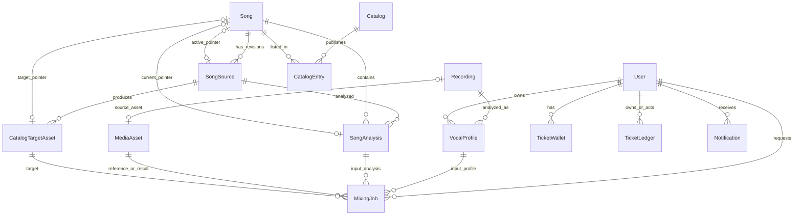
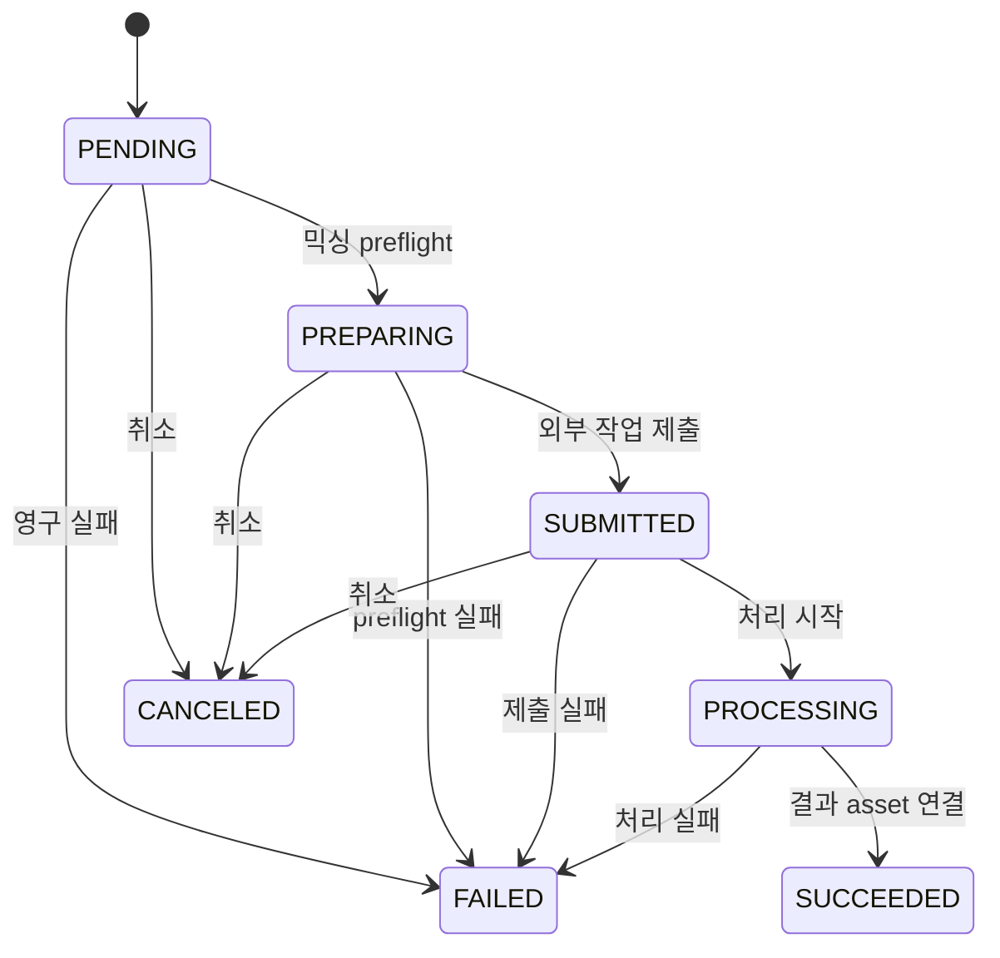

# 도메인 데이터 모델과 불변식

이 페이지의 실행 가능한 기준은 PostgreSQL용 `prisma/schema.prisma`와 그에 적용되는 `prisma/migrations`이다. 모델을 직접 수동 수정하거나 생성된 Prisma 클라이언트를 기준으로 스키마를 바꾸지 말고, **모든 스키마 변경은 migration을 추가하고 적용**한다. 현재 모델은 초기 데이터 기반에서 미디어, 티켓, 내구성 큐, 카탈로그 revision, target revision, 알림으로 확장되어 왔다 (`prisma/migrations/`).

## 한눈에 보는 핵심 관계

*그림은 영속 엔터티 사이의 소유, revision, 현재 포인터 및 작업 입력/결과 관계를 요약한다.*

### 엔터티별 책임과 비정상적으로 중요한 cardinality

- **`Recording`**은 업로드/분석 원본의 저장 위치와 미디어 메타데이터를 담는다. `kind`는 `USER_TEST`, `SONG_SOURCE`, `SVC_REFERENCE`, `SVC_TARGET`을 구별하고 `status`는 `PENDING`, `READY`, `FAILED`, `DELETED`다. 한 recording은 여러 `VocalProfile`을 가질 수 있지만, `mediaAssetId`가 unique이므로 연결된 원본 `MediaAsset`은 최대 하나다. 프로필 삭제가 recording을 지우는 구조가 아니며, 프로필은 recording을 `Restrict`로 참조한다 (`prisma/schema.prisma#L10-L22`, `#L130-L149`).
- **`VocalProfile`**은 한 recording에 대한 특정 `analyzer`와 `analyzerVersion`의 결과 스냅샷이다. 따라서 같은 녹음도 분석기 버전이 다르면 별도 프로필이 될 수 있고, `(recordingId, analyzer, analyzerVersion)`가 중복을 막는다. 사용자 프로필 번호는 `(userId, profileNumber)`가 unique이며 `sourceType`은 `USER` 또는 `SONG`이다. 수치 지표와 확장 가능한 `descriptors` JSON을 저장하고, 선택적으로 합성용 reference asset을 하나 연결한다 (`prisma/schema.prisma#L151-L186`). UI/API의 현재 사용자 프로필은 `sourceType: USER`와 양수 `profileNumber`를 요구하지만, 저장 모델의 `userId`는 nullable이므로 곡 분석 프로필(`SONG`)과 구별해야 한다 (`src/entities/vocal-profile/model/contract.ts#L71-L100`).
- **`Song`–`SongSource`–`SongAnalysis`**는 곡과 그 입력 revision, 분석 결과를 분리한다. 한 곡은 여러 source revision과 여러 analysis를 가질 수 있다. source는 `(songId, revision)` unique이고 `sourceVideoId`도 전역 unique다. analysis는 source별 `pipelineContract`가 unique이므로 같은 source와 pipeline 계약을 중복 실행하지 않는다. source/analysis 상태는 각각 `DRAFT|READY|SUPERSEDED|UNAVAILABLE`, `PENDING|READY|FAILED`다 (`prisma/schema.prisma#L188-L283`).
- `Song.activeSourceId`와 `Song.currentAnalysisId`는 각각 **현재 공개에 사용할 source와 분석 결과를 가리키는 pointer**이지 source/analysis의 생성 순서를 대신하지 않는다. `Song.targetAssetId`도 카탈로그용 target asset의 현재 pointer다. 모두 nullable이고 삭제 시 `SetNull`이므로 포인터가 없다고 행이 자동으로 복구되거나 publish-ready가 되는 것은 아니다.
- **카탈로그 publication**은 `Catalog`와 `CatalogEntry`로 표현한다. 카탈로그는 unique `slug`, `status: DRAFT|PUBLISHED|ARCHIVED`, 증가 가능한 `revision`을 가진다. entry는 곡을 카탈로그에 배치하며 `(catalogId, position)`과 `(catalogId, songId)`가 unique라서 한 카탈로그 안에서 위치와 곡이 중복될 수 없다. catalog 삭제는 entry를 cascade하지만 song 삭제는 entry가 `Restrict`한다. publish-ready 곡은 활성 source, current analysis, target asset, 적절한 상태의 entry가 모두 일치해야 한다는 통합 조건을 코드가 검사한다 (`prisma/schema.prisma#L312-L342`, `tests/song-catalog-db.integration.ts#L85-L143`).
- **`CatalogTargetAsset`은 `MediaAsset`과 다른 개념**이다. 이는 곡 source revision에서 만든 카탈로그 대상 파일이며 `sourceVideoId`, `sha256`, 외부 project/file 식별자와 media 상태를 가진다. 한 source에 여러 target revision이 존재할 수 있고, 곡의 `targetAssetId`만 현재 채택된 하나를 가리킨다. 반면 사용자 녹음 및 믹싱 결과는 `MediaAsset`에 저장된다. 양쪽 모두 `(externalProjectId, externalFileId)` unique라 외부 파일을 재등록하지 않는다 (`prisma/schema.prisma#L413-L467`).

## 작업 큐와 상태

작업 행은 단순한 UI 진행률이 아니라 재시도 가능한 durable queue다. `SongAnalysisJob`은 source당 최대 하나(`sourceId @unique`)이고 analysis를 선택적으로 연결한다. `VocalProfileAnalysisJob`은 recording당 최대 하나이며 사용자와 source asset, 생성된 profile 및 ticket ledger를 연결한다. `MixingJob`은 사용자, vocal profile, song, **선택된 `SongAnalysis`**, reference asset, target asset, 추천 시점의 `catalogPosition`·`catalogRevision`·`scoringVersion`을 함께 고정한다. 즉 나중에 곡의 current pointer나 카탈로그가 바뀌어도 이미 요청한 믹싱의 입력 맥락은 바뀌지 않는다 (`prisma/schema.prisma#L285-L310`, `#L536-L617`).

*믹싱의 저장 상태(`MixingJobStatus`)와 외부 제출 경계를 보여준다.*

모든 큐 작업은 `status`, `attempts`, `maxAttempts`, `nextAttemptAt`, lease(`leaseOwner`, `leaseExpiresAt`), heartbeat, error code/detail, retryable, 시각 필드를 갖는다. worker는 만료 lease를 회수할 수 있고, idempotency key로 중복 요청을 방지한다. 공개 계약은 Prisma enum 대문자 상태를 소문자 `pending` 등으로 serialize한다. 따라서 DB 상태와 UI 상태를 같은 문자열로 비교하지 말고 계약 serializer를 경계로 사용한다 (`src/entities/mixing-job/model/contract.ts#L4-L16`, `#L125-L145`). vocal analysis와 song analysis는 각각 `PENDING → PROCESSING → SUCCEEDED|FAILED`이며, 믹싱만 `PREPARING`, `SUBMITTED`, `CANCELED`를 추가로 가진다 (`prisma/schema.prisma#L48-L53`, `#L99-L114`).

실패 시 외부 결과를 즉시 DB에서 지우는 대신 asset을 `DELETE_PENDING`으로 두고 `MediaCleanupJob`이 `PENDING → PROCESSING → SUCCEEDED|FAILED`로 정리한다. 결과 삭제 API가 `mediaCleanupPending`을 반환할 수 있는 이유가 이것이다 (`prisma/schema.prisma#L67-L85`, `#L469-L481`; `src/entities/mixing-job/model/contract.ts#L105-L111`).

## 티켓, 사용자, 알림

`User`는 인증 주체이자 소유권 경계다. session/account는 사용자 삭제 시 cascade되고, 사용자가 만든 song/source와 프로필·미디어·작업·알림도 각각 관계의 on-delete 정책을 따른다. 티켓은 종류별로 분리한다. `TicketWallet`의 복합 primary key `(userId, kind)`는 `VOCAL_ANALYSIS`와 `AI_MIXING` 잔액을 한 지갑 행에 섞지 못하게 한다. ledger는 immutable 성격의 거래 기록으로 amount, 거래 후 잔액, 사유, unique `idempotencyKey`를 보존하며 소유자와 관리자 actor를 별도로 기록한다. 작업과 ledger의 연결은 nullable이므로 환불·관리자 조정도 표현할 수 있다 (`prisma/schema.prisma#L344-L366`, `#L483-L517`; `src/entities/ticket/model/contract.ts#L3-L20`). API 계약은 잔액을 음수가 아닌 정수로 투영한다. 잔액 차감/환불을 추가하거나 변경할 때는 지갑 갱신과 ledger 기록의 원자성, idempotency를 함께 보장해야 한다.

`Notification`은 사용자별 inbox 항목이다. 허용 type은 티켓 지급, vocal profile 성공/실패, mixing 성공/실패이며 `dedupeKey`가 unique라 동일 사건을 중복 알림으로 만들지 않는다. `readAt = null`이 미읽음이고, 목록은 `unreadOnly`와 `unreadCount`를 별도로 제공하며 전체 읽음 응답은 unread count 0을 보장한다. `href`는 내부 절대경로(`/`로 시작하되 `//`는 금지)여야 한다 (`prisma/schema.prisma#L519-L534`; `src/entities/notification/model/contract.ts#L4-L55`).

## 추천과 현재성의 구분

추천 결과는 영속 핵심 entity의 pointer를 덮어쓰는 것이 아니라 사용자 vocal profile, 공개 catalog의 `catalogRevision`, `scoringVersion`, 그리고 각 item의 `songAnalysisId`·`targetAssetId`·순위·recommended shift를 묶은 계산 결과다. 합성은 추천 item 안에서 `not_started → preparing → queued → processing → succeeded|failed`로 별도 투영된다. catalog revision이 바뀌면 캐시 identity가 달라져 다시 계산하지만, 같은 revision의 반복 계산은 같은 결과를 재사용할 수 있다 (`src/entities/recommendation/model/contract.ts#L5-L25`, `#L101-L148`; `tests/recommendation-persistence.integration.ts#L62-L90`).

프로필 데이터의 `analyzerVersion`은 단순 표시 필드가 아니라 결과의 의미를 식별하는 버전이다. `descriptors`에는 pitch histogram/track 같은 분석 확장 데이터와 합성 reference 선택 근거가 들어갈 수 있다. 중간 음역 reference가 없으면 추천은 가능해도 mixing capability를 `missing_mid_reference` 또는 `reference_unavailable`로 표시할 수 있으므로, **추천 가능성**, **합성 reference 존재**, **믹싱 가능성**을 하나의 boolean으로 합치지 않는다 (`src/entities/vocal-profile/model/contract.ts#L18-L69`; `src/entities/recommendation/model/contract.ts#L75-L99`).

## 운영·변경 시 체크리스트

1. 새 source를 만들 때 `(songId, revision)`과 전역 `sourceVideoId` 충돌을 먼저 고려하고, 이전 source를 자동으로 active로 만들지 않는다.
2. analysis나 target을 교체할 때는 `Song`의 current/active/target pointer를 같은 트랜잭션 경계에서 의도적으로 갱신하고, publish readiness를 다시 검사한다.
3. 외부 미디어 삭제는 행 삭제와 외부 파일 삭제를 같은 순간에 가정하지 않는다. 상태를 `DELETE_PENDING`으로 남겨 cleanup job이 재시도할 수 있게 한다.
4. queue handler는 idempotency key, lease/heartbeat, retryable과 attempts를 함께 처리한다. 외부 provider의 성공 뒤 DB 저장이 실패하는 경우를 cleanup 경로로 포함한다.
5. Prisma 모델·enum·unique/index·onDelete를 변경할 때는 migration을 작성하고 통합 테스트를 실행한다. 핵심 회귀 테스트는 `tests/song-catalog-db.integration.ts`, `tests/recommendation-persistence.integration.ts`, `tests/vocal-profile-persistence.integration.ts`이며 `DATABASE_URL`이 없으면 skip된다.

## 관련 경계

- 외부 파일 업로드/확인/삭제와 provider 식별자는 `/openwiki/integrations/leemage-media.md`에서 다룬다.
- 티켓 차감·환불과 알림의 업무 흐름은 `/openwiki/concepts/ownership-tickets-and-notifications.md`를 참조한다.
- lease, retry, worker 운영은 `/openwiki/operations/job-processing.md`를 참조한다.
