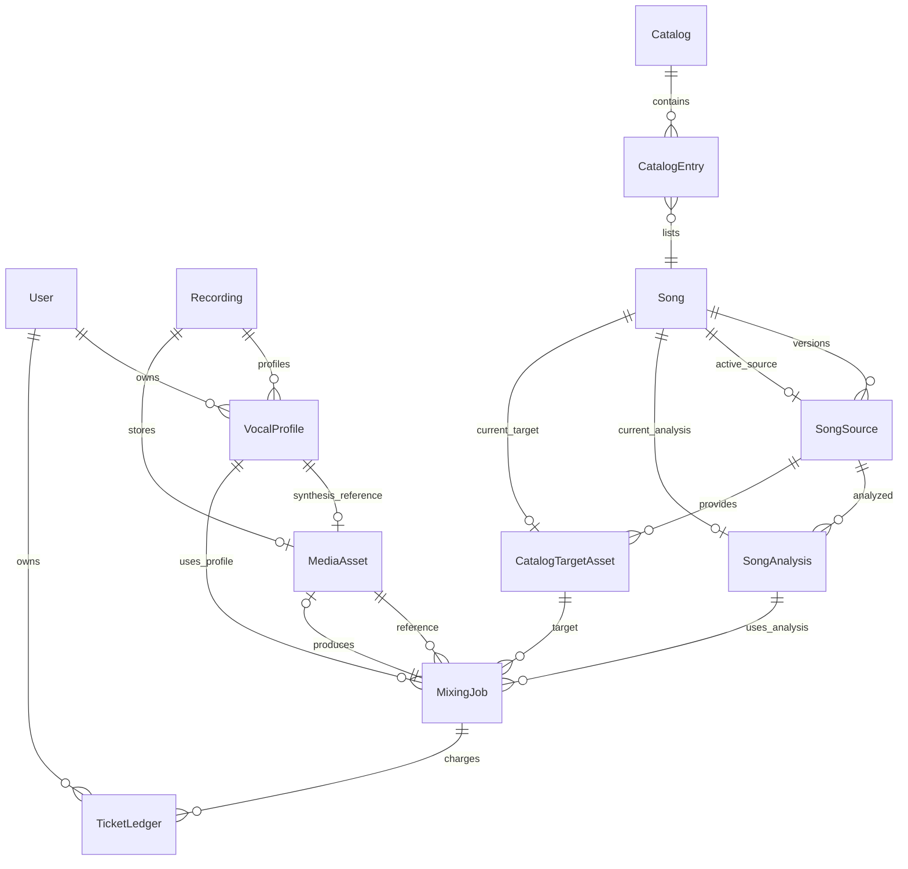
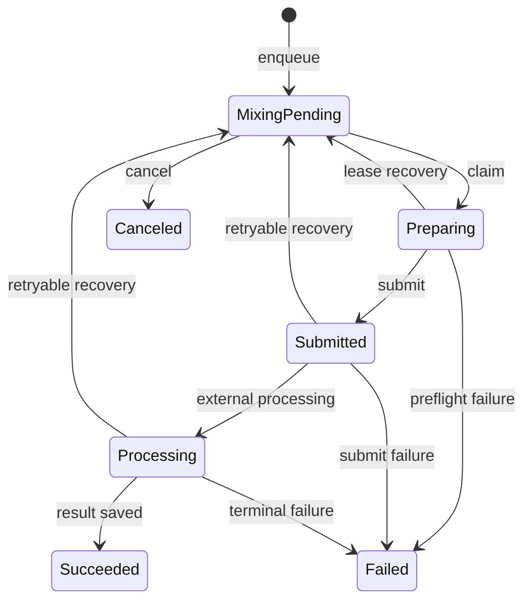

# 보컬 프로필·카탈로그·믹싱 데이터 모델

## 먼저 잡을 결론

믹싱의 입력은 서로 독립적인 파일 묶음이 아니에요. 사용자 소유 `VocalProfile`이 `Recording`과 그 `MediaAsset`을 가리키고, 카탈로그의 `Song`이 특정 `SongSource`와 `SongAnalysis`, `CatalogTargetAsset`을 현재 값으로 선택해요. `MixingJob`은 이 선택 결과와 `catalogRevision`을 작업 시점에 복사해 고정하고, 티켓 차감은 같은 트랜잭션의 `TicketLedger` 기록으로 남겨요.

따라서 변경할 때는 먼저 **현재 데이터의 유효성**을 확인하고, 그다음 **작업이 이미 고정한 스냅샷 값**을 확인하세요. 데이터 모델의 중심 제약과 관계는 [`prisma/schema.prisma`](repo://prisma/schema.prisma#L130-L186)와 [`prisma/schema.prisma`](repo://prisma/schema.prisma#L569-L617)에서 추적할 수 있어요. 추천 결과가 최신인지 확인하는 실행 시 경계는 [`mixing-queue.ts`](repo://src/features/create-mixing/api/mixing-queue.ts#L45-L121)에 있어요.

## 소유권과 고정 지점

*그림은 사용자·프로필·카탈로그 자산·믹싱 작업·티켓 원장의 저장 관계를 보여줘요.*

- `User`가 `VocalProfile`과 `MediaAsset`, `MixingJob`, `TicketWallet`, `TicketLedger`의 사용자 소유 경계를 제공해요. `VocalProfile.userId`는 nullable이지만, 사용자 분석 저장 경로는 `sourceType: USER`로 만들고 사용자와 연결해요.
- `VocalProfile`은 하나의 `Recording`을 필수로 참조하고, 하나의 `Recording`에는 여러 프로필 분석 결과가 연결될 수 있어요. `Recording.mediaAssetId`는 원본 오디오 저장물을 선택적으로 연결해요. 합성용 레퍼런스는 별도의 `MediaAsset`이며 `synthesisReferenceAssetId`가 unique라 프로필 하나가 최대 하나를 가리켜요.
- `Song`은 여러 `SongSource`와 `SongAnalysis`를 보유하지만, `activeSourceId`와 `currentAnalysisId`로 현재 선택을 따로 저장해요. `SongSource.songId`와 `SongAnalysis.songId/sourceId`는 삭제 시 `Restrict` 관계라 이력의 부모를 함부로 삭제할 수 없어요.
- `CatalogTargetAsset`은 `SongSource`에 선택적으로 귀속되고, `Song.targetAssetId`는 현재 타깃을 가리켜요. 사용자별 `MediaAsset`과 달리 `CatalogTargetAsset`에는 `userId`가 없어서 카탈로그 자산은 사용자별 소유가 아니에요.

## revision은 어디에 남나요?

`SongSource.revision`은 한 곡 안의 소스 버전이에요. `(songId, revision)`이 unique이고, `sourceVideoId`도 전역 unique라 같은 영상이 여러 소스나 곡에 중복 배정되지 않아요. 카탈로그 import는 기존 곡의 최대 revision 다음 번호를 만들고, 같은 `sourceVideoId`를 다시 import하면 기존 행을 갱신해요. import 구현은 [`catalog-import.ts`](repo://src/entities/song-catalog/api/catalog-import.ts#L105-L161)에서 확인하세요.

`Catalog.revision`은 소스 revision과 다른 카탈로그 스냅샷 번호예요. `(catalogId, position)`과 `(catalogId, songId)`가 unique라 한 카탈로그 안에서 위치와 곡 중복을 막아요. import는 들어온 revision보다 낮지 않게 카탈로그 revision을 유지하고, 준비된 항목만 `PUBLISHED`로 만들어요.

`MixingJob.catalogRevision`, `catalogPosition`, `scoringVersion`, `recommendedShift`는 추천 계산 당시의 값을 복사한 작업 기록이에요. 이것만으로 현재 카탈로그가 유효하다고 판단하지 않아요. `enqueueMixingJob`은 `Song.lifecycleStatus`, 현재 분석 ID, 공개 카탈로그와 revision, 위치, 타깃의 `sourceId`·`READY` 상태를 다시 대조하고, 다르면 `MIXING_RECOMMENDATION_STALE`을 반환해요.

## 상태 수명 주기

*그림은 `MixingJobStatus`의 저장 상태와 워커가 재시도할 수 있는 경계를 요약해요.*

데이터베이스 enum의 `MixingJobStatus`는 대문자 `PENDING`부터 `CANCELED`까지를 저장해요. 공개 API는 이를 소문자 `pending`부터 `canceled`로 직렬화하므로, UI의 표시 상태와 DB enum을 같은 계약으로 취급하지 마세요. 공개 상태 목록은 [`contract.ts`](repo://src/entities/mixing-job/model/contract.ts#L4-L16)에 있고, 작업 생성과 티켓 차감은 [`mixing-queue.ts`](repo://src/features/create-mixing/api/mixing-queue.ts#L105-L135)에 있어요.

- 분석 결과는 `SongAnalysisStatus`의 `PENDING`, `READY`, `FAILED`를 사용해요. 실행 중인 분석 제출·재시도 자체는 별도 `SongAnalysisJobStatus`의 `PENDING`, `PROCESSING`, `SUCCEEDED`, `FAILED`로 추적해요.
- 보컬 분석 워커도 `VocalProfileAnalysisJob`에 작업 상태, 시도 횟수, lease, `refundState`를 저장하고, 성공하면 `VocalProfile`을 연결해요. `recordingId`와 생성된 `vocalProfileId`는 각각 unique예요.
- `MediaAsset`은 `READY`, `DELETE_PENDING`, `DELETED`, `FAILED`를 사용해요. 믹싱 결과 삭제는 작업 행을 즉시 없애는 것과 외부 파일 정리를 분리할 수 있고, API 응답도 `mediaCleanupPending`을 노출해요.
- `Recording`은 `PENDING`, `READY`, `FAILED`, `DELETED`를 사용하지만 revision 필드가 없어요. 새 분석 결과를 revision으로 덮어쓰는 모델이 아니라 새 `Recording`과 `VocalProfile` 조합을 저장하는 모델이에요.

## 믹싱 입력의 실행 시 검증

`enqueueMixingJob`은 먼저 사용자 `sourceType: USER` 프로필과 `READY`인 `SongAnalysis`를 읽어요. 이어서 공개 카탈로그 항목과 현재 타깃을 확인하고, 프로필의 합성 레퍼런스를 우선 선택하되 없으면 원본 녹음 자산을 선택해요. 둘 다 사용할 수 없으면 작업도 티켓 차감도 만들지 않고 `MIXING_REFERENCE_UNAVAILABLE`을 반환해요.

작업 생성과 `AI_MIXING` 티켓 `USAGE_DEBIT`는 `Serializable` 트랜잭션 안에서 함께 실행돼요. `(userId, idempotencyKey)`가 unique라 같은 요청을 동시에 두 번 보내도 한 작업과 한 차감으로 수렴하고, 같은 키를 다른 프로필·분석에 재사용하면 `IDEMPOTENCY_CONFLICT`예요. 이 동작은 [`mixing-queue.integration.ts`](repo://tests/mixing-queue.integration.ts#L172-L211)에서 중복 enqueue, 잔액, 레퍼런스 실패와 환불 경계까지 검증해요.

워커의 lease는 `leaseOwner`, `leaseExpiresAt`, `heartbeatAt`로 작업 소유권을 표현해요. 한 시점에 한 워커만 claim할 수 있고, 재시도 가능 오류는 시도 횟수와 `nextAttemptAt`에 따라 다시 대기할 수 있어요. 최종 실패 또는 외부 레퍼런스 fetch 실패처럼 작업을 진행할 수 없는 경우에는 `refundState`를 `REFUNDED`로 바꾸고 `USAGE_REFUND` 원장을 남겨야 해요. 이 페이지에서 확인 가능한 focused test는 두 워커 중 하나만 claim되고 실패 시 잔액이 복구되는 경계를 보여줘요.

## 티켓 원장은 잔액의 변경 근거예요

`TicketWallet`은 `(userId, kind)`를 복합 기본 키로 사용하며 `kind`는 `VOCAL_ANALYSIS`와 `AI_MIXING`으로 분리돼요. 현재 잔액은 wallet의 `balance`이고, 각 변경은 `TicketLedger`에 양의 지급 또는 음의 사용·환불 금액과 `balanceAfter`를 남겨요. `TicketLedger.idempotencyKey`가 unique라 동일한 경제적 효과를 재적용하지 않아요.

`applyTicketChangeInTransaction`은 먼저 같은 idempotency key의 입력이 같은지 검사하고, 차감일 때 `balance >= abs(amount)` 조건부 갱신을 수행해요. 잔액이 부족하면 `InsufficientTicketsError`를 던지고 원장을 만들지 않아요. 믹싱 작업이나 보컬 분석 작업과의 연결은 각각 nullable 외래 키로 남기며, 원장 자체는 사용자와 함께 삭제될 수 있어요. 이 규칙은 [`ticket-service.ts`](repo://src/entities/ticket/api/ticket-service.ts#L42-L104)에서 확인하세요.

## 저장 실패와 변경 시 주의점

보컬 분석 persistence는 원본 reference `MediaAsset`을 먼저 저장한 뒤 DB 트랜잭션에서 `Recording`과 `VocalProfile`을 함께 만들어요. 합성 reference 저장이 실패해도 원본을 fallback으로 남기고 descriptor에 실패 상태를 기록해요. 반대로 원본 저장이나 DB 저장이 실패하면 이미 만든 외부 자산을 discard하려고 시도해요. persistence 실패 경계는 [`persistence.ts`](repo://src/entities/vocal-profile/api/persistence.ts#L34-L150)와 [`vocal-profile-persistence.integration.ts`](repo://tests/vocal-profile-persistence.integration.ts#L148-L181)에서 확인하세요.

Prisma의 관계와 enum은 저장 가능한 구조를 말해 주지만, “믹싱 가능”은 DB enum 하나가 정하는 값이 아니에요. 현재 분석·카탈로그 공개 상태·revision 일치·타깃 연결·자산 `READY` 여부를 enqueue 코드가 함께 확인해요. 이 실행 시 source of truth를 우회해 직접 `MixingJob`을 만들지 말고, 관련 변경 뒤에는 [`recommendations-and-catalog.md`](../workflows/recommendations-and-catalog.md), [`mixing-and-recovery.md`](../workflows/mixing-and-recovery.md), [`vocal-analysis.md`](../workflows/vocal-analysis.md)에서 해당 흐름을 이어서 읽으세요.
