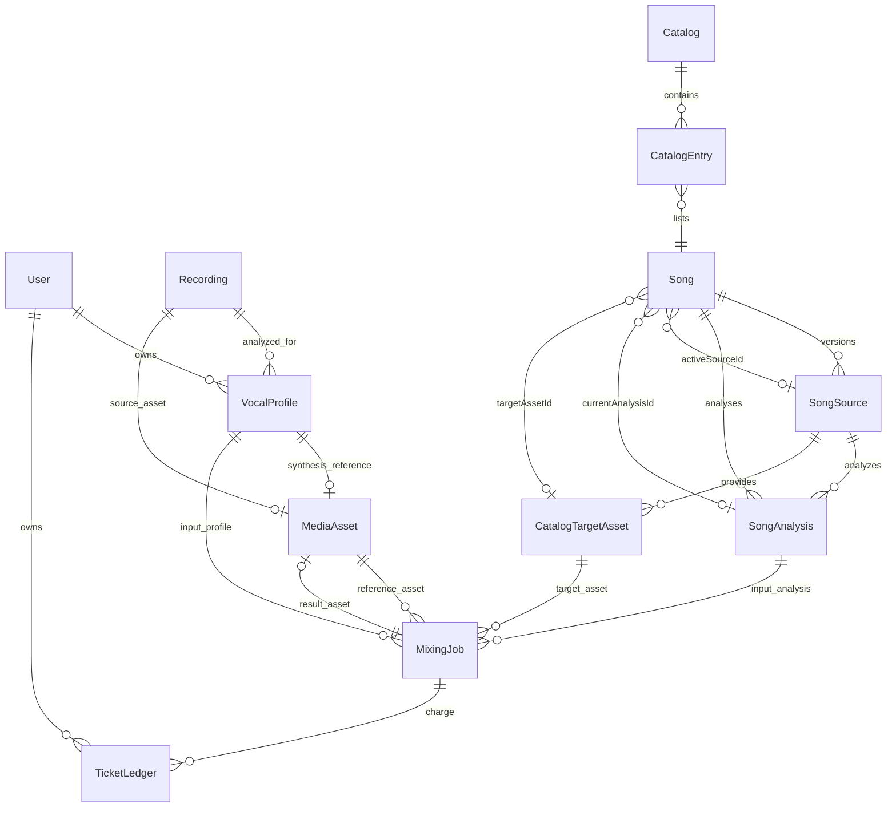
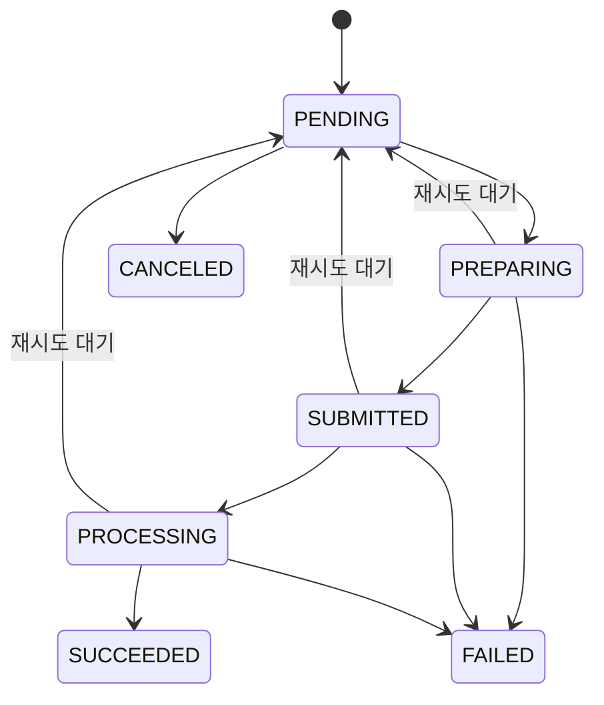

# 보컬·카탈로그·작업·티켓·미디어 데이터 모델

## 변경 전에 보존할 결론

이 페이지는 참조 문서예요. 독자 질문은 **“이 기능을 바꿀 때 어떤 행·관계·상태 불변식을 보존해야 하나요?”**예요.

믹싱 입력은 파일만으로 결정되지 않아요. 사용자 소유 `VocalProfile`은 `Recording`과 원본 `MediaAsset`을 연결하고, `Song`은 현재 `SongSource`, `SongAnalysis`, `CatalogTargetAsset`을 별도로 선택해요. `MixingJob`은 이 선택의 식별자와 추천 시점의 catalog 값을 저장하며, enqueue 안에서 현재 상태를 다시 확인해요. 유료 사용은 `TicketWallet` 잔액과 `TicketLedger` 원장에 함께 반영돼요.

변경할 때는 다음 순서로 확인하세요.

1. 부모 행과 외래 키의 `onDelete` 동작을 확인하세요.
2. 현재 선택을 가리키는 ID와 작업에 복사된 snapshot 값을 구분하세요.
3. 저장 enum과 공개 API 상태를 구분하세요.
4. 작업 생성, 티켓 차감, 외부 미디어 정리가 어느 트랜잭션과 수명 주기에 속하는지 확인하세요.

핵심 스키마는 [`prisma/schema.prisma`](repo://prisma/schema.prisma#L130-L186)와 [`prisma/schema.prisma`](repo://prisma/schema.prisma#L417-L627)에서 확인할 수 있어요. enqueue의 실행 시 경계는 [`mixing-queue.ts`](repo://src/features/create-mixing/api/mixing-queue.ts#L55-L147)에 있어요.

## 소유권과 현재 선택

- `User`는 `VocalProfile`, `MediaAsset`, `MixingJob`, `TicketWallet`, `TicketLedger`의 소유 경계를 제공해요. `VocalProfile.userId` 자체는 nullable이지만 사용자 분석 저장 경로는 `sourceType: USER`와 사용자 ID를 함께 사용해요.
- `VocalProfile.recordingId`는 필수예요. `(recordingId, analyzer, analyzerVersion)` unique 제약은 같은 분석 구현의 중복 프로필을 막아요. `synthesisReferenceAssetId`는 unique라 프로필 하나가 합성 레퍼런스를 최대 하나만 가리켜요.
- `Song`은 여러 `SongSource`와 `SongAnalysis`를 이력으로 보유해요. `activeSourceId`, `currentAnalysisId`, `targetAssetId`는 그중 현재 사용할 행을 별도로 가리켜요. 현재 분석과 활성 소스가 바뀌어도 이력 행을 작업이 직접 갱신하는 구조는 아니에요.
- `CatalogTargetAsset`에는 `userId`가 없어요. 사용자별 `MediaAsset`과 달리 카탈로그가 제공하는 타깃 자산이에요.

## revision과 추천 snapshot

`SongSource.revision`은 한 곡 안의 소스 버전이에요. `(songId, revision)`이 unique이고 `sourceVideoId`가 전역 unique라 같은 영상의 중복 배정을 제한해요. 카탈로그 import는 기존 곡의 다음 revision을 계산하거나, 같은 `sourceVideoId`가 있으면 기존 행을 갱신해요. 자세한 import 흐름은 [`catalog-import.ts`](repo://src/entities/song-catalog/api/catalog-import.ts#L105-L161)에서 확인하세요.

`Catalog.revision`은 `SongSource.revision`과 다른 카탈로그 snapshot 번호예요. `(catalogId, position)`과 `(catalogId, songId)`가 unique라 한 카탈로그 안의 위치와 곡 중복을 제한해요. 공개 항목을 만들고 현재 참조를 갱신하는 조건은 import 코드에서 함께 확인하세요.

`MixingJob`은 `catalogRevision`, `catalogPosition`, `recommendedShift`, `scoringVersion`과 `vocalProfileId`, `songAnalysisId`, `referenceAssetId`, `targetAssetId`를 저장해요. 이 값은 추천을 작업으로 옮긴 시점의 입력 snapshot이에요. 현재 유효성을 보장하는 대체물이 아니에요.

`enqueueMixingJob`은 트랜잭션 안에서 사용자 `sourceType: USER` 프로필과 `READY` 분석을 읽어요. 이어서 곡이 `ACTIVE`인지, 분석 ID가 현재 분석인지, 선택된 공개 카탈로그의 revision·position이 추천과 같은지, 타깃의 `id`, `sourceId`, `READY` 상태가 맞는지 확인해요. 하나라도 다르면 `MIXING_RECOMMENDATION_STALE`을 반환해요. 합성 레퍼런스가 없으면 원본 녹음 자산을 선택하고, 둘 다 없으면 `MIXING_REFERENCE_UNAVAILABLE`로 작업과 차감을 만들지 않아요.

## 상태와 작업 수명 주기

`MixingJobStatus`의 DB enum 값은 대문자 `PENDING`, `PREPARING`, `SUBMITTED`, `PROCESSING`, `SUCCEEDED`, `FAILED`, `CANCELED`예요. 공개 계약은 소문자 상태를 사용하고 `serializeMixingJob`이 DB 값을 `toLowerCase()`로 변환해요. API 상태를 DB enum 이름으로 저장하거나 비교하지 마세요. 계약은 [`contract.ts`](repo://src/entities/mixing-job/model/contract.ts#L4-L16)와 [`contract.ts`](repo://src/entities/mixing-job/model/contract.ts#L125-L145)에서 확인하세요.

`MixingJob`과 분석 작업은 `attempts`, `maxAttempts`, `nextAttemptAt`, `leaseOwner`, `leaseExpiresAt`, `heartbeatAt`로 워커의 재시도와 임대 소유권을 저장해요. 믹싱 작업에는 `ticketCost`와 `refundState`도 있어요. `deadlineAt`, `submissionStartedAt`, `submissionState`는 외부 제출 경계를 복구할 때 읽는 현재 저장 필드예요. 이 필드가 있다고 해서 모든 전이를 DB가 자동으로 보장하는 것은 아니므로, 전이를 바꾸면 해당 워커와 복구 호출자도 함께 확인하세요.

관련 저장 상태는 다음과 같아요.

- `Recording`은 `PENDING`, `READY`, `FAILED`, `DELETED`예요. `Recording.mediaAssetId` 삭제 동작은 `SetNull`이고, `VocalProfile`이 참조하는 `Recording`은 `Restrict`예요.
- `SongSource`는 `DRAFT`, `READY`, `SUPERSEDED`, `UNAVAILABLE`, `SongAnalysis`는 `PENDING`, `READY`, `FAILED`예요. `SongSource`와 `SongAnalysis`를 부모로 참조하는 핵심 관계는 `Restrict`예요.
- `MediaAsset`과 `CatalogTargetAsset`은 `READY`, `DELETE_PENDING`, `DELETED`, `FAILED`를 저장해요. `MixingJob`의 입력 자산 관계는 `Restrict`이고 결과 자산 관계는 `SetNull`이에요.
- `VocalProfileAnalysisJob`과 `SongAnalysisJob`은 각각 별도 작업 상태와 lease·attempt 필드를 가져요. 분석 결과 행의 상태와 제출 작업의 상태를 한 enum으로 합치지 마세요.

## 작업과 티켓의 원자성

`enqueueMixingJob`은 `MixingJob` 생성과 `AI_MIXING`의 `USAGE_DEBIT`를 `Serializable` 트랜잭션에서 함께 수행해요. 트랜잭션 안에서 queue admission과 입력 재검증도 먼저 실행해요. 생성 직후 차감이 실패하면 작업도 커밋되지 않아요.

`MixingJob`의 `(userId, idempotencyKey)` unique 제약과 enqueue의 선조회·트랜잭션 내부 재조회·unique 충돌 처리가 같은 요청의 중복 실행을 한 작업으로 수렴시켜요. 같은 키를 다른 프로필이나 분석에 재사용하면 `IDEMPOTENCY_CONFLICT`예요. 티켓 ledger의 `idempotencyKey`도 unique라 동일한 원장 효과를 다시 적용하지 않아요. 이 경계는 [`mixing-queue.integration.ts`](repo://tests/mixing-queue.integration.ts#L172-L211)에서 변경 범위 테스트로 확인하세요.

`TicketWallet`은 `(userId, kind)` 복합 기본 키로 `VOCAL_ANALYSIS`와 `AI_MIXING` 잔액을 나눠요. `TicketLedger`는 `amount`, `balanceAfter`, 변경 종류와 이유를 기록해요. 음수 변경은 `balance >= abs(amount)` 조건부 갱신을 통과해야 하고, 실패하면 `InsufficientTicketsError`를 던지며 원장을 만들지 않아요. 원장과 작업의 연결 외래 키는 nullable이고, 사용자 삭제 시 wallet과 소유자 원장은 함께 삭제되며 작업 연결은 `SetNull`이에요. 구현은 [`ticket-service.ts`](repo://src/entities/ticket/api/ticket-service.ts#L48-L104)에서 확인하세요.

## 미디어 삭제와 변경 경계

`MediaAsset`은 사용자 소유 외부 파일의 DB 참조이고, `CatalogTargetAsset`은 카탈로그 외부 파일의 참조예요. 두 모델 모두 외부 식별자 `(externalProjectId, externalFileId)`를 unique로 보장하고, 상태와 `deletedAt`을 저장해요. `MediaCleanupJob`은 자산을 참조하며 자산 삭제 시 cascade돼요.

믹싱 결과 삭제는 `MixingJob` 행의 결과 참조를 `SetNull`로 만드는 것과 외부 파일 정리를 같은 동작으로 가정하지 마세요. `MediaOperation`은 원래 도메인 행이 삭제돼도 남을 수 있는 독립 정리 의도이고, 외부 미디어 작업은 별도 수명 주기로 처리돼요. 삭제나 외부 자산 재사용을 바꿀 때는 [`prisma/schema.prisma`](repo://prisma/schema.prisma#L417-L485)와 production readiness migration의 [`migration.sql`](repo://prisma/migrations/20260913010000_production_readiness_core/migration.sql#L16-L37)을 함께 확인하세요.

## 변경 체크리스트

- 현재 선택 ID와 작업 snapshot을 모두 갱신하거나, 오래된 추천을 명시적으로 거부하세요.
- `Restrict`, `SetNull`, `Cascade`를 외래 키별로 확인하고 외부 파일 삭제를 DB 행 삭제와 분리하세요.
- 공개 상태 문자열과 Prisma enum을 변환 경계에서 테스트하세요.
- 작업 생성과 티켓 원장 변경을 분리하지 말고 idempotency 키 재사용 충돌을 유지하세요.
- 상태 전이를 바꾸면 lease 만료, 재시도, 환불 및 외부 제출 복구 호출자를 변경 범위 테스트로 확인하세요.

카탈로그 추천의 현재 선택 규칙은 [`recommendations-and-catalog.md`](../workflows/recommendations-and-catalog.md), 믹싱 복구는 [`mixing-and-recovery.md`](../workflows/mixing-and-recovery.md), 보컬 분석 저장은 [`vocal-analysis.md`](../workflows/vocal-analysis.md)에서 이어서 읽으세요.
