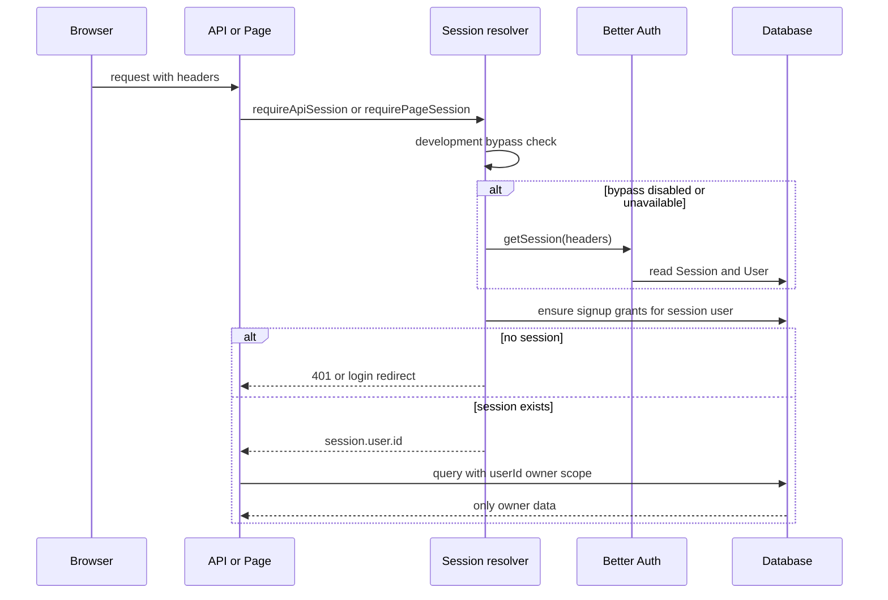
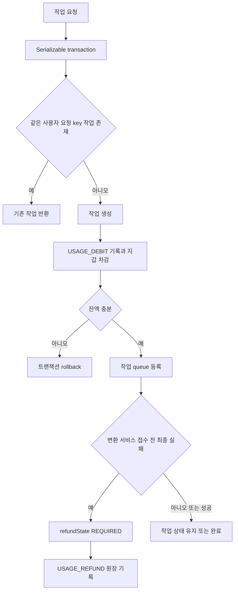

# 인증·데이터 소유권·티켓과 알림

이 페이지는 로그인한 사용자의 `userId`가 요청에서 데이터 조회와 비용 차감까지 어떻게 이어지는지 설명합니다. 핵심 규칙은 **세션의 사용자만 자신의 프로필·미디어·작업·티켓·알림을 읽고 변경한다**는 것입니다. 분석과 믹싱을 시작할 때 작업과 티켓 차감은 하나의 `Serializable` 트랜잭션으로 묶이고, 작업이 변환 서비스에 접수되기 전에 실패하면 원장에 자동 환불을 남깁니다.

데이터 모델의 사용자 관계와 지갑·원장·알림 제약은 [`User`, `TicketWallet`, `TicketLedger`, `Notification` 모델](repo://prisma/schema.prisma#L344-L366)을 기준으로 확인할 수 있습니다. 분석·믹싱의 상위 경계는 [도메인 데이터 모델](/openwiki/concepts/domain-data-model.md), 실행 흐름은 [보컬 분석](/openwiki/workflows/vocal-analysis.md)과 [추천과 믹싱](/openwiki/workflows/recommendation-and-mixing.md)을 함께 참조하세요.

## 요청이 사용자 경계를 통과하는 방식

Better Auth는 비밀번호 로그인을 끄고 Google provider에 `openid`, `email`, `profile` scope를 사용합니다. 사용자 생성 후에는 `ensureSignupTicketGrants`가 가입 티켓을 보장합니다. `getRequestSession(request)`는 먼저 개발 우회 세션을 확인하고, 없으면 요청 헤더의 Better Auth 세션을 조회합니다. 세션이 있으면 이 시점에도 가입 보상을 보장하므로, 로그인 후 최초 접근이 누락된 보상을 복구하는 진입점이 됩니다. 세션이 없으면 API는 `401 UNAUTHENTICATED`를 반환하고, 페이지는 `login`으로 callback URL을 보존해 redirect합니다.

이 다이어그램은 페이지/API 인증과 소유자 범위가 연결되는 현재 요청 흐름을 보여줍니다. 근거는 [`getRequestSession`과 페이지·API 보호 함수](repo://src/features/authentication/api/session.ts#L9-L34) 및 [Google Auth 설정과 사용자 생성 hook](repo://src/features/authentication/api/auth.ts#L11-L32)입니다.

`requireApiSession`은 세션을 반환할 뿐이므로 각 route handler가 `if (!session) return unauthorizedResponse()`를 수행합니다. 예를 들어 알림 목록은 URL 필터를 파싱한 뒤 반드시 `session.user.id`를 `getNotifications`에 전달하고, 티켓 잔액 route도 같은 방식으로 지갑을 조회합니다. 작업 생성 route 역시 body의 식별자와 별개로 `userId: session.user.id`를 queue에 전달합니다. 따라서 클라이언트가 다른 사용자 ID를 보내 소유권을 바꾸는 구조가 아닙니다. 소유권 조회 함수도 `WHERE userId = ...` 조건을 사용합니다. [`mixing-jobs` API의 세션 전달과 생성 경계](repo://src/_app/api-routes/mixing-jobs/mixing-jobs-route.ts#L12-L41)를 변경할 때 이 규칙을 유지해야 합니다.

### 페이지와 API의 관리자 경계

관리자 이메일은 `ADMIN_EMAILS`를 쉼표로 나누고 trim·소문자화한 집합으로 읽습니다. 이메일 비교도 같은 정규화를 적용합니다. `requireAdminPage`는 미인증 사용자와 비관리자를 모두 `notFound()`로 처리해 관리자 페이지의 존재를 노출하지 않습니다. `requireAdminApi`는 미인증이면 401, 로그인했지만 목록에 없는 이메일이면 403 `FORBIDDEN`, 관리자면 세션을 반환합니다. 이 정책은 역할을 데이터베이스에 저장하는 방식이 아니라 현재 환경 변수와 세션 사용자 이메일에 기반합니다. [`ADMIN_EMAILS` 판별과 페이지/API 결과](repo://src/features/authentication/api/admin.ts#L8-L27)를 기준으로 route를 보호하세요.

개발 인증 우회는 `NODE_ENV`가 `development` 또는 `test`이고 `DEV_AUTH_BYPASS_ENABLED`가 정확히 `true`일 때만 활성화됩니다. 지정한 `DEV_AUTH_BYPASS_USER_ID`가 로컬 DB에 실제로 존재해야 하며, 생성된 세션 token은 `dev-auth-bypass`입니다. production에서는 환경 변수가 켜져 있어도 우회하지 않습니다. [`developmentAuthBypassUserId`의 fail-closed 조건](repo://src/features/authentication/model/dev-bypass-policy.ts#L7-L16)과 [기존 DB 사용자를 요구하는 세션 생성](repo://src/features/authentication/api/dev-bypass.ts#L9-L31)을 함께 확인하세요.

## 사용자 소유 데이터의 경계

`User`는 `Session`, Google `Account`, `VocalProfile`, `MediaAsset`, `TicketWallet`, `TicketLedger`, 분석·믹싱 작업, `Notification`을 소유합니다. `MediaAsset.userId`, 작업의 `userId`, 원장의 사용자·행위자 ID, 알림의 `userId`가 각각 소유자와 감사 행위자를 구분합니다. `TicketLedger.actorUserId`는 관리자 조정 같은 다른 사용자의 행위를 기록할 수 있지만, 잔액의 주인은 항상 `userId`입니다.

실제 route와 서비스는 ID만 맞는지 검사하지 않고 조회 조건에 사용자 ID를 함께 넣습니다. 알림 읽음 변경은 `{ id, userId, readAt: null }`만 갱신하며, 다른 사용자의 알림 ID를 사용하면 `null`을 돌려줍니다. 알림 목록도 사용자별로 페이지 수와 미읽음 수를 계산합니다. 티켓 계정 조회는 해당 사용자의 존재를 확인한 뒤 그 사용자의 지갑과 원장만 같은 트랜잭션에서 반환합니다. 이 격리는 통합 테스트에서 다른 사용자의 프로필·Google 연결·알림·티켓 잔액이 보이지 않는지 검증합니다. [`auth-ownership` 통합 테스트](repo://tests/auth-ownership.integration.ts#L7-L64)와 [세션 사용자로 제한된 알림·티켓 route 테스트](repo://tests/notification-routes.integration.ts#L7-L118)를 안전 변경의 회귀 기준으로 삼으세요.

## 가입 보상과 티켓 원장 불변식

티켓 종류는 `VOCAL_ANALYSIS`와 `AI_MIXING`으로 분리됩니다. 가입 보상은 설정값 `SIGNUP_VOCAL_ANALYSIS_TICKET_GRANT`와 `SIGNUP_MIXING_TICKET_GRANT`에서 읽고, 종류별 지갑 행을 만듭니다. 각 보상에는 사용자 ID가 포함된 고정 idempotency key가 있습니다.

`applyTicketChangeInTransaction`은 다음 순서로 원장과 지갑을 함께 바꿉니다.

1. amount가 safe integer이고 idempotency key와 사유가 비어 있지 않은지 검증합니다.
2. 같은 idempotency key의 원장이 있으면 사용자·종류·타입·금액이 같은 경우 기존 원장을 반환합니다. 입력이 다르면 key 재사용 오류를 냅니다.
3. 지갑을 upsert합니다. 차감(`amount < 0`)은 잔액이 충분한 행에 조건부 `updateMany`를 적용하고, 갱신 행이 없으면 `InsufficientTicketsError`를 냅니다.
4. 변경 후 지갑 잔액을 `balanceAfter`로 원장에 기록합니다.

외부 호출을 하는 분석·믹싱 queue는 작업 생성과 `USAGE_DEBIT`를 같은 `Serializable` 트랜잭션에서 수행합니다. 분석은 사용자당 `PENDING` 또는 `PROCESSING` 작업이 있으면 `ANALYSIS_BUSY`로 막습니다. 중복 요청은 작업의 사용자별 idempotency key로 기존 작업을 반환하고, 이미 업로드한 중복 미디어를 폐기합니다. 믹싱도 사용자별 요청 key로 기존 작업을 반환하며, 추천 결과·카탈로그 revision·target asset이 최신이고 해당 사용자 프로필이 선택한 reference인지 확인한 뒤 비용을 차감합니다. write conflict는 최대 세 번 재시도합니다. [`티켓 변경의 Serializable 재시도와 중복 처리`](repo://src/entities/ticket/api/ticket-service.ts#L48-L134), [분석 작업 생성과 원자적 차감](repo://src/features/analyze-vocal-profile/api/analysis-queue.ts#L123-L181), [믹싱 작업 생성과 차감](repo://src/features/create-mixing/api/mixing-queue.ts#L105-L148)을 함께 읽으세요.

이 다이어그램은 작업 생성 시 비용 차감과 접수 전 실패 환불의 분기만 요약합니다. 실제 worker는 재시도 가능한 실패를 먼저 다시 queue하고, 최대 시도 후 실패를 확정합니다. 변환 서비스에 제출하기 전 실패한 믹싱 작업은 `refundState = REQUIRED`가 되고 `mixing:refund:<jobId>` key로 `ticketCost`만큼 환불합니다. 제출 후 실패는 자동 환불하지 않습니다. 환불 원장이 성공한 뒤 작업 상태를 `REFUNDED`로 바꾸므로, 환불 함수의 idempotency key와 refund state가 중복 환불을 막습니다. [`믹싱 실패 상태와 환불 semantics`](repo://src/_app/background-jobs/mixing/worker.ts#L146-L158) 및 [실패 확정·알림·환불 순서](repo://src/_app/background-jobs/mixing/worker.ts#L227-L255)가 이 경계를 정의합니다. 분석 worker도 같은 `REQUIRED`/`REFUNDED` 정책을 사용합니다.

가입 보상과 동일 요청의 동시 실행, 종류별 잔액 격리, 중복 차감, 부족한 잔액 오류는 [티켓 원장 통합 테스트](repo://tests/ticket-ledger.integration.ts#L7-L68)로 검증합니다. 이 테스트는 두 종류의 가입 보상이 각각 한 번만 생기고, AI 믹싱 차감이 보컬 분석 잔액을 건드리지 않으며, 동일 key의 동시 차감이 한 원장만 만드는지 확인합니다.

## 알림은 작업 결과의 내구성 있는 사용자 이벤트다

알림은 DB `Notification` 행으로 저장되며 타입은 티켓 지급, 분석 성공·실패, 믹싱 성공·실패입니다. 생성 시 제목·메시지·dedupe key의 공백을 제거하고 길이를 제한하며, `href`는 이중 slash가 아닌 상대 내부 경로만 허용합니다. `dedupeKey`는 DB에서 unique이므로 같은 이벤트의 동시 생성은 `createMany(..., skipDuplicates: true)` 후 기존 행을 읽어 동일 입력인지 검증합니다. 같은 key를 다른 사용자·타입·내용·경로로 재사용하면 오류입니다.

목록은 최신 `createdAt`, `id` 순으로 페이지화하고 `pageSize`를 50 이하로 제한합니다. `unreadOnly`는 목록만 필터링하고 `unreadCount`는 해당 사용자의 전체 미읽음 수로 계산합니다. 단일 읽음 처리는 사용자와 미읽음 상태를 조건으로 삼고, 전체 읽음은 해당 사용자 행만 갱신합니다. 그러므로 작업 worker가 재시도되어도 동일 `sourceId` 이벤트의 dedupe key가 있으면 사용자에게 중복 알림을 만들지 않습니다. [`알림 dedupe·검증·소유자별 읽음 처리`](repo://src/entities/notification/api/notification-service.ts#L68-L154)와 [내구성·페이지화·소유권 통합 테스트](repo://tests/notification-service.integration.ts#L7-L82)를 변경 전 확인하세요.

## 안전한 변경 체크리스트

- 새 page/API는 `getRequestSession`을 직접 우회하지 말고, API에서는 세션이 없을 때 401을 반환합니다.
- 사용자 소유 레코드 조회·수정에는 세션에서 얻은 `session.user.id`를 조건으로 넣습니다. 요청 body의 사용자 ID를 권한 근거로 사용하지 않습니다.
- 관리자 API는 401과 403을 구분하고, 관리자 page는 현재의 `notFound()` 동작을 유지합니다.
- 비용이 드는 분석·믹싱 작업은 작업 생성과 debit을 동일한 `Serializable` 트랜잭션에 넣고, 재시도 시 idempotency key를 보존합니다.
- 실패 시 외부 서비스에 이미 제출했는지에 따라 환불 여부를 결정합니다. 제출 후 실패를 자동 환불로 바꾸려면 중복 처리와 실제 외부 비용을 별도로 설계해야 합니다.
- 새 알림은 사용자·source·결과를 식별하는 안정적인 unique `dedupeKey`와 내부 상대 `href`를 사용합니다.
