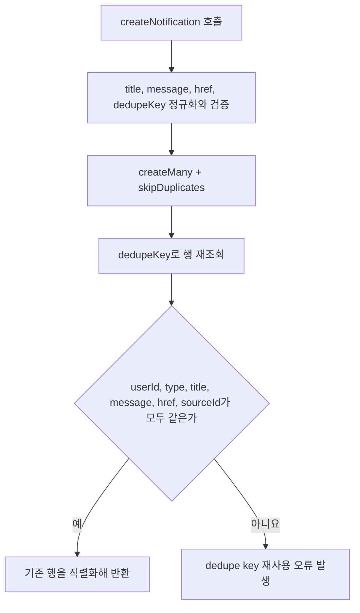
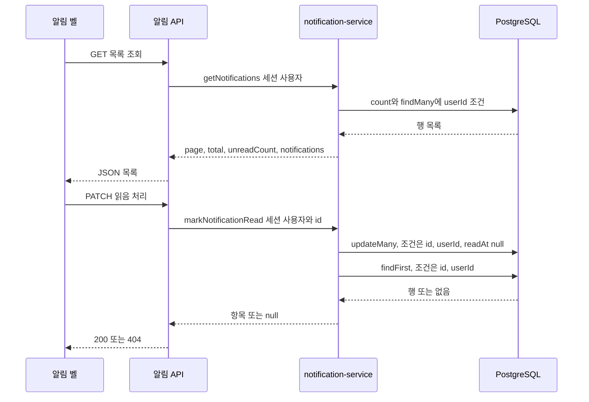

알림은 "이 사용자에게 이 사건이 일어났다"를 남기는 `Notification` 행 하나예요. 사건의 종류는 다섯 가지뿐이고, 모든 행이 `dedupeKey`라는 전역 unique 문자열을 함께 가져요. 그래서 같은 확정이 두 번 실행돼도 두 번째 insert는 무시되고, 먼저 만들어진 행이 그대로 반환돼요([prisma/schema.prisma](repo://prisma/schema.prisma#L523-L538)).

문구·링크·중복 규칙을 바꾸려면 알림을 만드는 다섯 지점과 그것들이 공유하는 `createNotification` 하나만 보면 돼요. 알림 생성이 작업 종료 확정 트랜잭션 안에 들어 있다는 점과, 티켓 지급 알림만 그 트랜잭션 밖에서 만들어진다는 차이가 가장 중요한 경계예요. 확정 트랜잭션 자체의 규칙은 [Job 큐와 lease 복구 계약](../operations/job-processing.md)이 소유하니 여기서는 다시 그리지 않아요.

## 입력 검증과 중복 확인 순서

`createNotification`은 입력을 먼저 정규화해요. trim한 값이 비었거나 길이 제한을 넘으면 그 자리에서 오류를 던지고, 통과한 값만 DB로 보내요([notification-service.ts](repo://src/entities/notification/api/notification-service.ts#L68-L107)).

| 필드 | 규칙 | 위반했을 때 |
| --- | --- | --- |
| `title` | trim 후 1~120자 | `Notification title must be between 1 and 120 characters.` |
| `message` | trim 후 1~500자 | `Notification message must be between 1 and 500 characters.` |
| `dedupeKey` | trim 후 1~200자 | `Notification dedupeKey must be between 1 and 200 characters.` |
| `href` | `/^\/(?!\/)/`를 만족하는 내부 상대 경로, 500자 이하 | `Notification href must be a relative internal path.` |
| `sourceId` | trim 결과가 비면 `null`, 값이 있으면 100자 이하 | `Notification sourceId must not exceed 100 characters.` |

그림: `createNotification`이 새 행을 만들지, 기존 행을 돌려줄지, 오류로 끝낼지 정하는 순서예요.

`href` 검증이 두 번 걸린다는 점을 기억하세요. 워커와 관리자 코드가 `createNotification`을 통과하고, 브라우저는 응답을 받을 때 [알림 계약의 notificationSchema](repo://src/entities/notification/model/contract.ts#L27-L39)의 같은 정규식으로 한 번 더 검사해요. 외부 URL이나 `//`로 시작하는 경로는 어느 쪽에서도 통과하지 못해요([tests/api-contracts.test.ts](repo://tests/api-contracts.test.ts#L164-L174)).

## 알림을 만드는 지점은 다섯 곳이에요

알림을 만드는 코드는 세 파일에 다섯 번 나와요. 모두 `dedupeKey`가 그 사건의 식별자를 포함하므로, 재시도나 중복 실행이 알림을 늘리지 않아요.

| 지점 | `type` | `dedupeKey` | `href` |
| --- | --- | --- | --- |
| 믹싱 성공 확정 | `MIXING_SUCCEEDED` | `mixing:{jobId}:succeeded` | `/library/mixes/{jobId}` |
| 믹싱 실패 확정 | `MIXING_FAILED` | `mixing:{jobId}:failed` | `/library/mixes/{jobId}` |
| 보컬 분석 성공 확정 | `VOCAL_PROFILE_SUCCEEDED` | `vocal-analysis:{jobId}:succeeded` | `/vocal-profiles/{profileId}` |
| 보컬 분석 실패 확정 | `VOCAL_PROFILE_FAILED` | `vocal-analysis:{jobId}:failed` | `/library?tab=profiles` |
| 관리자 티켓 지급 | `TICKET_CREDIT` | `ticket-ledger:{ledgerId}` | `/account` |

보컬 분석 성공 알림의 `href`만 작업 id가 아니라 결과 프로필 id를 써요. 사용자가 열어야 하는 화면이 작업 상세가 아니라 프로필이기 때문이에요([vocal-profile-analysis/worker.ts](repo://src/_app/background-jobs/vocal-profile-analysis/worker.ts#L122-L133)).

`sourceId`는 알림을 낳은 행을 가리켜요. 작업 알림 네 종류는 작업 id를, 티켓 지급 알림은 원장 행 id를 넣어요. 이 값은 unique가 아니고 화면 문구에도 쓰이지 않으므로, 알림과 원본 행을 잇는 추적용 필드로 보세요. 알림 규칙을 검증하는 통합 테스트도 이 값으로 대상을 찾아요([tests/mixing-queue.integration.ts](repo://tests/mixing-queue.integration.ts#L516-L520)).

| `type` | 제목 | 본문 |
| --- | --- | --- |
| `MIXING_SUCCEEDED` | `AI 믹스가 완성됐어요` | `{곡 제목} 결과를 들을 수 있어요.` |
| `MIXING_FAILED` | `AI 믹싱을 완료하지 못했어요` | `{곡 제목} 작업을 확인하고 다시 시도해 주세요.` |
| `VOCAL_PROFILE_SUCCEEDED` | `보컬 프로필 분석이 끝났어요` | `{프로필 표시 이름}의 분석 결과를 확인할 수 있어요.` |
| `VOCAL_PROFILE_FAILED` | `보컬 프로필 분석을 완료하지 못했어요` | `새 음성으로 다시 분석해 주세요.` |
| `TICKET_CREDIT` | `{분석 티켓 또는 믹싱 티켓}이 추가됐어요` | `{종류} {장수}장이 추가됐어요. {조정 사유}` |

티켓 문구의 종류 이름은 `ticketKindLabel`이 정해요. `VOCAL_ANALYSIS`는 `분석 티켓`, `AI_MIXING`은 `믹싱 티켓`이에요([contract.ts](repo://src/entities/ticket/model/contract.ts#L23-L25)). 티켓 지급 알림의 본문만 만들 때 500자로 잘라요.

보컬 분석 성공 알림의 본문은 프로필의 `displayName`을 쓰고, 그 값이 비어 있으면 `보컬 프로필 {profileNumber}`로 대체해요([vocal-profile-analysis/worker.ts](repo://src/_app/background-jobs/vocal-profile-analysis/worker.ts#L121-L131)).

## 작업 확정과 알림은 같은 트랜잭션이에요

네 개의 작업 알림은 `SUCCEEDED`나 `FAILED`를 쓰는 트랜잭션 안에서 만들어져요. 그래서 상태만 바뀌고 알림이 빠지거나, 알림만 남고 상태가 그대로인 커밋이 생길 수 없어요([mixing/worker.ts](repo://src/_app/background-jobs/mixing/worker.ts#L523-L534), [mixing/worker.ts](repo://src/_app/background-jobs/mixing/worker.ts#L277-L288), [vocal-profile-analysis/worker.ts](repo://src/_app/background-jobs/vocal-profile-analysis/worker.ts#L217-L228)).

재시도 중에는 알림이 생기지 않아요. 알림은 종료 상태를 확정할 때만 만들어지므로, 일시적 실패가 반복되는 동안에는 그 사용자의 알림 수가 0이에요([tests/vocal-profile-analysis-queue.integration.ts](repo://tests/vocal-profile-analysis-queue.integration.ts#L500-L511), [tests/mixing-queue.integration.ts](repo://tests/mixing-queue.integration.ts#L400-L414)). 마지막 시도에서 `FAILED`가 확정될 때 비로소 실패 알림 한 건이 남아요([tests/mixing-queue.integration.ts](repo://tests/mixing-queue.integration.ts#L427-L443)).

곡 분석 확정에는 사용자 알림이 붙지 않아요. 곡 분석 워커는 `createNotification`을 import하지 않고, `READY`로 끝나는 트랜잭션은 `SongAnalysis`와 `SongAnalysisJob` 행만 갱신해요([song-analysis/worker.ts](repo://src/_app/background-jobs/song-analysis/worker.ts#L224-L313)). 그래서 같은 다섯 종류 중 어느 것도 곡 등록·분석에는 쓰이지 않아요. 사용자에게 알리는 대상은 자기가 요청한 보컬 분석과 AI 믹싱, 그리고 자기 지갑에 들어온 티켓뿐이에요.

## 티켓 지급 알림만 트랜잭션 밖에서 만들어져요

`adjustUserTickets`는 `applyTicketChange`로 원장 행을 먼저 확정하고, 그 결과의 `amount`가 양수일 때만 `createNotification`을 따로 불러요([adjust-user-tickets.ts](repo://src/features/manage-tickets/api/adjust-user-tickets.ts#L21-L42)). 두 호출은 같은 트랜잭션이 아니에요. 그래서 원장 행은 남았는데 알림이 없는 상태로 프로세스가 끝날 수 있어요.

이 경로의 안전장치는 `dedupeKey`가 `ledger.id`를 포함한다는 점이에요. 관리자가 같은 `idempotencyKey`로 요청을 다시 보내면 `applyTicketChange`가 기존 원장 행을 그대로 반환하고, 코드는 그 행의 id로 `ticket-ledger:{ledgerId}` 알림 생성을 다시 시도해요. 이미 그 키의 행이 있으면 insert가 무시되므로 결과는 여전히 한 건이에요([tests/admin-operations.integration.ts](repo://tests/admin-operations.integration.ts#L51-L64)). 차감 조정(`amount < 0`)은 알림을 만들지 않아요.

원장의 멱등 규칙 자체는 [티켓 원장과 멱등성](ticket-ledger.md)이 소유해요. 작업 알림과 달리 티켓 지급 알림을 다시 만드는 경로는 관리자가 같은 요청 키를 다시 보내는 것뿐이고, 이 생성 입력에서 확인한 운영 스크립트 중에는 그 역할을 하는 것이 없어요. 그래서 이 호출을 지원 스크립트로 복구할 계획을 세운다면 `createNotification`을 직접 부를 수 있는지 먼저 확인하세요.

## 같은 키를 다른 내용으로 쓰면 오류예요

`dedupeKey`는 사용자별이 아니라 전역 unique예요. 그래서 `createNotification`은 재사용을 조용히 넘기지 않고, insert 뒤에 그 키의 행을 다시 읽어 요청과 비교해요.

| 비교 필드 | 요청 입력 | 다시 읽은 행 |
| --- | --- | --- |
| `userId` | `input.userId` | `row.userId` |
| `type` | `input.type` | `row.type` |
| `title` | 정규화한 `title` | `row.title` |
| `message` | 정규화한 `message` | `row.message` |
| `href` | 정규화한 `href` | `row.href` |
| `sourceId` | `input.sourceId?.trim() || null` | `row.sourceId` |

여섯 필드 중 하나라도 다르면 `"Notification dedupe key was reused with different input."` 오류를 던져요([notification-service.ts](repo://src/entities/notification/api/notification-service.ts#L80-L107)). `dedupeKey` 자체는 `findUniqueOrThrow`의 조회 조건이라 이 비교에서 항상 같아요.

이 비교에는 두 가지 효과가 있어요. 같은 사건의 재실행은 먼저 만든 행을 그대로 돌려주고, 다른 사용자에게 같은 키를 쓰려는 시도는 조용히 넘어가지 않고 실패해요([tests/notification-service.integration.ts](repo://tests/notification-service.integration.ts#L36-L38), [tests/notification-service.integration.ts](repo://tests/notification-service.integration.ts#L75-L78)).

새 알림 지점을 추가할 때는 키 문자열에 그 사건을 유일하게 만드는 값을 넣으세요. 다섯 개의 기존 키는 모두 `{도메인}:{행 id}:{결과}` 또는 `{행 종류}:{행 id}` 형태예요.

## 읽기 경로는 세션 사용자로 고정돼요

`withApiAdmission`이 요청 제한과 세션 확인을 끝낸 뒤 handler가 `requireApiSession`으로 세션을 얻고, 그 `user.id`를 서비스 함수에 넘겨요. 조회·갱신 쿼리는 모두 `userId` 조건을 포함하므로 다른 사용자의 행은 결과에 섞이지 않아요([notifications-route.ts](repo://src/_app/api-routes/notifications/notifications-route.ts#L5-L15), [notification-service.ts](repo://src/entities/notification/api/notification-service.ts#L109-L154)). 검증 순서와 401 처리 규칙은 [인증과 소유권 경계](../integrations/auth-and-ownership.md)가 소유해요.

| 메서드와 경로 | 하는 일 | 응답 |
| --- | --- | --- |
| `GET /api/notifications` | 세션 사용자의 목록 한 페이지 | `page`, `pageSize`, `total`, `pageCount`, `unreadCount`, `notifications` |
| `PATCH /api/notifications/{id}` | 그 알림을 읽음으로 표시 | `{ notification }` 또는 `404` |
| `POST /api/notifications/read-all` | 읽지 않은 알림을 모두 읽음으로 표시 | `{ updatedCount, unreadCount: 0 }` |

그림: 알림 목록 조회와 읽음 처리에서 세션 사용자 조건이 붙는 위치예요.

`PATCH`는 `uuid`가 아닌 id와 다른 사용자의 알림을 같은 방식으로 처리해요. 둘 다 `NOTIFICATION_NOT_FOUND`(`"알림을 찾을 수 없어요."`, `retryable: false`) 404가 돼요([notification-read-route.ts](repo://src/_app/api-routes/notifications/notification-read-route.ts#L6-L17), [tests/notification-routes.integration.ts](repo://tests/notification-routes.integration.ts#L76-L93)).

읽음 처리는 `readAt`이 `null`인 행만 갱신해요. 이미 읽은 알림을 다시 누르면 갱신 건수가 0이고, 응답에는 원래 `readAt`이 담긴 행이 그대로 실려요. `read-all`이 돌려주는 `updatedCount`도 이번에 실제로 바뀐 행 수예요([notification-service.ts](repo://src/entities/notification/api/notification-service.ts#L141-L154)).

## 목록 페이지와 필터의 기본값

목록은 한 번에 최대 50건이에요. 페이지 값은 `pageSearchParamSchema`가 정수로 바꿔 1 이상으로 올리고, `pageSize`는 1~50 범위를 벗어나거나 숫자가 아니면 예외 대신 20으로 대체해요. 50을 넘는 값을 50으로 잘라 주는 게 아니라 기본값으로 되돌린다는 점이 달라요([contract.ts](repo://src/entities/notification/model/contract.ts#L18-L25), [tests/api-contracts.test.ts](repo://tests/api-contracts.test.ts#L132-L142)).

| 항목 | 규칙 |
| --- | --- |
| `page` | 기본 1, 숫자가 아니면 1, 소수는 버림, 0 이하는 1 |
| `pageSize` | 기본 20, 1~50 밖이거나 정수가 아니면 20 |
| `unreadOnly` | `true`, `"true"`, `"1"`만 `true` |
| 정렬 | `createdAt` 내림차순, 같은 시각이면 `id` 내림차순 |
| `pageCount` | `max(1, ceil(total / pageSize))`, 요청 페이지가 더 크면 `pageCount`로 맞춰요 |
| `total` | 필터를 적용한 전체 건수 |
| `unreadCount` | 필터와 무관하게 그 사용자의 읽지 않은 알림 전체 건수 |

`unreadOnly=true`로 조회하면 `total`은 읽지 않은 건수가 되지만, `unreadCount`도 같은 값을 가리켜요([tests/notification-service.integration.ts](repo://tests/notification-service.integration.ts#L62-L73)). 목록이 비어도 `pageCount`는 1이에요.

## 화면에 도달하는 방식

알림은 두 곳에서 읽혀요. 헤더의 알림 벨은 `{ page: 1, pageSize: 5, unreadOnly: true }` 목록을 조회해 배지 숫자를 그리고, 알림 페이지는 서버 컴포넌트가 `pageSize: 20`, `unreadOnly: false`로 첫 페이지를 조회해 그 결과를 클라이언트 목록의 초기 데이터로 넘겨요([notification-bell.tsx](repo://src/features/manage-notifications/ui/notification-bell.tsx#L26-L85), [notifications-page.tsx](repo://src/_pages/notifications/ui/notifications-page.tsx#L13-L26)).

항목을 누르면 `PATCH`로 읽음을 보낸 뒤 `href`로 이동해요. 이동은 읽음 요청의 성공 여부와 무관하게 `finally`에서 실행되므로, 읽음 처리가 실패해도 사용자는 의도한 화면으로 가요([notification-bell.tsx](repo://src/features/manage-notifications/ui/notification-bell.tsx#L34-L40)). 벨은 읽지 않은 항목만 보여주고, 알림 페이지는 이전·다음 링크로 페이지를 넘겨요([notifications-list.tsx](repo://src/_pages/notifications/ui/notifications-list.tsx#L56-L113)).

`type`은 DB에 대문자 enum으로 저장되고 API 응답에서는 소문자 문자열로 직렬화돼요. 화면은 소문자 값을 키로 아이콘과 배지 색을 고르고, `readAt === null`인 항목에만 읽지 않음 표시를 붙여요([notification-item-content.tsx](repo://src/entities/notification/ui/notification-item-content.tsx#L42-L72), [prisma/schema.prisma](repo://prisma/schema.prisma#L122-L128)).

폴링 주기, 캐시 키, 읽음 뮤테이션의 무효화 범위는 [브라우저 상태와 API 오류 계약](../architecture/client-data-flow.md)이 소유해요. 여기서는 읽음 처리 뒤 `notificationKeys.lists()`를 무효화해 벨과 목록이 함께 갱신된다는 점만 기억하세요([client.ts](repo://src/features/manage-notifications/api/client.ts#L57-L82)).

## 알림 규칙을 바꿀 때 확인할 것

변경 범위 테스트는 두 축으로 나뉘어 있어요. 스키마·서비스 동작은 `tests/notification-service.integration.ts`가, 세션 범위와 HTTP 응답은 `tests/notification-routes.integration.ts`가 검증해요.

- [tests/notification-service.integration.ts](repo://tests/notification-service.integration.ts#L7-L87)는 같은 입력을 동시에 두 번 넣어 같은 id가 나오고 행이 하나만 남는지, 다른 사용자의 알림을 읽으려 하면 `null`인지, `pageSize`를 넘긴 페이지 요청이 `pageCount`로 잘리는지, `unreadOnly` 필터와 `read-all` 응답이 계약대로인지, 같은 키를 다른 입력으로 재사용하면 거부되는지 확인해요.
- [tests/notification-routes.integration.ts](repo://tests/notification-routes.integration.ts#L71-L118)는 세션 사용자의 목록만 보이는지, 다른 사용자의 알림 id와 `uuid`가 아닌 id가 모두 404인지, 세션이 없으면 401인지 확인해요.
- 알림 생성 지점은 워커·관리자 통합 테스트가 함께 지켜요. 성공·실패 알림의 `type`, `sourceId`, `href` 값과 재시도 중 0건, 종료 확정 시 1건을 확인해요([vocal-profile-analysis-queue.integration.ts](repo://tests/vocal-profile-analysis-queue.integration.ts#L471-L474), [mixing-queue.integration.ts](repo://tests/mixing-queue.integration.ts#L516-L520), [admin-operations.integration.ts](repo://tests/admin-operations.integration.ts#L60-L64)).
- 계약 스키마와 캐시 동작은 `pnpm run test:query`가 [tests/api-contracts.test.ts](repo://tests/api-contracts.test.ts#L132-L180)와 [tests/client-server-state-query.test.ts](repo://tests/client-server-state-query.test.ts#L123-L155)로 확인해요([package.json](repo://package.json#L26-L26)).

두 통합 테스트 파일은 `DATABASE_URL`이 없으면 스스로 건너뛰고, 현재 `package.json`의 어떤 스크립트도 이 두 파일을 지정하지 않아요. 알림 서비스나 라우트를 고쳤다면 이 파일들을 직접 지정해 실행하세요.

## 다음에 읽을 페이지

- 알림을 만드는 확정 트랜잭션과 재시도 규칙: [Job 큐와 lease 복구 계약](../operations/job-processing.md)
- `Notification` 테이블의 관계와 enum: [데이터 모델과 수명 주기 상태](../architecture/data-model.md)
- 세션·소유권 검증 순서: [인증과 소유권 경계](../integrations/auth-and-ownership.md)
- 티켓 지급 알림의 근거가 되는 원장: [티켓 원장과 멱등성](ticket-ledger.md)
- 믹싱·보컬 분석 작업의 전체 흐름: [AI 믹싱 작업 흐름](../workflows/ai-mixing.md), [보컬 프로필 분석 흐름](../workflows/vocal-profile-analysis.md)
