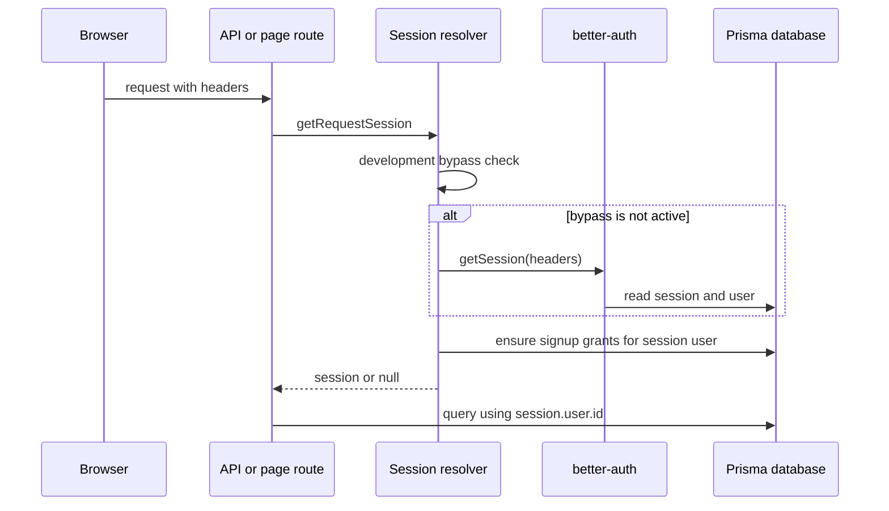
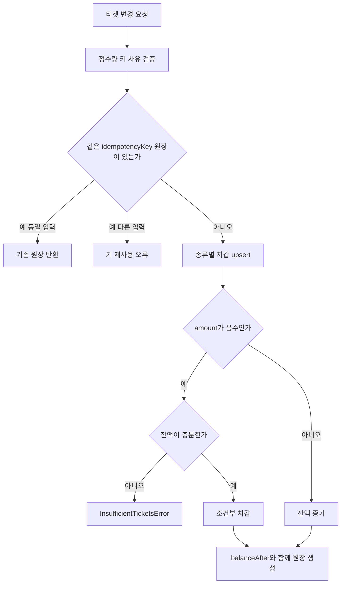

# 정체성, 소유권, 티켓과 알림

이 페이지의 핵심 안전 불변식은 **요청에서 얻은 서버 세션의 `user.id`를 모든 리소스·지갑·원장·알림 조회와 변경에 사용한다**는 것입니다. 클라이언트가 전달한 사용자 ID를 신뢰해 소유권을 결정하지 않으며, 작업을 생성할 때도 `userId`를 작업과 함께 저장하고 후속 조회에서 소유자 조건을 다시 적용합니다.

## 인증과 세션

프로덕션 인증은 `better-auth`와 Prisma PostgreSQL adapter를 사용하고, 이메일/비밀번호 로그인은 비활성화되어 있으며 Google provider만 `openid`, `email`, `profile` scope로 설정됩니다. OAuth client ID와 secret은 환경변수로만 주입하며 이 문서에는 값을 기록하지 않습니다. `googleAuthConfigured()`는 `BETTER_AUTH_SECRET`, `BETTER_AUTH_URL`, Google client ID/secret이 모두 있을 때만 로그인 UI를 configured 상태로 만듭니다. 인증 secret은 개발·테스트에서만 기본값을 허용하고 그 외 환경에서는 `BETTER_AUTH_SECRET`이 없으면 시작 시 오류를 냅니다.

`getRequestSession(request?)`은 먼저 개발용 우회 세션을 확인한 뒤, 없으면 요청 헤더를 `auth.api.getSession`에 넘깁니다. 세션이 있으면 매번 가입 티켓 보상도 보장합니다. 페이지 가드는 미인증 사용자를 `login?callbackURL=...`로 redirect하고, API 가드는 세션이 없을 때 `401 UNAUTHENTICATED`를 반환합니다. 로그인 callback은 `/`로 시작하고 `//` 또는 역슬래시를 포함하지 않는 내부 경로만 허용하며, 실패하면 `/profile`을 사용합니다.

*이 다이어그램은 요청 세션 확인과 세션 사용자 기준의 가입 보상 보장 순서를 보여줍니다.*

### 개발 인증 우회는 별도 경로다

`DEV_AUTH_BYPASS_ENABLED=true`와 `DEV_AUTH_BYPASS_USER_ID`는 `NODE_ENV`가 정확히 `development` 또는 `test`일 때만 작동합니다. 지정한 사용자가 로컬 데이터베이스에 실제로 존재하지 않으면 오류를 내며, 생성되는 세션 토큰은 `dev-auth-bypass`입니다. 따라서 이는 Google OAuth를 대체하는 로컬 개발·테스트 편의 기능이지 production 인증 방식이 아닙니다. production이나 환경이 지정되지 않은 경우에는 fail-closed로 비활성화됩니다.

## 소유권과 관리자 권한

서버 엔드포인트는 `requireApiSession` 또는 페이지용 `requirePageSession`을 먼저 호출해야 합니다. 분석 작업 상세 조회는 `id`와 `userId`를 함께 조건으로 검색하고, 성공한 프로필도 같은 `userId`로 다시 확인합니다. 알림 읽음 처리 역시 `id`와 세션 사용자 ID를 함께 조건으로 삼으므로 다른 사용자의 알림 ID를 알아도 읽거나 변경할 수 없습니다. 티켓 지갑과 원장, 작업 목록도 모두 사용자 ID로 범위를 제한합니다.

관리자 기능은 별도의 권한 상승이 아니라, 인증된 세션의 이메일을 `ADMIN_EMAILS`의 쉼표 구분 목록(공백 제거·소문자화)과 비교하는 정책입니다. 관리자 페이지는 비관리자를 `notFound()`로 처리하고, 관리자 API는 미인증에는 401, 인증됐지만 목록에 없는 사용자에는 403을 반환합니다. 티켓 조정에는 행위자 `actorUserId`와 대상 `targetUserId`를 구분해 원장에 남깁니다.

## 티켓 지갑과 원장

티켓 종류는 `VOCAL_ANALYSIS`와 `AI_MIXING`으로 분리됩니다. 지갑은 `(userId, kind)` 복합 키의 현재 잔액이고, `TicketLedger`는 변경량, 변경 후 잔액, 사유, 작업 연결 ID, 행위자와 고유 `idempotencyKey`를 보존하는 감사 기록입니다. 양의 변경은 credit, 음의 변경은 debit이며, 음의 변경은 잔액이 충분할 때만 조건부 원자 업데이트를 수행합니다. 부족하면 `InsufficientTicketsError`에 종류·필요량·현재 잔액이 포함됩니다.

회원 생성 후 database hook에서 분석·AI 믹싱 가입 보상을 각각 적용합니다. 세션을 처음 읽을 때도 `ensureSignupTicketGrants`를 호출하므로 누락된 보상을 복구할 수 있습니다. 분석 보상의 키는 `signup:vocal-analysis:${userId}`, 믹싱 보상의 키는 `signup:ai-mixing:${userId}`이고, 믹싱은 기존 가입 grant가 있으면 가장 이른 것을 재사용합니다. 실제 지급량은 `SIGNUP_VOCAL_ANALYSIS_TICKET_GRANT`와 `SIGNUP_MIXING_TICKET_GRANT` 설정에서 결정됩니다.

*이 흐름은 티켓 원장 적용의 멱등성, 종류 격리, 잔액 부족 분기를 보여줍니다.*

`applyTicketChange`는 `Serializable` 트랜잭션을 최대 세 번 시도하고 write conflict/deadlock을 재시도합니다. 동시 삽입으로 unique 충돌이 나도 동일 입력의 기존 원장을 반환하지만, 같은 키를 다른 사용자·종류·유형·수량으로 재사용하면 오류입니다. 분석/믹싱 enqueue는 작업 생성과 usage debit을 같은 serializable 트랜잭션에 넣고, 작업의 사용자별 idempotency key가 이미 있으면 중복 요청에 기존 작업을 돌려줍니다. 따라서 재시도나 동시 요청이 티켓을 이중 차감하지 않습니다.

### 실패와 환불

작업 비용이 0보다 클 때만 enqueue 시 usage debit이 발생합니다. 최종 실패한 분석 작업은 `refundState=REQUIRED`로 기록하고 실패 알림을 저장한 뒤 환불을 시도합니다. 믹싱은 외부 작업이 아직 제출되지 않은 실패에 대해서만 환불을 요구하며, 이미 제출된 실패는 환불하지 않습니다. 환불은 원래 비용만큼 `USAGE_REFUND`를 양수로 적용하고 `vocal-analysis-refund:${job.id}` 또는 믹싱 전용 키를 사용해 한 번만 반영한 뒤 상태를 `REFUNDED`로 바꿉니다. 환불 호출 자체가 실패해도 worker의 reconciliation이 `REQUIRED` 작업을 찾아 재처리하므로, 실패 알림과 금액 반환의 일시적 분리를 견딥니다.

## 완료·실패 알림

분석과 믹싱 worker는 작업 상태 변경 및 알림 생성을 하나의 데이터베이스 트랜잭션에서 처리합니다. 분석 성공은 `VOCAL_PROFILE_SUCCEEDED`, 분석 최종 실패는 `VOCAL_PROFILE_FAILED`, 믹싱 성공/실패는 각각 `MIXING_SUCCEEDED`/`MIXING_FAILED`입니다. 성공 알림은 결과 페이지로, 실패 알림은 분석 목록 또는 믹싱 작업 페이지로 가는 내부 `href`를 갖습니다. 관리자 양의 티켓 조정은 `TICKET_CREDIT` 알림을 대상 사용자에게 보냅니다.

알림은 `dedupeKey`가 고유하므로 worker 재실행·동시 실행에도 같은 사건의 알림이 하나만 생깁니다. 생성 시 제목·메시지 길이, 내부 상대 경로(`//`가 아닌 `/`로 시작하고 최대 500자), source ID를 검증하며, 이미 존재하는 키에 다른 입력을 넣으면 오류입니다. 목록은 사용자별로만 조회하고 최신 생성 시각과 ID 순으로 페이지네이션합니다. `pageSize`는 최대 50이며 `unreadOnly` 필터와 전체 unread count를 지원합니다. 개별 읽음과 전체 읽음도 모두 `userId` 조건을 포함하고, 존재하지 않거나 다른 사용자의 알림을 개별 PATCH하면 `404 NOTIFICATION_NOT_FOUND`입니다.

주요 API 진입점은 다음과 같습니다.

- 계정: `GET` ticket balance와 `GET` ticket ledger는 인증된 사용자의 지갑·원장만 반환하고, onboarding 완료도 세션 사용자 ID로 수행합니다.
- 알림: `GET` notifications, `PATCH` notification read, `POST` notifications read-all은 모두 먼저 세션을 확인합니다.
- 관리자 티켓 조정: 관리자 API 가드 뒤에 대상 사용자 변경과 양의 조정 알림이 있습니다.

## 상태와 운영 관점

작업은 `PENDING`에서 worker가 claim한 뒤 `PROCESSING`/`SUBMITTED`를 거쳐 `SUCCEEDED` 또는 `FAILED`가 됩니다. 재시도 가능한 오류는 최대 시도 횟수까지 다시 `PENDING`이 되므로 중간 실패에는 최종 실패 알림이나 환불을 확정하지 않습니다. 최종 실패에서만 환불 상태와 실패 알림을 기록합니다. 믹싱 결과 저장 후 상태·결과 asset·성공 알림을 함께 커밋하고, 그 트랜잭션이 실패하면 결과 asset을 폐기합니다. 이는 사용자에게 성공으로 보이는 알림이 실제 결과보다 먼저 노출되지 않게 하는 경계입니다.

## 집중 테스트

- `tests/dev-auth-bypass.integration.ts`: 우회가 development/test 밖에서 꺼지고, 존재하는 DB 사용자만 세션으로 해석되는지 검증합니다.
- `tests/auth-ownership.integration.ts`: Google account 연결과 vocal profile이 소유 사용자별로 분리되는지 확인합니다.
- `tests/ticket-ledger.integration.ts`: 가입 보상 동시 호출의 단일 지급, 티켓 종류 격리, 동시 debit의 단일 원장, 부족 잔액 오류와 페이지 경계를 검증합니다.
- `tests/notification-service.integration.ts`: 알림 dedupe, owner scope, 페이지·unread 필터, 읽음 처리와 외부 URL 거부를 검증합니다.

이 테스트들은 UI 문구가 아니라 세션·데이터베이스 조건·트랜잭션 구현이 보장하는 보안 및 과금 계약을 고정합니다.
