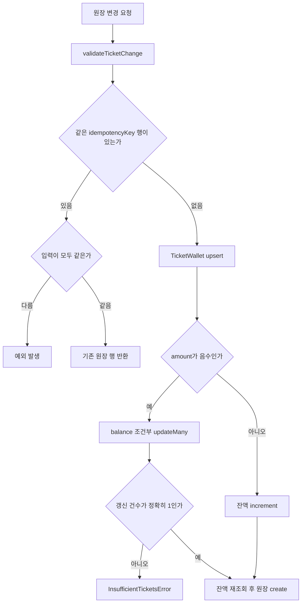
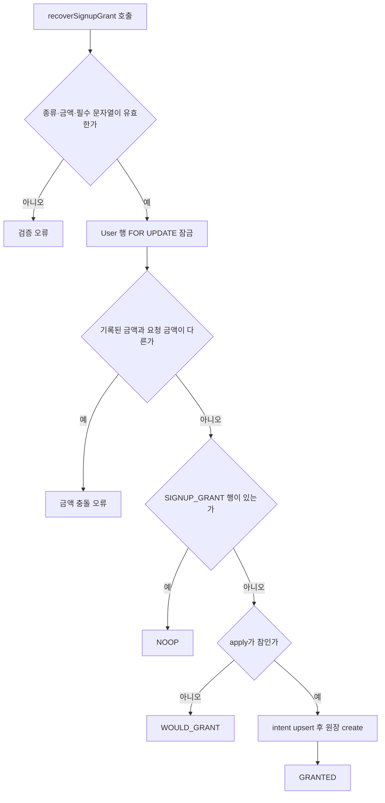

티켓 원장은 "지갑 잔액"과 "변경 내역"을 같은 트랜잭션에서 함께 움직여요. 티켓을 건드리는 코드는 모두 `applyTicketChangeInTransaction`을 통과하고, 그 함수가 잔액 갱신과 `TicketLedger` 행 생성을 한 번에 처리해요.

같은 요청이 두 번 도착해도 결과가 한 번만 반영되는 성질(멱등성, idempotency)은 `TicketLedger.idempotencyKey` unique 제약과 키 재사용 검사로 얻어요. 차감·환불·가입 지급·관리자 조정이 모두 이 함수를 지나므로, 새 경로를 추가할 때도 여기 규칙만 지키면 중복 반영을 피할 수 있어요. 핵심 구현은 [src/entities/ticket/api/ticket-service.ts](repo://src/entities/ticket/api/ticket-service.ts#L42-L105)예요.

## 원장이 지키는 불변식

원장을 읽거나 확장할 때 기준이 되는 규칙은 세 가지예요.

1. 잔액과 원장 행은 같은 트랜잭션에서 함께 바뀌어요. 호출자는 자기 트랜잭션(`tx`)을 넘기고, 원장 함수가 `TicketWallet` 잔액을 읽어 `balanceAfter`로 기록해요. 둘 중 하나만 반영된 상태가 커밋될 수 없어요.
2. 하나의 `idempotencyKey`는 하나의 변화만 나타내요. 키는 전역 unique이고, 같은 키로 다시 호출하면 새 행을 만들지 않고 기존 행을 그대로 돌려줘요.
3. 지갑은 `(userId, kind)` 단위로 분리돼요. `VOCAL_ANALYSIS` 차감은 `AI_MIXING` 잔액에 영향을 주지 않아요. 금액의 부호가 방향을 정하고, 양수는 지급, 음수는 차감이에요.

`validateTicketChange`가 원장 함수의 첫 단계예요. `amount`가 안전한 정수인지, `idempotencyKey`와 `reason`이 비어 있지 않은지 확인하고, 통과하지 못하면 예외를 던져요.

## 차감과 지급은 다른 SQL을 써요

차감(`amount < 0`)은 잔액을 읽어 비교한 뒤 쓰는 대신 조건부 `updateMany` 한 번으로 처리해요. `balance: { gte: Math.abs(input.amount) }` 조건이 붙어서, 동시에 들어온 두 요청 중 조건을 만족하는 쪽만 갱신에 성공해요. 갱신 건수가 1이 아니면 잔액을 다시 읽어 `InsufficientTicketsError`를 던지고, 그 오류는 `kind`, `required`, `balance`를 담아 호출자가 사용자 메시지로 쓸 수 있게 해요.

지급(`amount >= 0`)은 잔액이 줄어들 위험이 없어서 `increment`만 실행해요. 두 경로 모두 지갑 행이 없을 수 있으니 `upsert`로 `balance: 0` 행을 먼저 보장해요.

같은 키로 다시 호출했을 때 `userId`, `kind`, `type`, `amount` 중 하나라도 다르면 `"Ticket idempotency key was reused with different input."` 오류가 나요. 네 값이 모두 같으면 기존 행을 반환하고 잔액은 건드리지 않아요. 이 함수는 기존 원장 행을 수정하는 경로를 두지 않아요. 한 번 확정된 원장 행은 그대로 남고, 정정이 필요하면 반대 부호의 새 행을 만들어요.

`applyTicketChangeInTransaction`의 분기 순서예요. 키 중복 검사가 차감보다 앞에 있어서, 이미 처리한 요청은 지갑을 다시 읽지 않아요.

## 재시도와 unique 충돌 처리

`applyTicketChange`는 트랜잭션을 여는 얇은 래퍼예요. 격리 수준을 `Serializable`로 열고 최대 3회 시도해요. Prisma 오류 코드 `P2034`나 `TransactionWriteConflict`, `deadlock` 메시지가 나오면 다음 시도로 넘어가고, 3회를 다 쓰면 `"Ticket transaction exhausted its retry limit."`로 끝나요.

동시에 같은 키가 들어와 unique 제약이 걸리면(코드 `P2002`) 오류를 그대로 올리지 않아요. `userId`, `kind`, `type`, `amount`가 일치하는 기존 행이 있으면 그 행을 결과로 돌려줘요. 이 처리가 없으면 경쟁에서 진 쪽이 실패로 보여요. 근거는 [applyTicketChange](repo://src/entities/ticket/api/ticket-service.ts#L107-L134)예요.

## idempotencyKey 명명 규칙

키 이름이 곧 "무엇을 한 번만 허용하는가"를 정해요. 새 경로를 추가할 때는 아래 형식을 따르고, 절대 임의의 문자열을 만들지 마세요.

| idempotencyKey | 만드는 곳 | 한 번만 허용하는 변화 |
| --- | --- | --- |
| `signup:vocal-analysis:{userId}` | [signupKey](repo://src/entities/ticket/api/ticket-service.ts#L136-L138) | 사용자 1명의 가입 분석 티켓 지급 |
| `signup:ai-mixing:{userId}` | [signupKey](repo://src/entities/ticket/api/ticket-service.ts#L136-L138) | 사용자 1명의 가입 믹싱 티켓 지급 |
| `vocal-analysis:debit:{userId}:{요청키}` | [analysis-queue.ts](repo://src/features/analyze-vocal-profile/api/analysis-queue.ts#L160-L170) | 요청 키 하나에 대한 분석 티켓 차감 |
| `vocal-analysis-refund:{jobId}` | [worker.ts](repo://src/_app/background-jobs/vocal-profile-analysis/worker.ts#L139-L157) | 분석 작업 1건의 실패 환불 |
| `mixing:debit:{jobId}` | [mixing-queue.ts](repo://src/features/create-mixing/api/mixing-queue.ts#L134-L144) | 믹싱 작업 1건의 티켓 차감 |
| `mixing:refund:{jobId}` | [worker.ts](repo://src/_app/background-jobs/mixing/worker.ts#L156-L172) | 믹싱 작업 1건의 환불 |
| `admin:{actorUserId}:{요청키}` | [adjust-user-tickets.ts](repo://src/features/manage-tickets/api/adjust-user-tickets.ts#L21-L29) | 관리자 한 명이 보낸 요청 키 하나의 조정 |

분석 차감 키는 `userId`와 사용자가 보낸 요청 키를 함께 넣어요. 그래야 다른 사용자나 다른 업로드가 같은 키 문자열을 써도 서로 다른 변화로 남아요. 반면 믹싱과 분석의 환불 키는 `jobId`만 써요. 작업 행 자체가 이미 유일하기 때문이에요.

`mixing:refund:{jobId}`는 워커 자동 환불과 운영자 복구 스크립트가 같은 문자열을 만들어요. 두 경로가 겹쳐 실행돼도 원장 행은 하나만 생겨요([reconcile-external-job.ts](repo://scripts/reconcile-external-job.ts#L55-L72)).

## 가입 지급과 복구 가능성

가입 지급은 금액을 먼저 확정해 두는 2단계 구조예요. `ensureSignupTicketGrants`는 지급 전에 `SignupGrantIntent`에 두 종류의 금액을 모두 기록해요. 지급 자체는 그 intent의 `amount`를 읽어서 실행해요. 나중에 `SIGNUP_VOCAL_ANALYSIS_TICKET_GRANT` 같은 환경 변수를 바꿔도 이미 기록된 금액이 우선이라, 복구 결과가 설정 변경에 흔들리지 않아요([src/entities/ticket/api/ticket-service.ts](repo://src/entities/ticket/api/ticket-service.ts#L136-L179)). intent는 `(userId, kind)`를 복합 기본 키로 쓰는 별도 모델이라 종류마다 한 행만 남아요([prisma/schema.prisma](repo://prisma/schema.prisma#L653-L662)).

같은 함수가 두 번 동시에 불려도 안전해요. `SELECT ... FOR UPDATE`로 `User` 행을 잠그고, 해당 `kind`의 `SIGNUP_GRANT` 원장 행이 이미 있으면 지급을 건너뛰어요. 지급 금액의 기본값과 허용 범위는 [operations/configuration.md](../operations/configuration.md)가 다뤄요.

운영자 복구인 `recoverSignupGrant`는 DB를 건드리기 전에 입력을 먼저 검증하고, 기록된 금액과 요청 금액이 어긋나면 지급을 거부해요([src/entities/ticket/api/ticket-service.ts](repo://src/entities/ticket/api/ticket-service.ts#L181-L253)).

| 검사 | 통과 조건 | 실패했을 때 |
| --- | --- | --- |
| `kind` | `VOCAL_ANALYSIS` 또는 `AI_MIXING`이에요 | `An explicit valid ticket kind and amount (0..1000000) are required.` |
| `amount` | 안전한 정수이고 `0` 이상 `1,000,000` 이하예요. `0`도 통과해요 | 같은 메시지예요 |
| `userId`, `operator`, `reason` | 각각 trim 후 비어 있지 않아요 | `user, operator and reason are required.` |
| 대상 사용자 | `User` 행이 `FOR UPDATE` 잠금으로 정확히 1건 잡혀요 | `Signup user does not exist.` |
| 기록된 금액 | 같은 `kind`의 `SignupGrantIntent` 금액과 기존 `SIGNUP_GRANT` 원장 금액이 요청 금액과 같아요 | `Signup amount conflicts with the recorded intent or ledger.` |

검증을 통과하면 기존 `SIGNUP_GRANT` 행이 있을 때는 `NOOP`(기존 행 id와 현재 잔액을 담아요), 없고 `apply`를 주지 않았을 때는 `WOULD_GRANT`, 없고 `apply`를 줬을 때는 `GRANTED`를 반환해요. 실제 지급까지 간 경우에만 `SignupGrantIntent`가 없으면 `operator`·`reason`과 함께 만들고, 원장 사유는 `가입 지급 복구 ({operator}): {reason}`이 돼요. 금액 `0`도 검증을 통과하므로 `amount`가 0인 지급 행이 생길 수 있어요. 실행 인자와 결과 표, `--amount 0`의 함정은 [복구 스크립트 운영 절차](../operations/recovery-runbook.md)가 다뤄요.

복구 한 번의 분기 순서예요. 검증과 금액 충돌 거부가 모두 지급보다 앞에 있어서, 잘못된 인자나 다른 금액은 잔액을 건드리지 않아요.

## 모델 관계와 열거형

`kind`는 티켓 종류, `type`은 변화의 성격이에요. 두 축이 분리돼 있어서 "관리자가 조정한 분석 티켓" 같은 조합을 원장에서 그대로 조회할 수 있어요.

| 대상 | 값 또는 제약 |
| --- | --- |
| `TicketKind` | `VOCAL_ANALYSIS`, `AI_MIXING` |
| `TicketLedgerType` | `SIGNUP_GRANT`, `USAGE_DEBIT`, `USAGE_REFUND`, `ADMIN_ADJUSTMENT` |
| `TicketWallet` | 기본 키 `@@id([userId, kind])`, `balance` 기본값 0 |
| `TicketLedger` | `idempotencyKey` unique, `balanceAfter` 필수, `amount`은 부호 있는 정수 |
| `TicketLedger` 관계 | 소유자는 `User`(`Cascade`), `actorUserId`는 `SetNull`, 작업 참조 두 개도 `SetNull` |

`balanceAfter`는 그 행이 반영된 직후의 잔액이에요. 그래서 원장만으로 잔액 변화를 재구성할 수 있고, 화면도 각 항목 옆에 당시 잔액을 보여줄 수 있어요. 전체 관계는 [architecture/data-model.md](../architecture/data-model.md)가 소유해요. 스키마 정의는 [prisma/schema.prisma](repo://prisma/schema.prisma#L487-L521)를 확인하세요.

## 환불은 원장 관점에서 무엇을 남기나

환불은 `refundState`가 `REQUIRED`인 작업만 실행해요. 그래서 작업 상태 확정과 환불 기록이 분리돼 있고, 워커가 중간에 죽어도 남은 `REQUIRED` 작업을 다시 처리할 수 있어요.

세 경우를 구분하세요.

- 분석 작업 실패는 `ticketCost > 0`일 때 `refundState = REQUIRED`가 되고, `vocal-analysis-refund:{jobId}` 키로 환불한 뒤 `REFUNDED`로 바뀌어요([worker.ts](repo://src/_app/background-jobs/vocal-profile-analysis/worker.ts#L200-L236)).
- 믹싱은 외부 변환 서비스에 접수하기 전에 실패했을 때만 `USAGE_REFUND`가 생겨요. 접수 후 실패는 `refundState = NONE`으로 남고 환불하지 않아요([worker.ts](repo://src/_app/background-jobs/mixing/worker.ts#L251-L291)).
- 접수 여부가 불확실하면 `MODAL_SUBMISSION_UNCONFIRMED`로 두고 환불을 보류해요. 운영자가 확인할 때까지 잔액을 되돌리지 않아요. 이 판단 규칙은 [workflows/ai-mixing.md](../workflows/ai-mixing.md)가 소유해요.

환불도 예외 없이 `applyTicketChangeInTransaction`을 쓰고, 작업 행 상태 변경과 같은 트랜잭션에서 처리해요.

## 조정과 조회 표면

관리자 조정은 `ADMIN_ADJUSTMENT` 원장 행 하나를 남겨요. 요청 스키마가 `amount`를 0이 아닌 정수로 `±10000` 이내로 제한하고, `reason`은 trim 후 3~500자, `idempotencyKey`는 1~200자로 제한해요([contract.ts](repo://src/features/manage-tickets/model/contract.ts#L4-L14)).

지급 조정일 때만 대상 사용자에게 알림을 보내요. `dedupeKey`가 `ticket-ledger:{ledger.id}`라서 같은 원장 행에 대한 알림은 한 번만 생겨요([adjust-user-tickets.ts](repo://src/features/manage-tickets/api/adjust-user-tickets.ts#L30-L41)).

HTTP 계약은 [ticket-adjustments-route.ts](repo://src/_app/api-routes/admin/ticket-adjustments-route.ts#L7-L48)에 있어요. 성공하면 `201`과 `balanceAfter`를 포함한 행을 돌려주고, 실패는 원인별로 상태 코드가 갈려요.

| 상황 | 응답 |
| --- | --- |
| 조정 성공 | `201` + `id`, `kind`, `amount`, `balanceAfter`, `reason`, `createdAt` |
| 본문 검증 실패 | `400` + `INVALID_REQUEST` |
| 잔액 부족 | `409` + `INSUFFICIENT_TICKETS` |
| 그 밖의 실패 | `400` + `TICKET_ADJUSTMENT_FAILED` |

사용자 조회는 `GET /api/account/tickets`가 페이지 단위 원장을, `GET /api/account/ticket-balance`가 `kind`별 잔액을 돌려줘요. 응답 스키마는 [contract.ts](repo://src/entities/ticket/model/contract.ts#L1-L25)에 있고, 지갑 행이 아직 없는 `kind`도 잔액 0으로 채워서 두 종류를 항상 같은 순서로 돌려줘요.

## 원장 동작을 증명하는 테스트

원장 변경을 확인하는 테스트는 명령마다 대상 파일이 달라요. 아래 표는 DB 동작을 고정하는 통합 테스트만 모았어요.

| 명령 | 대표 테스트 | 확인하는 것 |
| --- | --- | --- |
| `pnpm run test:tickets` | [tests/ticket-ledger.integration.ts](repo://tests/ticket-ledger.integration.ts#L7-L77) | 가입 지급을 동시에 두 번 불러도 종류별 `SIGNUP_GRANT` 행이 하나씩만 생기는지, 같은 키의 `applyTicketChange` 두 번이 같은 원장 id를 돌려주는지, 다른 키로 한 번 더 차감하면 `InsufficientTicketsError`가 나는지 확인해요 |
| `pnpm run test:readiness` | [tests/signup-recovery.integration.ts](repo://tests/signup-recovery.integration.ts#L7-L99) | 가입 지급 복구의 금액 고정, 동시 실행 수렴, 금액 충돌 거부를 확인해요 |
| `pnpm run test:mixing:db` | [tests/mixing-queue.integration.ts](repo://tests/mixing-queue.integration.ts#L250-L260) | 접수 전 실패가 `refundState = REFUNDED`와 `USAGE_REFUND` 행 하나를 남기고, [접수 후 실패](repo://tests/mixing-queue.integration.ts#L340-L351)는 `refundState = NONE`과 환불 행 0건으로 남는지 확인해요 |
| `pnpm run test:vocal-profile-analysis-queue` | [tests/vocal-profile-analysis-queue.integration.ts](repo://tests/vocal-profile-analysis-queue.integration.ts#L569-L584) | 분석 실패 환불이 잔액을 되돌리고 `USAGE_REFUND` 행을 하나만 남기는지 확인해요 |

`pnpm run test:tickets`는 위 통합 테스트와 함께 `tests/ticket-ledger-ui.test.tsx`와 `tests/account-ui.test.tsx`도 실행해요. 각 명령의 전체 파일 목록은 [package.json](repo://package.json#L50-L70)에 있어요.

실제 HTTP 경로의 멱등성은 `pnpm run test:e2e`가 확인해요. 같은 접수 본문을 동시에 두 번 보내면 한 번만 차감되고 두 응답이 같은 작업 id를 돌려줘요. 접수 제한에 걸린 요청은 `Retry-After`만큼 기다린 뒤 다시 보내고, 그 재전송도 같은 작업을 돌려줘야 해요([tests/e2e/journeys.spec.mjs](repo://tests/e2e/journeys.spec.mjs#L188-L208)). 잔액이 0인 사용자의 접수는 `402`와 `INSUFFICIENT_TICKETS`로 거절되는지도 같은 여정에서 봐요([tests/e2e/journeys.spec.mjs](repo://tests/e2e/journeys.spec.mjs#L326-L336)). 명령 선택 기준은 [변경 검증 경로](../testing/verification.md)를 보세요.

[tests/signup-recovery.integration.ts](repo://tests/signup-recovery.integration.ts#L7-L99)가 고정하는 복구 계약은 이래요. `SIGNUP_VOCAL_ANALYSIS_TICKET_GRANT`를 `5`에서 `3`으로 바꾸고 `ensureSignupTicketGrants`를 다시 불러도 지갑 잔액은 `5`로 남아요. 대상 `kind`의 `SIGNUP_GRANT` 행이 없는 사용자에게 `amount: 7`로 `apply` 없이 호출하면 `WOULD_GRANT`와 `balanceBefore: 0`, `balanceAfter: 7`이 나오고, 이때 그 사용자의 `SignupGrantIntent` 행 수는 0이에요. 같은 인자로 `apply: true`를 동시에 두 번 호출하면 `GRANTED` 한 건과 `NOOP` 한 건으로 갈리고, 잔액은 `7`, 그 사용자의 원장 행은 `2`건이 돼요. 이미 지급된 뒤에는 `NOOP`이 잔액 `7`을 그대로 돌려주고, 앞서 만든 원장 행을 id로 다시 읽은 값은 복구 전과 같아요. 기록된 금액과 다른 `amount`는 거부돼요([tests/signup-recovery.integration.ts](repo://tests/signup-recovery.integration.ts#L17-L96)).

## 다음에 읽을 페이지

- 잔액 확인 흐름과 계정 화면: [architecture/http-api-surface.md](../architecture/http-api-surface.md)
- 작업 실패와 환불 판단: [workflows/ai-mixing.md](../workflows/ai-mixing.md), [workflows/vocal-profile-analysis.md](../workflows/vocal-profile-analysis.md)
- 운영자 복구 명령: [operations/recovery-runbook.md](../operations/recovery-runbook.md)
