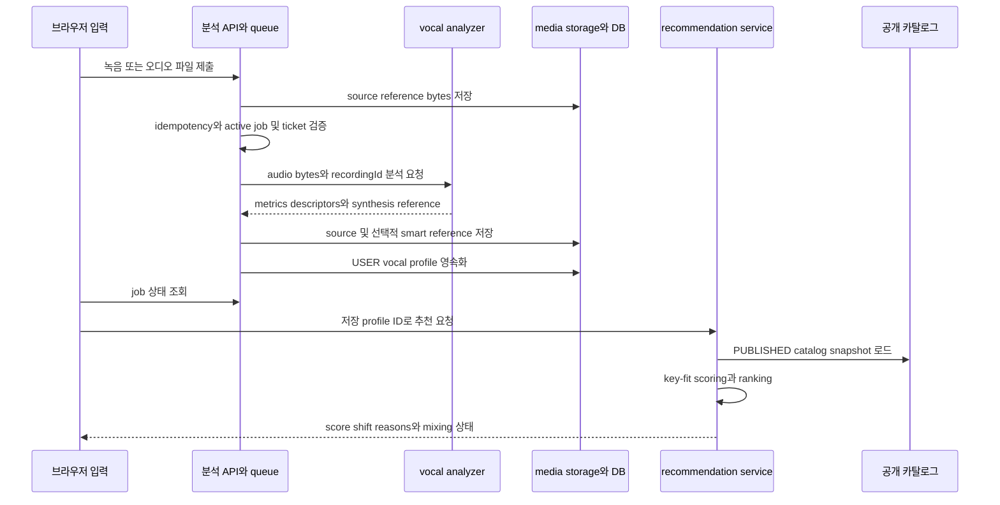

# 보컬 분석과 추천 도메인

이 도메인은 **오디오 bytes를 브라우저가 직접 추천으로 바꾸는 구조가 아니다**. 브라우저는 녹음 또는 파일 선택과 진행 상태를 담당하고, 서버는 분석 job과 저장을 담당한다. 저장된 `USER` vocal profile이 공개 카탈로그의 `READY` 곡 분석값과 같은 analyzer 계약으로 점수화될 때만 추천 결과가 만들어진다.

카탈로그의 source·analysis·target revision과 공개 조건은 [곡 카탈로그와 추천 대상 수명주기](/openwiki/concepts/catalog-and-recommendations.md)를 먼저 참고한다. 이 문서는 그 공개 snapshot을 사용자 profile과 결합하는 계산·상태 경계에 집중한다.

## 오디오 입력에서 저장 profile까지

프로필 생성 화면의 녹음기는 브라우저 `MediaRecorder`와 microphone stream을 소유한다. 녹음 시작 전 권한 요청 상태를 보여 주고, 종료·취소 시 `plugin.stopMic()`와 `plugin.destroy()`로 media 자원을 정리한다. 시각화는 녹음기 내부의 파형 라이브러리가 아니라 `VoiceSignalCore`가 `MediaStream`을 `AudioContext.createMediaStreamSource`와 `createAnalyser`에 연결해 그린다. 파일 업로드는 녹음기와 별도의 `VoiceScanInput` 경로다. ([`vocal-profile-recorder.tsx`](repo://src/_pages/profile/ui/vocal-profile-recorder.tsx#L1-L180), [`voice-signal-core.tsx`](repo://src/shared/ui/voice-signal-core/voice-signal-core.tsx#L1-L180))

녹음은 5초가 분석 가능 최소값이고 10초부터 권장 구간이다. `null` duration 파일은 서버가 판정할 수 있으므로 분석 제출을 막지 않는다. MIME type은 서버에서 정규화·지원 여부를 확인하고, 빈 파일과 25MB 초과 파일은 거부한다. 사용자의 분석 ticket 잔액도 job 생성 전에 확인한다. ([`voice-scan.ts`](repo://src/_pages/profile/model/voice-scan.ts#L8-L55), [`analysis-queue.ts`](repo://src/features/analyze-vocal-profile/api/analysis-queue.ts#L37-L109))

이 diagram은 브라우저 입력부터 저장 profile을 거쳐 공개 카탈로그 추천 응답으로 이어지는 소유권 경계를 보여 준다.

분석 queue는 `idempotencyKey`로 동일 요청을 재사용하고, 사용자당 `PENDING` 또는 `PROCESSING` job을 하나만 허용한다. ticket debit과 job 생성은 `Serializable` transaction으로 묶으며 write conflict는 제한적으로 재시도한다. 경쟁 요청으로 기존 job이 먼저 만들어지면 새로 임시 저장한 media asset을 폐기하고 기존 job을 반환한다. ([`analysis-queue.ts`](repo://src/features/analyze-vocal-profile/api/analysis-queue.ts#L54-L70), [`analysis-queue.ts`](repo://src/features/analyze-vocal-profile/api/analysis-queue.ts#L95-L181))

분석기는 결과의 `recordingId`가 요청과 일치하는지와 smart reference contract를 지원하는지 검증한다. profile에는 `minMidi`, `maxMidi`, `p10Midi`, `medianMidi`, `p90Midi`, tessitura 구간, `voicedRatio`, `pitchStability`, `clippingRatio`, `rmsDb`, analyzer 이름·버전, 선택적 `pitchHistogram`·`pitchTrack` descriptor가 들어간다. persistence 계층은 원본 reference를 `REFERENCE` asset으로 저장하고, smart synthesis reference 저장이 실패하면 source reference fallback을 남긴다. DB transaction이 실패하면 생성한 asset을 정리하고 `PROFILE_SAVE_FAILED`를 반환한다. ([`analyzer/index.ts`](repo://src/entities/vocal-profile/api/analyzer/index.ts#L11-L49), [`contract.ts`](repo://src/entities/vocal-profile/model/contract.ts#L18-L69), [`persistence.ts`](repo://src/entities/vocal-profile/api/persistence.ts#L34-L150))

## 분석 job과 화면 상태의 경계

서버가 영속적으로 아는 job 상태는 `pending`, `processing`, `succeeded`, `failed`다. 화면용 `resolveAnalysisStage`는 여기에 요청 중인 `submitting`, retry 가능한 pending을 나타내는 `retrying`, 네트워크 재요청 상태인 `reconnecting`을 덧붙인다. 성공한 job은 별도의 진행률을 만들어 내지 않고 상태가 `null`이 되어 저장 profile route로 이동한다. 즉 화면 상태는 제품 요구사항이 아니라 durable job과 요청 오류를 표시하기 위한 mapping이다. ([`voice-scan.ts`](repo://src/_pages/profile/model/voice-scan.ts#L89-L116), [`analysis-queue.ts`](repo://src/features/analyze-vocal-profile/api/analysis-queue.ts#L39-L51))

브라우저 오류도 분석 오류와 섞지 않는다. `NotAllowedError`·`SecurityError`는 권한 거부, 장치 관련 DOMException은 device unavailable, `MEDIA_RECORDER_UNAVAILABLE`는 브라우저 미지원으로 변환하며 각각 파일 업로드라는 대안을 안내한다. 서버 오류는 `reasonCode`, `detail`, `retryable` 계약으로 정규화하고, 너무 짧은 녹음·무음·clipping·지원하지 않는 MIME·ticket 부족·저장 실패 같은 복구 행동을 별도로 표시한다. ([`voice-scan.ts`](repo://src/_pages/profile/model/voice-scan.ts#L21-L45), [`voice-scan.ts`](repo://src/_pages/profile/model/voice-scan.ts#L57-L99))

## key-fit 계산 규칙

추천 service는 소유자가 맞는 `USER` profile에서 모든 scoring 필드가 유한한지 확인하고, `PUBLISHED` 카탈로그를 `RepeatableRead` transaction으로 읽는다. 각 곡은 active source, 그 source에 연결된 current analysis, READY target이 모두 맞고 analysis cleanup이 확인되어야 한다. 하나라도 빠지거나 revision 연결이 어긋나면 곡을 조용히 제외하지 않고 retryable `CATALOG_NOT_READY`로 실패한다. ([`recommendation-data.ts`](repo://src/features/create-recommendation/lib/recommendation-data.ts#L17-L67), [`recommendation-service.ts`](repo://src/features/create-recommendation/api/recommendation-service.ts#L84-L119))

계산의 현재 계약은 `key-fit-v3`이며 key shift 후보는 `-6`부터 `+6` 반음까지다.

1. user와 song profile의 모든 수치가 유한해야 한다. `voicedRatio`, `pitchStability`, `clippingRatio`는 `[0, 1]`이고, pitch percentile은 `min → p10 → median → p90 → max` 순서여야 한다. tessitura는 min/max 안의 비어 있지 않은 구간이어야 한다.
2. analyzer 이름과 버전이 user·song에서 같아야 한다. 다르면 `INCOMPATIBLE_ANALYZER`다.
3. song의 tessitura와 user tessitura의 대칭 overlap 비율, shifted tessitura의 초과량, shifted extreme range의 초과량을 계산한다. 초과량은 각각 합산해 12반음에서 penalty를 포화시킨다.
4. score는 overlap 58점, tessitura fit 26점, extreme fit 16점의 합이며 0~100으로 clamp한다. confidence는 `0.6 * pitchStability + 0.4 * voicedConfidence`이고, `voicedConfidence`는 `(voicedRatio - 0.25) / 0.5`를 0~1로 clamp한 값이다. confidence는 진단값이며 candidate fit score를 바꾸지 않는다.
5. 최고 raw score를 고른다. 동점이면 고음 부담, 전체 extreme 부담, 절대 shift 크기, 마지막으로 shift 값 순서로 결정한다. 결과에는 원키와 추천 shift의 breakdown, `scoringVersion`, confidence, reason codes를 함께 보낸다.

추천 순위는 key-fit score 자체와 다르다. `selectionScore = 0.65 * originalKeyScore + 0.35 * adjustedScore - shiftPenalty`이며 shift penalty는 절대 shift `0..6`에 대해 `[0, 1, 3, 7, 12, 20, 30]`이다. 순위 동점은 original score, adjusted score, 작은 절대 shift, catalog order 순으로 푼다. 이 때문에 adjusted score가 높은 곡이 항상 1위가 되지는 않는다. ([`key-fit-scorer.ts`](repo://src/entities/recommendation/lib/key-fit-scorer.ts#L12-L19), [`key-fit-scorer.ts`](repo://src/entities/recommendation/lib/key-fit-scorer.ts#L47-L105), [`key-fit-scorer.ts`](repo://src/entities/recommendation/lib/key-fit-scorer.ts#L118-L189), [`ranking.ts`](repo://src/entities/recommendation/lib/ranking.ts#L5-L84))

## 추천 응답과 presentation

`getRecommendationResult`는 카탈로그 ID·revision과 `scoringVersion`, profile confidence, 항목별 `rank`, `originalKeyScore`, `adjustedScore`, `selectionScore`, `recommendedShift`, reason codes·한국어 reasons, original/recommended metrics를 반환한다. 추천 항목에는 곡 analysis ID와 target asset ID도 포함된다. 이는 제목만 있는 목록이 아니라 특정 공개 revision을 가리키는 계산 결과다. 추천에서 믹싱으로 넘길 때의 snapshot 검증은 [추천에서 믹싱까지](/openwiki/workflows/recommendation-to-mixing.md)에서 다룬다. ([`recommendation-service.ts`](repo://src/features/create-recommendation/api/recommendation-service.ts#L152-L236))

화면 projection은 서버 rank를 표시용 rank로 사용한다. score는 0~100 정수로 반올림·clamp하고 색상은 그 값으로 foreground와 brand accent를 연속 보간한다. URL filter는 query, score 구간(`90-plus`, `80-plus`, `under-80`), shift 방향, synthesis 상태, 정렬(`recommendation-score`, `original-score`, `title`)만 허용하며 잘못된 값은 기본값으로 되돌린다. legacy `rank`와 `adjusted-score` 정렬 값은 recommendation score로 호환한다. projection은 검색·필터·정렬을 적용하지만 source rank 배열을 변경하지 않는다. ([`presentation.ts`](repo://src/entities/recommendation/lib/presentation.ts#L4-L70), [`presentation.ts`](repo://src/entities/recommendation/lib/presentation.ts#L73-L149))

계산용 reason code를 모두 사용자에게 노출하지도 않는다. `KEY_SHIFT_IMPROVES_FIT`, range burden, notes reduced 계열은 설명 문자열을 계산하는 내부 근거로 남기고, `visibleRecommendationReasons`는 이를 숨긴다. 반면 overlap이나 low confidence 같은 사용자 판단에 필요한 이유는 남긴다. low confidence는 추천을 차단하지 않으며 “더 긴 소절로 다시 분석”할 수 있다는 설명을 추가한다. ([`ranking.ts`](repo://src/entities/recommendation/lib/ranking.ts#L93-L140), [`presentation.ts`](repo://src/entities/recommendation/lib/presentation.ts#L14-L21), [`presentation.ts`](repo://src/entities/recommendation/lib/presentation.ts#L99-L105))

mixing capability도 profile persistence와 분리된 presentation 데이터다. 소유자·asset kind·`READY` 상태를 확인해 smart reference를 우선하고, smart reference가 없으면 source reference를 fallback으로 쓴다. `smart-reference-mid-v1`에서 중앙 음역 reference가 없으면 `missing_mid_reference`, 둘 다 없으면 `reference_unavailable`로 표시한다. ([`contract.ts`](repo://src/entities/vocal-profile/model/contract.ts#L196-L250), [`recommendation-service.ts`](repo://src/features/create-recommendation/api/recommendation-service.ts#L135-L150), [`presentation.ts`](repo://src/entities/recommendation/lib/presentation.ts#L91-L97))

## 변경 전 확인할 테스트

- `tests/voice-scan-state.test.ts`는 5초·10초 milestone, 권한·장치·브라우저 오류 분류, submitting/pending/retrying/processing/reconnecting/failed mapping, 성공 후 저장 profile redirect와 media cleanup 경계를 확인한다. ([`tests/voice-scan-state.test.ts`](repo://tests/voice-scan-state.test.ts#L25-L82), [`tests/voice-scan-state.test.ts`](repo://tests/voice-scan-state.test.ts#L84-L130))
- `tests/key-fit-scoring.test.ts`는 profile invariant, analyzer 호환성, 대칭 overlap, 고·저음 burden, confidence의 진단적 성격, `-6..+6` shift와 deterministic 결과, non-ready song 실패를 검증한다. ([`tests/key-fit-scoring.test.ts`](repo://tests/key-fit-scoring.test.ts#L42-L186), [`tests/key-fit-scoring.test.ts`](repo://tests/key-fit-scoring.test.ts#L238-L288))
- `tests/recommendation-ranking.test.ts`는 original/adjusted 가중치와 stepped penalty, tie-break, 전체 catalog의 deterministic ranking, 빈 catalog·중복 position 거부, 한국어 explanation을 검증한다. ([`tests/recommendation-ranking.test.ts`](repo://tests/recommendation-ranking.test.ts#L53-L177), [`tests/recommendation-ranking.test.ts`](repo://tests/recommendation-ranking.test.ts#L227-L251))
- `tests/recommendation-presentation.test.ts`는 URL filter parsing/serialization, 서버 rank 보존, score 표시 clamp, score color, 숨겨진 reason code, 완전한 `SONG` profile만의 detail projection을 검증한다. ([`tests/recommendation-presentation.test.ts`](repo://tests/recommendation-presentation.test.ts#L71-L112), [`tests/recommendation-presentation.test.ts`](repo://tests/recommendation-presentation.test.ts#L114-L205))

계산 상수나 상태 mapping을 바꾸면 해당 unit test와 snapshot/revision을 소비하는 [추천에서 믹싱까지](/openwiki/workflows/recommendation-to-mixing.md) 경계를 함께 확인한다. 녹음 UX 요구사항을 바꾸는 일과 analyzer contract·profile persistence·추천 계산을 바꾸는 일은 서로 다른 변경이며, 한 계층의 화면 문구만 수정해 다른 계층의 규칙이 바뀐 것으로 해석하지 않는다.
