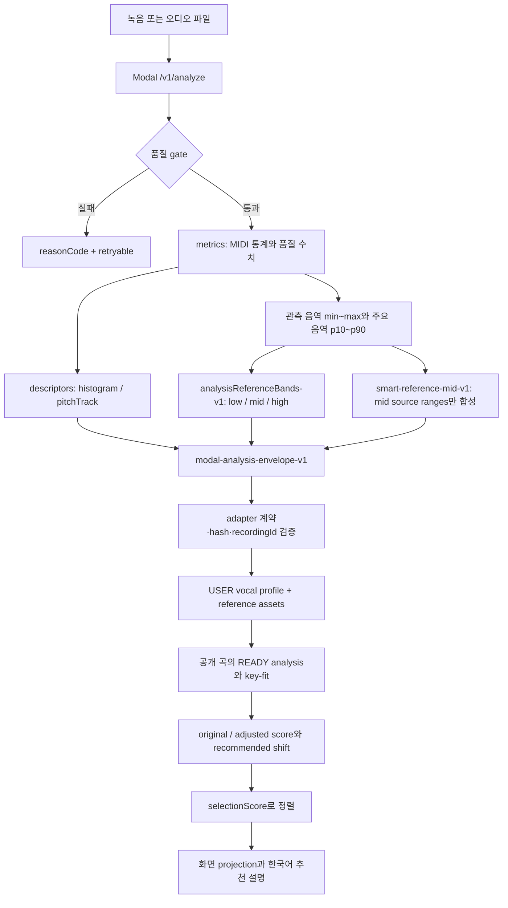

# 보컬 분석 지표와 추천 적합도

이 페이지의 핵심은 **분석값의 의미와 계약 경계**다. Modal analyzer가 오디오에서 수치와 descriptor를 만들고, TypeScript adapter가 응답·artifact 무결성·reference 계약을 검증한다. 그 뒤 profile persistence가 `USER` profile을 저장하고, 추천은 같은 analyzer와 `analyzerVersion`을 사용한 공개 곡 분석값만 비교한다.

곡의 공개 snapshot과 revision 수명주기는 [곡 카탈로그와 추천 대상 수명주기](/openwiki/concepts/catalog-and-recommendations.md), 추천 결과를 믹싱에 넘기는 검증은 [추천에서 믹싱까지](/openwiki/workflows/recommendation-to-mixing.md)를 함께 참고한다.

## 전체 데이터 흐름

다음 흐름에서 `metrics`는 계산 입력이고, `descriptors`는 관측·시각화용 상세 데이터다. `analysisReferenceBands`는 사람에게 원본의 세 음역을 보여 주기 위한 선택 결과이며, `synthesisReference`는 합성/믹싱에 넘길 중앙 음역만의 오디오 artifact다. 둘은 같은 source ranges를 의미하지 않는다.



## 입력과 품질 gate

분석 입력은 `audio` multipart body와 `X-Recording-ID` UUID다. MIME은 매개변수를 제거해 소문자로 정규화하고 WAV, MP3, M4A, WebM만 허용한다. 업로드는 25MB 이하이며, 기본 사용자 분석은 5초 이상 60초 이하, mono·non-empty decode여야 한다. `rmsDb < -45`이면 `TOO_SILENT`, clipping 비율이 `0.01`보다 크면 `EXCESSIVE_CLIPPING`, voiced frame 비율이 `0.25`보다 작으면 `LOW_VOICED_RATIO`다. 지원하지 않는 형식, 잘못된 segment timestamp도 별도 rejection code로 돌아간다. 긴 입력은 Modal 요청에서 `trim_to_max_duration`을 켠 경우에만 첫 audible 구간부터 60초로 자른다. ([`config.py`](repo://services/vocal-analysis-core/vocal_analysis_core/config.py#L4-L42), [`analysis.py`](repo://services/vocal-analysis-core/vocal_analysis_core/analysis.py#L164-L229), [`modal_app.py`](repo://services/vocal-profile-modal/modal_app.py#L199-L289))

analyzer는 `librosa.pyin`으로 pitch frame을 구하고 analyzer 이름을 `librosa-pyin`, 버전을 실행 중인 `librosa.__version__`으로 기록한다. API health도 같은 analyzer와 설치된 librosa 버전을 보고한다. 따라서 `analyzerVersion`은 장식용 문자열이 아니라 user/song 비교 가능성을 결정하는 계약 필드다. 추천 scorer는 두 profile의 이름과 버전이 모두 같지 않으면 `INCOMPATIBLE_ANALYZER`를 발생시킨다. ([`analysis.py`](repo://services/vocal-analysis-core/vocal_analysis_core/analysis.py#L195-L265), [`modal_app.py`](repo://services/vocal-profile-modal/modal_app.py#L122-L143), [`key-fit-scorer.ts`](repo://src/entities/recommendation/lib/key-fit-scorer.ts#L47-L105))

## analyzer envelope과 local/Modal 경계

현재 애플리케이션의 analyzer entrypoint는 `analyzeVocalProfile`이며 Modal adapter를 호출한다. adapter는 `modal-analysis-envelope-v1`, `cleanupConfirmed: true`, 요청과 동일한 `recordingId`를 요구한다. source와 synthesis reference artifact는 base64를 decode한 뒤 `sizeBytes`와 SHA-256을 모두 확인한다. profile metadata와 artifact MIME/bytes가 어긋나거나, profile에 reference가 있다고 했는데 artifact가 없으면 `ANALYZER_INVALID_RESPONSE`다. adapter에는 별도의 다른 로컬 계산 구현을 두지 않으므로 local 실행도 이 Modal transport 계약을 통과해야 한다. ([`analyzer/index.ts`](repo://src/entities/vocal-profile/api/analyzer/index.ts#L11-L49), [`modal-adapter.ts`](repo://src/entities/vocal-profile/api/analyzer/modal-adapter.ts#L48-L142))

Modal은 CPU 2 cores·4096 MiB, container당 한 입력, 최대 10 containers, 120초 timeout으로 실행되고 API key를 `hmac.compare_digest`로 확인한다. `/health`는 `smart-reference-mid-v1`와 `song-target-v1` capability를 함께 선언한다. 네트워크 timeout/중단, 5xx, 429는 retryable analyzer 오류로 mapping하지만 인증 실패와 계약 미지원은 retry로 해결하지 않는다. ([`modal_app.py`](repo://services/vocal-profile-modal/modal_app.py#L21-L74), [`modal_app.py`](repo://services/vocal-profile-modal/modal_app.py#L49-L60), [`modal-adapter.ts`](repo://src/entities/vocal-profile/api/analyzer/modal-adapter.ts#L145-L215))

구버전 보정은 임의의 수치를 채우는 방식이 아니다. 현재 adapter는 지원하는 synthesis reference version만 인정하고, `smart-reference-v1`의 low/mid/high shape와 `smart-reference-mid-v1`의 mid-only shape를 각각 검증한다. version이 없거나 미래 version이면 `hasSmartReferenceContract`가 false가 되어 `ANALYZER_UPDATE_REQUIRED`가 된다. 즉 누락·불일치 descriptor를 조용히 legacy 값으로 바꾸지 않는 것이 안전한 동작이다. ([`contract.ts`](repo://src/entities/vocal-profile/model/contract.ts#L196-L250), [`vocal-profile-contract.test.ts`](repo://tests/vocal-profile-contract.test.ts#L68-L147))

## 저장되는 지표와 세 가지 음역

profile의 핵심 수치는 다음처럼 읽는다.

| 구분 | 필드/descriptor | 의미 |
| --- | --- | --- |
| 관측 음역 | `minMidi`, `maxMidi` | range 분석에 사용한 pitch의 2·98 percentile 경계 |
| 주요 음역 | `p10Midi`, `medianMidi`, `p90Midi`, `tessituraLowMidi`, `tessituraHighMidi` | melody 통계의 10·50·90 percentile. tessitura는 p10~p90이다. |
| 품질 | `voicedRatio`, `pitchStability`, `clippingRatio`, `rmsDb` | pitch가 선명한 비율, pitch 안정도, clipping 비율, RMS dB |
| 상세 관측 | `pitchHistogram`, `pitchTrack` | 전체 voiced pitch 분포와 최대 720개로 bucketed 된 시간별 MIDI track |

guide segment를 함께 제출하면 melody 구간은 주요 음역과 stability에, glissando 구간은 관측 음역에 사용한다. 두 구간 각각 최소 20개의 voiced frame이 없으면 분석이 거부된다. ([`analysis.py`](repo://services/vocal-analysis-core/vocal_analysis_core/analysis.py#L216-L265), [`analysis.py`](repo://services/vocal-analysis-core/vocal_analysis_core/analysis.py#L137-L161))

`analysisReferenceBands-v1`은 후보 phrase를 median MIDI로 low/mid/high에 분류하고 각 band에 최대 10초씩 배분한다. 이 descriptor는 화면의 `저음 영역`, `중앙 영역`, `고음 영역` control을 만드는 입력이다. 화면은 이 descriptor가 없거나 malformed이면 control을 숨긴다. synthesis reference는 별도 `smart-reference-mid-v1` 결과로, voiced mid phrase만 점수화해 최대 30초까지 이어 붙이고 30ms crossfade를 적용한다. 중앙 phrase를 찾지 못하면 오디오 artifact 없이 `status: unavailable`, `fallbackReason: no-quality-mid-phrase`를 기록한다. ([`reference.py`](repo://services/vocal-analysis-core/vocal_analysis_core/reference.py#L14-L22), [`reference.py`](repo://services/vocal-analysis-core/vocal_analysis_core/reference.py#L57-L189), [`reference.py`](repo://services/vocal-analysis-core/vocal_analysis_core/reference.py#L222-L301), [`vocal-profile-reference-bands.test.ts`](repo://tests/vocal-profile-reference-bands.test.ts#L5-L52))

저장 계층은 원본을 `REFERENCE` asset으로 저장하고, synthesis artifact가 있으면 `SYNTHESIS_REFERENCE` asset도 저장한다. 후자 업로드가 실패해도 원본을 fallback으로 남기며 descriptor에 실패 상태를 기록한다. profile 또는 DB transaction이 실패하면 이미 만든 asset을 정리하고 `PROFILE_SAVE_FAILED`를 반환한다. ([`persistence.ts`](repo://src/entities/vocal-profile/api/persistence.ts#L34-L150))

## key fit 계산

추천 scorer는 먼저 user와 song profile의 모든 수치가 유한한지, `[0, 1]` 필드 범위와 MIDI percentile 순서, min/max 안의 non-empty tessitura를 만족하는지 확인한다. 그 뒤 `key-fit-v3` 계약으로 `-6..+6` 반음 후보를 각각 평가한다.

각 후보는 song tessitura를 shift한 뒤 user tessitura와 **대칭 overlap ratio**, tessitura 초과량, extreme range 초과량을 계산한다. tessitura와 extreme 초과량은 각각 12반음에서 penalty를 포화한다. score는 overlap 58점, tessitura fit 26점, extreme fit 16점의 합을 0~100으로 clamp한 값이다. confidence는 `0.6 * pitchStability + 0.4 * clamp((voicedRatio - 0.25) / 0.5, 0, 1)`이며 score를 낮추지 않는 진단값이다. ([`key-fit-scorer.ts`](repo://src/entities/recommendation/lib/key-fit-scorer.ts#L12-L19), [`key-fit-scorer.ts`](repo://src/entities/recommendation/lib/key-fit-scorer.ts#L118-L189))

최고 raw score가 recommended key다. raw score가 같으면 고음 tessitura 부담, 전체 extreme 부담, 절대 shift 크기, shift 값 순서로 결정해 결과를 deterministic하게 만든다. 응답에는 `originalKeyScore`, `adjustedScore`, `recommendedShift`, `scoringVersion`, confidence, 원키·추천키 breakdown과 reason codes가 들어간다. low confidence는 차단 조건이 아니라 설명 조건이다. ([`key-fit-scorer.ts`](repo://src/entities/recommendation/lib/key-fit-scorer.ts#L192-L263), [`tests/key-fit-scoring.test.ts`](repo://tests/key-fit-scoring.test.ts#L88-L248))

## 추천 정렬과 표시 상태

곡별 추천 순위는 adjusted score를 단순 내림차순 정렬하지 않는다. `selectionScore`는 다음과 같다.

```text
0.65 * originalKeyScore + 0.35 * adjustedScore - shiftPenalty
shiftPenalty(|shift|) = [0, 1, 3, 7, 12, 20, 30]  // |shift| = 0..6
```

정렬 동점은 original score, adjusted score, 작은 절대 shift, catalog order 순서로 푼다. 빈 후보, 중복 catalog order, 범위를 벗어난 shift는 `CATALOG_NOT_READY`다. 따라서 adjusted score가 높은 곡이 항상 1위라는 보장은 없다. ([`ranking.ts`](repo://src/entities/recommendation/lib/ranking.ts#L5-L84), [`tests/recommendation-ranking.test.ts`](repo://tests/recommendation-ranking.test.ts#L53-L177))

presentation은 계산 결과를 다시 scoring하지 않는다. 서버가 부여한 `rank`를 표시하고 score만 0~100 정수로 반올림·clamp한다. URL filter는 query, score 구간, shift 방향, synthesis 상태와 허용된 sort 값만 읽으며 잘못된 값은 기본값으로 정규화한다. projection은 filter/sort를 적용해도 원본 rank 배열 자체는 바꾸지 않는다. 내부 reason code 중 shift 개선·range burden·notes reduced는 사용자 문구에서 숨기고, overlap·low confidence처럼 판단에 필요한 설명은 한국어로 남긴다. ([`presentation.ts`](repo://src/entities/recommendation/lib/presentation.ts#L4-L70), [`presentation.ts`](repo://src/entities/recommendation/lib/presentation.ts#L73-L149), [`ranking.ts`](repo://src/entities/recommendation/lib/ranking.ts#L93-L140))

추천 service는 소유자의 `USER` profile과 공개 catalog의 READY/current analysis를 같은 revision 경계에서 읽는다. source·analysis·target 연결이 준비되지 않았거나 revision이 어긋나면 후보를 조용히 빼지 않고 retryable `CATALOG_NOT_READY`로 실패한다. 성공 응답은 catalog revision, `scoringVersion`, confidence, rank·selectionScore·shift·reason과 `songAnalysisId`, `targetAssetId`를 함께 반환한다. ([`recommendation-data.ts`](repo://src/features/create-recommendation/lib/recommendation-data.ts#L17-L67), [`recommendation-service.ts`](repo://src/features/create-recommendation/api/recommendation-service.ts#L84-L119), [`recommendation-service.ts`](repo://src/features/create-recommendation/api/recommendation-service.ts#L152-L236))

믹싱 capability는 추천 score와 별개다. `SMART_REFERENCE_MID_VERSION`이면 descriptor와 artifact의 모든 source range가 mid인지 확인하고, smart reference가 READY일 때 우선한다. smart reference 저장 실패 시 source reference를 fallback으로 쓸 수 있지만 mid-only 계약에서 중앙 reference가 없으면 `missing_mid_reference`, source까지 없으면 `reference_unavailable`로 표시한다. legacy descriptor나 malformed range는 사람용 band control을 만들지 않는다. ([`contract.ts`](repo://src/entities/vocal-profile/model/contract.ts#L201-L250), [`vocal-profile-reference-bands.test.ts`](repo://tests/vocal-profile-reference-bands.test.ts#L26-L52))

## 변경 전 확인할 테스트

- `tests/key-fit-scoring.test.ts`: invariant, analyzer 이름·버전 호환성, overlap/부담, confidence의 진단적 성격, `-6..+6` deterministic 선택을 확인한다.
- `tests/recommendation-ranking.test.ts`: 가중치·shift penalty, tie-break, invalid catalog data와 한국어 explanation을 확인한다.
- `tests/vocal-profile-contract.test.ts`: legacy와 mid-only reference version, version mismatch, low/high range가 섞인 mid-only 응답, 누락 descriptor rejection을 확인한다.
- `tests/vocal-profile-reference-bands.test.ts`: low/mid/high 정렬, `analysisReferenceBands` 우선, legacy/malformed descriptor에서 control 숨김을 확인한다.
- `services/vocal-profile-modal/test_modal_app_source.py`: Modal의 CPU-only/authenticated deployment, `/health`, `/v1/analyze`, `/v1/song-target`, transport capability를 확인한다.

analyzer 수치나 version, reference descriptor를 바꾸면 analyzer core와 Modal envelope, TypeScript adapter 계약을 함께 변경하고 위 테스트를 같이 갱신해야 한다. 추천 상수만 바꾸는 경우에도 scoring 결과와 presentation 문구를 분리해 검증한다.
