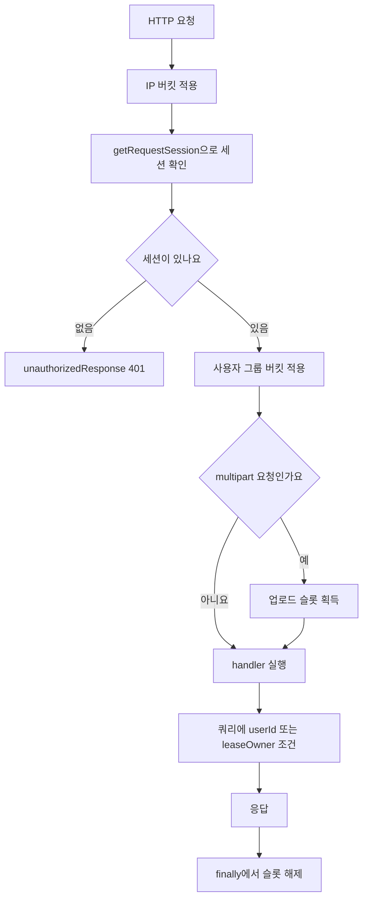
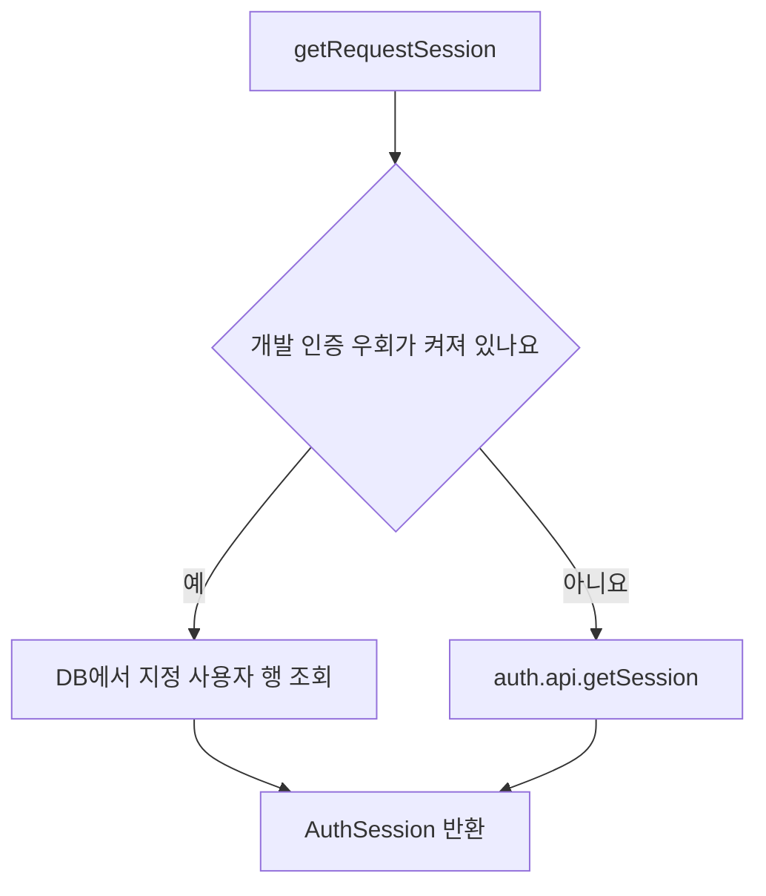

접근 제어는 한 곳에서 끝나지 않아요. `withApiAdmission` 래퍼가 IP 버킷을 적용한 뒤 세션을 확인하고, handler가 `requireApiSession`으로 세션을 얻고, 실제 데이터 조회 쿼리가 `userId` 조건으로 대상을 좁혀요. 관리자 경로는 그 위에 이메일 allowlist 검사를 하나 더 얹어요. 새 API도 같은 순서를 따라야 하고, 마지막 절의 체크리스트가 그 순서를 정리해요.

## 검증이 일어나는 순서

`withApiAdmission`은 handler를 부르기 전에 IP 버킷 → 세션 확인 → 사용자 그룹 버킷 → 업로드 슬롯 순서로 통과시켜요([admission.ts](repo://src/_app/api-routes/admission.ts#L11-L33)). `trustedClientIp`가 값을 반환하면 `ip:${ip}` 버킷을 적용하고, `getRequestSession(request)`가 세션을 못 찾으면 handler를 부르지 않고 `unauthorizedResponse()` 401을 반환해요. 세션이 확인된 뒤에야 `requestPolicy`가 정한 그룹으로 `user:${userId}:${group}` 버킷을 적용하고, `Content-Type`이 `multipart/form-data`로 시작하면 업로드 슬롯을 잡아요. 슬롯은 `finally`에서 해제돼요.



세션 없는 요청은 IP 버킷만 지나 401로 끝나고, 세션이 있는 요청만 사용자 버킷을 통과해 handler에 닿아요.

그룹별 rate·burst 수치와 오류 봉투 형태는 [HTTP API 표면과 요청 접수 규칙](../architecture/http-api-surface.md)이 소유해요. 이 페이지는 "어디서 검증하는가"만 다뤄요.

## 로그인은 Google OAuth 하나만 열려 있어요

Better Auth 설정은 Google 소셜 로그인 하나만 열어 두고 이메일·비밀번호 로그인을 꺼 둬요. 데이터베이스는 Prisma adapter(PostgreSQL)를 쓰고, `appName`은 `Copysinger`예요([auth.ts](repo://src/features/authentication/api/auth.ts#L11-L41)).

| 설정 | 값 | 의미 |
| --- | --- | --- |
| `baseURL` | `BETTER_AUTH_URL`을 읽고 없으면 `http://localhost:3000` | 로컬 기본값이 있어요 |
| `secret` | `resolveAuthSecret(process.env)` | 개발·테스트 밖에서는 `BETTER_AUTH_SECRET`이 없으면 예외를 던져요 |
| `database` | `prismaAdapter(prisma, { provider: "postgresql" })` | 세션·계정 행이 PostgreSQL에 저장돼요 |
| `emailAndPassword` | `{ enabled: false }` | 비밀번호 로그인 경로가 없어요 |
| `socialProviders.google` | scope `openid`, `email`, `profile` | 인증 수단은 Google 계정뿐이에요 |

secret 해석 규칙은 fail-closed예요. `BETTER_AUTH_SECRET`이 있으면 trim한 값을 쓰고, 없으면 `NODE_ENV`가 `development`·`test`일 때만 개발용 상수를 반환하며, 그 밖의 환경에서는 오류를 던져요([auth-secret-policy.ts](repo://src/features/authentication/model/auth-secret-policy.ts#L8-L13)). [tests/auth-navigation.test.ts](repo://tests/auth-navigation.test.ts#L9-L16)가 이 세 갈래를 모두 검사해요.

설정이 모두 채워졌는지는 `googleAuthConfigured()`가 판단해요. `BETTER_AUTH_SECRET`, `BETTER_AUTH_URL`, `GOOGLE_CLIENT_ID`, `GOOGLE_CLIENT_SECRET` 네 값이 모두 있어야 `true`고([auth.ts](repo://src/features/authentication/api/auth.ts#L43-L49)), 값이 하나라도 비면 로그인 화면의 Google 버튼이 비활성화되고 안내 문구가 떠요([google-sign-in.tsx](repo://src/features/authentication/ui/google-sign-in.tsx#L22-L35)).

새 사용자가 만들어질 때는 `databaseHooks.user.create.after`가 `ensureSignupTicketGrants(user.id)`를 호출해요([auth.ts](repo://src/features/authentication/api/auth.ts#L32-L40)). 가입 지급의 멱등 규칙은 [티켓 원장과 멱등성](../concepts/ticket-ledger.md)이 소유해요.

Better Auth의 HTTP endpoint는 `app/api/auth/[...all]/route.ts`가 `src/_app/api-routes/auth/index.server.ts`를 re-export하는 구조예요. 그 handler는 `toNextJsHandler(auth)`를 `withAuthAdmission`으로 감싼 형태라, 인증 흐름 자체에는 세션 검사를 걸지 않고 인증 전용 버킷만 적용해요([auth-route.ts](repo://src/_app/api-routes/auth/auth-route.ts#L1-L7)).

## 요청 안에서 세션은 WeakMap으로 메모이제이션돼요

`getRequestSession(request?)`는 `Request` 객체를 키로 쓰는 `WeakMap`에 세션 Promise를 저장해요. 그래서 같은 요청 안에서 여러 번 불러도 세션 조회는 한 번만 일어나요. 인자를 주지 않으면 `next/headers`의 `headers()`를 쓰고, 해석 순서는 개발 인증 우회 세션을 먼저 시도한 뒤 `auth.api.getSession({ headers })`를 부르는 순서예요([session.ts](repo://src/features/authentication/api/session.ts#L8-L25)).



세션 하나를 해석하는 분기예요. 두 경로 모두 `AuthSession` 또는 `null`을 돌려주니, 그 위 코드는 어느 쪽으로 해석됐는지까지 알 필요가 없어요.

세션을 강제하는 방법은 페이지와 API가 달라요. 페이지는 `requirePageSession(returnTo)`가 세션이 없으면 `returnTo`를 URL 인코딩해 `/login?callbackURL=...`으로 리다이렉트해요. API는 세션을 강제하지 않고 세션 또는 `null`만 돌려주니, handler가 `unauthorizedResponse()`로 401을 만들죠([session.ts](repo://src/features/authentication/api/session.ts#L27-L44)).

```json
{ "error": { "code": "UNAUTHENTICATED", "message": "Google 로그인이 필요해요.", "retryable": false } }
```

이 401 봉투는 [tests/new-user-onboarding.integration.ts](repo://tests/new-user-onboarding.integration.ts#L19-L31)가 실제 handler 응답으로 확인해요.

`requirePageSession`이 페이지마다 `returnTo`를 직접 받는 이유는 리다이렉트 정밀도 때문이에요. 공용 layout은 인증을 강제하지 않고, 세션이 있는 요청에만 persistent shell을 덧붙여요([product-layout.tsx](repo://src/_app/layout/product-layout.tsx#L14-L21)). 그래서 각 페이지가 자기 경로를 넘겨야 하고, 실제로 계정 화면은 `requirePageSession("/account")`을 호출해요([account-page.tsx](repo://src/_pages/account/ui/account-page.tsx#L17-L22)).

로그인 후 돌아갈 주소는 `safeCallbackURL`이 걸러요. `/`로 시작하고 `//`·`\`를 포함하지 않으며 origin이 로컬 경로로 해석되는 값만 통과하고, 나머지는 `/profile`로 떨어져요([safe-callback-url.ts](repo://src/features/authentication/model/safe-callback-url.ts#L3-L13)). 외부 URL·프로토콜 상대 URL·역슬래시 우회 시도가 모두 기본값으로 접히는지는 [tests/auth-navigation.test.ts](repo://tests/auth-navigation.test.ts#L18-L28)가 검사해요.

## 개발 인증 우회는 development와 test에서만 켜져요

개발 인증 우회는 세 조건을 모두 만족할 때만 활성화돼요. 하나라도 어긋나면 `developmentAuthBypassUserId`가 `null`을 돌려주고 일반 Better Auth 세션 경로를 그대로 써요([dev-bypass-policy.ts](repo://src/features/authentication/model/dev-bypass-policy.ts#L7-L12)).

| 조건 | 통과 값 | 어긋날 때 |
| --- | --- | --- |
| `NODE_ENV` | `development` 또는 `test` | `production`·미설정이면 우회 비활성 |
| `DEV_AUTH_BYPASS_ENABLED` | trim·소문자 변환 후 `"true"` | `"false"`·미설정이면 우회 비활성 |
| `DEV_AUTH_BYPASS_USER_ID` | trim 후 비어 있지 않은 값 | 공백뿐이면 우회 비활성 |

우회 세션은 지정한 사용자 행을 실제로 조회해서 만들어요. 그 id의 사용자가 데이터베이스에 없으면 조용히 넘어가지 않고 오류를 던져요. 만들어진 세션의 `token`은 `dev-auth-bypass`이고 만료는 생성 시점에서 24시간 뒤예요([dev-bypass.ts](repo://src/features/authentication/api/dev-bypass.ts#L9-L31)).

우회 세션인지 구분하는 함수는 `isDevelopmentAuthBypassSession`이에요. 이 값이 `true`면 계정 메뉴에 로그아웃 대신 `개발 인증 우회 사용 중`이 표시되고([user-menu.tsx](repo://src/features/authentication/ui/user-menu.tsx#L133-L141)), 레이아웃은 온보딩 스냅샷 조회를 건너뛰어요([product-layout.tsx](repo://src/_app/layout/product-layout.tsx#L21-L29)).

정책 자체는 순수 함수라 테스트가 직접 환경 값을 바꿔 확인해요. [tests/dev-auth-bypass.integration.ts](repo://tests/dev-auth-bypass.integration.ts#L7-L26)가 개발·테스트 밖에서 우회가 꺼지는 것을, 같은 파일의 두 번째 테스트가 기존 사용자만 세션으로 해석되는 것을 확인해요([tests/dev-auth-bypass.integration.ts](repo://tests/dev-auth-bypass.integration.ts#L28-L50)). 미인증 401을 확인하는 테스트는 `DEV_AUTH_BYPASS_ENABLED`를 `"false"`로 되돌린 뒤 요청을 보내요([tests/new-user-onboarding.integration.ts](repo://tests/new-user-onboarding.integration.ts#L19-L31)).

## 관리자 경계는 이메일 allowlist로 판정해요

관리자 여부는 역할 테이블이 아니라 이메일 allowlist로 판정해요. `adminEmails()`가 `ADMIN_EMAILS`를 쉼표로 나눠 trim·소문자로 정규화하고 빈 값을 버린 뒤 `Set`을 만들고, `isAdminEmail`은 입력 이메일을 같은 방식으로 정규화해 포함 여부만 봐요([admin-policy.ts](repo://src/features/authentication/model/admin-policy.ts#L3-L14)). [tests/admin-operations.integration.ts](repo://tests/admin-operations.integration.ts#L12-L38)가 대문자·공백이 섞인 allowlist 항목을 실제로 통과시키는지 확인해요.

같은 판정 함수를 쓰지만 페이지와 API의 실패 응답이 달라요. 이 차이가 관리자 화면의 존재 자체를 숨기는 장치예요.

| 진입점 | 세션 없음 | 관리자 아님 | 근거 |
| --- | --- | --- | --- |
| `requireAdminPage()` | `notFound()` | `notFound()` | [admin.ts](repo://src/features/authentication/api/admin.ts#L8-L15) |
| `requireAdminApi(request)` | 401 `UNAUTHENTICATED` | 403 `FORBIDDEN` | [admin.ts](repo://src/features/authentication/api/admin.ts#L17-L27) |

`requireAdminApi`는 성공 시 `{ response: null, session }`을 돌려주니, handler는 `if (access.response) return access.response;`로 검사하고 통과한 세션을 그대로 이어서 써요. 관리자 catalog handler와 개요 handler가 모두 이 형태예요([catalog-route.ts](repo://src/_app/api-routes/admin/catalog/catalog-route.ts#L13-L23), [overview-route.ts](repo://src/_app/api-routes/admin/overview-route.ts#L5-L9)).

관리자 페이지는 데이터 조회 전에 `requireAdminPage()`를 호출해요. 그래서 권한 없는 세션은 관리자 화면을 404로 보게 돼요([admin-page.tsx](repo://src/_pages/admin/ui/admin-page.tsx#L65-L76)). 계정 메뉴의 관리 링크는 `isAdminEmail` 결과로 렌더 여부만 바뀌는 편의 장치예요([user-menu.tsx](repo://src/features/authentication/ui/user-menu.tsx#L126-L130)). 실제 차단은 항상 서버의 allowlist 검사가 담당하니, UI 조건을 인가 근거로 삼지 마세요.

## 자원 소유권은 쿼리 조건과 lease로 검증해요

소유권 검증은 "이 사용자가 이 자원을 요청할 수 있는가"를 쿼리 조건으로 표현하는 방식이에요. handler가 받은 `session.user.id`를 도메인 함수의 인자로 넘겨서, 조건이 handler 바깥으로 새지 않게 해요.

| 패턴 | 동작 | 실제 예 |
| --- | --- | --- |
| 단건 조회에 `userId` 조건 | `findFirst({ where: { id, userId } })`, 결과가 없으면 404 | [getMixingJobForUser](repo://src/entities/mixing-job/api/history.ts#L152-L155), [mixing-job-detail-route.ts](repo://src/_app/api-routes/mixing-jobs/mixing-job-detail-route.ts#L6-L14) |
| 목록 조회를 세션 사용자로 고정 | `userId`를 where에 넣어 다른 사용자의 행이 섞이지 않아요 | [getMixingHistory](repo://src/entities/mixing-job/api/history.ts#L129-L150), [notifications-route.ts](repo://src/_app/api-routes/notifications/notifications-route.ts#L5-L15) |
| 참조 자산의 소유자·종류·상태 재확인 | 자산의 `userId`, `kind`, `status`를 다시 비교해 어긋나면 `null` | [getVocalProfileReference](repo://src/entities/vocal-profile/api/history.ts#L103-L120) |
| 트랜잭션 안에서 행 잠금 | `SELECT ... WHERE id = ... AND "userId" = ... FOR UPDATE` | [vocal-profile-detail-route.ts](repo://src/_app/api-routes/vocal-profiles/vocal-profile-detail-route.ts#L62-L97), [deletion.ts](repo://src/entities/mixing-job/api/deletion.ts#L9-L39) |
| 소유권 인자를 도메인 함수의 필수 인자로 넘기기 | handler가 `userId`를 인자로 넘겨 조건이 함수 안에서 만들어져요 | [getVocalProfileDetail](repo://src/entities/vocal-profile/api/history.ts#L87-L101), [getMixingJobForUser](repo://src/entities/mixing-job/api/history.ts#L152-L155) |
| 워커의 lease owner | `leaseOwner`와 `leaseExpiresAt`이 맞아야 진행하고, 아니면 `LeaseLostError` | [lease.ts](repo://src/shared/lib/runtime/lease.ts#L22-L36), [mixing worker.ts](repo://src/_app/background-jobs/mixing/worker.ts#L138-L154) |

남의 자원에는 403이 아니라 404를 돌려줘요. 믹싱 작업 상세는 소유자가 다르면 `MIXING_NOT_FOUND` 404를 반환하고, 잘못된 id 형식도 같은 응답으로 처리해 자원 존재 여부를 노출하지 않아요([mixing-job-detail-route.ts](repo://src/_app/api-routes/mixing-jobs/mixing-job-detail-route.ts#L9-L13)). [tests/mixing-queue.integration.ts](repo://tests/mixing-queue.integration.ts#L565-L568)가 다른 사용자 id로 삭제를 시도했을 때 `MIXING_NOT_FOUND` 404가 나오는 것을 확인해요.

`getRecommendationResult`처럼 `userId`가 선택 인자인 함수는 호출자가 넘기지 않으면 소유권 조건이 빠져요. handler가 `session.user.id`를 항상 넘기는 이유가 여기 있고, 추천 handler도 그렇게 호출해요([recommendations-route.ts](repo://src/_app/api-routes/recommendations/recommendations-route.ts#L45-L48)). 클라이언트가 보낸 본문의 사용자 id를 소유권 근거로 쓰면 안 되는 대표적인 예가 티켓 조정이에요. 관리자 티켓 조정은 `actorUserId`를 요청 본문이 아니라 `access.session.user.id`로 채워요([ticket-adjustments-route.ts](repo://src/_app/api-routes/admin/ticket-adjustments-route.ts#L7-L25)).

사용자별 소유권 범위는 [tests/auth-ownership.integration.ts](repo://tests/auth-ownership.integration.ts#L7-L59)가 실제 데이터베이스로 확인해요. 같은 프로필 행이 소유자 조건에서는 1건, 다른 사용자 조건에서는 0건으로 조회되는지, 그리고 Google 연결 요약이 사용자별로 갈리는지를 검사해요.

## 새 API를 추가할 때 확인할 체크리스트

1. handler를 `withApiAdmission`으로 감싸세요. 세션 없는 요청은 handler 본문에 닿기 전에 401로 끊기고, 그룹 버킷과 업로드 슬롯이 자동으로 붙어요([admission.ts](repo://src/_app/api-routes/admission.ts#L11-L33)).
2. handler에서 `requireApiSession(request)`를 호출해 세션을 얻으세요. `null`이면 `unauthorizedResponse()`를 반환하세요. 래퍼가 세션 없는 요청을 이미 401로 끊지만, 이 호출이 세션 타입을 좁혀 이후 쿼리에 쓸 `session.user.id`를 확보해요.
3. 조회·수정·삭제 쿼리에 `userId` 조건을 넣고, 없거나 남의 자원이면 같은 404로 답하세요. 삭제처럼 경합이 있는 경로는 트랜잭션 안에서 `FOR UPDATE`로 행을 잠그세요.
4. 관리자 전용이면 `requireAdminApi`를 쓰고 `access.response`가 있으면 그대로 반환하세요. 관리자 페이지는 `requireAdminPage`로 `notFound()`를 태워 화면 존재를 숨기세요.
5. 새 오류 봉투를 만들지 말고 같은 그룹의 기존 형태를 따르세요. 누가 요청했는지를 나타내는 `actorUserId` 같은 값은 요청 본문이 아니라 세션에서 채우세요.
6. 사용자 파라미터를 도메인 함수로 넘길 때 선택 인자로 두지 마세요. 인자를 빼면 소유권 조건이 조용히 사라져요.
7. 워커가 처리하는 경로라면 조회·갱신 쿼리에 `leaseOwner` 조건을 넣으세요. 점유·heartbeat·재시도 규칙은 [Job 큐와 lease 복구 계약](../operations/job-processing.md)이 소유해요.

| 확인 대상 | 명령 또는 문서 |
| --- | --- |
| 우회 정책과 사용자별 소유권 범위 | `pnpm run test:auth:db`([package.json](repo://package.json#L63), [tests/auth-ownership.integration.ts](repo://tests/auth-ownership.integration.ts#L7-L59), [tests/dev-auth-bypass.integration.ts](repo://tests/dev-auth-bypass.integration.ts#L7-L50)) |
| secret 정책, callback URL, 로그인 화면, 레이아웃 경계 | `pnpm run test:auth-navigation`([tests/auth-navigation.test.ts](repo://tests/auth-navigation.test.ts#L9-L28)) |
| 관리자 조회와 티켓 조정 경계 | `pnpm run test:admin`([tests/admin-operations.integration.ts](repo://tests/admin-operations.integration.ts#L7-L59)) |
| 환경 변수 이름·필수 조건 | [환경 변수와 런타임 한도](../operations/configuration.md) |
| 계층 경계와 새 코드 위치 | [시스템 지도와 경계](../architecture/system-map.md) |
| 세션 이후 도메인 처리 절차 | [AI 믹싱 작업 흐름](../workflows/ai-mixing.md) |
