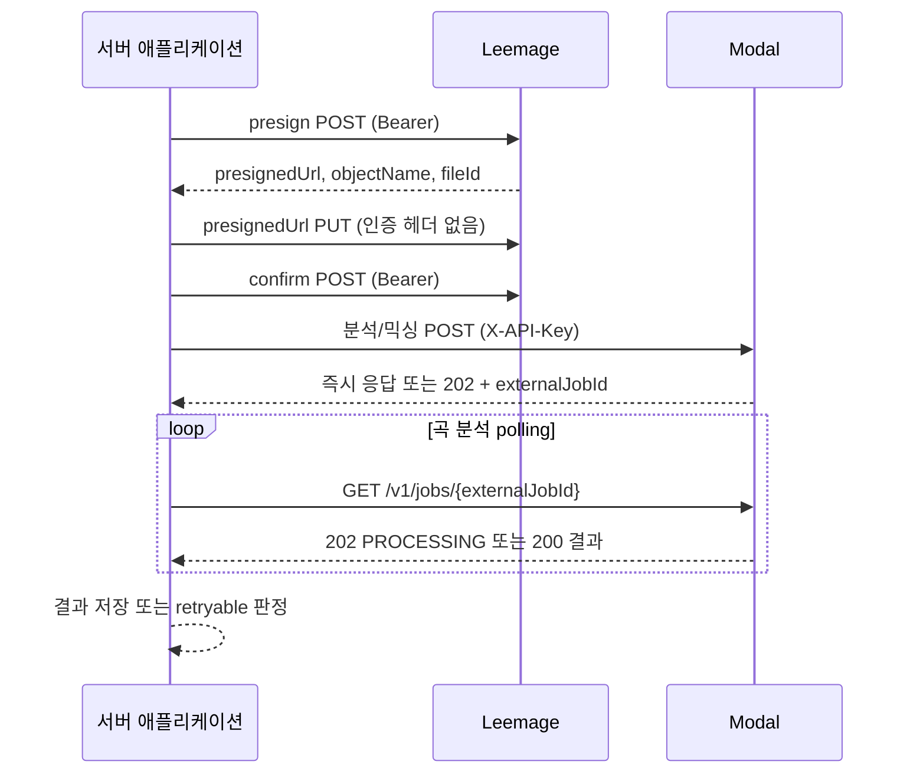

# Better Auth·Leemage·Modal 외부 서비스 계약

외부 계약을 바꿀 때는 **서버가 어떤 인증 헤더와 payload를 보내고, 어떤 상태를 저장하며, 실패를 재시도할 수 있는지**부터 확인하세요. 브라우저에는 OAuth 이동만 허용하고 Leemage·Modal의 키와 호출은 서버에 남겨야 해요. 아래 표와 흐름을 기준으로 변경 범위를 잡은 뒤 관련 변경 범위 테스트를 실행하세요.

[Leemage 요청과 재시도 구현](repo://src/shared/media/client.ts#L21-L105)과 [곡 분석 Modal API](repo://services/song-catalog-analyzer/modal_app.py#L259-L320)가 이 계약을 추적하기 좋은 정규 소스예요.

## 외부 호출 순서와 시간 경계

Leemage API 요청에는 metadata 시간 제한이 적용되고 파일 `PUT`에는 별도 파일 시간 제한이 적용돼요. 보컬 분석 요청은 120초, health 확인은 10초, SoulX reference 다운로드는 60초, 믹싱 제출은 120초 제한을 사용해요. 곡 분석 워커는 설정된 `SONG_ANALYSIS_POLL_INTERVAL_MS`만큼 기다렸다가 다시 조회하고, 작업 lease가 만료되거나 최대 시도를 넘으면 계속 외부 호출하지 않아요.

## Better Auth와 Google OAuth

Better Auth는 `BETTER_AUTH_URL`을 기본 URL로 사용하고 PostgreSQL Prisma 어댑터에 사용자와 세션을 저장해요. 이메일·비밀번호 로그인은 꺼져 있고 Google만 `openid`, `email`, `profile` 범위로 등록돼 있어요. 새 사용자가 만들어진 뒤 `ensureSignupTicketGrants` 훅이 가입 티켓 지급을 보장해요.

| 환경 변수 | 규칙 | 용도 |
|---|---|---|
| `BETTER_AUTH_URL` | 설정 객체는 `http://localhost:3000`으로 fallback하지만 `googleAuthConfigured()`는 실제 설정값을 요구해요. | Better Auth `baseURL` |
| `BETTER_AUTH_SECRET` | `development`·`test`만 개발용 fallback을 허용하고, 그 밖의 환경에서는 필수예요. | 세션·토큰 서명 |
| `GOOGLE_CLIENT_ID` | 실제 값이 있어야 Google 구성이 완료돼요. | OAuth client ID |
| `GOOGLE_CLIENT_SECRET` | 실제 값이 있어야 Google 구성이 완료돼요. | OAuth client secret |

OAuth client secret과 `BETTER_AUTH_SECRET` 값 자체는 문서나 클라이언트 코드에 넣지 말고 서버 환경에만 설정하세요. 인증 구현은 [`src/features/authentication/api/auth.ts`](repo://src/features/authentication/api/auth.ts#L9-L49), secret 정책은 [`src/features/authentication/model/auth-secret-policy.ts`](repo://src/features/authentication/model/auth-secret-policy.ts#L6-L12)에서 확인하세요.

## Leemage 파일 저장과 정리

`LeemageClient.uploadFile`은 아래 세 단계를 순서대로 수행해요.

1. `POST /projects/{projectId}/files/presign`에 `fileName`, `contentType`, `fileSize`를 Bearer 인증으로 보내요.
2. 응답의 `presignedUrl`에 인증 헤더 없이 `PUT`하고 `Content-Type`만 원래 MIME 타입으로 보내요.
3. `POST /projects/{projectId}/files/confirm`에 `fileId`, `objectName`, 파일 메타데이터를 Bearer 인증으로 보내요.

confirm 응답의 `file.id`는 presign의 `fileId`와 같아야 해요. 최종 결과에는 `projectId`, `fileId`, `url`, `fileName`, `mimeType`, `sizeBytes`가 들어가고, 삭제는 `DELETE /projects/{projectId}/files/{fileId}`를 사용해요.

`LEEMAGE_BASE_URL`은 기본값 `https://leemage.leey00nsu.com/api/v1`을 사용하고 끝의 `/`를 제거해요. `LEEMAGE_API_KEY`와 `LEEMAGE_PROJECT_ID`는 필수예요. API 요청은 `Authorization: Bearer ...`를 붙여요.

네트워크 오류와 `429`, `5xx`는 기본적으로 최대 3회까지 재시도하지만 **POST presign·confirm은 최대 1회**예요. `Retry-After`가 숫자면 최대 5초로 제한하고, 아니면 지수 지연을 사용해요. 서버 API가 최종 실패하면 `LeemageError`의 `status`와 `retryable`을 보존해요. presign·confirm 필수 필드가 없거나 confirm identity가 다르면 상태 502의 재시도 불가 오류예요. presigned `PUT`은 내부 재시도가 없고 5xx만 `retryable`로 표시해요. [Leemage client 테스트](repo://tests/leemage-client.test.ts#L6-L72)로 요청 순서와 헤더를 확인하세요.

## Modal 공통 인증과 설정

Modal 웹 함수는 `SOULX_API_KEY`와 요청의 `X-API-Key`를 constant-time 비교해요. 서버 키가 없으면 `503 Server API key is not configured`, 없거나 다른 키면 `401 Invalid API key`예요. 키는 `SOULX_API_KEY`를 직접 기록하지 말고 Modal Secret `soulx-api-secret`과 서버 환경 설정으로 주입하세요.

| 연동 | URL | API 키 | 주요 표면 |
|---|---|---|---|
| 보컬 분석 | `VOCAL_PROFILE_MODAL_URL` | `VOCAL_PROFILE_MODAL_API_KEY` → `MODAL_API_KEY` fallback | `POST /v1/analyze`, `GET /health` |
| 곡 분석 | `SONG_ANALYSIS_MODAL_URL` | `SONG_ANALYSIS_MODAL_API_KEY` → `MODAL_API_KEY` fallback | `POST /v1/jobs`, `GET /v1/jobs/{externalJobId}`, `DELETE /v1/jobs/{externalJobId}` |
| SoulX 믹싱 | `MODAL_API_URL` | `MODAL_API_KEY` | `POST /v1/conversions`, 상태·WAV·삭제 |

URL 끝의 `/`는 제거해요. URL이나 키가 없으면 보컬 분석은 `ANALYZER_NOT_CONFIGURED`와 503으로, SoulX 서버 프록시는 사용자용 503으로 중단돼요.

## 보컬 분석 payload와 응답 검증

서버는 `POST {VOCAL_PROFILE_MODAL_URL}/v1/analyze`에 원본 multipart body와 `Content-Type`, `X-Recording-ID`, `X-API-Key`를 보내요. Modal은 25 MB 이하 입력과 UUID 형식 recording ID를 요구하고, `transportVersion: "modal-analysis-envelope-v1"`인 JSON envelope를 반환해요.

응답에는 `profile`과 source artifact가 오고, 선택적으로 synthesis reference artifact가 와요. 각 artifact의 `fileName`, `mimeType`, `sizeBytes`, `sha256`, `contentBase64`를 검증하세요. 클라이언트는 `cleanupConfirmed: true`, base64 디코딩 결과의 크기·SHA-256, profile의 recording ID·MIME·크기를 확인해요. 불일치 응답은 `ANALYZER_INVALID_RESPONSE`로 거부해요. `401/403`은 재시도 불가 `ANALYZER_AUTH_FAILED`, `429`는 재시도 가능한 `ANALYZER_BUSY`(503), `5xx`는 `ANALYZER_UNAVAILABLE`, 시간 초과는 `ANALYZER_TIMEOUT`으로 변환돼요. 요청 제한은 [Modal 어댑터](repo://src/entities/vocal-profile/api/analyzer/modal-adapter.ts#L13-L18)와 [응답 검증](repo://src/entities/vocal-profile/api/analyzer/modal-adapter.ts#L88-L153)을 함께 확인하세요.

## 곡 분석의 비동기 상태와 재사용

곡 분석 워커는 `READY` 상태인 Leemage catalog target을 먼저 60초 제한으로 내려받아요. 그런 다음 `requestId`, 11자리 YouTube `sourceVideoId`, 오디오 bytes와 파일명을 multipart `POST /v1/jobs`로 보내고 반환된 `externalJobId`를 저장해요. 같은 `requestId`와 다른 입력이면 Modal은 409 `IDEMPOTENCY_CONFLICT`로 거부하고, 같은 입력이면 기존 작업 ID를 재사용할 수 있어요. 제출 결과가 아직 확정되지 않았으면 503 `SUBMISSION_UNKNOWN`과 재시도 지시를 반환해요.

Modal은 `.m4a`, `.mp3`, `.mp4`, `.wav`, `.webm`만 허용하고 오디오는 100 MB 이하여야 해요. 빈 오디오, 잘못된 request ID·video ID·확장자는 422이며 payload 초과는 413이고 모두 재시도하지 않아요. 처리 중에는 202 `PROCESSING`, 성공은 200 `SUCCEEDED`예요. Modal 결과가 만료되면 410 `MODAL_RESULT_EXPIRED`, 분석 예외면 200 `MODAL_ANALYSIS_FAILED`이며 두 응답은 `retryable: true`를 포함해요. 워커의 lease·polling·결과 저장 순서는 [`song-analysis/worker.ts`](repo://src/_app/background-jobs/song-analysis/worker.ts#L139-L229), Modal 상태 표면은 [`modal_app.py`](repo://services/song-catalog-analyzer/modal_app.py#L259-L320)에서 확인하세요.

| 설정 | 기본값 | 허용 범위 |
|---|---:|---:|
| `SONG_ANALYSIS_WORKER_CONCURRENCY` | 1 | 1–8 |
| `SONG_ANALYSIS_LEASE_SECONDS` | 300초 | 180–3,600초 |
| `SONG_ANALYSIS_POLL_INTERVAL_MS` | 2,500ms | 250–30,000ms |

## SoulX 믹싱 입력과 수명 주기

서버는 저장된 vocal reference를 먼저 60초 제한으로 내려받고 `prompt_audio`, 사용자가 올린 `target_audio`, preset 값을 multipart `POST {MODAL_API_URL}/v1/conversions`에 보내요. prompt는 128 MB, target은 256 MB까지예요. 기본 preset은 `prompt_vocal_separation=false`, `target_vocal_separation=true`, `auto_pitch_shift=true`, `auto_mix_accompaniment=true`, `pitch_shift=0`, `steps=32`, `cfg=1.0`, `seed=42`이고 범위 검증을 거쳐요.

Modal은 202와 `queued` 작업 ID를 반환해요. 상태는 `queued`·`processing`·`succeeded`·`failed`이고, 성공 뒤 `GET /v1/conversions/{jobId}/audio`에서 WAV를 받아요. 성공 전 오디오 요청은 409이고 파일이 만료되면 410이에요. `DELETE /v1/conversions/{jobId}`는 진행 중 호출을 취소하고 입력·결과 파일과 작업 인덱스를 삭제해요. 요청 ID가 있으면 동일 입력을 재제출할 때 기존 작업을 재사용하고, 다른 입력이면 409 `IDEMPOTENCY_CONFLICT`예요.

작업과 결과는 `soulx-singer-jobs` Volume에, 모델은 `soulx-singer-models` Volume에 저장돼요. 작업은 24시간 뒤 매일 `17 3 * * *` 정리돼요. `SOULX_GPU` 기본값은 `L4`, `SOULX_MAX_CONTAINERS`는 `1`, `SOULX_SCALEDOWN_WINDOW`는 `60`이에요. 모델이 없으면 `modal run modal_app.py::setup`으로 준비하세요. 서버 프록시의 timeout·범위 헤더 전달은 [`admin-custom-mixing/api/modal.ts`](repo://src/features/admin-custom-mixing/api/modal.ts#L19-L121), Modal 저장·정리는 [`soulx-singer-svc/modal_app.py`](repo://services/soulx-singer-svc/modal_app.py#L218-L405)에서 확인하세요.

## 변경 전 다음 행동

1. 계약 변경에서 인증 헤더, 입력 필드, 응답 상태, 재시도 가능 여부를 먼저 표로 대조하세요.
2. Leemage 업로드 순서를 바꾸면 `tests/leemage-client.test.ts`를 실행하세요.
3. 보컬 envelope와 무결성 검증을 바꾸면 `tests/vocal-profile-analyzer-adapter.test.ts`를 실행하세요.
4. 믹싱 lease·복구 흐름은 [믹싱과 복구](../workflows/mixing-and-recovery.md), 분석 흐름은 [보컬 분석](../workflows/vocal-analysis.md)과 [추천·카탈로그](../workflows/recommendations-and-catalog.md)에서 이어서 확인하세요. 시스템 경계는 [시스템 경계](../architecture/system-boundaries.md), 설정값은 [구성과 런타임](../operations/configuration-and-runtime.md), 저장 모델은 [도메인 데이터 모델](../concepts/domain-data-model.md)에서 확인하세요.
