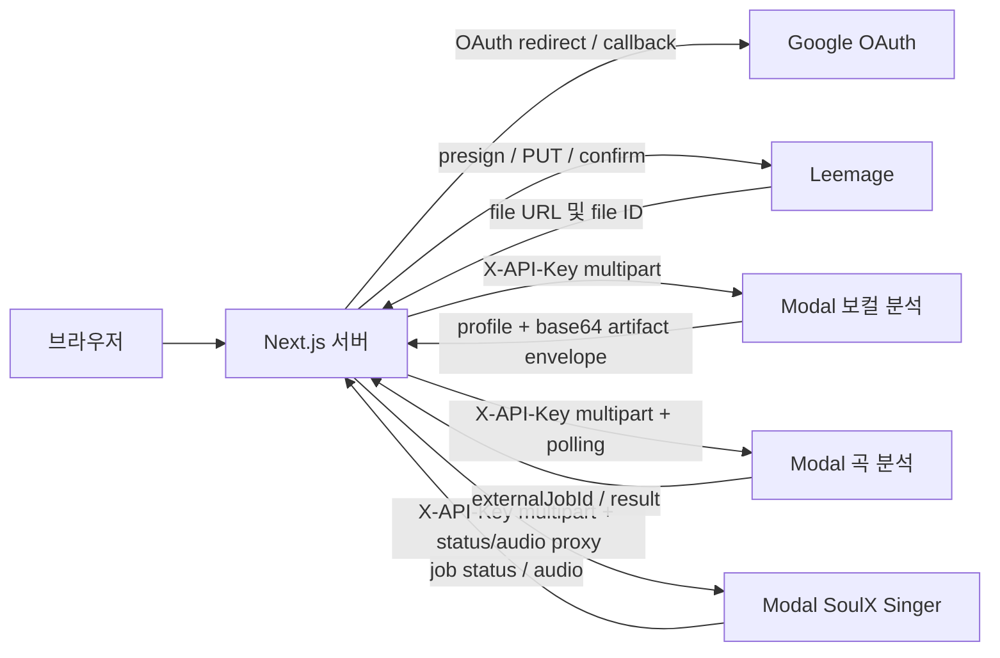

# Google OAuth·Leemage·Modal 연동 계약

이 페이지에서 확인할 핵심은 **외부 서비스 호출은 서버 경계에서만 일어나고, 각 서비스의 실패를 애플리케이션 계약으로 변환한다는 점**이에요. Google은 Better Auth의 소셜 로그인 공급자이고, Leemage는 서버 전용 파일 저장소이며, Modal은 보컬·곡 분석과 SoulX 음성 변환을 실행해요. 연결이 필요한 작업을 시작하기 전에 아래 환경 변수를 설정하고, 성공 응답과 `retryable` 또는 HTTP 상태를 함께 확인하세요.

[Better Auth 설정과 Google 공급자](repo://src/features/authentication/api/auth.ts#L9-L41)와 [Modal 보컬 분석 어댑터](repo://src/entities/vocal-profile/api/analyzer/modal-adapter.ts#L34-L45)가 애플리케이션 쪽의 주요 추적 소스예요.

## 외부 경계와 데이터 흐름

애플리케이션은 브라우저에 Modal 또는 Leemage API 키를 노출하지 않아요. 서버 코드가 `X-API-Key` 또는 `Authorization: Bearer ...`를 붙이고, 필요한 경우 외부 응답을 내부 API 응답으로 전달해요.

## Google OAuth 로그인

Better Auth는 `BETTER_AUTH_URL`을 기본 URL로 사용하고 PostgreSQL Prisma 어댑터에 세션·사용자 데이터를 저장해요. 이메일·비밀번호 로그인은 꺼져 있고 Google 공급자만 `openid`, `email`, `profile` 범위로 등록돼 있어요. 새 사용자가 만들어지면 `databaseHooks.user.create.after`에서 가입 티켓 지급도 실행해요.

| 환경 변수 | 필수 여부와 fallback | 사용처 |
|---|---|---|
| `BETTER_AUTH_URL` | 운영 설정에 필요해요. 설정 객체에서는 `http://localhost:3000`으로 fallback해요. `googleAuthConfigured()`는 실제 값이 있어야 구성 완료로 판단해요. | Better Auth `baseURL` |
| `BETTER_AUTH_SECRET` | development·test에서는 내장 개발용 fallback이 있고, 그 밖의 환경에서는 필수예요. | 세션·토큰 서명 |
| `GOOGLE_CLIENT_ID` | Google 로그인 구성에 필수예요. 미설정 시 설정 객체에 빈 문자열이 들어가고 `googleAuthConfigured()`는 false를 반환해요. | Google OAuth client ID |
| `GOOGLE_CLIENT_SECRET` | Google 로그인 구성에 필수예요. 미설정 시 설정 객체에 빈 문자열이 들어가고 `googleAuthConfigured()`는 false를 반환해요. | Google OAuth client secret |

인증 엔드포인트의 라우트 연결은 [`app/api/auth/[...all]/route.ts`](repo://app/api/auth/[...all]/route.ts)에서 확인하세요. 이 파일의 세부 동작을 확인할 수 없으면 인증 공급자 설정의 근거로 [`src/features/authentication/api/auth.ts`](repo://src/features/authentication/api/auth.ts)를 우선 사용하세요.

## Leemage 파일 저장

서버 전용 `LeemageClient`는 파일을 바로 Leemage API로 보내지 않고 세 단계로 저장해요.

1. `POST /projects/{projectId}/files/presign`에 `fileName`, `contentType`, `fileSize`를 보내 presigned URL, `objectName`, `fileId`를 받아요.
2. presigned URL에 인증 헤더 없이 `PUT`하고, `Content-Type`만 원래 MIME 타입으로 보내요.
3. `POST /projects/{projectId}/files/confirm`에 `fileId`, `objectName`, 파일 메타데이터를 보내 최종 `file.id`와 `file.url`을 받아요.

성공한 결과는 `projectId`, `fileId`, `url`, `fileName`, `mimeType`, `sizeBytes`예요. 삭제는 `DELETE /projects/{projectId}/files/{fileId}`를 사용해요. 애플리케이션 데이터베이스는 이 외부 식별자와 URL을 미디어 자산의 참조로 사용할 수 있어요.

| 환경 변수 | 필수 여부와 fallback | 전송 계약 |
|---|---|---|
| `LEEMAGE_BASE_URL` | 선택이에요. 기본값은 `https://leemage.leey00nsu.com/api/v1`이고 끝의 `/`는 제거해요. | API 기본 URL |
| `LEEMAGE_API_KEY` | 필수예요. 없으면 클라이언트 생성 시 재시도하지 않는 `LeemageError`가 나요. | API 요청의 Bearer 인증 |
| `LEEMAGE_PROJECT_ID` | 필수예요. 없으면 클라이언트 생성 시 재시도하지 않는 `LeemageError`가 나요. | 프로젝트 경로 |

네트워크 오류와 HTTP `429`, `5xx`는 최대 3회까지 재시도해요. `Retry-After`가 숫자면 최대 5초로 제한해 사용하고, 그 밖에는 지수 지연을 사용해요. 최종 실패는 `LeemageError`로 전달되며 `status`와 `retryable`을 보존해요. presign·confirm 응답의 필수 필드가 빠지면 HTTP 502 성격의 재시도 불가 오류로 취급해요. 객체 `PUT` 자체는 내부 재시도하지 않으므로 실패 상태와 `retryable`을 호출자가 판단해야 해요. 동작 검증은 [`tests/leemage-client.test.ts`](repo://tests/leemage-client.test.ts#L6-L72)를 참고하세요.

## Modal 공통 인증과 헬스 확인

Modal의 웹 함수는 `soulx-api-secret`을 주입받고, 런타임의 `SOULX_API_KEY`와 요청의 `X-API-Key`를 비교해요. 키가 서버에 없으면 `503 Server API key is not configured`, 키가 다르면 `401 Invalid API key`를 반환해요. 따라서 애플리케이션 쪽의 Modal URL과 키는 서버 환경에만 설정하세요.

| 연동 | URL 변수 | API 키 변수와 fallback | 주요 엔드포인트 |
|---|---|---|---|
| 보컬 분석 | `VOCAL_PROFILE_MODAL_URL` | `VOCAL_PROFILE_MODAL_API_KEY`, 없으면 `MODAL_API_KEY` | `POST /v1/analyze`, `GET /health` |
| 곡 분석 | `SONG_ANALYSIS_MODAL_URL` | `SONG_ANALYSIS_MODAL_API_KEY`, 없으면 `MODAL_API_KEY` | `POST /v1/jobs`, `GET /v1/jobs/{externalJobId}`, `GET /health` |
| SoulX 믹싱 | `MODAL_API_URL` | `MODAL_API_KEY` | `POST /v1/conversions`, 상태·오디오 조회, 삭제 |

보컬 분석과 곡 분석 URL은 끝의 `/`를 제거해요. 보컬 분석 설정이 없으면 `ANALYZER_NOT_CONFIGURED`와 HTTP 503을 만들고, 곡 분석 워커도 설정이 없으면 `ANALYZER_NOT_CONFIGURED`로 작업을 실패 또는 재시도 흐름에 넘겨요. SoulX 커스텀 믹싱은 URL 또는 키가 없을 때 사용자용 HTTP 503을 반환해요.

## 보컬 분석 계약

애플리케이션은 `POST {VOCAL_PROFILE_MODAL_URL}/v1/analyze`에 원본 multipart body를 스트리밍하고 `Content-Type`, `X-Recording-ID`, `X-API-Key`를 보내요. 요청 제한은 Modal 서비스에서 25 MB이고, `X-Recording-ID`는 UUID여야 해요. 선택 입력으로 `preset`, 멜로디·글리산도 구간, `trim_to_max_duration`을 보낼 수 있어요.

Modal은 `transportVersion: "modal-analysis-envelope-v1"`인 JSON envelope를 반환해요. `profile`에는 recording ID, 오디오 메타데이터, MIDI 범위·분포, 음성 비율·피치 안정성·클리핑·RMS, 분석기와 descriptor가 들어가요. 선택적인 `synthesisReference` 메타데이터와 `artifacts.source`, `artifacts.synthesisReference`가 함께 올 수 있어요. 각 artifact는 `fileName`, `mimeType`, `sizeBytes`, `sha256`, `contentBase64`를 포함해요.

클라이언트는 transport 버전과 `cleanupConfirmed: true`를 먼저 확인하고, base64를 디코딩한 뒤 크기와 SHA-256을 검증해요. source artifact의 MIME·크기는 profile과 일치해야 하고, synthesis reference가 profile에 없는데 artifact만 오거나 그 반대여도 `ANALYZER_INVALID_RESPONSE`로 거부해요. recording ID가 다르면 `ANALYSIS_FAILED`예요. Modal의 `401/403`은 `ANALYZER_AUTH_FAILED`(재시도 불가), `429`는 `ANALYZER_BUSY`(HTTP 503), `5xx`는 `ANALYZER_UNAVAILABLE`로 변환해요. timeout은 `ANALYZER_TIMEOUT`으로 변환하고 재시도 가능으로 표시해요.

## 곡 분석 비동기 작업

곡 분석 워커는 READY 상태의 Leemage catalog target을 먼저 내려받고, `requestId`·11자리 YouTube `sourceVideoId`·오디오 파일을 `POST /v1/jobs`로 보낸 뒤 `externalJobId`를 작업 행에 저장해요. Modal은 중복 `requestId`를 받으면 기존 작업 ID와 `reused: true`를 돌려줄 수 있어요. 워커는 설정된 `SONG_ANALYSIS_POLL_INTERVAL_MS` 간격으로 상태를 조회하고, 성공 결과를 `songAnalysis`에 저장해요.

Modal은 지원 확장자를 `.m4a`, `.mp3`, `.mp4`, `.wav`, `.webm`으로 제한하고 100 MB를 초과하면 `PAYLOAD_TOO_LARGE`와 HTTP 413을 반환해요. 잘못된 request ID·video ID·빈 오디오는 HTTP 422이고 모두 재시도하지 않아요. 처리 중에는 HTTP 202 `PROCESSING`, 성공은 HTTP 200 `SUCCEEDED`, 결과 만료는 HTTP 410 `MODAL_RESULT_EXPIRED`(재시도 가능), 그 밖의 분석 예외는 HTTP 200 `MODAL_ANALYSIS_FAILED`(재시도 가능)예요. 애플리케이션의 submit·poll 응답 스키마와 변환은 [`src/features/manage-song-catalog/api/analyzer.ts`](repo://src/features/manage-song-catalog/api/analyzer.ts#L27-L138)에서 확인하세요.

| 환경 변수 | 기본값 | 허용 범위 |
|---|---:|---:|
| `SONG_ANALYSIS_WORKER_CONCURRENCY` | 1 | 1–8 |
| `SONG_ANALYSIS_LEASE_SECONDS` | 300초 | 180–3,600초 |
| `SONG_ANALYSIS_POLL_INTERVAL_MS` | 2,500ms | 250–30,000ms |
| `SONG_ANALYSIS_MODAL_URL` | 없음 | 키와 함께 설정해야 활성화 |
| `SONG_ANALYSIS_MODAL_API_KEY` | `MODAL_API_KEY` fallback | 전용 키가 우선이에요 |

## SoulX 믹싱 계약

서버는 먼저 저장된 vocal reference URL을 내려받고, `prompt_audio`와 사용자가 올린 `target_audio`를 multipart로 `POST {MODAL_API_URL}/v1/conversions`에 보내요. 기본 preset은 `prompt_vocal_separation=false`, `target_vocal_separation=true`, `auto_pitch_shift=true`, `auto_mix_accompaniment=true`, `pitch_shift=0`, `steps=32`, `cfg=1.0`, `seed=42`이고 각 값에는 코드의 범위 검증이 적용돼요. prompt는 128 MB, target은 256 MB까지예요.

Modal은 `queued` 작업과 `id`, 상태 조회용 결과 URL을 HTTP 202로 반환해요. `GET /v1/conversions/{jobId}`는 `queued`·`processing`·`succeeded`·`failed` 상태를 제공하고, 성공 작업의 오디오는 `GET /v1/conversions/{jobId}/audio`에서 WAV로 받아요. 아직 성공하지 않은 오디오 요청은 HTTP 409이고, 결과 파일이 만료되면 HTTP 410이에요. `DELETE`는 진행 중인 Modal 호출을 취소한 뒤 입력·결과 파일과 작업 인덱스를 지워요. Modal의 입력·결과 파일은 24시간 뒤 정리돼요.

Modal 웹 함수는 `SOULX_GPU` 기본값 `L4`, `SOULX_MAX_CONTAINERS` 기본값 `1`, `SOULX_SCALEDOWN_WINDOW` 기본값 `60`을 사용해요. 모델 가중치는 `soulx-singer-models` Volume에 내려받고, 작업 오디오는 `soulx-singer-jobs` Volume에 저장해요. 가중치가 없으면 `modal run modal_app.py::setup` 실행이 필요하다는 런타임 오류가 나므로 배포 전에 모델 준비 상태를 확인하세요. 서버 프록시의 요청·응답 전달은 [`src/features/admin-custom-mixing/api/modal.ts`](repo://src/features/admin-custom-mixing/api/modal.ts#L43-L111), Modal의 수명 주기와 정리는 [`services/soulx-singer-svc/modal_app.py`](repo://services/soulx-singer-svc/modal_app.py#L220-L360)에서 확인하세요.

## 변경 전 확인할 테스트와 다음 문서

- Leemage 요청 순서와 Bearer 헤더 경계를 바꾸면 [`tests/leemage-client.test.ts`](repo://tests/leemage-client.test.ts)를 실행하세요.
- 보컬 envelope, artifact 무결성, HTTP 오류 매핑을 바꾸면 [`tests/vocal-profile-analyzer-adapter.test.ts`](repo://tests/vocal-profile-analyzer-adapter.test.ts)를 실행하세요.
- private audio proxy가 URL·범위·권한을 전달하는 방식을 바꾸면 [`tests/private-audio-proxy.test.ts`](repo://tests/private-audio-proxy.test.ts)를 실행하세요.
- 작업 lease·재시도와 저장 모델의 관계는 [믹싱과 복구](../workflows/mixing-and-recovery.md), [보컬 분석 흐름](../workflows/vocal-analysis.md), [시스템 경계](../architecture/system-boundaries.md), [구성과 런타임](../operations/configuration-and-runtime.md), [도메인 데이터 모델](../concepts/domain-data-model.md)에서 이어서 확인하세요.
