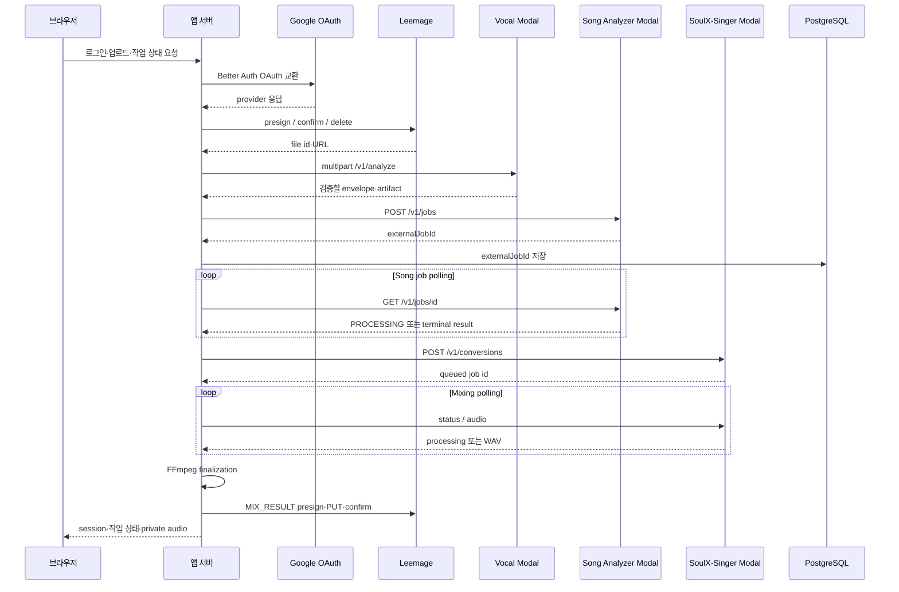
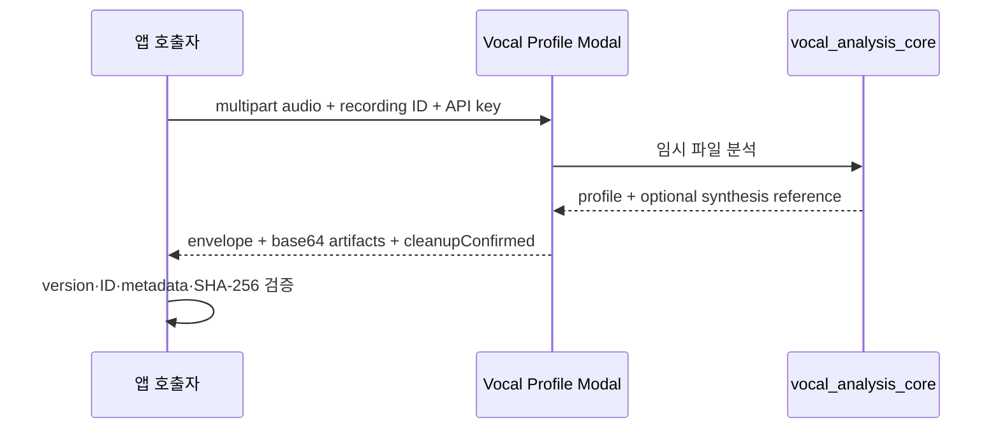
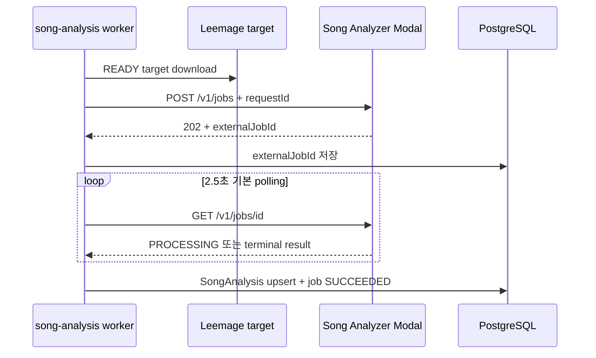
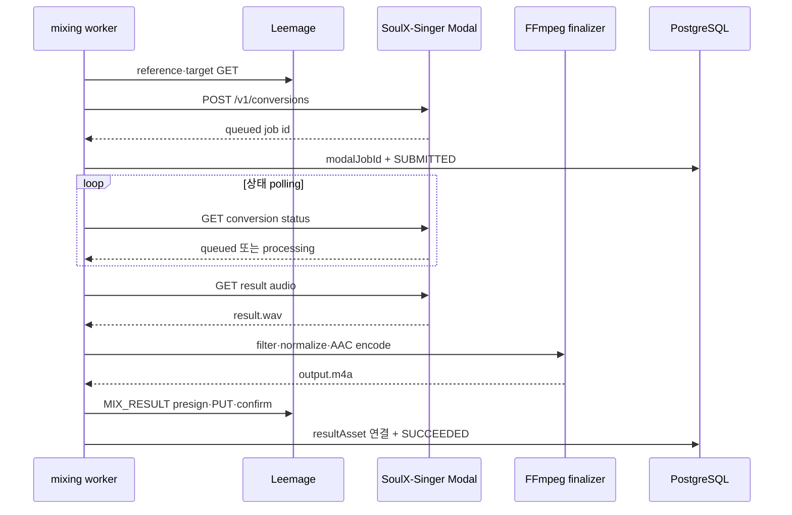

# 외부 서비스 연동 계약

이 페이지는 외부 endpoint의 실제 값이 아니라 앱 서버가 외부 서비스와 맺는 계약을 설명한다. 브라우저는 외부 API key를 보지 않으며, 서버 worker 또는 `server-only` 모듈이 외부 호출과 응답 검증을 맡는다. 작업형 연동은 내부 DB job이 외부 job ID를 보존하므로 worker가 중단되어도 제출 이후 상태 조회를 이어 간다.

## 연동 한눈에 보기

| 연동 | 호출 방향과 transport | 동기성 | 외부 식별자·artifact handoff | 실패·partial failure 경계 |
|---|---|---|---|---|
| Google OAuth | 앱 서버의 Better Auth가 Google social provider와 OAuth 교환 | 인증 요청은 OAuth 흐름 | Better Auth session을 PostgreSQL에 저장 | 필수 설정이 없으면 UI가 시작을 막고, provider 오류는 로그인 실패 |
| Leemage | 서버 API `presign` → presigned URL `PUT` → `confirm` | 파일 업로드 요청은 순차식 | `externalProjectId`, `externalFileId`, URL을 `MediaAsset`에 저장 | API 429/5xx·네트워크는 최대 3회 재시도. 객체 삭제 실패는 `DELETE_PENDING`으로 보류 |
| Vocal Profile Modal | 앱 adapter가 multipart `POST /v1/analyze` | 동기 HTTP. Modal Function job polling 아님 | `modal-analysis-envelope-v1` 안의 profile과 base64 source/reference artifact | envelope·hash·metadata 불일치는 계약 오류. 인증 실패는 비재시도, timeout/429/5xx는 재시도 가능 |
| Song Catalog Analyzer Modal | worker가 `POST /v1/jobs` 후 `GET /v1/jobs/{externalJobId}` polling | 비동기 job | Modal `FunctionCall` ID를 `SongAnalysisJob.externalJobId`에 저장. metrics를 `SongAnalysis`로 upsert | 처리 중 202, 만료 410, 실패 payload의 `retryable`을 내부 재시도 정책에 전달 |
| SoulX-Singer Modal | worker가 두 multipart audio를 `POST /v1/conversions`에 제출하고 상태·결과를 polling | 비동기 job | SoulX job ID를 `MixingJob.modalJobId`에 저장. WAV는 FFmpeg finalization 후 Leemage `MIX_RESULT` | 제출 전 실패는 환불 가능. 제출 후에는 같은 ID를 조회하며 자동 환불하지 않음 |
| FFmpeg | 앱 worker가 변환 결과 bytes를 임시 파일로 넘겨 CLI 실행 | 외부 job 없음. 결과 확정 전 동기 실행 | 입력 audio → `output.m4a` (`audio/mp4`) → Leemage 저장 | 프로세스 실패는 finalization 실패. 임시 디렉터리는 성공·실패 모두 정리 |

이 그림에서 DB는 외부 서비스의 job 상태를 대신 저장하지 않는다. worker가 lease와 heartbeat를 갱신하고, 저장된 외부 ID로 원격 상태를 재조회한다.

## 자격 증명과 설정 경계

Google client secret, Leemage bearer key, Modal `X-API-Key`는 서버 환경에서만 읽는다. Google 설정은 `BETTER_AUTH_SECRET`, `BETTER_AUTH_URL`, `GOOGLE_CLIENT_ID`, `GOOGLE_CLIENT_SECRET`가 모두 있을 때만 `googleAuthConfigured()`가 true가 된다. UI는 이 boolean을 사용해 설정되지 않은 환경에서 로그인 버튼을 비활성화한다. Better Auth는 PostgreSQL Prisma adapter를 사용하고 email/password 로그인은 끈 상태다. 새 user 생성 후에는 가입 ticket grant hook을 실행한다.

Leemage는 `LEEMAGE_API_KEY`, `LEEMAGE_PROJECT_ID`를 필수로 검증하고 `LEEMAGE_BASE_URL`은 선택값이며 기본 base URL이 있다. 보컬 Modal adapter는 `VOCAL_PROFILE_MODAL_URL`과 `VOCAL_PROFILE_MODAL_API_KEY`를 우선 사용하고, key만 `MODAL_API_KEY`로 fallback한다. 곡 분석은 `SONG_ANALYSIS_MODAL_URL`과 `SONG_ANALYSIS_MODAL_API_KEY`를 우선하고 key를 `MODAL_API_KEY`로 fallback한다. mixing worker는 `MODAL_API_URL`, `MODAL_API_KEY`를 사용한다. Modal 서비스 내부에서는 secret에 주입된 `SOULX_API_KEY`를 검증한다.

구체적인 배포 URL, key, OAuth client 값은 저장소나 로그에 문서화하지 않는다. 배포 환경의 필수값과 검증 경계는 [configuration-and-deployment](/openwiki/operations/configuration-and-deployment.md)에서 함께 확인한다.

## Google OAuth: Better Auth가 세션의 소유자

앱은 Better Auth의 Google social provider에 `openid`, `email`, `profile` scope를 등록한다. OAuth callback과 provider credential은 서버 설정인 `BETTER_AUTH_URL` 및 Google client 설정에 종속된다. 성공하면 Better Auth가 session과 account를 DB에 기록하고, 신규 user hook이 가입 ticket을 부여한다. 브라우저의 `google-sign-in.tsx`는 서버가 전달한 구성 가능 여부만 표시한다.

OAuth 자체에는 이 앱이 관리하는 외부 job ID나 media artifact가 없다. 그러므로 OAuth 실패를 background retry queue로 보내지 않는다. 설정 누락은 시작 전 차단하고, provider 교환 실패는 사용자가 다시 로그인해야 하는 인증 실패로 처리한다.

## Leemage: presigned object와 자산 수명

`LeemageClient.uploadFile`은 다음 순서를 지킨다.

1. 프로젝트의 `/files/presign`에 파일명, MIME type, 크기를 서버 API key와 함께 보낸다.
2. 응답의 `presignedUrl`, `objectName`, `fileId`가 문자열인지 검증한다.
3. presigned URL에는 API key를 붙이지 않고 audio bytes를 `PUT`한다.
4. `/files/confirm`에 allocation 정보를 보내고 응답의 외부 file ID와 URL을 검증한다.
5. media service가 provider·project/file ID·URL·MIME type·크기를 내부 `MediaAsset`에 저장한다. reference, `SYNTHESIS_REFERENCE`, `MIX_RESULT`는 별도 kind로 구분한다.

서버 API 요청은 네트워크 오류와 429/5xx에 최대 3회 시도한다. `Retry-After`가 숫자면 최대 5초, 아니면 지수 지연을 최대 2초로 제한한다. 429를 제외한 4xx와 presign/confirm schema 오류는 재시도하지 않는다. presigned object `PUT`은 공통 API 재시도 루프 밖에 있으므로 실패하면 호출자가 전체 upload를 다시 시작해야 한다.

삭제 API가 실패하면 DB의 `MediaAsset`을 즉시 제거하지 않는다. 자산을 `DELETE_PENDING`으로 표시하고 `MediaCleanupJob(PENDING)`을 기록해 후속 worker가 삭제를 재시도한다. 성공하면 외부 객체를 지우고 asset과 cleanup record를 정리한다. 이 보류 상태가 외부 객체와 DB metadata가 잠시 어긋나는 partial failure를 복구하는 장치다.

저장된 `externalUrl`은 브라우저에 직접 넘기지 않는다. private audio proxy가 서버에서 upstream을 읽고 `Range`와 허용된 `Content-*` header만 전달·복사한다. 반환 응답은 `private, no-store`이고 upstream이 200 또는 206이 아니거나 60초 안에 응답하지 않으면 실패한다.

## Vocal Profile Modal: 동기 envelope와 artifact 무결성

`analyzeVocalProfileBytes`는 bytes를 `FormData`의 `audio` field로 만들고 adapter에 전달한다. adapter는 원본 content type, `X-Recording-ID`, `X-API-Key`를 포함한 multipart 요청을 `/v1/analyze`에 보내며 timeout은 120초다. Modal endpoint는 audio를 chunk 단위로 임시 디렉터리에 저장하고 최대 25 MB를 허용한다. `preset`, melody/glissando 구간, `trim_to_max_duration` 같은 분석 옵션도 form으로 전달할 수 있다.

Modal과 `services/vocal-analysis-core`는 같은 분석 core의 profile 계약을 사용한다. 현재 앱의 public adapter는 Modal backend를 호출한다. 따라서 “local과 Modal이 같은 결과를 보장한다”고 확대 해석하지 않는다. 코드와 adapter test가 보장하는 범위는 동일한 profile field·smart reference contract·artifact 무결성 경계다.

응답은 `modal-analysis-envelope-v1`이다. `profile`에는 `recordingId`, 원본 MIME type·크기와 pitch metrics가 들어가고, `artifacts.source`와 선택적인 `artifacts.synthesisReference`는 `contentBase64`, `sizeBytes`, `sha256`, MIME type, 파일명을 가진다. Modal은 임시 directory 정리 뒤에만 `cleanupConfirmed: true`로 응답한다. 앱 adapter는 다음을 검증한 뒤 smart reference contract를 확인한다.

- transport version과 `cleanupConfirmed`가 정확히 맞다.
- profile의 `recordingId`가 요청 ID와 같다.
- base64 decode 결과의 크기와 SHA-256이 metadata와 같다.
- source artifact metadata가 profile과 같다.
- synthesis reference가 profile에 있으면 artifact도 있어야 하며 MIME type·크기가 일치한다. 반대도 허용하지 않는다.

401/403은 `ANALYZER_AUTH_FAILED` 비재시도 오류다. 429는 `ANALYZER_BUSY`, 5xx는 `ANALYZER_UNAVAILABLE`, timeout은 `ANALYZER_TIMEOUT`으로 매핑하며 재시도 가능하다. 서비스가 `retryable: false`를 명시한 분석 거부는 다시 호출하지 않는다. 잘못된 envelope는 `ANALYZER_INVALID_RESPONSE`로 기록한다. 이 호출은 외부 job ID나 polling을 만들지 않는다.

## Song Catalog Analyzer: Modal job과 결과 수집

song-analysis worker는 `READY`인 `CatalogTargetAsset`의 Leemage URL을 서버에서 다운로드한다. `POST /v1/jobs`에는 내부 `SongAnalysisJob.id`를 `requestId`, source의 YouTube 11자리 ID를 `sourceVideoId`, target audio를 multipart로 보낸다. Modal은 같은 `requestId`가 이미 `job_index`에 있으면 기존 `FunctionCall` ID를 재사용한다. 최초 응답은 `202`와 `status: PROCESSING`, `externalJobId`, `reused`다.

Modal은 빈 입력, 100 MB 초과, 허용 suffix `.m4a`, `.mp3`, `.mp4`, `.wav`, `.webm`, 잘못된 video ID를 제출 시점에 거부한다. 실제 함수는 FFmpeg로 stereo 44.1 kHz WAV를 만들고, librosa chroma로 key를 추정한 다음 CPU Demucs `htdemucs`로 vocal stem을 분리하고 `vocal_analysis_core`로 metrics를 계산한다. 임시 directory가 남으면 `CLEANUP_FAILED`다. 외부 함수에는 Modal retry 설정도 있지만, 앱 worker는 자체 DB attempts/maxAttempts 정책을 별도로 적용한다.

worker는 제출 전에 `externalJobId`를 저장하고, 이후 `GET /v1/jobs/{id}`를 반복한다. 202는 processing, 200의 `SUCCEEDED`는 metrics 결과, 410은 `MODAL_RESULT_EXPIRED`, 실패 payload는 `reasonCode`, `detail`, `retryable`을 포함한다. 성공 시 `SongAnalysis`를 pipeline contract와 함께 upsert하고 job을 `SUCCEEDED`로 바꾼다. 실패 시 외부 ID를 비우고 retryable이면 `PENDING`으로 되돌려 5·10·20초씩 최대 60초 지연하며, 한도를 다 쓰거나 non-retryable이면 `FAILED`로 종료한다.

동시 worker는 `FOR UPDATE SKIP LOCKED`로 job을 claim하고 lease/heartbeat를 유지한다. 기본 lease와 polling 값은 `server-env.ts`의 함수가 환경값을 정수 범위로 검증해 제공한다. 이 흐름의 다음 도메인 단계는 [job-processing](/openwiki/operations/job-processing.md)과 [recommendation-to-mixing](/openwiki/workflows/recommendation-to-mixing.md)이다.

## SoulX-Singer: queued conversion, Volume, 그리고 finalizer

SoulX web endpoint는 prompt audio(최대 128 MB)와 target audio(최대 256 MB)를 chunk로 persistent job Volume에 저장한다. 이어 `SoulXModel.convert` Modal call을 spawn하고 API는 `queued` 상태의 앱 job ID를 반환한다. job metadata와 Modal call ID는 Modal `Dict`, 입력과 `result.wav`는 Volume이 소유한다. GPU 종류, container 수, scaledown window는 `SOULX_GPU`, `SOULX_MAX_CONTAINERS`, `SOULX_SCALEDOWN_WINDOW`로 조정하며 기본값은 코드에 있다. 모델 weights는 고정 revision으로 다운로드해 별도 model Volume에 commit한다. 운영자는 `modal run modal_app.py::setup`으로 준비한다.

mixing worker는 Leemage에서 reference와 `READY` target을 각각 읽어 `prompt_audio`, `target_audio` multipart로 보낸다. synthesis preset을 넣고 `auto_pitch_shift`는 `false`, `pitch_shift`는 job의 `recommendedShift`로 고정한다. 응답이 `id`와 `queued`를 함께 반환해야 `MixingJob.modalJobId`와 `SUBMITTED` 상태를 기록한다. 잘못된 submit response는 non-retryable submit 오류다.

그 뒤 worker는 같은 `modalJobId`로 상태를 polling한다. `processing`이면 heartbeat 후 대기하고, `failed`면 non-retryable job failure로 종료한다. `succeeded`가 되면 `/audio`에서 WAV를 내려받아 비어 있지 않은지 확인한다. 결과는 앱의 FFmpeg finalizer를 통과한다.

FFmpeg finalizer는 임시 directory의 `input.audio`와 `output.m4a`를 사용한다. `clarity-normal-v1` filter chain에는 high-pass, EQ, compressor, stereo 확장, `loudnorm=I=-14:LRA=11:TP=-1.0`가 포함된다. 출력은 metadata를 제거하고 stereo 44.1 kHz AAC 160k, `+faststart`의 `audio/mp4`/`m4a`다. finalizer는 성공 여부와 관계없이 임시 directory를 삭제한다. 압축 실패는 `MIXING_FINALIZATION_FAILED`로 재시도 가능하게 기록한다.

압축 결과를 Leemage `MIX_RESULT`로 저장한 뒤, worker는 한 transaction에서 `resultAssetId`, `SUCCEEDED`, 완료 시각과 성공 notification을 기록한다. 이 transaction이 실패하면 방금 만든 result asset을 폐기한다. 따라서 외부 결과 저장은 성공했지만 내부 연결에 실패한 partial failure가 고아 결과 자산으로 남지 않는다.

제출 전 reference/target 다운로드나 submit 실패는 `retryable`과 attempts에 따라 재시도한다. 최종 실패의 `refundState`는 `REQUIRED`가 되고 idempotent refund reconciliation이 처리한다. 한 번 Modal에 제출해 `modalJobId`가 생긴 뒤에는 그 ID를 보존한 `SUBMITTED` 재시도 경로로 상태와 결과를 다시 조회한다. 이 시점의 실패는 자동 환불하지 않는다. status·audio 조회의 408/425/429/5xx와 네트워크 오류는 재시도 가능하지만 Modal job 자체의 `failed`, 잘못된 submit response는 그렇지 않다.

SoulX job Volume의 입력·결과 디렉터리는 24시간 TTL cleanup cron이 제거한다. 아직 성공하지 않은 job의 audio는 status에 따라 반환되지 않으며, 성공 후 결과가 TTL로 사라지면 audio endpoint가 410을 반환한다. 삭제 endpoint는 완료·실패 외 상태의 Modal call을 취소한 뒤 Volume과 job index를 정리한다.

## 외부 경계를 바꿀 때 지켜야 할 불변식

- key는 브라우저, client response, 일반 로그에 넣지 않는다. reason code, 외부 job ID, retryable 여부만 관측 정보로 남긴다.
- presigned URL은 API key를 붙이지 않는 object `PUT`이다. `confirm` 이전에는 내부 자산을 `READY`로 만들지 않는다.
- 외부 job을 제출한 뒤에는 내부 row에 외부 ID를 먼저 보존해야 재시작 시 중복 제출을 피한다.
- artifact는 bytes, MIME type, 크기, SHA-256을 함께 검증한다. analyzer가 보고한 recording ID와 요청 ID도 일치해야 한다.
- Modal 결과를 DB에 연결하기 전에 FFmpeg finalization과 Leemage 저장을 끝낸다. DB transaction 실패 시 새 결과 asset을 폐기한다.
- 제출 전과 제출 후의 환불 의미를 섞지 않는다. 제출 후에는 원격 job을 조회해 중복 실행과 이중 환불을 피한다.

## 집중 검증 테스트

- `tests/leemage-client.test.ts`: Leemage 설정, bearer header, presign·object `PUT`·confirm 순서와 재시도 경계를 검증한다.
- `tests/leemage-media.integration.ts`: user-owned `MediaAsset`, 삭제 실패의 `DELETE_PENDING`/cleanup job, cleanup 재시도 후 정리를 검증한다.
- `tests/vocal-profile-analyzer-adapter.test.ts`: API key, envelope version/cleanup, recording ID, artifact integrity, 인증·명시적 거부·429/5xx·timeout mapping을 검증한다.
- `tests/vocal-profile-contract.test.ts` 및 `tests/vocal-profile-analysis-queue.integration.ts`: smart reference contract와 내부 분석 job persistence·retry 경계를 검증한다.
- `tests/song-analysis-modal-adapter.test.ts`: submit/poll schema, API 인증, processing·success·failure·expired 응답과 retryable reason code를 검증한다.
- `tests/song-analysis-queue.integration.ts`: 외부 ID 보존, lease를 가진 worker의 polling, 성공 upsert와 재시도 상태를 검증한다.
- `tests/compress-mixing-result.test.ts`: FFmpeg filter/finalization 출력 계약과 임시 파일 정리를 검증한다.
- `tests/admin-custom-mixing.integration.ts`: 관리자 custom mixing이 소유자 범위의 synthesis reference만 해석하고, submit 단계에서 queued Modal response를 전달하는지 검증한다.

이 테스트들은 Google·Leemage·Modal·SoulX 모델의 외부 동작이나 분석 품질 전체를 대체하지 않는다. 앱과 서비스 사이의 credential 경계, transport schema, job lifecycle, artifact handoff, 재시도와 partial failure 복구를 보호한다.
