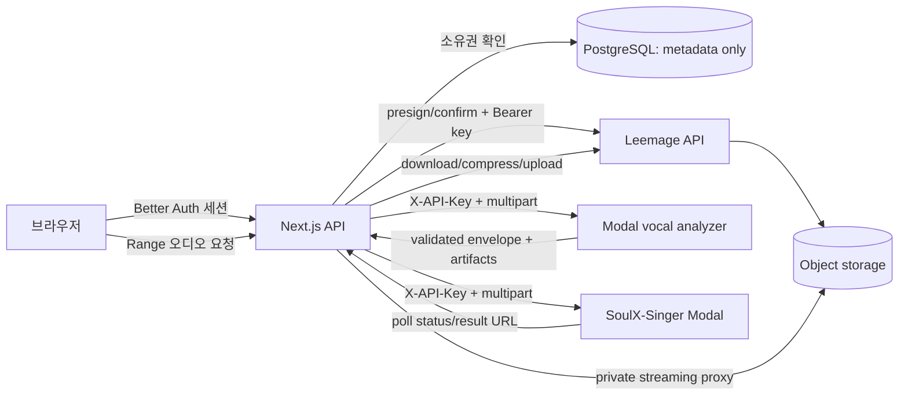

# 인증·미디어·분석 서비스 연동

이 페이지는 외부 서비스와 애플리케이션 사이에서 **누가 인증하고, 어떤 바이트가 어디로 이동하며, 무엇을 데이터베이스에 남기는지** 설명한다. 서버 전용 키는 애플리케이션 서버 또는 Modal Secret에만 둔다. 브라우저는 Better Auth 세션을 사용하고, 저장된 오디오의 외부 URL을 직접 받지 않는다.

관련 데이터 구조는 [미디어 자산 모델](repo://prisma/schema.prisma#L413-L467), 작업 흐름은 [/openwiki/workflows/vocal-analysis.md](/openwiki/workflows/vocal-analysis.md)와 [/openwiki/workflows/recommendation-and-mixing.md](/openwiki/workflows/recommendation-and-mixing.md)를 함께 본다.

## 인증: Better Auth가 세션과 Google 연결을 소유한다

`src/_app/api-routes/auth/auth-route.ts`는 Better Auth의 `toNextJsHandler(auth)`를 Next.js `GET`·`POST` 라우트로 노출한다. `auth` 설정은 Prisma PostgreSQL 어댑터를 사용하고 이메일·비밀번호 로그인은 끈 상태다. Google OAuth는 `openid`, `email`, `profile` scope로 설정된다. 새 사용자가 생성되면 `ensureSignupTicketGrants(user.id)`가 실행되어 가입 기본 권한을 만든다.

운영 설정은 `BETTER_AUTH_SECRET`, `BETTER_AUTH_URL`, `GOOGLE_CLIENT_ID`, `GOOGLE_CLIENT_SECRET`이 모두 있어야 Google 인증이 구성된 것으로 간주된다. 값 자체는 기록하지 않는다. 클라이언트는 `createAuthClient()`만 사용하며 OAuth client secret을 브라우저 코드로 가져오지 않는다.

API 라우트는 `requireApiSession(request)`로 요청 세션을 읽는다. 세션이 없으면 `401 UNAUTHENTICATED`를 반환한다. 오디오 라우트는 세션 사용자 ID를 조회 함수에 전달하므로, 인증만 통과한 다른 사용자가 프로필 ID를 알아도 자산을 얻지 못한다. 예를 들어 보컬 프로필 오디오는 `getVocalProfileReference(session.user.id, profileId)`가 소유권까지 확인한 뒤에만 프록시한다.

## Leemage: presign → 객체 PUT → confirm

애플리케이션은 오디오 바이트를 Leemage API에 서버 인증으로 등록한다. `LEEMAGE_BASE_URL`은 선택 사항이며 기본값은 코드에 정의된 Leemage API URL이다. `LEEMAGE_API_KEY`와 `LEEMAGE_PROJECT_ID`는 필수다. Leemage API 요청에는 `Authorization: Bearer <server key>`가 붙고 `cache: no-store`를 사용한다.

`LeemageClient.uploadFile()`의 순서는 다음과 같다.

1. `/projects/{projectId}/files/presign`에 파일명·content type·바이트 수를 JSON으로 보낸다.
2. 응답의 `presignedUrl`, `objectName`, `fileId`를 검증한다.
3. presigned URL로 `PUT`하여 실제 바이트를 객체 저장소로 보낸다. 이 요청에는 Leemage API Bearer 인증을 재사용하지 않고 파일의 `Content-Type`만 보낸다.
4. `/files/confirm`에 객체 식별자와 파일 메타데이터를 보내고, 반환된 `file.id`와 `file.url`을 저장 결과로 사용한다.

데이터베이스에는 오디오 바이트가 아니라 `MediaAsset` 또는 `CatalogTargetAsset`의 소유자/외부 프로젝트 ID/파일 ID/URL/파일명/MIME type/크기와 상태를 저장한다. 사용자 미디어는 `REFERENCE`, `SYNTHESIS_REFERENCE`, `MIX_RESULT`로 구분되고 `MediaAsset.userId`와 사용자 관계가 소유권 경계다. 따라서 DB는 외부 객체를 가리키는 메타데이터 저장소이지 오디오 blob 저장소가 아니다.

Leemage의 `429`와 `5xx`, 네트워크 예외는 최대 3회 재시도한다. `Retry-After`가 있으면 최대 5초로 제한하고, 없으면 지수 지연을 쓴다. 업로드의 presign·confirm 단계는 재시도 대상이지만 presigned 객체 PUT 자체는 실패를 `LeemageError`로 반환한다. 삭제가 실패하면 자산을 즉시 잃지 않고 `DELETE_PENDING`과 `MediaCleanupJob(PENDING)`으로 남긴다. cleanup worker가 재시도에 성공하면 외부 파일을 삭제하고 DB 자산과 cleanup job을 제거한다.

## 비공개 오디오 프록시의 경계

`proxyPrivateAudio()`는 외부 URL을 브라우저에 노출하지 않고 서버에서 가져온 응답 body를 반환한다. 요청의 `Range` 헤더를 upstream에 전달하므로 오디오 seek이 가능하다. upstream의 `Content-Type`, `Content-Length`, `Content-Range`, `Accept-Ranges`만 선별 복사하고, 파일명은 안전하지 않은 문자를 `-`로 치환한다. 응답에는 `Content-Disposition: inline`과 `Cache-Control: private, no-store`를 붙인다.

프록시 호출 전에 라우트가 세션과 소유권을 확인한다. upstream이 성공 또는 `206`이 아니면 `null`을 반환하고 라우트는 `502` 오류를 낸다. 이 순서가 중요하다. Leemage의 `externalUrl`을 공개 다운로드 링크로 만들거나, 클라이언트에 API key를 전달하면 안 된다.

## Modal 보컬 프로필 분석: 동기 multipart 계약

애플리케이션의 vocal-profile adapter는 `VOCAL_PROFILE_MODAL_URL`과 `VOCAL_PROFILE_MODAL_API_KEY`를 사용하며, 후자가 없으면 `MODAL_API_KEY`를 fallback으로 사용한다. `POST /v1/analyze`에 업로드 body를 그대로 스트리밍하고 `Content-Type`, `X-Recording-ID`, `X-API-Key`를 보낸다. 요청 제한시간은 120초다. Modal 웹 앱도 같은 `SOULX_API_KEY`를 검증하며, 키 미설정은 `503`, 불일치는 `401`이다.

Modal은 `X-Recording-ID`가 UUID인지 확인하고 파일을 임시 작업 디렉터리에 chunk 단위로 쓴다. 입력은 25 MB 이하이며 MIME type으로 확장자를 결정한다. 분석 결과는 profile과 source 및 선택적 synthesis-reference artifact를 포함한 `modal-analysis-envelope-v1` envelope로 반환한다. 서비스는 작업 디렉터리를 정리한 뒤 `cleanupConfirmed: true`를 붙인다.

애플리케이션은 envelope 버전과 cleanup 확인을 검사하고, `recordingId`, MIME type, 크기를 profile과 대조한다. 각 artifact의 base64를 다시 바이트로 decode한 뒤 크기와 SHA-256을 검증한다. 검증을 통과한 바이트만 `storeAnalyzerReferenceBytes()` 또는 `storeAnalyzerSynthesisReferenceBytes()`를 거쳐 Leemage로 이동한다. 그러므로 Modal과 애플리케이션 사이의 파일 경계는 `multipart bytes → JSON base64 artifact → 검증 후 Leemage upload`다.

| 실패 | 애플리케이션 의미 |
| --- | --- |
| `401`/`403` | `ANALYZER_AUTH_FAILED`, 재시도하지 않음 |
| `429` | `ANALYZER_BUSY`, 잠시 후 재시도 가능 |
| timeout/네트워크/`5xx` | timeout 또는 unavailable, 재시도 가능 |
| envelope·artifact·무결성 불일치 | `ANALYZER_INVALID_RESPONSE`, 외부 계약 오류 |
| 분석 로직 거부 | reason code와 `retryable`을 보존해 호출자에게 전달 |

## Modal 곡 카탈로그 분석: 비동기 polling 계약

곡 분석기는 `SONG_ANALYSIS_MODAL_URL`과 `SONG_ANALYSIS_MODAL_API_KEY` 또는 공용 `MODAL_API_KEY`를 사용한다. worker는 `POST /v1/jobs` multipart 요청에 `requestId`, 11자리 YouTube `sourceVideoId`, `audio`를 넣고 `X-API-Key`를 보낸다. 카탈로그 분석 업로드는 100 MB 이하이며 `.m4a`, `.mp3`, `.mp4`, `.wav`, `.webm`만 허용한다.

응답은 즉시 `202 PROCESSING`과 `externalJobId`를 준다. 같은 `requestId`가 이미 있으면 기존 Modal call ID를 재사용한다. worker는 기본 2,500ms 간격으로 `GET /v1/jobs/{externalJobId}`를 polling한다. `PROCESSING`이면 계속 기다리고, `SUCCEEDED`이면 결과 schema와 `cleanupConfirmed: true`를 검증한다. 결과에는 duration, sample rate, key/confidence, pitch 계열 지표, separator/analyzer 버전 등이 포함된다.

Modal worker는 임시 디렉터리에서 ffmpeg로 WAV를 만들고 Demucs `htdemucs`로 vocals stem을 분리한 뒤 vocal-analysis-core를 실행한다. 함수는 CPU 8코어, 16,384 MB 메모리, 최대 3,600초로 설정되고 최대 4개 컨테이너와 최대 2회 재시도를 사용한다. 결과가 만료되면 `410 MODAL_RESULT_EXPIRED`를 반환하고 재시도 가능으로 표시한다. 그 밖의 분석 예외는 `200` 응답 안에 `FAILED / MODAL_ANALYSIS_FAILED`로 표현한다. 이 API는 HTTP status만 보지 말고 JSON `status`, `reasonCode`, `retryable`을 함께 해석해야 한다.

## SoulX-Singer: 업로드는 영속 job volume, 결과는 polling URL

믹싱 worker는 `MODAL_API_URL`과 `MODAL_API_KEY`로 SoulX-Singer API에 접근한다. `POST /v1/conversions`에 prompt와 target 오디오를 multipart로 보낸다. prompt 제한은 128 MB, target 제한은 256 MB다. 서비스는 원본 파일명을 그대로 경로로 쓰지 않고 허용된 확장자만 보존한 안전한 job 파일명으로 바꾼다. 기본 변환 파라미터에는 vocal separation, pitch shift, steps, cfg, seed가 포함되며 범위도 API가 검증한다.

SoulX 웹 앱은 파일을 `/jobs/{jobId}` 아래에 저장하고 `job_volume.commit()`한 뒤 Modal GPU 함수에 전달한다. GPU 함수는 영속 volume의 입력을 임시 디렉터리로 복사하여 엔진을 실행하고, 결과 WAV를 다시 job volume에 복사한다. DB가 보관하는 것은 Modal job ID와 상태가 아니라 애플리케이션 mixing job의 상태 및 외부 식별자이며, 최종 결과는 worker가 다운로드·압축한 후 Leemage `MIX_RESULT`로 업로드한다.

`GET /v1/conversions/{jobId}`는 `queued`, `processing`, `succeeded`, `failed` 상태를 반환하고 성공 시에만 `result_url`을 준다. 결과 URL은 서비스 내부의 `/v1/conversions/{jobId}/audio`다. 이 URL도 `X-API-Key`가 필요하고, 아직 성공하지 않은 job은 `409`, 결과 파일이 사라지면 `410`이다. 외부 결과는 worker가 status를 polling한 뒤 audio endpoint에서 bytes를 받아 최종 미디어로 확정한다. 삭제 요청은 실행 중 call을 취소하고 job volume의 파일과 job index를 제거한다. 매일 실행되는 cleanup job은 24시간이 지난 입력·결과 파일을 삭제한다.

## 변경·운영 시 확인할 것

- URL과 키는 `BETTER_AUTH_*`, `GOOGLE_*`, `LEEMAGE_*`, `VOCAL_PROFILE_MODAL_*`, `SONG_ANALYSIS_MODAL_*`, `MODAL_*` 환경 변수로 주입한다. 페이지나 로그에 실제 credential을 적지 않는다.
- 새 외부 분석기를 추가할 때는 URL/API key 검증, timeout, HTTP 오류의 retryability, response schema, 바이트 무결성, cleanup 확인을 adapter 계약에 포함한다.
- 파일을 DB에 넣는 새 경로를 만들지 말고, 외부 파일을 저장한 뒤 `MediaAsset` 메타데이터와 소유자만 기록한다.
- 보호된 오디오 route는 `requireApiSession`과 사용자 범위 조회를 먼저 실행하고 `proxyPrivateAudio`를 호출한다.

핵심 계약은 [Leemage client의 presign·PUT·confirm 구현](repo://src/shared/media/client.ts#L63-L164), [보컬 Modal adapter의 response 검증](repo://src/entities/vocal-profile/api/analyzer/modal-adapter.ts#L88-L195), [곡 분석 worker adapter의 polling](repo://src/features/manage-song-catalog/api/analyzer.ts#L81-L138)에서 확인할 수 있다.
