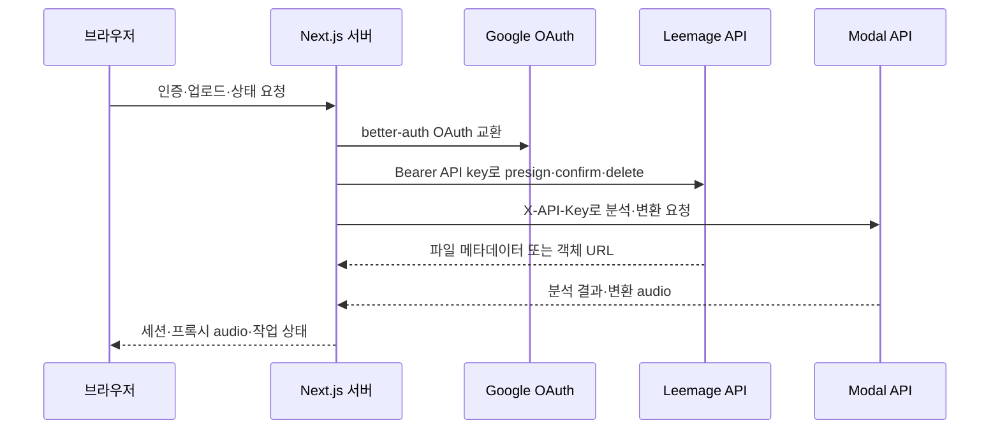
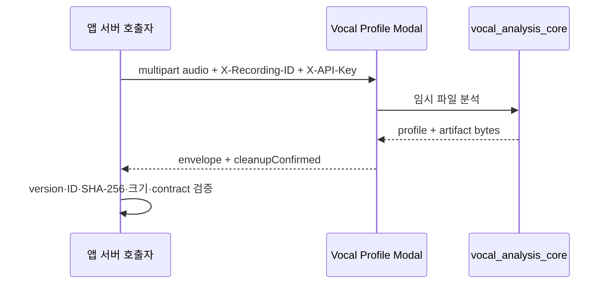
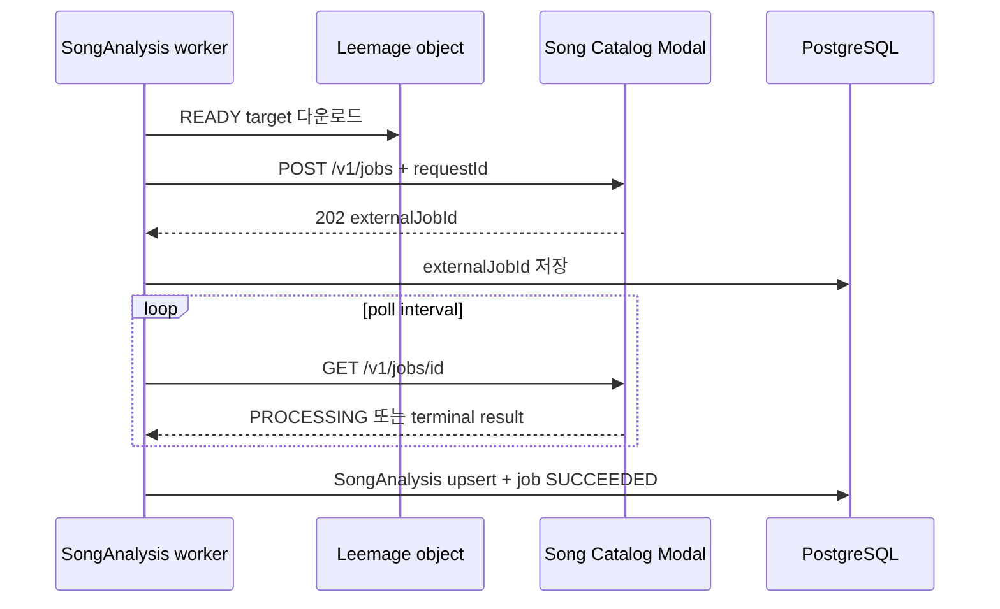
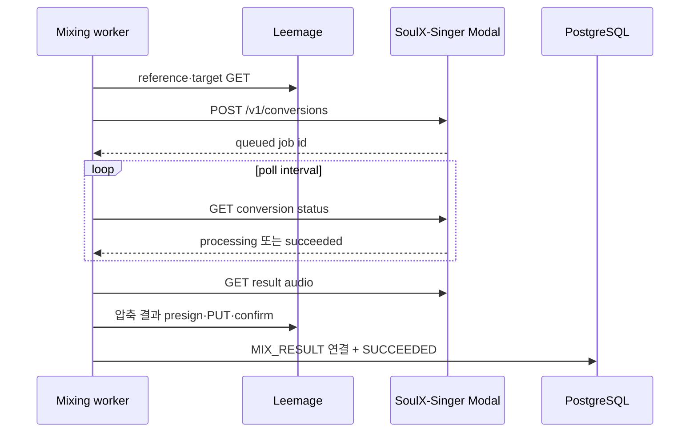

# Google·Leemage·Modal 통합 계약

이 페이지는 외부 서비스의 URL만 나열하지 않는다. 어떤 서버 경계가 자격 증명을 소유하고, 어떤 내부 작업이 외부 비동기 job을 추적하며, 실패를 언제 재시도하거나 사용자 데이터 정리 job으로 넘기는지를 설명한다.

## 공통 경계와 호출 원칙

브라우저는 credential-bearing 외부 API를 직접 호출하지 않는다. Google 로그인 버튼은 `better-auth` 클라이언트를 통해 애플리케이션의 인증 흐름을 시작하지만 Google client secret은 서버의 `src/features/authentication/api/auth.ts`에만 설정된다. Leemage API key, vocal analyzer API key, SoulX 변환 API key도 모두 `server-only` 모듈 또는 서버 background worker가 `X-API-Key`·`Authorization` 헤더에 넣는다.

위 sequence는 앱 서버가 외부 응답을 검증하고 내부 DB 상태를 갱신한 뒤 브라우저에 공개한다는 현재 경계를 나타낸다. 비밀값 자체는 응답이나 문서에 포함하지 않는다.

## 계약 비교

| 통합 | 현재 transport | 상태 소유자 | 성공 결과 | 대표 실패 의미 |
|---|---|---|---|---|
| Google | Better Auth social provider | Better Auth + PostgreSQL adapter | 애플리케이션 세션 | 설정 누락이면 UI에서 비활성화, OAuth 시작 실패는 사용자 오류 |
| Leemage | presign → 객체 `PUT` → confirm | `MediaAsset`와 `MediaCleanupJob` | 외부 file id·URL을 가진 `READY` 자산 | 429/5xx는 제한적 재시도, 삭제 실패는 `DELETE_PENDING` |
| Vocal Profile Modal | 단일 multipart `POST /v1/analyze` | 호출자와 분석 응답 | 검증된 profile과 base64 artifact | 인증 실패·계약 불일치는 즉시 오류, timeout/429/5xx는 retryable |
| Song Catalog Modal | `POST /v1/jobs` 후 polling | `SongAnalysisJob` + Modal `FunctionCall` | 곡 분석 metrics | Modal job 만료·분석 실패는 retryable 응답, 입력 검증은 비재시도 |
| SoulX-Singer Modal | 두 audio 업로드 후 queued conversion polling | `MixingJob` + Modal job index/Volume | 변환 WAV를 Leemage에 저장한 `MIX_RESULT` | 제출 전 실패는 환불 대상, 제출 후 재시도는 같은 job을 계속 조회 |

## Google 인증: 서버가 provider 설정과 세션을 소유한다

`auth`는 `betterAuth`에 PostgreSQL Prisma adapter와 Google social provider를 등록하고 `openid`, `email`, `profile` scope를 요청한다. 이메일/비밀번호 로그인은 꺼져 있다. 새 사용자가 만들어진 뒤에는 `ensureSignupTicketGrants`가 가입 ticket을 부여한다.

운영 설정은 `BETTER_AUTH_SECRET`, `BETTER_AUTH_URL`, `GOOGLE_CLIENT_ID`, `GOOGLE_CLIENT_SECRET` 네 값이 모두 있어야 `googleAuthConfigured()`가 true가 된다. UI는 이 값을 직접 읽지 않고 서버가 계산한 `configured`를 받아 버튼을 비활성화한다. 따라서 설정이 빠진 환경에서 빈 client id로 외부 호출을 시도하지 않는다. `BETTER_AUTH_URL`은 callback URL과 배포 도메인 설정과 함께 맞춰야 한다.

## Leemage: 객체 저장과 내부 자산 수명

`LeemageClient`는 기본 base URL `https://leemage.leey00nsu.com/api/v1`과 `LEEMAGE_API_KEY`, `LEEMAGE_PROJECT_ID`를 서버 환경에서 읽는다. `uploadFile`의 순서는 다음과 같다.

1. `/projects/{projectId}/files/presign`에 파일명·MIME type·크기를 POST한다.
2. 응답의 `presignedUrl`, `objectName`, `fileId`가 문자열인지 확인한 뒤 presigned URL에 API key 없이 객체 `PUT`을 한다.
3. `/files/confirm`에 allocation 정보를 POST하고, 반환된 file id와 URL을 확인한다.
4. `media-service.ts`가 외부 식별자·URL·MIME type·크기를 `MediaAsset`에 저장하고 상태를 `READY`로 만든다. reference, synthesis reference, mixing result는 각각 용도로 구분한다.

API 요청은 네트워크 예외와 429/5xx에 최대 3회 시도한다. `Retry-After`가 숫자면 최대 5초로 제한하고, 아니면 지수 backoff를 최대 2초로 제한한다. 4xx(429 제외)는 retryable이 아니며, presign/confirm 응답 형식 오류도 계약 오류로 즉시 실패한다. presigned object `PUT` 자체는 client 공통 재시도 경로가 아니므로 실패 시 호출자가 전체 저장을 다시 수행해야 한다.

삭제가 성공하면 외부 파일을 지우고 `MediaAsset`을 `DELETED`로 표시한다. 삭제 호출이 실패하면 원본 자산을 바로 지우지 않고 `DELETE_PENDING`과 `MediaCleanupJob(PENDING)`을 같은 transaction에 기록한다. cleanup worker가 재시도에 성공하면 자산과 cleanup record를 제거한다. 이 보류 상태가 외부 객체와 DB 메타데이터의 불일치를 복구할 수 있는 운영 경계다.

### 비공개 audio 전달

저장된 `externalUrl`은 브라우저에 credential과 함께 노출하지 않는다. 서버 route가 `proxyPrivateAudio`를 호출해 upstream에 `Range`만 전달하고, 허용된 `Content-*` 헤더를 복사한 새 응답을 반환한다. 응답은 `private, no-store`이며 파일명은 안전한 ASCII 문자로 정규화한다. upstream이 성공 또는 206이 아니면 `null`을 반환하고, 요청에는 60초 timeout이 있다.

## Vocal Profile Modal: 동기 분석과 envelope 검증

앱의 `analyzeVocalProfileBytes`는 서버에서 `FormData`를 만들고 audio를 multipart stream으로 `POST /v1/analyze`에 전달한다. adapter는 `X-Recording-ID`, `X-API-Key`, 원본 content type을 넣고 120초 timeout을 적용한다. URL은 `VOCAL_PROFILE_MODAL_URL`, key는 `VOCAL_PROFILE_MODAL_API_KEY`를 우선하고 `MODAL_API_KEY`를 fallback으로 사용한다.

Modal endpoint는 25 MB 이하 입력을 chunk 단위로 임시 작업 디렉터리에 저장하고 `librosa-pyin` 분석을 실행한다. `preset`과 melody/glissando 범위, `trim_to_max_duration`을 분석 옵션으로 전달할 수 있다. 응답에는 profile, source 및 선택적 synthesis reference artifact가 `modal-analysis-envelope-v1` 형식으로 들어간다. Modal은 작업 디렉터리 정리 뒤 `cleanupConfirmed: true`를 설정한다.

앱 adapter는 다음 불변식을 확인한다.

- envelope transport version과 `cleanupConfirmed`가 정확히 일치한다.
- profile의 `recordingId`가 요청 ID와 같다.
- base64 artifact의 SHA-256과 바이트 크기가 metadata와 같다.
- source metadata가 profile과 같고, synthesis reference의 존재·MIME type·크기도 profile과 일치한다.
- `analyzeVocalProfile`은 최종적으로 smart reference contract를 확인한다.

401/403은 `ANALYZER_AUTH_FAILED` 비재시도 오류다. 429는 `ANALYZER_BUSY`, 5xx는 `ANALYZER_UNAVAILABLE`, timeout은 `ANALYZER_TIMEOUT`이며 retryable이다. 422의 분석 거부처럼 서비스가 명시한 `retryable: false`는 한 번만 호출한다. 잘못된 envelope는 `ANALYZER_INVALID_RESPONSE`로 취급한다.

이 호출은 비동기 Modal job이 아니라 HTTP 요청 하나의 timeout 안에서 끝난다. `health`는 analyzer version, transport version, autoscaling 및 container 정보를 제공해 운영 점검에 사용한다.

## Song Catalog Analyzer Modal: 제출·polling job

곡 분석 worker는 먼저 `CatalogTargetAsset`의 Leemage `externalUrl`을 서버에서 다운로드한다. 자산이 `READY`이고 대상 source가 있어야 job을 claim할 수 있다. 이어 `POST /v1/jobs`에 `requestId=SongAnalysisJob.id`, YouTube 11자리 `sourceVideoId`, audio multipart를 보내고, 반환된 `externalJobId`를 DB에 저장한다. 같은 request id가 이미 있으면 Modal이 기존 call id를 재사용해 중복 제출을 막는다.

Modal은 최대 100 MB와 `.m4a`, `.mp3`, `.mp4`, `.wav`, `.webm` suffix를 검증하고, `ffmpeg`로 WAV를 만든 뒤 Demucs `htdemucs` CPU 분리와 `vocal_analysis_core` 분석을 수행한다. 임시 디렉터리가 남으면 `CLEANUP_FAILED`로 실패한다. `/v1/jobs/{id}` polling은 처리 중이면 202, 성공이면 metrics, 결과 만료면 410 `MODAL_RESULT_EXPIRED`, 기타 실행 실패면 200 본문의 `MODAL_ANALYSIS_FAILED`를 반환한다.

worker는 lease를 가진 job만 처리한다. claim은 `FOR UPDATE SKIP LOCKED`로 동시 worker 충돌을 막고 attempts/maxAttempts, `nextAttemptAt`, lease expiry를 검사한다. 60초 heartbeat로 lease를 연장하면서 Modal 상태를 반복 조회하고, 성공 시 `SongAnalysis`를 pipeline contract와 함께 upsert하고 job을 `SUCCEEDED`로 만든다. 실패는 분석 오류의 `retryable`을 보존하고, 재시도 가능하면서 횟수가 남아 있으면 `PENDING`으로 되돌려 5·10·20…초(최대 60초) 뒤 재시도한다. 입력 오류나 설정 오류처럼 non-retryable이면 `FAILED`로 종료한다.

## SoulX-Singer Modal: GPU 변환과 결과 저장

mixing worker가 `MODAL_API_URL`, `MODAL_API_KEY`를 확인한 뒤 Leemage에서 reference와 `READY` catalog target audio를 각각 읽는다. `POST /v1/conversions`에 두 multipart audio와 synthesis preset을 보내며, 추천 pitch shift를 적용하고 preset의 `auto_pitch_shift`는 false로 고정한다. Modal 응답은 `queued` 상태와 job id여야 한다.

SoulX web endpoint는 prompt 128 MB, target 256 MB까지 chunk 저장하고 persistent `Volume`에 commit한다. `SoulXModel`은 GPU(`SOULX_GPU`, 기본 `L4`)에서 모델 Volume을 연결하고, `modal run modal_app.py::setup`으로 고정 revision의 모델을 내려받는다. conversion method는 Volume의 job 입력을 임시 디렉터리로 복사해 engine을 실행하고 `result.wav`를 다시 Volume에 commit한다. job metadata는 Modal `Dict`에 두며, 결과·입력 디렉터리는 24시간 TTL cleanup cron이 제거한다.

worker는 `queued` 또는 `processing` 상태를 polling한다. 성공하면 `/audio`에서 WAV를 받고 비어 있지 않은지 확인하고, 압축한 결과를 Leemage `MIX_RESULT`로 저장한 뒤 DB transaction에서 mixing job과 성공 알림을 기록한다. transaction이 실패하면 방금 만든 result asset을 폐기한다. 변환 audio가 아직 없으면 409, 결과가 TTL로 사라지면 410이다.

제출 전 preflight/download 실패는 retryable 여부와 attempts에 따라 `PENDING` 재시도하고 최종 실패 시 ticket을 환불(`refundState: REQUIRED` 후 idempotent refund)한다. Modal에 이미 제출한 뒤의 실패는 기존 `modalJobId`를 보존한 `SUBMITTED` 재시도 경로를 사용하며, 이미 사용이 접수됐으므로 자동 환불하지 않는다. status 조회·결과 다운로드의 408/425/429/5xx와 네트워크 오류는 retryable이고, Modal job 자체의 `failed` 및 잘못된 submit response는 non-retryable로 기록된다. 모든 worker는 lease와 heartbeat를 사용해 중복 처리를 줄인다.

## 설정과 점검 지점

- Google: `BETTER_AUTH_SECRET`, `BETTER_AUTH_URL`, `GOOGLE_CLIENT_ID`, `GOOGLE_CLIENT_SECRET`. 네 값이 모두 있어야 로그인 버튼이 활성화된다.
- Leemage: `LEEMAGE_BASE_URL`(선택, 기본값 있음), `LEEMAGE_API_KEY`, `LEEMAGE_PROJECT_ID`. API key는 서버 환경에만 둔다.
- Vocal Profile Modal: `VOCAL_PROFILE_MODAL_URL`, `VOCAL_PROFILE_MODAL_API_KEY` 또는 `MODAL_API_KEY`.
- Song analyzer Modal: `SONG_ANALYZER_MODAL_URL` 계열 설정은 `songAnalysisModalConfig()`가 해석하고 worker에 URL·key를 주입한다. 코드에는 analyzer API key를 브라우저로 전달하는 경로가 없다.
- SoulX Modal: `MODAL_API_URL`, `MODAL_API_KEY`, 그리고 Modal 배포 환경의 `SOULX_API_KEY`, `SOULX_GPU`, `SOULX_MAX_CONTAINERS`, `SOULX_SCALEDOWN_WINDOW`.

health endpoint는 API key dependency가 적용된 Modal 서비스와 analyzer version/transport/autoscaling을 확인하는 용도다. 로그에는 외부 secret을 기록하지 말고 reason code·job id·retryable만 사용한다. 관련 운영 절차는 [configuration-and-deployment](/openwiki/operations/configuration-and-deployment.md), 도메인 흐름은 [catalog-management](/openwiki/workflows/catalog-management.md), [vocal-profile-analysis](/openwiki/workflows/vocal-profile-analysis.md), [recommendation-to-mixing](/openwiki/workflows/recommendation-to-mixing.md)에서 이어서 확인한다.

## 집중 검증 테스트

- `tests/leemage-media.integration.ts`: reference/synthesis metadata가 user-owned `MediaAsset`으로 저장되는지, 429 삭제 실패가 `DELETE_PENDING`과 `PENDING` cleanup job을 남기는지, 성공한 cleanup retry가 외부 자산과 DB record를 제거하는지 검증한다.
- `tests/vocal-profile-analyzer-adapter.test.ts`: API key 전달, envelope·artifact integrity, recording ID 검증, 401 비재시도, 422 명시적 거부, 429/5xx retryable, network/timeout 매핑을 검증한다.
- `tests/song-analysis-modal-adapter.test.ts`: submit/poll response schema, API 인증, 처리 중·성공·실패·만료 및 retryable reason code 경계를 검증한다.

이 테스트들은 외부 서비스 자체의 모델 정확도를 검증하지 않는다. 앱과 외부 서비스 사이의 transport schema, credential 경계, 상태 전이와 복구 가능성을 검증한다.
