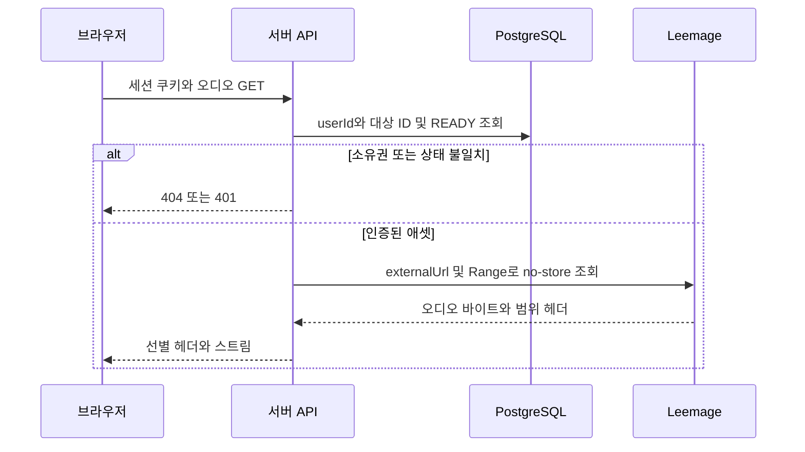
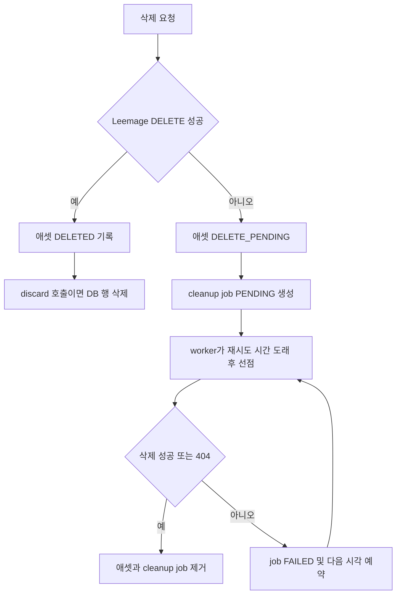

# Leemage 미디어 저장과 보호된 오디오 접근

## 저장 경계와 데이터 모델

Leemage는 실제 오디오 바이트를 보관하는 외부 미디어 저장소입니다. 애플리케이션은 `MediaAsset`에 다음 메타데이터를 PostgreSQL로 기록합니다.

- `userId`: 애셋 소유자
- `kind`: `REFERENCE`, `SYNTHESIS_REFERENCE`, `MIX_RESULT`
- `externalProjectId`, `externalFileId`, `externalUrl`: Leemage 위치를 가리키는 참조
- 파일명, MIME 타입, 바이트 수와 `READY`/`DELETE_PENDING`/`DELETED` 상태

따라서 PostgreSQL의 `Recording`이나 `MediaAsset`은 오디오 자체가 아니라 소유권·도메인 관계·접근에 필요한 메타데이터의 source of truth입니다. 보컬 프로필의 `Recording.storagePath`도 `leemage://project/file` 형태로 애셋을 가리키며, 프로필·녹음·분석 작업이 같은 `MediaAsset`을 관계로 참조합니다 (`prisma/schema.prisma#L413-L440`).

`MediaAssetKind`는 기능적으로 구분해야 합니다 (`prisma/schema.prisma#L67-L85`).

1. **`REFERENCE`**: 보컬 프로필 분석에 사용한 사용자의 원본/분석 레퍼런스 음성입니다. 프로필의 `Recording`에 연결됩니다.
2. **`SYNTHESIS_REFERENCE`**: 분석기가 별도로 만든 AI 믹싱용 스마트 레퍼런스입니다. 보컬 프로필의 `synthesisReferenceAsset`에 연결되며, 생성 실패 시 분석 원본을 fallback으로 유지합니다.
3. **`MIX_RESULT`**: 믹싱 작업의 최종 청취 결과입니다. 성공한 `MixingJob.resultAssetId`에 연결됩니다.

`MediaAsset`에는 `provider` 기본값이 `LEEMAGE`로 있고 외부 프로젝트/파일 조합은 유일합니다. 새 저장 공급자를 추가할 때도 도메인 관계와 상태를 유지하면서 provider별 클라이언트를 별도 경계로 두어야 합니다.

## 업로드 경로

### 보컬 프로필 분석

클라이언트의 `prepareProfileAudio`는 브라우저 `AudioContext`로 파일을 디코드하고, 처음 들리는 프레임부터 시작하도록 앞부분 무음을 제거합니다. 최대 유효 길이는 60초에서 인코딩 여유 0.25초를 뺀 값이며, 모노·16 kHz·64 kbps로 강제 변환합니다. 브라우저에서 AAC 인코더를 사용할 수 있으면 `m4a`/`audio/mp4`, 아니면 Opus `webm`/`audio/webm`을 선택합니다 (`src/shared/lib/audio/profile-upload.ts#L1-L14`, `#L51-L128`).

서버의 `enqueueVocalProfileAnalysis`는 MIME/크기와 티켓·중복 작업을 검증한 뒤 입력 바이트를 `storeAnalyzerReferenceBytes`로 Leemage에 올리고, 반환된 `MediaAsset.id`를 분석 작업의 `sourceAssetId`로 저장합니다 (`src/features/analyze-vocal-profile/api/analysis-queue.ts#L95-L118`, `#L120-L146`). 분석 결과 저장 시에는 원본 `REFERENCE`를 `Recording`에 연결하고, 분석기가 스마트 레퍼런스를 제공할 때만 `SYNTHESIS_REFERENCE`를 추가로 업로드합니다. 스마트 레퍼런스 업로드가 실패해도 원본은 남기고 fallback 상태를 descriptor에 기록합니다 (`src/entities/vocal-profile/api/persistence.ts#L39-L89`, `#L92-L132`).

### 믹싱 결과

믹싱 worker는 외부 합성 서비스에서 결과 바이트를 받은 뒤 임시 디렉터리에서 FFmpeg로 최종화합니다. 메타데이터를 제거하고, 명료도/정규화 필터를 적용하며, 2채널·44.1 kHz AAC 160 kbps `m4a`와 `+faststart`로 출력합니다. 임시 디렉터리는 성공·실패 모두 정리됩니다 (`src/shared/lib/audio/compress-mixing-result.ts#L36-L71`).

그 결과를 `storeMixingResult`가 `copy-singer-{mixingJobId}.m4a`로 Leemage에 업로드하고 `MIX_RESULT` 애셋을 만듭니다. 이후 같은 트랜잭션에서 작업을 `SUCCEEDED`로 바꾸고 `resultAssetId`를 연결합니다. DB 연결 트랜잭션이 실패하면 방금 업로드한 외부 애셋을 즉시 폐기 시도합니다 (`src/_app/background-jobs/mixing/worker.ts#L395-L443`).

## Leemage 클라이언트의 책임과 실패

`LeemageClient`는 **서버 전용** 모듈입니다. `LEEMAGE_BASE_URL`(기본값은 코드에 정의된 Leemage API URL), `LEEMAGE_API_KEY`, `LEEMAGE_PROJECT_ID` 환경값을 읽습니다. 비밀값은 브라우저나 이 문서에 노출하지 않습니다 (`src/shared/media/client.ts#L1-L7`, `#L31-L42`).

업로드는 세 단계입니다.

1. 인증된 API 요청으로 `/projects/{projectId}/files/presign`에 파일명·content type·크기를 보내 presigned URL, object name, file ID를 받습니다.
2. presigned URL에만 인증 헤더 없이 `PUT`으로 바이트를 전송합니다.
3. API에 `/files/confirm`을 호출해 업로드를 확정하고, 검증된 파일 ID/URL을 애플리케이션에 반환합니다 (`src/shared/media/client.ts#L101-L157`).

API 요청은 `cache: "no-store"`와 Bearer 인증을 사용합니다. 네트워크 오류, HTTP 429, 5xx는 최대 3회 재시도하며 `Retry-After`를 우선하고 지수형 상한 지연을 사용합니다. 그 외 오류는 `LeemageError`로 전달되므로 저장 실패를 성공으로 기록하지 않습니다 (`src/shared/media/client.ts#L69-L99`).

## 보호된 다운로드와 소유권 검사

외부 URL을 클라이언트에 직접 제공하지 마십시오. 모든 다운로드 엔드포인트는 먼저 `requireApiSession`으로 세션을 확인하고, 쿼리 조건에 `session.user.id`를 포함해 소유권을 검사해야 합니다.

- `GET /api/vocal-profiles/[id]/audio`는 사용자 소유의 프로필 레퍼런스를 조회한 뒤 `proxyPrivateAudio`로 프록시합니다.
- `GET /api/vocal-profiles/[id]/synthesis-reference/audio`도 동일하게 소유자 조건을 적용하되 `SYNTHESIS_REFERENCE`를 조회합니다.
- `GET /api/mixing-jobs/[id]/audio`는 소유자의 `SUCCEEDED` 작업과 `READY`인 `resultAsset`만 허용합니다. 조건을 만족하지 않으면 404입니다 (`src/_app/api-routes/mixing-jobs/mixing-job-audio-route.ts#L4-L16`).

프록시는 요청의 `Range`를 Leemage에 전달해 오디오 seek/부분 응답을 지원하고, `Content-Type`, 길이, 범위, `Accept-Ranges`만 선별해 반환합니다. 저장소 응답의 임의 헤더(저장 URL 포함)는 노출하지 않으며 `Content-Disposition: inline`, `Cache-Control: private, no-store`를 설정합니다. upstream 실패는 본문을 전달하지 않고 호출자에게 `502`로 처리할 `null`을 반환합니다 (`src/shared/media/audio-proxy.ts#L3-L27`). 믹스 결과 라우트는 같은 헤더 정책을 직접 구현하므로 새 오디오 경로도 이 정책을 따라야 합니다 (`src/_app/api-routes/mixing-jobs/mixing-job-audio-route.ts#L17-L36`).

이 흐름은 외부 저장 URL과 Leemage 자격 증명이 서버에만 남고, URL을 안다고 해서 도메인 소유권 검사를 우회할 수 없음을 보여줍니다.

## 삭제 수명주기: 즉시 삭제와 지연 삭제의 구별

정상 삭제는 `deleteOrScheduleMediaAsset`가 Leemage `DELETE`를 먼저 호출하고 성공하면 DB 애셋을 `DELETED`로 표시하며 `deletedAt`을 기록합니다. 호출자인 `discardMediaAsset`는 그 성공 결과일 때만 DB 행도 삭제합니다. 즉시 삭제 호출이 실패하면 애셋은 물리적으로 남아 있을 수 있으므로 `DELETE_PENDING`으로 바꾸고 `lastError`와 `MediaCleanupJob(PENDING)`을 하나의 트랜잭션으로 기록합니다 (`src/shared/media/media-service.ts#L72-L101`).

백그라운드 cleanup은 `PENDING`/`FAILED`이면서 재시도 시간이 된 작업 또는 5분 이상 멈춘 `PROCESSING` 작업 하나를 `FOR UPDATE SKIP LOCKED`로 선점합니다. Leemage 삭제 성공 시 애셋과 cleanup job을 제거하고, 이미 없는 404도 멱등적인 성공으로 취급합니다. 그 밖의 실패는 job을 `FAILED`로 두고 시도 횟수에 따른 최대 360분 지연 후 재시도하며 애셋은 계속 `DELETE_PENDING`입니다 (`src/shared/media/cleanup.ts#L6-L53`).

여기서 **즉시 삭제**는 외부 DELETE 성공을 확인한 동기 경로이고, **`DELETE_PENDING` cleanup job**은 외부 서비스 장애·rate limit을 견디기 위한 비동기 보상 경로입니다. DB 행만 먼저 삭제하면 외부 바이트가 고아가 되므로 두 경로의 순서를 뒤집지 마십시오.

## 운영 및 변경 시 확인점

- `LEEMAGE_API_KEY`와 `LEEMAGE_PROJECT_ID`가 서버 런타임에 설정되어 있는지 확인합니다. 설정 누락은 재시도할 수 없는 구성 오류입니다.
- cleanup worker가 `processOneMediaCleanup`을 반복 호출하고, `DELETE_PENDING`과 `MediaCleanupJob`의 `lastError`를 모니터링해야 외부 고아 파일을 발견할 수 있습니다.
- DB cascade는 사용자 삭제 시 애셋과 cleanup job을 함께 지울 수 있으므로, 사용자 삭제 정책을 바꿀 때 Leemage 외부 파일 정리도 별도로 보장해야 합니다 (`prisma/schema.prisma#L429-L439`, `#L469-L480`).
- 오디오 다운로드 새 엔드포인트를 만들 때는 서버 전용 Leemage 접근, 세션 인증, `userId` 소유권 조건, `READY` 상태 확인, Range 전달, `private, no-store`를 모두 유지합니다.

## 집중 테스트

- `tests/leemage-client.test.ts#L6-L56`: presign → 무인증 PUT → confirm의 3단계와 API 요청의 Bearer 헤더 경계를 검증합니다. `#L58-L72`는 429 후 DELETE 재시도를 검증합니다.
- `tests/private-audio-proxy.test.ts#L6-L35`: Range/206 전달과 저장소 URL 헤더 비노출을 검증하고, `#L37-L46`은 upstream 실패 본문을 숨기는지 검증합니다.
- `tests/leemage-media.integration.ts#L7-L83`: 사용자 소유 `REFERENCE`와 `SYNTHESIS_REFERENCE` 메타데이터 저장을, `#L85-L141`은 실패 시 `DELETE_PENDING`과 재시도 job을, `#L143-L194`는 성공 재시도 후 삭제를 검증합니다. DB가 없으면 통합 테스트는 skip됩니다.
