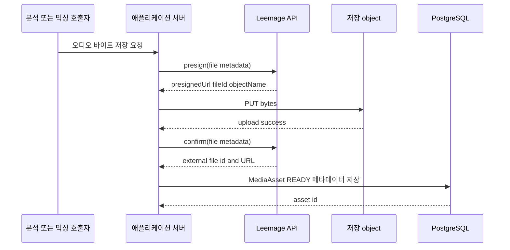
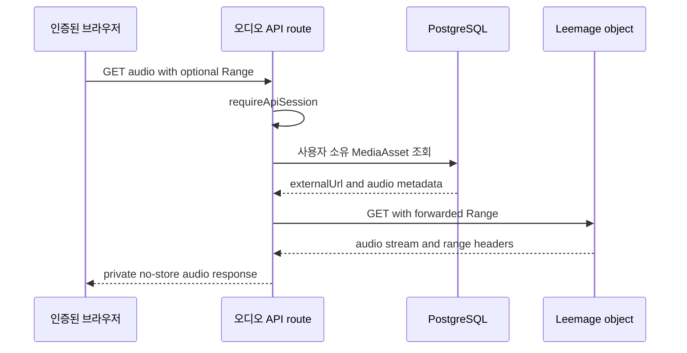
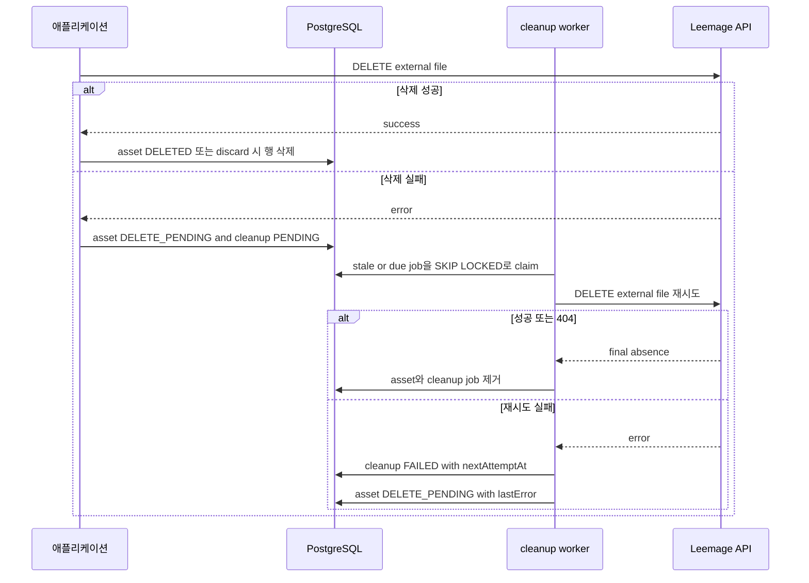

# Media Storage, Proxying, and Cleanup

## 경계와 소유권

애플리케이션 서버의 미디어 경계는 `src/shared/media`에 있다. `LeemageClient`는 서버 전용 클라이언트로서 외부 저장소 API와 presigned object URL을 호출하고, 애플리케이션의 PostgreSQL은 바이트 자체가 아니라 `MediaAsset` 메타데이터와 수명 상태를 소유한다. 저장소 URL은 `externalUrl`에 보관되지만 클라이언트에 직접 노출하지 않는 것이 비공개 오디오 경로의 불변식이다.

`MediaAsset`은 사용자(`userId`), 용도(`REFERENCE`, `SYNTHESIS_REFERENCE`, `MIX_RESULT`), provider(기본값 `LEEMAGE`), 외부 project/file 식별자, 외부 URL, 파일명, MIME type, 바이트 수, 상태와 오류를 기록한다. `(externalProjectId, externalFileId)`는 유일하며, 분석·보컬 프로필·믹싱 작업이 이 행을 참조한다. PostgreSQL의 `BigInt` `sizeBytes`는 업로드 응답의 바이트 수를 저장한다.

### 설정과 외부 API 안전성

`leemageConfigFromEnv()`는 `LEEMAGE_API_KEY`와 `LEEMAGE_PROJECT_ID`를 필수로 읽고, `LEEMAGE_BASE_URL`이 없으면 코드에 정의된 기본 API base URL을 사용한다. 이 값과 인증 헤더는 서버 전용 코드에서만 사용한다. 문서와 로그에는 credential, token 또는 환경 파일 내용을 기록하지 않는다.

API 요청은 `Authorization: Bearer ...`, `cache: no-store`로 수행한다. 네트워크 예외와 HTTP 429 또는 5xx는 최대 3회 재시도한다. `Retry-After`(최대 5초)를 우선하고 이후 지수 지연을 사용한다. 그 밖의 HTTP 오류는 `LeemageError`로 전달되며, 상태 코드와 retryable 여부를 보존한다. presign/confirm 응답에 필요한 문자열 필드가 없으면 재시도하지 않는 502 성격의 오류로 취급한다.

## 업로드와 메타데이터 영속화

`storeAnalyzerReferenceBytes()`와 `storeAnalyzerSynthesisReferenceBytes()`는 파일명 확장자를 MIME type에 맞춰 정하고 공통 저장 루틴을 호출한다. `storeMixingResult()`는 `copy-singer-{mixingJobId}.{extension}` 이름으로 최종 결과를 저장한다. 공통 순서는 다음과 같다.

1. Leemage `POST /projects/{projectId}/files/presign`에 파일명, content type, 크기를 보낸다.
2. 응답의 `presignedUrl`로 바이트를 `PUT`하고 MIME type을 보낸다. 이 object 업로드 요청에는 API 인증 헤더를 붙이지 않는다.
3. Leemage `POST /projects/{projectId}/files/confirm`에 `fileId`, `objectName`, 파일 메타데이터를 보내 저장을 확정한다.
4. confirm 결과의 외부 `id`와 `url` 및 로컬 입력 메타데이터를 `MediaAsset(status=READY)`로 만든다.

따라서 외부 업로드가 성공해도 마지막 DB 기록이 실패할 수 있다. 분석 enqueue는 트랜잭션 실패, idempotency 경합 또는 이미 존재하는 작업이면 방금 만든 asset을 `discardMediaAsset()`으로 정리해 고아 object를 남기지 않도록 한다. 믹싱 worker도 결과 asset을 만든 뒤 작업 성공 트랜잭션이 실패하면 동일하게 폐기한다.

*그림은 바이트가 Leemage object에 올라간 뒤 외부 식별자와 URL만 PostgreSQL에 저장되는 경계를 보여준다.*

## 결과 압축

믹싱 worker는 Modal에서 성공한 원본 오디오를 바로 저장하지 않는다. `compressMixingResult()`가 임시 디렉터리에서 FFmpeg를 실행해 입력을 `audio/mp4` AAC `m4a`로 변환한다. 44.1 kHz, 2채널, 160k 비트레이트, `+faststart`를 사용하며 clarity/normal 필터 체인은 고역·저역 조정, 컴프레서, loudness 정규화를 포함한다. 입력·출력 임시 파일은 성공과 실패 모두 `finally`에서 삭제한다. FFmpeg 실패는 `MIXING_FINALIZATION_FAILED`로 보고되고 재시도 가능한 믹싱 단계 오류다. 실행 파일은 `FFMPEG_BIN`으로 바꿀 수 있고, 없으면 `ffmpeg`를 찾는다.

압축된 결과를 Leemage에 업로드하고 `MIX_RESULT` asset을 만든 후에야 믹싱 작업을 `SUCCEEDED`로 커밋한다. 이 순서를 바꾸면 성공 작업이 가리킬 결과 메타데이터가 없어질 수 있다.

## 비공개 오디오 프록시

보컬 프로필 원본 및 synthesis reference route는 먼저 `requireApiSession()`으로 인증하고, 세션 사용자 소유의 reference를 조회한다. 없으면 404, 인증되지 않으면 unauthorized 응답을 반환한다. 그 뒤 `proxyPrivateAudio()`가 DB의 `externalUrl`을 서버에서 가져와 브라우저에 스트리밍한다.

프록시는 요청의 `Range`를 upstream에 전달하므로 부분 재생을 지원하며, upstream이 정상 또는 206이 아니면 body를 전달하지 않고 `null`을 반환한다. 전달하는 헤더는 `Content-Type`, `Content-Length`, `Content-Range`, `Accept-Ranges`뿐이다. 저장소 응답의 임의 헤더는 노출하지 않는다. MIME type 보정, 안전한 파일명 기반 `Content-Disposition: inline`, `Cache-Control: private, no-store`를 설정하고 60초 timeout을 둔다. route는 `null`을 502 `..._UNAVAILABLE` 오류로 변환한다. 결과적으로 브라우저는 저장소 URL이 아닌 애플리케이션 API URL만 사용한다.

*그림은 인증·소유권 확인 뒤 서버가 외부 object를 중계하는 비공개 재생 흐름이다.*

## 삭제 상태와 정리 worker

`deleteOrScheduleMediaAsset()`은 먼저 asset을 조회한다. 행이 없으면 이미 삭제된 것으로 성공을 반환한다. Leemage 삭제가 성공하면 `DELETED`, `deletedAt`, `lastError=null`로 표시한다. 호출자가 `discardMediaAsset()`이면 그 성공 결과에 한해 PostgreSQL 행도 삭제한다.

외부 삭제가 실패하면 asset을 즉시 지우지 않고 `DELETE_PENDING`과 오류를 기록하며, `MediaCleanupJob(status=PENDING)`을 같은 트랜잭션으로 만든다. 이 보상 경로가 DB 메타데이터와 외부 object의 불일치를 재시도할 수 있게 한다.

`processOneMediaCleanup()`은 `PENDING`/`FAILED` 중 `nextAttemptAt`이 된 작업 또는 5분 이상 멈춘 `PROCESSING` 작업을 `FOR UPDATE SKIP LOCKED`로 하나 선점한다. worker는 외부 삭제 성공 시 asset과 cleanup job(성공 후 흐름)을 제거한다. 외부가 404를 반환해도 원하는 최종 상태가 이미 달성된 것으로 보고 asset을 제거한다. 다른 실패는 cleanup job을 `FAILED`로 만들고 backoff(시도 횟수에 따른 최대 360분)를 설정하며 asset은 `DELETE_PENDING`으로 남긴다. `runMixingWorkerOnce()`가 일반 믹싱 작업을 claim하기 전에 이 cleanup을 한 번 처리한다.

*그림은 즉시 삭제와 실패 시 지연 정리의 상태 전이를 함께 보여준다.*

## 변경 시 확인할 불변식과 테스트

- Leemage API credential은 server-only 모듈 밖으로 이동하지 말고, presigned `PUT`에 API 인증을 재사용하지 않는다.
- `confirm` 성공과 `MediaAsset` DB 생성의 순서를 유지한다. DB 트랜잭션이 결과 asset을 채택하지 못하면 보상 삭제를 호출한다.
- 사용자 소유권 조회를 우회해 `externalUrl`을 직접 반환하지 않는다. Range·partial response·저장소 헤더 비노출을 유지한다.
- 외부 삭제 실패 시 `DELETE_PENDING`과 cleanup job을 함께 기록하고, 404는 멱등적인 삭제 성공으로 취급한다.

집중 테스트는 `tests/leemage-client.test.ts`에서 presign → PUT → confirm의 세 호출, 인증 헤더 경계와 429 재시도를 검증한다. `tests/private-audio-proxy.test.ts`는 Range 전달, 206 응답 헤더, private no-store 및 저장소 URL 헤더 차단, upstream 503 처리를 검증한다. `tests/compress-mixing-result.test.ts`는 FFmpeg 결과 형식과 임시 파일 정리를 검증하고, `tests/effect-cleanup.test.ts`는 UI가 임의 fetch나 polling timer를 소유하지 않고 오디오 미리보기만 바이너리로 가져오는 규칙을 검사한다. cleanup의 선점·재시도 동작은 `src/shared/media/cleanup.ts`와 `tests/leemage-media.integration.ts`의 통합 경계를 변경 시 함께 확인해야 한다.
