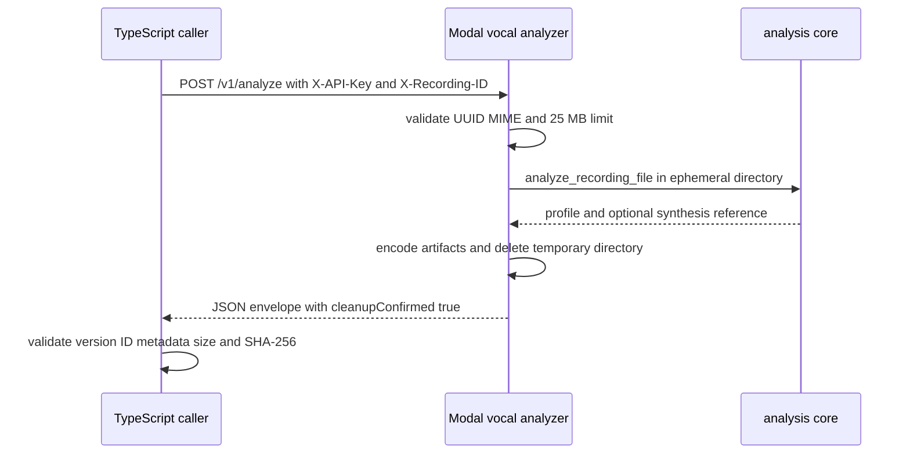
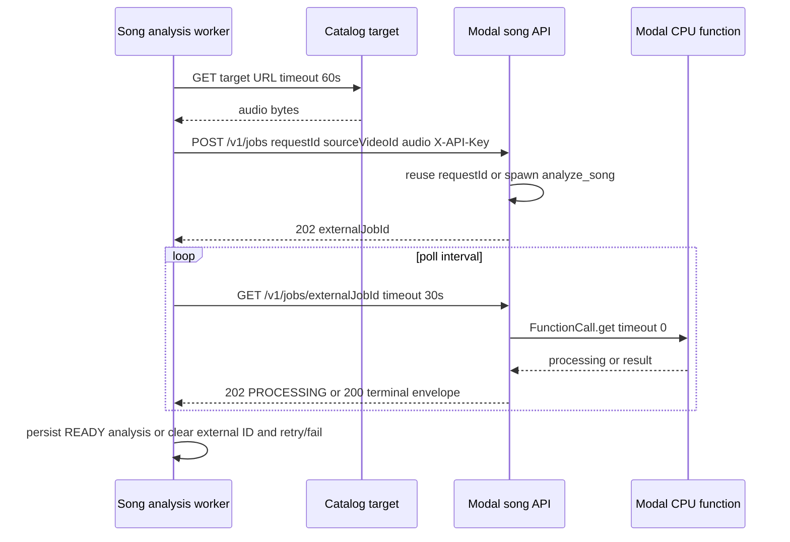
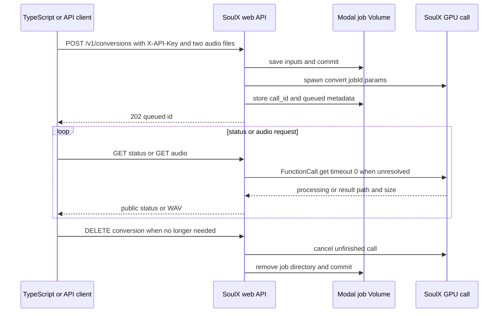

# Modal 분석기와 SoulX-Singer 통합 계약

이 문서는 서버 측 TypeScript가 Modal에 배포된 Python HTTP 서비스를 호출할 때 지켜야 하는 계약이다. API 키는 코드나 문서에 기록하지 않고, 호출자는 `X-API-Key` 헤더에 런타임 secret을 넣는다. 서비스는 키가 없으면 `503`, 키가 없거나 틀리면 `401`을 반환한다. 보컬 프로필 분석기와 곡 분석기의 `/health`도 전역 인증 의존성의 적용을 받으므로 운영 점검 역시 키가 필요하다. SoulX의 `/health`는 공개 endpoint이고 변환 endpoint만 인증된다.

## 계약 한눈에 보기

| 기능 | HTTP 경계 | 처리 방식 | 성공 응답 | 로컬/원격 파일 수명 |
|---|---|---|---|---|
| 보컬 프로필 분석 | `POST /v1/analyze` | 동기, 120초 클라이언트 제한 | `modal-analysis-envelope-v1` JSON | Python 임시 디렉터리 정리 후 `cleanupConfirmed: true` |
| 곡 카탈로그 분석 제출 | `POST /v1/jobs` | 202 외부 Modal job | `{status: PROCESSING, externalJobId, reused}` | Modal 함수의 임시 디렉터리 정리 확인 |
| 곡 카탈로그 분석 폴링 | `GET /v1/jobs/{external_job_id}` | 202/200 | `PROCESSING`, `SUCCEEDED`, `FAILED` | 결과 만료는 명시적 실패 |
| SoulX 변환 제출 | `POST /v1/conversions` | 202 외부 Modal GPU job | 공개 job metadata | `/jobs/{id}`에 입력·결과 보관 |
| SoulX 상태/결과/삭제 | `GET .../{id}`, `GET .../audio`, `DELETE .../{id}` | 상태를 조회할 때 Modal call도 수렴시킴 | 상태 JSON, WAV, 204 | 삭제 또는 24시간 TTL cleanup |

## 동기 보컬 분석 계약

### 요청과 인증

TypeScript `analyzeWithModalAdapter`는 `VOCAL_PROFILE_MODAL_URL`과 `VOCAL_PROFILE_MODAL_API_KEY`(없으면 `MODAL_API_KEY`)를 읽고, URL 끝의 `/`를 제거한다. 원본 바디를 스트리밍하여 다음과 같이 보낸다.

- `POST {url}/v1/analyze`
- `Content-Type`: 업로드 원본의 MIME type
- `X-Recording-ID`: recording UUID
- `X-API-Key`: secret 값
- body: 원본 오디오 `ReadableStream`
- timeout: 120,000ms, `cache: no-store`

Python은 `X-Recording-ID`를 UUID로 정규화한다. MIME에서 지원 suffix를 결정하고 최대 25 MB까지 청크로 저장한다. `preset`, melody/glissando 구간, `trim_to_max_duration`는 multipart form 값으로 전달할 수 있다. 잘못된 UUID는 `400 INVALID_RECORDING_ID`, 너무 큰 입력은 `413 PAYLOAD_TOO_LARGE`, 지원하지 않는 오디오는 `415 UNSUPPORTED_AUDIO`가 된다.



*그림: 보컬 프로필 동기 요청부터 임시 산출물 정리와 TypeScript 검증까지의 순서.*

### 응답 봉투와 불변식

성공 응답은 다음 구조여야 한다.

```json
{
  "transportVersion": "modal-analysis-envelope-v1",
  "profile": { "recordingId": "...", "mimeType": "audio/wav", "sizeBytes": 123 },
  "artifacts": {
    "source": { "fileName": "source.wav", "mimeType": "audio/wav", "sizeBytes": 123, "sha256": "...", "contentBase64": "..." },
    "synthesisReference": null
  },
  "cleanupConfirmed": true
}
```

`profile`에는 duration/sample rate, MIDI 범위와 tessitura, voiced ratio, pitch stability, clipping/RMS, analyzer 버전, descriptors가 들어간다. 선택적 `synthesisReference`에는 WAV 메타데이터와 `smart-reference-mid-v1` descriptor(구간, band seconds, voiced density, pitch coverage, crossfade, fallback reason)가 들어간다. 참고 음원이 품질 기준을 충족하지 못하면 Python은 참조 artifact를 `null`로 두고 descriptor에 `status: unavailable`과 사유를 남긴다. 이는 별도 로컬 fallback을 뜻하지 않는다.

Python transport는 artifact를 Base64와 `sizeBytes`, SHA-256으로 함께 인코딩한다. TypeScript는 Base64 디코딩 후 실제 바이트 수와 SHA-256을 다시 계산하고, 다음을 모두 거부한다.

1. 봉투가 객체가 아니거나 transport version이 다름
2. `cleanupConfirmed`가 `true`가 아님
3. profile 또는 artifact 필드가 없음
4. profile의 recording ID가 요청 ID와 다름
5. source MIME/크기가 profile과 불일치
6. synthesis reference가 profile에 있는데 artifact가 없거나 메타데이터가 불일치함, 또는 그 반대
7. Base64, 크기, 해시 무결성 실패

이 경우 `ANALYZER_INVALID_RESPONSE`(대개 502, retryable)를 사용한다. 즉 HTTP 200만으로 성공으로 간주하지 말고 envelope과 source mismatch까지 검증해야 한다. 호출자는 분석 결과의 source artifact를 저장 경계에 넘길 수 있지만, 응답이 확인되기 전에는 신뢰해서는 안 된다.

### HTTP 상태, timeout, retryability

TypeScript 어댑터는 401/403을 `ANALYZER_AUTH_FAILED`(재시도 불가), 429를 `ANALYZER_BUSY`(재시도 가능), 5xx를 `ANALYZER_UNAVAILABLE`(재시도 가능)으로 매핑한다. 그 밖의 Python 오류 응답은 `reasonCode`, `detail`, `retryable`을 읽고, 필드가 없으면 429 또는 5xx만 재시도 가능으로 본다. 네트워크 오류와 `AbortError`/`TimeoutError`는 `ANALYZER_TIMEOUT` 또는 `ANALYZER_UNAVAILABLE`로 정규화하며 재시도 가능하다. health 호출 timeout은 10초이다.

## 곡 카탈로그 분석: 제출·폴링 외부 작업

TypeScript 작업자는 먼저 READY 상태의 카탈로그 target URL을 60초 timeout으로 내려받는다. 원본 응답의 429/5xx만 retryable이며, 다른 HTTP 실패는 `ANALYSIS_SOURCE_UNAVAILABLE` 비재시도 오류다. 이어 `FormData`에 `requestId`(DB job ID), `sourceVideoId`(11자리 YouTube ID), `audio`(파일명과 MIME을 가진 File)를 넣어 `POST /v1/jobs`에 120초 timeout으로 제출한다.

Python 제출 handler는 request ID(필수, 최대 200자), YouTube ID 패턴, 비어 있지 않은 오디오, 100 MB 상한, `.m4a/.mp3/.mp4/.wav/.webm` suffix를 검증한다. 잘못된 요청은 `422`(크기 초과는 `413`)와 `retryable: false`를 반환한다. 같은 request ID가 이미 있으면 업로드를 다시 처리하지 않고 기존 Modal call ID로 `202 PROCESSING`과 `reused: true`를 돌려준다. 새 작업은 CPU 8 core/16,384 MB, CPU Demucs(`htdemucs`)와 `vocal_analysis_core`를 사용하며 Modal retry는 최대 2회다.



*그림: 곡 분석 원본 다운로드, idempotent 제출, Modal call 폴링 및 DB 반영 흐름.*

폴링은 `GET /v1/jobs/{externalJobId}`로 한다. Modal call이 아직 끝나지 않았으면 HTTP `202`와 `PROCESSING`을 반환한다. 완료되면 `200 SUCCEEDED`와 분석 result가 오고, 예외는 `200 FAILED`와 `MODAL_ANALYSIS_FAILED`, 결과 만료는 `410 FAILED`와 `MODAL_RESULT_EXPIRED`를 반환한다. 후자의 두 오류는 Python 계약상 retryable이다. TypeScript schema는 세 상태를 discriminator로 검증하므로 상태나 result envelope이 틀리면 `INVALID_ANALYZER_RESPONSE`로 처리한다.

워커는 외부 ID를 제출 직후 lease 소유 조건으로 DB에 저장한다. lease를 잃으면 중단한다. PROCESSING 동안 poll interval만큼 기다리고, FAILED면 외부 ID를 지운 뒤 `retryable`과 최대 시도 횟수에 따라 5초부터 최대 60초 exponential backoff로 재큐잉하거나 최종 실패한다. 성공 시 pipeline contract와 cleanup 확인을 포함해 `SongAnalysis`를 READY로 upsert하고 job lease를 해제한다. heartbeat는 60초마다 갱신된다.

## SoulX-Singer 변환 계약

### 모델과 입력

`POST /v1/conversions`는 `prompt_audio`, `target_audio` multipart 파일과 다음 form 값을 받는다: vocal separation 두 개, auto pitch shift, auto mix accompaniment, `pitch_shift` -36..36, `steps` 1..100, `cfg` 0..10, `seed` 0..2,147,483,647. prompt는 128 MB, target은 256 MB까지 청크 저장하며 파일명은 allowlist suffix만 보존하고 나머지는 `.audio`로 안전하게 치환한다. 업로드가 실패하면 해당 job directory를 지운다.

서비스는 persistent Modal Volume에서 고정 revision의 SoulX 및 preprocess 모델을 준비하고, GPU(`SOULX_GPU`, 기본 `L4`) 단일 프로세스 엔진을 구동한다. prompt/target은 각각 30초/300초로 normalize되고 44.1 kHz로 처리된다. `queue_size=1`, 기본 max container 1이며, 엔진은 CUDA가 없거나 모델 산출물 `generated.wav`가 없으면 실패한다. 변환 성공 시 결과 WAV를 `/jobs/{job_id}/result.wav`에 복사하고 크기를 기록한다.



*그림: SoulX 변환의 제출, 상태 수렴, 결과 다운로드 및 명시적 cleanup 순서.*

### 상태, 결과, 삭제

제출 성공은 `202`이며 public metadata는 `id`, `status: queued`, `created_at`, `error`, `result_url`(성공 전에는 null)이다. 상태 endpoint는 queued/processing이면 Modal call을 즉시(`timeout=0`) 확인하고, 완료 결과를 metadata에 저장해 `succeeded`로 수렴시킨다. call timeout은 processing으로 남기며, 호출 예외는 metadata를 failed로 저장한다. 결과 만료는 `410 Conversion result expired`다.

오디오 endpoint는 succeeded 결과만 허용한다. 아직 완료되지 않았거나 실패한 job은 `409 Conversion is ...`; 성공했지만 파일이 없으면 `410 Conversion audio expired`; 파일이 있으면 `audio/wav`의 `FileResponse`로 반환한다. DELETE는 미완료 call을 `terminate_containers=True`로 취소하고, Volume을 reload한 뒤 job directory를 제거·commit하고 job index를 pop한다. 이미 succeeded/failed인 call은 취소하지 않는다.

입력과 결과 파일은 `cleanup_expired_jobs`의 매일 `03:17` UTC cron에서 디렉터리 mtime이 24시간 지난 job이면 제거하고 index도 삭제한다. 따라서 24시간 뒤에는 상태가 404가 되거나 결과가 만료될 수 있으며, 보존이 필요한 호출자는 그 전에 WAV를 내려받아야 한다. 명시적 DELETE와 TTL cleanup 모두 외부 사용자 데이터를 영구 보관하지 않는 경계다.

## 변경·운영 체크리스트

- API key를 로그, wiki, 테스트 fixture에 넣지 말고 Modal secret과 TypeScript 환경 변수로 주입한다.
- endpoint를 바꾸면 Python status/reason envelope과 TypeScript Zod schema 및 retry mapping을 함께 바꾼다.
- 동기 분석은 `transportVersion`, ID, source/reference metadata, Base64 크기와 SHA-256, `cleanupConfirmed`를 모두 유지한다.
- 외부 job은 request/job ID idempotency, 외부 call ID 영속화, poll timeout과 결과 만료, lease/heartbeat를 함께 검증한다.
- 성공을 HTTP status만으로 판정하지 않는다. invalid response와 source mismatch는 저장 전에 실패시켜야 한다.
- Modal 배포 전 SoulX 모델 Volume을 `modal run modal_app.py::setup`으로 준비하고, GPU/모델 revision과 max container 설정을 운영 환경에서 확인한다.

## 집중 테스트

- `services/vocal-profile-modal/test_transport.py`: artifact round-trip의 크기·해시, smart reference payload, reference unavailable 봉투, 변조 hash 거부를 검증한다.
- `services/vocal-profile-modal/test_modal_app_source.py` 및 `test_runtime.py`: MIME/업로드, 오류 status, cleanup과 handler 계약의 source-level 회귀를 검증한다.
- `services/song-catalog-analyzer/test_modal_app.py`: request/source ID 및 크기, suffix allowlist, key estimator, CPU spawn/poll/idempotency와 Demucs 설정을 검증한다.
- `src/features/manage-song-catalog/api/analyzer.ts`와 `src/_app/background-jobs/song-analysis/worker.ts`: 제출·폴링 schema, HTTP/timeout retry mapping, lease를 잃지 않은 경우의 외부 ID 저장과 재시도 수렴이 실제 계약이다.
